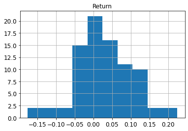
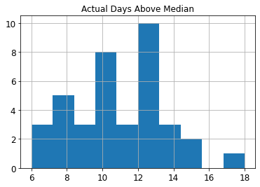
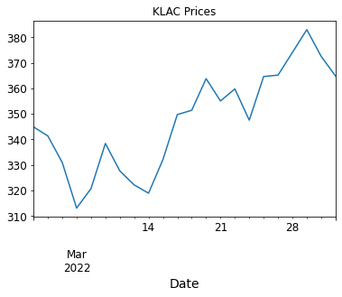

# Recurrent Neural Network for Financial Time Series

## David Long

### CFRM 521, University of Washington, Spring 2022 (Lu)

This project is based on Long Short-Term Memory Neural Network for Financial Time Series by Carmina Fjellström. (https://arxiv.org/abs/2201.08218)

The investigation uses the Long-Short Term Memory variant of the Recurrent Neural Network to make the one-step ahead forecast of time series of financial returns.  Many LSTM models are trained in parallel, each with a different weight initialization, and a hard-voting classifier is used to resolve them.  The target variable is whether the one-step ahead return will be greater than the day’s median return.  The author uses data from Stockholm’s OMX30 and makes rolling predictions 30 days at a time.  For evaluation, a trading strategy based on the predictions is compared to holding the entire market and a random portfolio.

For this investigation, the Nasdaq 100 is used, as determined on 05/16/22 by (https://www.slickcharts.com/nasdaq100)    Adjusted closing prices are downloaded from Yahoo Finance using Python’s yfinance package.  An attempt was made to replace the hard-voting classifier with a logistic regression blender.  The author argued for an ensemble method to boost accuracy, but after conferring with the professor, I've decided against using an ensemble entirely.  Common practice is to let the activation function determine the weight initialization, so rather than train multiple models for each stock, many of which will have low accuracy due to bad weight initialization, it seems like the computational time would be better spent tuning the hyperparameters of a single model for each stock.  The activation functions in the LSTM cells are sigmoid and tanh, so the only weight initialization that will be used are Glorot Normal and Glorot Uniform.

The trading strategy will differ as well.  Fjellström uses a daily portfolio, owning all the stocks that are predicted to be above the median on each day of the prediction window.  This is not a trading strategy that most investors can engage in.  Instead, this investigation will seek to identify models with high cross-validation prediction accuracies.  For such models, the number of days predicted  above the median becomes relevant.  The recommended strategy will be to identify a stock with high prediction accuracy and a high number of days predicted above the median.  Buy the stock at the start of the prediction window and sell it at the end.  The returns given in the results summary are calculated from those two prices.  With this trading strategy in place, the model seeks to inform the investor, who must make discretionary decisions, rather than to dictate a course of action.  For a given prediction window, the best course of action may be to own one stock, several stocks, or no stocks at all.

***Before jumping into the script, specify values for reload_import_list, train_models and stocks_to_process, as described in the comments below.  They are currently set to import a saved data file of prices and to train models for all stocks in stocks_to_process.***


```python
import yfinance as yf
import pandas as pd
import numpy as np
import tensorflow as tf
from tensorflow import keras
from sklearn.model_selection import TimeSeriesSplit
from sklearn.preprocessing import StandardScaler
from sklearn.linear_model import LogisticRegression
from sklearn.metrics import accuracy_score
from scipy.stats import reciprocal
import sys
import random
import time
import matplotlib as mpl
import matplotlib.pyplot as plt
mpl.rc('axes', labelsize=14)
mpl.rc('xtick', labelsize=12)
mpl.rc('ytick', labelsize=12)

print('Python Version:', sys.version)
print('YFinance Version:', yf.__version__)
print('Pandas Version:', pd.__version__)
print('Numpy Version:', np.__version__)
print('Tensorflow Version:', tf.__version__)
print('Keras Version:', keras.__version__, '\n')
```

    Python Version: 3.8.8 (default, Apr 13 2021, 15:08:03) [MSC v.1916 64 bit (AMD64)]
    YFinance Version: 0.1.70
    Pandas Version: 1.4.2
    Numpy Version: 1.19.5
    Tensorflow Version: 2.3.0
    Keras Version: 2.4.0 
    
    


```python
t0 = time.time()

# stock list set on 05/16/22 from https://www.slickcharts.com/nasdaq100
import_list = ['AAPL', 'MSFT', 'AMZN', 'TSLA', 'GOOG', 'GOOGL', 'FB', 'NVDA'
              , 'AVGO', 'PEP', 'COST', 'CSCO', 'ADBE', 'CMCSA', 'INTC'
              , 'TMUS', 'TXN', 'AMD', 'QCOM', 'AMGN', 'HON', 'INTU', 'AMAT'
              , 'MDLZ', 'PYPL', 'ADP', 'SBUX', 'BKNG', 'NFLX', 'ADI', 'CHTR'
              , 'MU', 'ISRG', 'GILD', 'CSX', 'REGN', 'LRCX', 'VRTX', 'FISV'
              , 'ATVI', 'MRNA', 'MAR', 'KHC', 'KDP', 'KLAC', 'AEP', 'MRVL'
              , 'PANW', 'NXPI', 'MNST', 'EXC', 'ASML', 'FTNT', 'ABNB', 'ADSK'
              , 'PAYX', 'ORLY', 'SNPS', 'XEL', 'MELI', 'CDNS', 'CTAS', 'CTSH'
              , 'LULU', 'WBA', 'MCHP', 'ILMN', 'AZN', 'DLTR', 'WDAY', 'EA'
              , 'CRWD', 'ROST', 'DXCM', 'ODFL', 'JD', 'IDXX', 'FAST', 'LCID'
              , 'BIIB', 'PCAR', 'DDOG', 'VRSK', 'BIDU', 'EBAY', 'TEAM'
              , 'CPRT', 'SGEN', 'SIRI', 'ZM', 'ANSS', 'MTCH', 'ALGN', 'ZS'
              , 'NTES', 'VRSN', 'CEG', 'SWKS', 'PDD', 'SPLK', 'DOCU', 'OKTA']
print('import_list:', import_list, '\n')

# if True, the prices will be downloaded and saved locally
reload_import_list = False
if reload_import_list:
    prices = yf.download(import_list, start="2015-01-01", end="2022-03-31")['Adj Close']
    prices.to_pickle('prices_data.csv')
    print('prices fields downloaded:', set(prices.columns.get_level_values(0)))
else:
    prices = pd.read_pickle('prices_data.csv')
    
# if True, new models will be trained for each stock in stocks_to_process
train_models = True
```

    import_list: ['AAPL', 'MSFT', 'AMZN', 'TSLA', 'GOOG', 'GOOGL', 'FB', 'NVDA', 'AVGO', 'PEP', 'COST', 'CSCO', 'ADBE', 'CMCSA', 'INTC', 'TMUS', 'TXN', 'AMD', 'QCOM', 'AMGN', 'HON', 'INTU', 'AMAT', 'MDLZ', 'PYPL', 'ADP', 'SBUX', 'BKNG', 'NFLX', 'ADI', 'CHTR', 'MU', 'ISRG', 'GILD', 'CSX', 'REGN', 'LRCX', 'VRTX', 'FISV', 'ATVI', 'MRNA', 'MAR', 'KHC', 'KDP', 'KLAC', 'AEP', 'MRVL', 'PANW', 'NXPI', 'MNST', 'EXC', 'ASML', 'FTNT', 'ABNB', 'ADSK', 'PAYX', 'ORLY', 'SNPS', 'XEL', 'MELI', 'CDNS', 'CTAS', 'CTSH', 'LULU', 'WBA', 'MCHP', 'ILMN', 'AZN', 'DLTR', 'WDAY', 'EA', 'CRWD', 'ROST', 'DXCM', 'ODFL', 'JD', 'IDXX', 'FAST', 'LCID', 'BIIB', 'PCAR', 'DDOG', 'VRSK', 'BIDU', 'EBAY', 'TEAM', 'CPRT', 'SGEN', 'SIRI', 'ZM', 'ANSS', 'MTCH', 'ALGN', 'ZS', 'NTES', 'VRSN', 'CEG', 'SWKS', 'PDD', 'SPLK', 'DOCU', 'OKTA'] 
    
    


```python
# summary of null values
null_counts = pd.isnull(prices).sum()
drop_list = null_counts.index[null_counts > 0]
print('Null Counts:\n', null_counts[drop_list], '\n')

# drop stocks with null values
prices.drop(drop_list, axis=1, inplace=True)
print('Stocks with missing data have been dropped\n')
```

    Null Counts:
     ABNB    2502
    CEG     2780
    CRWD    2123
    DDOG    2192
    DOCU    1841
    FB       347
    JD       851
    KHC     1132
    LCID    2444
    MRNA    1996
    OKTA    1576
    PANW     390
    PDD     1903
    PYPL    1132
    SPLK     326
    TEAM    1242
    WDAY     449
    ZM      2086
    ZS      1812
    dtype: int64 
    
    Stocks with missing data have been dropped
    
    


```python
# calculate returns
stock_names = prices.columns
dates = prices.index[1:]
prices_array = prices.to_numpy()
returns_raw = np.empty((prices.shape[0]-1, prices.shape[1]))
for j in range(prices.shape[1]):
    for i in range(prices.shape[0]-1):
        returns_raw[i, j] = prices_array[i+1, j]/prices_array[i, j] - 1
        
# # scale the returns - not to be used if build_lstm uses BatchNormalization()
# std_scaler = StandardScaler()
# returns_array = std_scaler.fit_transform(returns_raw)

# a sample of returns look roughly stationary, so no differencing will be done
returns = pd.DataFrame(returns_raw, index=dates, columns=stock_names)
returns.iloc[:,[10,20, 30]].plot(figsize=(8, 5))
returns_array = np.array(returns)

# calculate daily medians
daily_medians = np.median(returns_array, axis=1)

# classify each daily return as above or below the daily median
classifications_array = np.empty((returns.shape[0], returns.shape[1]))
for j in range(returns.shape[1]):
    for i in range(returns.shape[0]):
        classifications_array[i, j] = returns_array[i, j] >= daily_medians[i]

classifications = pd.DataFrame(classifications_array, index=dates
                                , columns=stock_names)

t_load = time.time() - t0
print('Load and Transform Time: {:.2f}s'.format(t_load), '\n')
```

    Load and Transform Time: 0.70s 
    
    


    

    


The number of training days per year and per month are estimated as 264 and 22.  Training sets are multiples of a year and test sets are one month, which is an attempt to capture seasonality in the data.  *ts_split()* is used to convert the time series into sequences, then some constants are calculated that help to determine which sequence to start with and which prices to use to calculate the return.


```python
# set constants
n_returns = returns_array.shape[0]
n_stocks = returns_array.shape[1]
trd_days_per_year = 264
n_one_step_forecasts = 22
x_sequence_length = trd_days_per_year
n_sequences = returns.shape[0] - x_sequence_length

n_training_points = 3 * trd_days_per_year + x_sequence_length
n_training_sequences = n_training_points - x_sequence_length
n_test_points = n_one_step_forecasts + x_sequence_length
n_test_sequences = n_test_points - x_sequence_length
n_sequences_used = n_training_sequences + n_test_sequences

# this function is from the class notes
# it is used to form the time sequences
def ts_split(ts, feature_steps=x_sequence_length, target_steps=1):
    
    n_obs = len(ts) - feature_steps - target_steps + 1
    X = np.array([ts[idx:idx + feature_steps] for idx in range(n_obs)])
    y = np.array([ts[idx + feature_steps:idx + feature_steps + target_steps]
                  for idx in range(n_obs)])
    return X, y.ravel()
    
# call ts_split() to generate sequences
X = np.empty((returns.shape[0] - x_sequence_length, x_sequence_length, n_stocks))
y = np.empty((returns.shape[0] - x_sequence_length, n_stocks))
for m in range(n_stocks):
    X[:,:,m], y[:,m] = ts_split(returns_array[:,m])

n_block_points = n_training_points + n_test_points
n_blocks = (n_sequences - n_sequences_used) // n_one_step_forecasts
offset_n_blocks = n_blocks - 1
n_time_points_used = n_training_points  + n_blocks * n_one_step_forecasts
start_index = X.shape[0] - ((n_blocks - offset_n_blocks - 1) * n_one_step_forecasts + n_sequences_used)
prices_start_at = n_returns - n_time_points_used + 1

print('Number of Returns:', n_returns)
print('Number of Stocks:', n_stocks)
print('Number of Trading Days per Year:', trd_days_per_year)
print('Number of One-Step Forecasts:', n_one_step_forecasts)
print('X Sequence Length:', x_sequence_length)
print('Number of Sequences:', n_sequences, '\n')
print('Number of Points per Block:', n_block_points)
print('Number of Blocks:', n_blocks)
print('Number of Blocks to Offset:', offset_n_blocks, '\n')
print('Number of Training Points:', n_training_points)
print('Number of Test Points:', n_test_points)
print('Number of Time Points Used (All Blocks):', n_time_points_used)
print('Prices Start At:', prices_start_at, '\n')
print('Number of Training Sequences:', n_training_sequences)
print('Number of Test Sequences:', n_test_sequences)
print('Number of Time Sequences Used:', n_sequences_used, '\n')
print('X.shape, y.shape:', X.shape, y.shape)
print('X Start Index:', start_index, '\n')
```

    Number of Returns: 2830
    Number of Stocks: 83
    Number of Trading Days per Year: 264
    Number of One-Step Forecasts: 22
    X Sequence Length: 264
    Number of Sequences: 2566 
    
    Number of Points per Block: 1342
    Number of Blocks: 79
    Number of Blocks to Offset: 78 
    
    Number of Training Points: 1056
    Number of Test Points: 286
    Number of Time Points Used (All Blocks): 2794
    Prices Start At: 37 
    
    Number of Training Sequences: 792
    Number of Test Sequences: 22
    Number of Time Sequences Used: 814 
    
    X.shape, y.shape: (2566, 264, 83) (2566, 83)
    X Start Index: 1752 
    
    


```python
# select a random subset, use a list of saved models, or use all

# stocks_to_process = random.sample(list(stock_names), n_stocks // 2)
# stocks_to_process = ['AAPL']
stocks_to_process = list(stock_names)

# data frame for final results
results_summary = pd.DataFrame(data=dict((name, [0]) for name in ['Average CV Accuracy', 
                                                                  'Test Set Accuracy', 
                                                                  'Predicted Days Above Median',
                                                                  'Actual Days Above Median',
                                                                  'Return']),
                               index=stocks_to_process)
```

Several functions are defined here.  The first calculates the return for the prediction window.  The stock is assumed to be held for the entire period, so the return is calculated from the first and last price in the window.

*time_series_cv()* is from the class notes.  It splits the series into nested training and validation sets, averages the accuracy over all folds, and saves the best model.  Saved models can be loaded by setting train_models = False, which will bypass the calls to *time_series_cv()*.

The last function builds the RNN.  It consists of an input layer, batch normalization, LSTM layer, batch normalization, and a Dense layer.  The LSTM cells use sigmoid activation functions for the recurrent input and tanh for the output activation function.  The dense layer outputs the predicted probability that the next day's return will be above the day's median return, so the activation function is sigmoid.  With these activation functions in mind, the only weight initializations used will be Glorot Normal and Glorot Uniform.  The *build_lstm()* call is in a hyperparameter loop that trains many random selections of hyperparameters and keeps the best according to cross-validation accuracy.  The loss function for the model is binary crossentropy and the evaluation metric is accuracy.


```python
# this funciton is to calculate the return on the test set
def get_return(stock, start, end):
    print('Buy price:', prices[stock][start])
    print('Sell price:', prices[stock][end])
    print('Return:', prices[stock][end]/prices[stock][start] - 1)
    return (prices[stock][end]/prices[stock][start] - 1)

# this function is from the class notes
# it is used for time series cross validation
def time_series_cv(X, y, model, stock, n_split=3):
    
    print('Cross-Validating', stock)
    tscv = TimeSeriesSplit(n_splits=n_split)
    accuracy_scores = []
    i = 0
    
    for train_index, valid_index in tscv.split(X):
        
        i += 1
        
        # Split
        X_train_split, X_valid_split = X[train_index], X[valid_index]
        X_train_split, X_valid_split = X_train_split[..., np.newaxis], X_valid_split[..., np.newaxis]
        y_train_split, y_valid_split = y[train_index], y[valid_index]
        # print('Set sizes:\n', X_train_split.shape, y_train_split.shape)
        
        model.fit(X_train_split, y_train_split, epochs=50, verbose=0,
                  callbacks=[keras.callbacks.EarlyStopping(patience=5,
                                                           monitor='accuracy',
                                                           mode='max',
                                                           restore_best_weights=True)])
        y_hat = model.predict(X_valid_split)
        y_hat_class = np.empty(y_hat.shape[0])
        for j in range(y_hat.shape[0]):
            y_hat_class[j] = y_hat[j] >= 0.5
        validation_accuracy = accuracy_score(y_valid_split, y_hat_class)
        accuracy_scores = np.append(accuracy_scores, validation_accuracy)
    
    print('CV Accuracy Scores:\n', accuracy_scores)
    print('Average CV Accuracy Score:\n', np.mean(accuracy_scores))
                
    #update best_model
    if np.mean(accuracy_scores) > best_model['accuracy']:
        best_model['accuracy'] = np.mean(accuracy_scores)
        best_model['model'] = model
        best_model['param'] = param
        results_summary.at[stock, 'Average CV Accuracy'] = np.mean(accuracy_scores)
    
# this function will build the LSTM model
def build_lstm (n_neurons=3, 
                input_shape=(None, 1), 
                dropout=0.06,
                recurrent_dropout=0.14, 
                lstm_initializer=keras.initializers.GlorotUniform(),
                dense_initializer=keras.initializers.GlorotUniform(),
                optimizer=keras.optimizers.Adam()):
    model = keras.models.Sequential()
    model.add(keras.layers.InputLayer(input_shape=input_shape))
    model.add(keras.layers.BatchNormalization())
    model.add(keras.layers.LSTM(n_neurons, 
                                activation='tanh', 
                                recurrent_activation='sigmoid', 
                                dropout=dropout,
                                recurrent_dropout=recurrent_dropout, 
                                kernel_initializer=lstm_initializer))
    model.add(keras.layers.BatchNormalization())
    model.add(keras.layers.Dense(1, activation='sigmoid'
                                  ,kernel_initializer=dense_initializer))
    model.compile(loss='binary_crossentropy', optimizer=optimizer, 
                  metrics=['accuracy'])
    return model
```

This is where the heavy lifting is done.  There are several nested loops.  Adjust the range in each to have greater control over the output.

The outer loop is intended to shift the prediction window forward in time.  The script is currently not configured to store results from multiple periods and the time to process a block is long, so the block is set to predict the final days of the download with offset_n_blocks.

The next loop processes the stocks set in stocks_to_process.  An if-else statement controls whether models will be trained or loaded for all stocks_to_process.

If new models are to be trained, a hyperparameter loop will train multiple models with random selections of hyperparameters and save the best model.  The parameter dictionary includes dropout, recurrent dropout, number of neurons in the LSTM layer, LSTM initializer, dense layer initializer, and optimizer.  The best model is determined according to average cross-validation accuracy generated by time_series_cv().  The best model is then refit to the entire training set, and predictions are made on the test set and evaluated.  The script is currently set to evaluate seven points from the hyperparameter space.


```python
# loop through the blocks
for i in range(1):
# for i in range(n_blocks - offset_n_blocks):
    
    tb = time.time()
    
    print('Training Block Number', i + offset_n_blocks + 1)
    print('First Sequence Index:', start_index, '\n')
        
    # split X and y into training, test
    training_index = start_index + (i * n_one_step_forecasts)
    test_index = training_index + n_training_sequences
    end_block_index = test_index + n_one_step_forecasts
    
    X_train, y_train = X[training_index:test_index,:,:], classifications_array[training_index:test_index,:]
    X_test, y_test= X[test_index:end_block_index,:,:], classifications_array[test_index:end_block_index,:]
    print('Data Shapes:', X_train.shape, y_train.shape, X_test.shape, y_test.shape, '\n')
    
    # get the price indices that correspond to y_test
    # these prices are used to calculate the return
    # the stock is bought at the start of the prediction period and sold at the end
    prices_start_index = prices_start_at + (offset_n_blocks * n_one_step_forecasts) + n_training_points
    prices_end_index = prices_start_index + n_one_step_forecasts - 1
    print('Prices Start Index:', prices_start_index)
    print('Prices End Index:', prices_end_index)
    
    # for each stock
    # for stock in ['AAPL']:
    for stock in stocks_to_process:
        
        stock_index = stock_names.get_loc(stock)            
        model_save_name = 'models/' + f'{(i + offset_n_blocks + 1):04}' + '_' + stock + '.h5'
        
        if train_models:
            
            print('\nTraining', stock, ':\n')
            
            # hyperparameter pool
            param_dist = {
                            'dropout': reciprocal(0.05,0.3).rvs(1000).tolist(),
                            'recurrent_dropout': reciprocal(0.05,0.3).rvs(1000).tolist(),
                            'n_neurons': np.arange(1, 5).tolist(),
                            'learning_rate': reciprocal(3e-3, 0.3).rvs(1000).tolist(),
                            'lstm_initializer': [tf.keras.initializers.GlorotNormal(), tf.keras.initializers.GlorotUniform()],
                            'dense_initializer': [tf.keras.initializers.GlorotNormal(), tf.keras.initializers.GlorotUniform()]
                        }
            
            # best model variables
            best_model = {'accuracy': 0, 'model': None, 'param': None}
                
            t_cv = time.time()
            
            # determine number of random combinations from param_dist
            for n_rand_params in range(7):
                
                print('Random Parameter Set Number', n_rand_params + 1)
                    
                # randomly select hyperparameters
                param = {}
                
                for key in list(param_dist.keys()):
                    param[key] = random.choice(param_dist[key])
                
                # randomly select optimizer
                optimizer_dist = [keras.optimizers.Adam(learning_rate=param['learning_rate']),
                                  keras.optimizers.Nadam(learning_rate=param['learning_rate']),
                                  keras.optimizers.Adadelta(learning_rate=param['learning_rate'])]
                param['optimizer'] = random.choice(optimizer_dist)
                print('Building model with', param, '\n')
                    
                # fit the model
                model = build_lstm(dropout=param['dropout'],
                                    recurrent_dropout=param['recurrent_dropout'],
                                    n_neurons=param['n_neurons'],
                                    optimizer=param['optimizer'],
                                    lstm_initializer=param['lstm_initializer'],
                                    dense_initializer=param['dense_initializer'])
                t1 = time.time()
                time_series_cv(X_train[:,:,stock_index], 
                                y_train[:,stock_index], 
                                model, 
                                stock)                
                t_fit = time.time() - t1
                print(stock, 'Fit Time: {:.2f}s'.format(t_fit), '\n')
                
            t_cv_end = time.time() - t_cv
            print(stock, 'Hyperparameter Tuning Time: {:.2f}s'.format(t_cv_end), '\n')
        
            # model summary
            print(stock, 'Best Model Parameters:\n', best_model['param'], '\n')
            print(stock, 'Best Model Average CV Accuracy Score:\n', best_model['accuracy'], '\n')
            
            # refit with full training set
            best_model['model'].fit(np.reshape(X_train[:,:,stock_index], (X_train.shape[0], x_sequence_length, 1))
                                            , y_train[:,stock_index])
            
            # make predictions on the test set
            y_hat = best_model['model'].predict(np.reshape(X_test[:,:,stock_index], (X_test.shape[0], x_sequence_length, 1)))
            
            # evaluate the test set accuracy
            y_hat_class = np.empty(y_hat.shape[0])
            for j in range(y_hat.shape[0]):
                y_hat_class[j] = y_hat[j,0] >= 0.5
            test_accuracy = accuracy_score(y_test[:,stock_index], y_hat_class)
            print(stock, 'Test Set Accuracy:', test_accuracy)
            
            # fill the results_summary
            results_summary.at[stock, 'Test Set Accuracy'] = test_accuracy
            results_summary.at[stock, 'Return'] = get_return(stock,
                                                             prices_start_index,
                                                             prices_end_index)
            results_summary.at[stock, 'Predicted Days Above Median'] = np.sum(y_hat_class)
            results_summary.at[stock, 'Actual Days Above Median'] = np.sum(y_test[:,stock_index])
            
            best_model['model'].save(model_save_name)
            
        else:
            
            print('\nLoading model', stock, 'from', model_save_name, '\n')
            
            model = keras.models.load_model(model_save_name)
            
            # make predictions on the test set
            y_hat = model.predict(np.reshape(X_test[:,:,stock_index], (X_test.shape[0], x_sequence_length, 1)))
            
            # evaluate the test set accuracy
            y_hat_class = np.empty(y_hat.shape[0])
            for j in range(y_hat.shape[0]):
                y_hat_class[j] = y_hat[j,0] >= 0.5
            test_accuracy = accuracy_score(y_test[:,stock_index], y_hat_class)
            print(stock, 'Test Set Accuracy:', test_accuracy)
            
            # fill the results_summary
            results_summary.at[stock, 'Test Set Accuracy'] = test_accuracy
            results_summary.at[stock, 'Return'] = get_return(stock,
                                                             prices_start_index,
                                                             prices_end_index)
            results_summary.at[stock, 'Predicted Days Above Median'] = np.sum(y_hat_class)
            results_summary.at[stock, 'Actual Days Above Median'] = np.sum(y_test[:,stock_index])
    
    print('\nBlock Run Time: {:.2f}s'.format(time.time() - tb), '\n')
    
print('Total Run Time: {:.2f}s'.format(time.time() - t0))
```

    Training Block Number 79
    First Sequence Index: 1752 
    
    Data Shapes: (792, 264, 83) (792, 83) (22, 264, 83) (22, 83) 
    
    Prices Start Index: 2809
    Prices End Index: 2830
    
    Training AAPL :
    
    Random Parameter Set Number 1
    Building model with {'dropout': 0.06180513225956115, 'recurrent_dropout': 0.11577867019979043, 'n_neurons': 3, 'learning_rate': 0.005470733962036824, 'lstm_initializer': <tensorflow.python.keras.initializers.initializers_v2.GlorotUniform object at 0x000001D557D358B0>, 'dense_initializer': <tensorflow.python.keras.initializers.initializers_v2.GlorotNormal object at 0x000001D557D35760>, 'optimizer': <tensorflow.python.keras.optimizer_v2.adadelta.Adadelta object at 0x000001D557D353A0>} 
    
    Cross-Validating AAPL
    CV Accuracy Scores:
     [0.51010101 0.54040404 0.54040404]
    Average CV Accuracy Score:
     0.5303030303030304
    AAPL Fit Time: 42.97s 
    
    Random Parameter Set Number 2
    Building model with {'dropout': 0.07153285738686853, 'recurrent_dropout': 0.0803906715278501, 'n_neurons': 2, 'learning_rate': 0.012892858271210261, 'lstm_initializer': <tensorflow.python.keras.initializers.initializers_v2.GlorotNormal object at 0x000001D557D68FA0>, 'dense_initializer': <tensorflow.python.keras.initializers.initializers_v2.GlorotNormal object at 0x000001D557D35760>, 'optimizer': <tensorflow.python.keras.optimizer_v2.adam.Adam object at 0x000001D55EA4D9D0>} 
    
    Cross-Validating AAPL
    CV Accuracy Scores:
     [0.5        0.45959596 0.45959596]
    Average CV Accuracy Score:
     0.473063973063973
    AAPL Fit Time: 60.66s 
    
    Random Parameter Set Number 3
    Building model with {'dropout': 0.05029489811146464, 'recurrent_dropout': 0.05120815241364827, 'n_neurons': 2, 'learning_rate': 0.04292794712983729, 'lstm_initializer': <tensorflow.python.keras.initializers.initializers_v2.GlorotNormal object at 0x000001D557D68FA0>, 'dense_initializer': <tensorflow.python.keras.initializers.initializers_v2.GlorotUniform object at 0x000001D557D356A0>, 'optimizer': <tensorflow.python.keras.optimizer_v2.adadelta.Adadelta object at 0x000001D5630FE190>} 
    
    Cross-Validating AAPL
    CV Accuracy Scores:
     [0.52525253 0.53030303 0.54040404]
    Average CV Accuracy Score:
     0.531986531986532
    AAPL Fit Time: 36.22s 
    
    Random Parameter Set Number 4
    Building model with {'dropout': 0.06779789802858259, 'recurrent_dropout': 0.055010583501800284, 'n_neurons': 3, 'learning_rate': 0.06590348153444453, 'lstm_initializer': <tensorflow.python.keras.initializers.initializers_v2.GlorotUniform object at 0x000001D557D358B0>, 'dense_initializer': <tensorflow.python.keras.initializers.initializers_v2.GlorotUniform object at 0x000001D557D356A0>, 'optimizer': <tensorflow.python.keras.optimizer_v2.nadam.Nadam object at 0x000001D562F51A60>} 
    
    Cross-Validating AAPL
    CV Accuracy Scores:
     [0.5        0.45959596 0.45959596]
    Average CV Accuracy Score:
     0.473063973063973
    AAPL Fit Time: 69.15s 
    
    Random Parameter Set Number 5
    Building model with {'dropout': 0.1535524632526163, 'recurrent_dropout': 0.18599318874663487, 'n_neurons': 4, 'learning_rate': 0.024768418381527, 'lstm_initializer': <tensorflow.python.keras.initializers.initializers_v2.GlorotNormal object at 0x000001D557D68FA0>, 'dense_initializer': <tensorflow.python.keras.initializers.initializers_v2.GlorotNormal object at 0x000001D557D35760>, 'optimizer': <tensorflow.python.keras.optimizer_v2.adadelta.Adadelta object at 0x000001D5582605B0>} 
    
    Cross-Validating AAPL
    CV Accuracy Scores:
     [0.50505051 0.52525253 0.56565657]
    Average CV Accuracy Score:
     0.531986531986532
    AAPL Fit Time: 51.87s 
    
    Random Parameter Set Number 6
    Building model with {'dropout': 0.06199204241494143, 'recurrent_dropout': 0.09917852481298815, 'n_neurons': 4, 'learning_rate': 0.05904702142849825, 'lstm_initializer': <tensorflow.python.keras.initializers.initializers_v2.GlorotUniform object at 0x000001D557D358B0>, 'dense_initializer': <tensorflow.python.keras.initializers.initializers_v2.GlorotNormal object at 0x000001D557D35760>, 'optimizer': <tensorflow.python.keras.optimizer_v2.nadam.Nadam object at 0x000001D56A6CDC10>} 
    
    Cross-Validating AAPL
    CV Accuracy Scores:
     [0.5        0.45959596 0.45959596]
    Average CV Accuracy Score:
     0.473063973063973
    AAPL Fit Time: 50.90s 
    
    Random Parameter Set Number 7
    Building model with {'dropout': 0.12111774075997868, 'recurrent_dropout': 0.06493979247578756, 'n_neurons': 1, 'learning_rate': 0.23003109983821968, 'lstm_initializer': <tensorflow.python.keras.initializers.initializers_v2.GlorotUniform object at 0x000001D557D358B0>, 'dense_initializer': <tensorflow.python.keras.initializers.initializers_v2.GlorotUniform object at 0x000001D557D356A0>, 'optimizer': <tensorflow.python.keras.optimizer_v2.adam.Adam object at 0x000001D56A62A550>} 
    
    Cross-Validating AAPL
    CV Accuracy Scores:
     [0.5        0.45959596 0.54040404]
    Average CV Accuracy Score:
     0.5
    AAPL Fit Time: 31.25s 
    
    AAPL Hyperparameter Tuning Time: 345.48s 
    
    AAPL Best Model Parameters:
     {'dropout': 0.05029489811146464, 'recurrent_dropout': 0.05120815241364827, 'n_neurons': 2, 'learning_rate': 0.04292794712983729, 'lstm_initializer': <tensorflow.python.keras.initializers.initializers_v2.GlorotNormal object at 0x000001D557D68FA0>, 'dense_initializer': <tensorflow.python.keras.initializers.initializers_v2.GlorotUniform object at 0x000001D557D356A0>, 'optimizer': <tensorflow.python.keras.optimizer_v2.adadelta.Adadelta object at 0x000001D5630FE190>} 
    
    AAPL Best Model Average CV Accuracy Score:
     0.531986531986532 
    
    25/25 [==============================] - 3s 114ms/step - loss: 0.9763 - accuracy: 0.5000
    AAPL Test Set Accuracy: 0.3181818181818182
    Buy price: 166.31564331054688
    Sell price: 174.3538360595703
    Return: 0.04833094824408324
    
    Training ADBE :
    
    Random Parameter Set Number 1
    Building model with {'dropout': 0.08369345737727218, 'recurrent_dropout': 0.17606191428910412, 'n_neurons': 1, 'learning_rate': 0.004095897933086151, 'lstm_initializer': <tensorflow.python.keras.initializers.initializers_v2.GlorotNormal object at 0x000001D56AA92190>, 'dense_initializer': <tensorflow.python.keras.initializers.initializers_v2.GlorotUniform object at 0x000001D56AAA39D0>, 'optimizer': <tensorflow.python.keras.optimizer_v2.nadam.Nadam object at 0x000001D56AAA3C40>} 
    
    Cross-Validating ADBE
    CV Accuracy Scores:
     [0.5        0.52020202 0.53535354]
    Average CV Accuracy Score:
     0.5185185185185186
    ADBE Fit Time: 38.49s 
    
    Random Parameter Set Number 2
    Building model with {'dropout': 0.1729498034030372, 'recurrent_dropout': 0.08121145872832336, 'n_neurons': 4, 'learning_rate': 0.046394578826075866, 'lstm_initializer': <tensorflow.python.keras.initializers.initializers_v2.GlorotNormal object at 0x000001D56AA92190>, 'dense_initializer': <tensorflow.python.keras.initializers.initializers_v2.GlorotNormal object at 0x000001D56AAA3910>, 'optimizer': <tensorflow.python.keras.optimizer_v2.adadelta.Adadelta object at 0x000001D559E19C40>} 
    
    Cross-Validating ADBE
    CV Accuracy Scores:
     [0.49494949 0.54040404 0.51515152]
    Average CV Accuracy Score:
     0.5168350168350169
    ADBE Fit Time: 60.73s 
    
    Random Parameter Set Number 3
    Building model with {'dropout': 0.10637040947084038, 'recurrent_dropout': 0.27683064431725646, 'n_neurons': 2, 'learning_rate': 0.0652367808206236, 'lstm_initializer': <tensorflow.python.keras.initializers.initializers_v2.GlorotUniform object at 0x000001D56AAA3820>, 'dense_initializer': <tensorflow.python.keras.initializers.initializers_v2.GlorotUniform object at 0x000001D56AAA39D0>, 'optimizer': <tensorflow.python.keras.optimizer_v2.adam.Adam object at 0x000001D55B172160>} 
    
    Cross-Validating ADBE
    CV Accuracy Scores:
     [0.5        0.52020202 0.53535354]
    Average CV Accuracy Score:
     0.5185185185185186
    ADBE Fit Time: 50.68s 
    
    Random Parameter Set Number 4
    Building model with {'dropout': 0.12357830221359217, 'recurrent_dropout': 0.2141780757101937, 'n_neurons': 1, 'learning_rate': 0.019502472815675114, 'lstm_initializer': <tensorflow.python.keras.initializers.initializers_v2.GlorotNormal object at 0x000001D56AA92190>, 'dense_initializer': <tensorflow.python.keras.initializers.initializers_v2.GlorotUniform object at 0x000001D56AAA39D0>, 'optimizer': <tensorflow.python.keras.optimizer_v2.adam.Adam object at 0x000001D55B042490>} 
    
    Cross-Validating ADBE
    CV Accuracy Scores:
     [0.5        0.52020202 0.53535354]
    Average CV Accuracy Score:
     0.5185185185185186
    ADBE Fit Time: 46.25s 
    
    Random Parameter Set Number 5
    Building model with {'dropout': 0.0545461928342346, 'recurrent_dropout': 0.10433698744891334, 'n_neurons': 4, 'learning_rate': 0.09136519417703896, 'lstm_initializer': <tensorflow.python.keras.initializers.initializers_v2.GlorotUniform object at 0x000001D56AAA3820>, 'dense_initializer': <tensorflow.python.keras.initializers.initializers_v2.GlorotUniform object at 0x000001D56AAA39D0>, 'optimizer': <tensorflow.python.keras.optimizer_v2.nadam.Nadam object at 0x000001D58310DDC0>} 
    
    Cross-Validating ADBE
    CV Accuracy Scores:
     [0.5        0.52020202 0.53535354]
    Average CV Accuracy Score:
     0.5185185185185186
    ADBE Fit Time: 43.92s 
    
    Random Parameter Set Number 6
    Building model with {'dropout': 0.11529833694958869, 'recurrent_dropout': 0.054172495972140744, 'n_neurons': 2, 'learning_rate': 0.03706787175064799, 'lstm_initializer': <tensorflow.python.keras.initializers.initializers_v2.GlorotUniform object at 0x000001D56AAA3820>, 'dense_initializer': <tensorflow.python.keras.initializers.initializers_v2.GlorotNormal object at 0x000001D56AAA3910>, 'optimizer': <tensorflow.python.keras.optimizer_v2.nadam.Nadam object at 0x000001D559AF6460>} 
    
    Cross-Validating ADBE
    CV Accuracy Scores:
     [0.5        0.52020202 0.53535354]
    Average CV Accuracy Score:
     0.5185185185185186
    ADBE Fit Time: 45.72s 
    
    Random Parameter Set Number 7
    Building model with {'dropout': 0.20277868944224473, 'recurrent_dropout': 0.22464399707103372, 'n_neurons': 4, 'learning_rate': 0.019502472815675114, 'lstm_initializer': <tensorflow.python.keras.initializers.initializers_v2.GlorotUniform object at 0x000001D56AAA3820>, 'dense_initializer': <tensorflow.python.keras.initializers.initializers_v2.GlorotNormal object at 0x000001D56AAA3910>, 'optimizer': <tensorflow.python.keras.optimizer_v2.nadam.Nadam object at 0x000001D55D7C25E0>} 
    
    Cross-Validating ADBE
    CV Accuracy Scores:
     [0.5        0.52020202 0.54040404]
    Average CV Accuracy Score:
     0.5202020202020202
    ADBE Fit Time: 78.69s 
    
    ADBE Hyperparameter Tuning Time: 366.23s 
    
    ADBE Best Model Parameters:
     {'dropout': 0.20277868944224473, 'recurrent_dropout': 0.22464399707103372, 'n_neurons': 4, 'learning_rate': 0.019502472815675114, 'lstm_initializer': <tensorflow.python.keras.initializers.initializers_v2.GlorotUniform object at 0x000001D56AAA3820>, 'dense_initializer': <tensorflow.python.keras.initializers.initializers_v2.GlorotNormal object at 0x000001D56AAA3910>, 'optimizer': <tensorflow.python.keras.optimizer_v2.nadam.Nadam object at 0x000001D55D7C25E0>} 
    
    ADBE Best Model Average CV Accuracy Score:
     0.5202020202020202 
    
    25/25 [==============================] - 3s 115ms/step - loss: 0.6895 - accuracy: 0.5492
    ADBE Test Set Accuracy: 0.36363636363636365
    Buy price: 471.17999267578125
    Sell price: 455.6199951171875
    Return: -0.03302346831458225
    
    Training ADI :
    
    Random Parameter Set Number 1
    Building model with {'dropout': 0.1256568569999702, 'recurrent_dropout': 0.09380665441069143, 'n_neurons': 4, 'learning_rate': 0.1860913563174966, 'lstm_initializer': <tensorflow.python.keras.initializers.initializers_v2.GlorotNormal object at 0x000001D559730B80>, 'dense_initializer': <tensorflow.python.keras.initializers.initializers_v2.GlorotUniform object at 0x000001D568E10550>, 'optimizer': <tensorflow.python.keras.optimizer_v2.adadelta.Adadelta object at 0x000001D568E106D0>} 
    
    Cross-Validating ADI
    CV Accuracy Scores:
     [0.48989899 0.47979798 0.53030303]
    Average CV Accuracy Score:
     0.5
    ADI Fit Time: 36.96s 
    
    Random Parameter Set Number 2
    Building model with {'dropout': 0.23644539828794342, 'recurrent_dropout': 0.06383274146266647, 'n_neurons': 4, 'learning_rate': 0.062408488660617906, 'lstm_initializer': <tensorflow.python.keras.initializers.initializers_v2.GlorotNormal object at 0x000001D559730B80>, 'dense_initializer': <tensorflow.python.keras.initializers.initializers_v2.GlorotUniform object at 0x000001D568E10550>, 'optimizer': <tensorflow.python.keras.optimizer_v2.adam.Adam object at 0x000001D564CC7580>} 
    
    Cross-Validating ADI
    CV Accuracy Scores:
     [0.48484848 0.52525253 0.51010101]
    Average CV Accuracy Score:
     0.5067340067340068
    ADI Fit Time: 59.42s 
    
    Random Parameter Set Number 3
    Building model with {'dropout': 0.05912553237837506, 'recurrent_dropout': 0.0895123594674776, 'n_neurons': 3, 'learning_rate': 0.02206599499151226, 'lstm_initializer': <tensorflow.python.keras.initializers.initializers_v2.GlorotUniform object at 0x000001D568E10190>, 'dense_initializer': <tensorflow.python.keras.initializers.initializers_v2.GlorotNormal object at 0x000001D568E10490>, 'optimizer': <tensorflow.python.keras.optimizer_v2.adam.Adam object at 0x000001D5650F4610>} 
    
    Cross-Validating ADI
    CV Accuracy Scores:
     [0.48484848 0.47474747 0.46969697]
    Average CV Accuracy Score:
     0.4764309764309764
    ADI Fit Time: 44.46s 
    
    Random Parameter Set Number 4
    Building model with {'dropout': 0.12218311614432514, 'recurrent_dropout': 0.12792959737649856, 'n_neurons': 2, 'learning_rate': 0.011165319625824642, 'lstm_initializer': <tensorflow.python.keras.initializers.initializers_v2.GlorotUniform object at 0x000001D568E10190>, 'dense_initializer': <tensorflow.python.keras.initializers.initializers_v2.GlorotNormal object at 0x000001D568E10490>, 'optimizer': <tensorflow.python.keras.optimizer_v2.adadelta.Adadelta object at 0x000001D55831F850>} 
    
    Cross-Validating ADI
    CV Accuracy Scores:
     [0.49494949 0.53030303 0.49494949]
    Average CV Accuracy Score:
     0.5067340067340068
    ADI Fit Time: 60.96s 
    
    Random Parameter Set Number 5
    Building model with {'dropout': 0.052402173311937396, 'recurrent_dropout': 0.06312758882184376, 'n_neurons': 2, 'learning_rate': 0.004164042704611083, 'lstm_initializer': <tensorflow.python.keras.initializers.initializers_v2.GlorotUniform object at 0x000001D568E10190>, 'dense_initializer': <tensorflow.python.keras.initializers.initializers_v2.GlorotNormal object at 0x000001D568E10490>, 'optimizer': <tensorflow.python.keras.optimizer_v2.adam.Adam object at 0x000001D55D681CD0>} 
    
    Cross-Validating ADI
    CV Accuracy Scores:
     [0.48484848 0.52525253 0.46969697]
    Average CV Accuracy Score:
     0.4932659932659933
    ADI Fit Time: 32.77s 
    
    Random Parameter Set Number 6
    Building model with {'dropout': 0.2616340518785473, 'recurrent_dropout': 0.1489798698943153, 'n_neurons': 2, 'learning_rate': 0.06905500100609911, 'lstm_initializer': <tensorflow.python.keras.initializers.initializers_v2.GlorotNormal object at 0x000001D559730B80>, 'dense_initializer': <tensorflow.python.keras.initializers.initializers_v2.GlorotUniform object at 0x000001D568E10550>, 'optimizer': <tensorflow.python.keras.optimizer_v2.adam.Adam object at 0x000001D56915BE80>} 
    
    Cross-Validating ADI
    CV Accuracy Scores:
     [0.48484848 0.52525253 0.53030303]
    Average CV Accuracy Score:
     0.5134680134680135
    ADI Fit Time: 34.41s 
    
    Random Parameter Set Number 7
    Building model with {'dropout': 0.2581246181106407, 'recurrent_dropout': 0.07347144898643318, 'n_neurons': 3, 'learning_rate': 0.008844730442035683, 'lstm_initializer': <tensorflow.python.keras.initializers.initializers_v2.GlorotUniform object at 0x000001D568E10190>, 'dense_initializer': <tensorflow.python.keras.initializers.initializers_v2.GlorotNormal object at 0x000001D568E10490>, 'optimizer': <tensorflow.python.keras.optimizer_v2.adam.Adam object at 0x000001D58704DEE0>} 
    
    Cross-Validating ADI
    CV Accuracy Scores:
     [0.51515152 0.52525253 0.46969697]
    Average CV Accuracy Score:
     0.5033670033670034
    ADI Fit Time: 50.66s 
    
    ADI Hyperparameter Tuning Time: 321.51s 
    
    ADI Best Model Parameters:
     {'dropout': 0.2616340518785473, 'recurrent_dropout': 0.1489798698943153, 'n_neurons': 2, 'learning_rate': 0.06905500100609911, 'lstm_initializer': <tensorflow.python.keras.initializers.initializers_v2.GlorotNormal object at 0x000001D559730B80>, 'dense_initializer': <tensorflow.python.keras.initializers.initializers_v2.GlorotUniform object at 0x000001D568E10550>, 'optimizer': <tensorflow.python.keras.optimizer_v2.adam.Adam object at 0x000001D56915BE80>} 
    
    ADI Best Model Average CV Accuracy Score:
     0.5134680134680135 
    
    25/25 [==============================] - 3s 114ms/step - loss: 0.6932 - accuracy: 0.4937
    ADI Test Set Accuracy: 0.5909090909090909
    Buy price: 159.07937622070312
    Sell price: 164.41452026367188
    Return: 0.03353762234751856
    
    Training ADP :
    
    Random Parameter Set Number 1
    Building model with {'dropout': 0.2466440154651414, 'recurrent_dropout': 0.0841406253124056, 'n_neurons': 1, 'learning_rate': 0.05982935953979544, 'lstm_initializer': <tensorflow.python.keras.initializers.initializers_v2.GlorotNormal object at 0x000001D56A45EDF0>, 'dense_initializer': <tensorflow.python.keras.initializers.initializers_v2.GlorotUniform object at 0x000001D559CB3A60>, 'optimizer': <tensorflow.python.keras.optimizer_v2.adadelta.Adadelta object at 0x000001D559CB30D0>} 
    
    Cross-Validating ADP
    CV Accuracy Scores:
     [0.48989899 0.53535354 0.45959596]
    Average CV Accuracy Score:
     0.494949494949495
    ADP Fit Time: 45.23s 
    
    Random Parameter Set Number 2
    Building model with {'dropout': 0.23584916666899694, 'recurrent_dropout': 0.22458129511062747, 'n_neurons': 3, 'learning_rate': 0.004561797104685548, 'lstm_initializer': <tensorflow.python.keras.initializers.initializers_v2.GlorotUniform object at 0x000001D559CB3400>, 'dense_initializer': <tensorflow.python.keras.initializers.initializers_v2.GlorotNormal object at 0x000001D559CB3910>, 'optimizer': <tensorflow.python.keras.optimizer_v2.adadelta.Adadelta object at 0x000001D5870100A0>} 
    
    Cross-Validating ADP
    CV Accuracy Scores:
     [0.48484848 0.50505051 0.45454545]
    Average CV Accuracy Score:
     0.48148148148148145
    ADP Fit Time: 57.86s 
    
    Random Parameter Set Number 3
    Building model with {'dropout': 0.09925013198090706, 'recurrent_dropout': 0.10755667027142615, 'n_neurons': 2, 'learning_rate': 0.017375680682149754, 'lstm_initializer': <tensorflow.python.keras.initializers.initializers_v2.GlorotUniform object at 0x000001D559CB3400>, 'dense_initializer': <tensorflow.python.keras.initializers.initializers_v2.GlorotUniform object at 0x000001D559CB3A60>, 'optimizer': <tensorflow.python.keras.optimizer_v2.nadam.Nadam object at 0x000001D564D757C0>} 
    
    Cross-Validating ADP
    CV Accuracy Scores:
     [0.53030303 0.50505051 0.54040404]
    Average CV Accuracy Score:
     0.5252525252525253
    ADP Fit Time: 62.75s 
    
    Random Parameter Set Number 4
    Building model with {'dropout': 0.161524715885312, 'recurrent_dropout': 0.1207562689884033, 'n_neurons': 3, 'learning_rate': 0.05117710180628582, 'lstm_initializer': <tensorflow.python.keras.initializers.initializers_v2.GlorotNormal object at 0x000001D56A45EDF0>, 'dense_initializer': <tensorflow.python.keras.initializers.initializers_v2.GlorotNormal object at 0x000001D559CB3910>, 'optimizer': <tensorflow.python.keras.optimizer_v2.nadam.Nadam object at 0x000001D562F1F4C0>} 
    
    Cross-Validating ADP
    CV Accuracy Scores:
     [0.53030303 0.50505051 0.45454545]
    Average CV Accuracy Score:
     0.4966329966329967
    ADP Fit Time: 49.62s 
    
    Random Parameter Set Number 5
    Building model with {'dropout': 0.25159963554672066, 'recurrent_dropout': 0.19543190557411305, 'n_neurons': 4, 'learning_rate': 0.21660299154744403, 'lstm_initializer': <tensorflow.python.keras.initializers.initializers_v2.GlorotUniform object at 0x000001D559CB3400>, 'dense_initializer': <tensorflow.python.keras.initializers.initializers_v2.GlorotUniform object at 0x000001D559CB3A60>, 'optimizer': <tensorflow.python.keras.optimizer_v2.nadam.Nadam object at 0x000001D58B1F4760>} 
    
    Cross-Validating ADP
    CV Accuracy Scores:
     [0.46969697 0.49494949 0.54545455]
    Average CV Accuracy Score:
     0.5033670033670034
    ADP Fit Time: 37.58s 
    
    Random Parameter Set Number 6
    Building model with {'dropout': 0.2129674834136817, 'recurrent_dropout': 0.06389303156192606, 'n_neurons': 3, 'learning_rate': 0.0305341867277483, 'lstm_initializer': <tensorflow.python.keras.initializers.initializers_v2.GlorotUniform object at 0x000001D559CB3400>, 'dense_initializer': <tensorflow.python.keras.initializers.initializers_v2.GlorotUniform object at 0x000001D559CB3A60>, 'optimizer': <tensorflow.python.keras.optimizer_v2.adadelta.Adadelta object at 0x000001D55F04B9A0>} 
    
    Cross-Validating ADP
    CV Accuracy Scores:
     [0.5        0.49494949 0.52020202]
    Average CV Accuracy Score:
     0.5050505050505051
    ADP Fit Time: 49.79s 
    
    Random Parameter Set Number 7
    Building model with {'dropout': 0.14602876937635972, 'recurrent_dropout': 0.10985624493810142, 'n_neurons': 1, 'learning_rate': 0.009335043627217167, 'lstm_initializer': <tensorflow.python.keras.initializers.initializers_v2.GlorotUniform object at 0x000001D559CB3400>, 'dense_initializer': <tensorflow.python.keras.initializers.initializers_v2.GlorotNormal object at 0x000001D559CB3910>, 'optimizer': <tensorflow.python.keras.optimizer_v2.nadam.Nadam object at 0x000001D58B49D400>} 
    
    Cross-Validating ADP
    CV Accuracy Scores:
     [0.53030303 0.50505051 0.45454545]
    Average CV Accuracy Score:
     0.4966329966329967
    ADP Fit Time: 31.02s 
    
    ADP Hyperparameter Tuning Time: 335.52s 
    
    ADP Best Model Parameters:
     {'dropout': 0.09925013198090706, 'recurrent_dropout': 0.10755667027142615, 'n_neurons': 2, 'learning_rate': 0.017375680682149754, 'lstm_initializer': <tensorflow.python.keras.initializers.initializers_v2.GlorotUniform object at 0x000001D559CB3400>, 'dense_initializer': <tensorflow.python.keras.initializers.initializers_v2.GlorotUniform object at 0x000001D559CB3A60>, 'optimizer': <tensorflow.python.keras.optimizer_v2.nadam.Nadam object at 0x000001D564D757C0>} 
    
    ADP Best Model Average CV Accuracy Score:
     0.5252525252525253 
    
    25/25 [==============================] - 3s 113ms/step - loss: 0.6945 - accuracy: 0.5038
    ADP Test Set Accuracy: 0.5
    Buy price: 205.26690673828125
    Sell price: 227.5399932861328
    Return: 0.10850792707784174
    
    Training ADSK :
    
    Random Parameter Set Number 1
    Building model with {'dropout': 0.16533670052987426, 'recurrent_dropout': 0.1538605731470786, 'n_neurons': 4, 'learning_rate': 0.266002358975279, 'lstm_initializer': <tensorflow.python.keras.initializers.initializers_v2.GlorotNormal object at 0x000001D56A4C65E0>, 'dense_initializer': <tensorflow.python.keras.initializers.initializers_v2.GlorotNormal object at 0x000001D56B0A9220>, 'optimizer': <tensorflow.python.keras.optimizer_v2.nadam.Nadam object at 0x000001D564CC7220>} 
    
    Cross-Validating ADSK
    CV Accuracy Scores:
     [0.48484848 0.52525253 0.51515152]
    Average CV Accuracy Score:
     0.5084175084175084
    ADSK Fit Time: 44.00s 
    
    Random Parameter Set Number 2
    Building model with {'dropout': 0.25898434985071705, 'recurrent_dropout': 0.08719899609764802, 'n_neurons': 4, 'learning_rate': 0.005495022892911995, 'lstm_initializer': <tensorflow.python.keras.initializers.initializers_v2.GlorotNormal object at 0x000001D56A4C65E0>, 'dense_initializer': <tensorflow.python.keras.initializers.initializers_v2.GlorotUniform object at 0x000001D564CC7610>, 'optimizer': <tensorflow.python.keras.optimizer_v2.adadelta.Adadelta object at 0x000001D58DF1DB50>} 
    
    Cross-Validating ADSK
    CV Accuracy Scores:
     [0.47979798 0.47474747 0.48484848]
    Average CV Accuracy Score:
     0.47979797979797983
    ADSK Fit Time: 39.79s 
    
    Random Parameter Set Number 3
    Building model with {'dropout': 0.13352220992342173, 'recurrent_dropout': 0.09006822223490923, 'n_neurons': 4, 'learning_rate': 0.18672927373496626, 'lstm_initializer': <tensorflow.python.keras.initializers.initializers_v2.GlorotUniform object at 0x000001D56B0A9040>, 'dense_initializer': <tensorflow.python.keras.initializers.initializers_v2.GlorotNormal object at 0x000001D56B0A9220>, 'optimizer': <tensorflow.python.keras.optimizer_v2.nadam.Nadam object at 0x000001D58E625580>} 
    
    Cross-Validating ADSK
    CV Accuracy Scores:
     [0.51515152 0.47474747 0.51515152]
    Average CV Accuracy Score:
     0.5016835016835016
    ADSK Fit Time: 50.98s 
    
    Random Parameter Set Number 4
    Building model with {'dropout': 0.16997545913213374, 'recurrent_dropout': 0.1297207973521875, 'n_neurons': 2, 'learning_rate': 0.2677638651604285, 'lstm_initializer': <tensorflow.python.keras.initializers.initializers_v2.GlorotNormal object at 0x000001D56A4C65E0>, 'dense_initializer': <tensorflow.python.keras.initializers.initializers_v2.GlorotUniform object at 0x000001D564CC7610>, 'optimizer': <tensorflow.python.keras.optimizer_v2.adam.Adam object at 0x000001D5605FB1F0>} 
    
    Cross-Validating ADSK
    CV Accuracy Scores:
     [0.51515152 0.47474747 0.48484848]
    Average CV Accuracy Score:
     0.49158249158249157
    ADSK Fit Time: 51.07s 
    
    Random Parameter Set Number 5
    Building model with {'dropout': 0.2830732126861721, 'recurrent_dropout': 0.1387410656592023, 'n_neurons': 2, 'learning_rate': 0.019545239005104287, 'lstm_initializer': <tensorflow.python.keras.initializers.initializers_v2.GlorotNormal object at 0x000001D56A4C65E0>, 'dense_initializer': <tensorflow.python.keras.initializers.initializers_v2.GlorotUniform object at 0x000001D564CC7610>, 'optimizer': <tensorflow.python.keras.optimizer_v2.nadam.Nadam object at 0x000001D588AA8E50>} 
    
    Cross-Validating ADSK
    CV Accuracy Scores:
     [0.51515152 0.52525253 0.51515152]
    Average CV Accuracy Score:
     0.5185185185185185
    ADSK Fit Time: 48.95s 
    
    Random Parameter Set Number 6
    Building model with {'dropout': 0.05636643967471229, 'recurrent_dropout': 0.06498504946425161, 'n_neurons': 1, 'learning_rate': 0.0037125772748695146, 'lstm_initializer': <tensorflow.python.keras.initializers.initializers_v2.GlorotNormal object at 0x000001D56A4C65E0>, 'dense_initializer': <tensorflow.python.keras.initializers.initializers_v2.GlorotUniform object at 0x000001D564CC7610>, 'optimizer': <tensorflow.python.keras.optimizer_v2.adadelta.Adadelta object at 0x000001D58E12D280>} 
    
    Cross-Validating ADSK
    CV Accuracy Scores:
     [0.48484848 0.47474747 0.48484848]
    Average CV Accuracy Score:
     0.48148148148148145
    ADSK Fit Time: 33.75s 
    
    Random Parameter Set Number 7
    Building model with {'dropout': 0.2030878150805033, 'recurrent_dropout': 0.05443567738611241, 'n_neurons': 3, 'learning_rate': 0.047696522549089376, 'lstm_initializer': <tensorflow.python.keras.initializers.initializers_v2.GlorotNormal object at 0x000001D56A4C65E0>, 'dense_initializer': <tensorflow.python.keras.initializers.initializers_v2.GlorotNormal object at 0x000001D56B0A9220>, 'optimizer': <tensorflow.python.keras.optimizer_v2.nadam.Nadam object at 0x000001D55EC1FA00>} 
    
    Cross-Validating ADSK
    CV Accuracy Scores:
     [0.51515152 0.52525253 0.51515152]
    Average CV Accuracy Score:
     0.5185185185185185
    ADSK Fit Time: 47.27s 
    
    ADSK Hyperparameter Tuning Time: 317.50s 
    
    ADSK Best Model Parameters:
     {'dropout': 0.2830732126861721, 'recurrent_dropout': 0.1387410656592023, 'n_neurons': 2, 'learning_rate': 0.019545239005104287, 'lstm_initializer': <tensorflow.python.keras.initializers.initializers_v2.GlorotNormal object at 0x000001D56A4C65E0>, 'dense_initializer': <tensorflow.python.keras.initializers.initializers_v2.GlorotUniform object at 0x000001D564CC7610>, 'optimizer': <tensorflow.python.keras.optimizer_v2.nadam.Nadam object at 0x000001D588AA8E50>} 
    
    ADSK Best Model Average CV Accuracy Score:
     0.5185185185185185 
    
    25/25 [==============================] - 3s 114ms/step - loss: 0.6946 - accuracy: 0.5253
    ADSK Test Set Accuracy: 0.5
    Buy price: 216.50999450683594
    Sell price: 214.35000610351562
    Return: -0.009976391197276224
    
    Training AEP :
    
    Random Parameter Set Number 1
    Building model with {'dropout': 0.19694257220202932, 'recurrent_dropout': 0.11846454046877658, 'n_neurons': 1, 'learning_rate': 0.0030652728604100643, 'lstm_initializer': <tensorflow.python.keras.initializers.initializers_v2.GlorotNormal object at 0x000001D588F10EE0>, 'dense_initializer': <tensorflow.python.keras.initializers.initializers_v2.GlorotNormal object at 0x000001D58B066E20>, 'optimizer': <tensorflow.python.keras.optimizer_v2.adadelta.Adadelta object at 0x000001D58B0861C0>} 
    
    Cross-Validating AEP
    CV Accuracy Scores:
     [0.53535354 0.56565657 0.47979798]
    Average CV Accuracy Score:
     0.5269360269360269
    AEP Fit Time: 30.70s 
    
    Random Parameter Set Number 2
    Building model with {'dropout': 0.12959783993150148, 'recurrent_dropout': 0.17080121880585775, 'n_neurons': 1, 'learning_rate': 0.05866954694998789, 'lstm_initializer': <tensorflow.python.keras.initializers.initializers_v2.GlorotUniform object at 0x000001D58B066DC0>, 'dense_initializer': <tensorflow.python.keras.initializers.initializers_v2.GlorotUniform object at 0x000001D58B066F10>, 'optimizer': <tensorflow.python.keras.optimizer_v2.nadam.Nadam object at 0x000001D58B46EFD0>} 
    
    Cross-Validating AEP
    CV Accuracy Scores:
     [0.51010101 0.52020202 0.47979798]
    Average CV Accuracy Score:
     0.5033670033670034
    AEP Fit Time: 36.20s 
    
    Random Parameter Set Number 3
    Building model with {'dropout': 0.21841667648887864, 'recurrent_dropout': 0.06726839412512724, 'n_neurons': 1, 'learning_rate': 0.17356535393288947, 'lstm_initializer': <tensorflow.python.keras.initializers.initializers_v2.GlorotNormal object at 0x000001D588F10EE0>, 'dense_initializer': <tensorflow.python.keras.initializers.initializers_v2.GlorotNormal object at 0x000001D58B066E20>, 'optimizer': <tensorflow.python.keras.optimizer_v2.adadelta.Adadelta object at 0x000001D560DEDAC0>} 
    
    Cross-Validating AEP
    CV Accuracy Scores:
     [0.46464646 0.47979798 0.54040404]
    Average CV Accuracy Score:
     0.494949494949495
    AEP Fit Time: 40.90s 
    
    Random Parameter Set Number 4
    Building model with {'dropout': 0.06674319494522041, 'recurrent_dropout': 0.05704061188729325, 'n_neurons': 3, 'learning_rate': 0.020185460354250975, 'lstm_initializer': <tensorflow.python.keras.initializers.initializers_v2.GlorotNormal object at 0x000001D588F10EE0>, 'dense_initializer': <tensorflow.python.keras.initializers.initializers_v2.GlorotUniform object at 0x000001D58B066F10>, 'optimizer': <tensorflow.python.keras.optimizer_v2.adadelta.Adadelta object at 0x000001D5832D0B50>} 
    
    Cross-Validating AEP
    CV Accuracy Scores:
     [0.51515152 0.54545455 0.46464646]
    Average CV Accuracy Score:
     0.5084175084175083
    AEP Fit Time: 57.12s 
    
    Random Parameter Set Number 5
    Building model with {'dropout': 0.29953156221319044, 'recurrent_dropout': 0.14242016833573037, 'n_neurons': 1, 'learning_rate': 0.004006885352609564, 'lstm_initializer': <tensorflow.python.keras.initializers.initializers_v2.GlorotUniform object at 0x000001D58B066DC0>, 'dense_initializer': <tensorflow.python.keras.initializers.initializers_v2.GlorotUniform object at 0x000001D58B066F10>, 'optimizer': <tensorflow.python.keras.optimizer_v2.nadam.Nadam object at 0x000001D58E2460A0>} 
    
    Cross-Validating AEP
    CV Accuracy Scores:
     [0.48989899 0.47979798 0.52020202]
    Average CV Accuracy Score:
     0.4966329966329967
    AEP Fit Time: 30.72s 
    
    Random Parameter Set Number 6
    Building model with {'dropout': 0.16104767337560771, 'recurrent_dropout': 0.159305686555121, 'n_neurons': 1, 'learning_rate': 0.25373884703063443, 'lstm_initializer': <tensorflow.python.keras.initializers.initializers_v2.GlorotUniform object at 0x000001D58B066DC0>, 'dense_initializer': <tensorflow.python.keras.initializers.initializers_v2.GlorotNormal object at 0x000001D58B066E20>, 'optimizer': <tensorflow.python.keras.optimizer_v2.adam.Adam object at 0x000001D588F8CBE0>} 
    
    Cross-Validating AEP
    CV Accuracy Scores:
     [0.51010101 0.47979798 0.52020202]
    Average CV Accuracy Score:
     0.5033670033670034
    AEP Fit Time: 38.88s 
    
    Random Parameter Set Number 7
    Building model with {'dropout': 0.07225442462801467, 'recurrent_dropout': 0.15466973407732704, 'n_neurons': 3, 'learning_rate': 0.007608154596639112, 'lstm_initializer': <tensorflow.python.keras.initializers.initializers_v2.GlorotNormal object at 0x000001D588F10EE0>, 'dense_initializer': <tensorflow.python.keras.initializers.initializers_v2.GlorotUniform object at 0x000001D58B066F10>, 'optimizer': <tensorflow.python.keras.optimizer_v2.adadelta.Adadelta object at 0x000001D56ADD0190>} 
    
    Cross-Validating AEP
    CV Accuracy Scores:
     [0.45454545 0.46969697 0.51515152]
    Average CV Accuracy Score:
     0.47979797979797983
    AEP Fit Time: 46.18s 
    
    AEP Hyperparameter Tuning Time: 282.62s 
    
    AEP Best Model Parameters:
     {'dropout': 0.19694257220202932, 'recurrent_dropout': 0.11846454046877658, 'n_neurons': 1, 'learning_rate': 0.0030652728604100643, 'lstm_initializer': <tensorflow.python.keras.initializers.initializers_v2.GlorotNormal object at 0x000001D588F10EE0>, 'dense_initializer': <tensorflow.python.keras.initializers.initializers_v2.GlorotNormal object at 0x000001D58B066E20>, 'optimizer': <tensorflow.python.keras.optimizer_v2.adadelta.Adadelta object at 0x000001D58B0861C0>} 
    
    AEP Best Model Average CV Accuracy Score:
     0.5269360269360269 
    
    25/25 [==============================] - 2s 91ms/step - loss: 0.6925 - accuracy: 0.5101
    AEP Test Set Accuracy: 0.5909090909090909
    Buy price: 90.52582550048828
    Sell price: 98.98905944824219
    Return: 0.09348971855228494
    
    Training ALGN :
    
    Random Parameter Set Number 1
    Building model with {'dropout': 0.19727418251101853, 'recurrent_dropout': 0.2322110852232101, 'n_neurons': 3, 'learning_rate': 0.00606095135800582, 'lstm_initializer': <tensorflow.python.keras.initializers.initializers_v2.GlorotUniform object at 0x000001D588A22610>, 'dense_initializer': <tensorflow.python.keras.initializers.initializers_v2.GlorotNormal object at 0x000001D588A225B0>, 'optimizer': <tensorflow.python.keras.optimizer_v2.adadelta.Adadelta object at 0x000001D588A22250>} 
    
    Cross-Validating ALGN
    CV Accuracy Scores:
     [0.53030303 0.52525253 0.48484848]
    Average CV Accuracy Score:
     0.5134680134680135
    ALGN Fit Time: 35.72s 
    
    Random Parameter Set Number 2
    Building model with {'dropout': 0.1551120583647183, 'recurrent_dropout': 0.13616404006972999, 'n_neurons': 2, 'learning_rate': 0.03862563023692474, 'lstm_initializer': <tensorflow.python.keras.initializers.initializers_v2.GlorotNormal object at 0x000001D58B97D3D0>, 'dense_initializer': <tensorflow.python.keras.initializers.initializers_v2.GlorotNormal object at 0x000001D588A225B0>, 'optimizer': <tensorflow.python.keras.optimizer_v2.adam.Adam object at 0x000001D587185B80>} 
    
    Cross-Validating ALGN
    CV Accuracy Scores:
     [0.48484848 0.48484848 0.51515152]
    Average CV Accuracy Score:
     0.494949494949495
    ALGN Fit Time: 44.10s 
    
    Random Parameter Set Number 3
    Building model with {'dropout': 0.2745034460407593, 'recurrent_dropout': 0.1590917490044024, 'n_neurons': 2, 'learning_rate': 0.01293609885480577, 'lstm_initializer': <tensorflow.python.keras.initializers.initializers_v2.GlorotUniform object at 0x000001D588A22610>, 'dense_initializer': <tensorflow.python.keras.initializers.initializers_v2.GlorotUniform object at 0x000001D588A225E0>, 'optimizer': <tensorflow.python.keras.optimizer_v2.adam.Adam object at 0x000001D568AA3340>} 
    
    Cross-Validating ALGN
    CV Accuracy Scores:
     [0.48484848 0.51515152 0.51515152]
    Average CV Accuracy Score:
     0.5050505050505051
    ALGN Fit Time: 42.26s 
    
    Random Parameter Set Number 4
    Building model with {'dropout': 0.054072704541731104, 'recurrent_dropout': 0.10586855922420416, 'n_neurons': 2, 'learning_rate': 0.02989603192772656, 'lstm_initializer': <tensorflow.python.keras.initializers.initializers_v2.GlorotUniform object at 0x000001D588A22610>, 'dense_initializer': <tensorflow.python.keras.initializers.initializers_v2.GlorotNormal object at 0x000001D588A225B0>, 'optimizer': <tensorflow.python.keras.optimizer_v2.adam.Adam object at 0x000001D5924E40D0>} 
    
    Cross-Validating ALGN
    CV Accuracy Scores:
     [0.48484848 0.48484848 0.48484848]
    Average CV Accuracy Score:
     0.48484848484848486
    ALGN Fit Time: 53.34s 
    
    Random Parameter Set Number 5
    Building model with {'dropout': 0.24513796262999912, 'recurrent_dropout': 0.1835366986649519, 'n_neurons': 2, 'learning_rate': 0.0038996074926203558, 'lstm_initializer': <tensorflow.python.keras.initializers.initializers_v2.GlorotUniform object at 0x000001D588A22610>, 'dense_initializer': <tensorflow.python.keras.initializers.initializers_v2.GlorotUniform object at 0x000001D588A225E0>, 'optimizer': <tensorflow.python.keras.optimizer_v2.adam.Adam object at 0x000001D59142F130>} 
    
    Cross-Validating ALGN
    CV Accuracy Scores:
     [0.48484848 0.48484848 0.51515152]
    Average CV Accuracy Score:
     0.494949494949495
    ALGN Fit Time: 53.06s 
    
    Random Parameter Set Number 6
    Building model with {'dropout': 0.10096865975844178, 'recurrent_dropout': 0.13374406549863316, 'n_neurons': 1, 'learning_rate': 0.1291684501234834, 'lstm_initializer': <tensorflow.python.keras.initializers.initializers_v2.GlorotNormal object at 0x000001D58B97D3D0>, 'dense_initializer': <tensorflow.python.keras.initializers.initializers_v2.GlorotUniform object at 0x000001D588A225E0>, 'optimizer': <tensorflow.python.keras.optimizer_v2.adam.Adam object at 0x000001D588862D00>} 
    
    Cross-Validating ALGN
    CV Accuracy Scores:
     [0.48484848 0.48484848 0.51515152]
    Average CV Accuracy Score:
     0.494949494949495
    ALGN Fit Time: 50.96s 
    
    Random Parameter Set Number 7
    Building model with {'dropout': 0.18322643419713144, 'recurrent_dropout': 0.23005485072328, 'n_neurons': 1, 'learning_rate': 0.04083903674552495, 'lstm_initializer': <tensorflow.python.keras.initializers.initializers_v2.GlorotUniform object at 0x000001D588A22610>, 'dense_initializer': <tensorflow.python.keras.initializers.initializers_v2.GlorotNormal object at 0x000001D588A225B0>, 'optimizer': <tensorflow.python.keras.optimizer_v2.nadam.Nadam object at 0x000001D5846001F0>} 
    
    Cross-Validating ALGN
    CV Accuracy Scores:
     [0.48484848 0.51515152 0.48484848]
    Average CV Accuracy Score:
     0.494949494949495
    ALGN Fit Time: 42.33s 
    
    ALGN Hyperparameter Tuning Time: 324.06s 
    
    ALGN Best Model Parameters:
     {'dropout': 0.19727418251101853, 'recurrent_dropout': 0.2322110852232101, 'n_neurons': 3, 'learning_rate': 0.00606095135800582, 'lstm_initializer': <tensorflow.python.keras.initializers.initializers_v2.GlorotUniform object at 0x000001D588A22610>, 'dense_initializer': <tensorflow.python.keras.initializers.initializers_v2.GlorotNormal object at 0x000001D588A225B0>, 'optimizer': <tensorflow.python.keras.optimizer_v2.adadelta.Adadelta object at 0x000001D588A22250>} 
    
    ALGN Best Model Average CV Accuracy Score:
     0.5134680134680135 
    
    25/25 [==============================] - 3s 114ms/step - loss: 0.7596 - accuracy: 0.5013
    ALGN Test Set Accuracy: 0.5454545454545454
    Buy price: 496.1400146484375
    Sell price: 436.0
    Return: -0.12121581181282548
    
    Training AMAT :
    
    Random Parameter Set Number 1
    Building model with {'dropout': 0.08076631023403413, 'recurrent_dropout': 0.05466259392330866, 'n_neurons': 2, 'learning_rate': 0.009080653939792046, 'lstm_initializer': <tensorflow.python.keras.initializers.initializers_v2.GlorotUniform object at 0x000001D592AA4D90>, 'dense_initializer': <tensorflow.python.keras.initializers.initializers_v2.GlorotNormal object at 0x000001D593CC93A0>, 'optimizer': <tensorflow.python.keras.optimizer_v2.nadam.Nadam object at 0x000001D593DB2FA0>} 
    
    Cross-Validating AMAT
    CV Accuracy Scores:
     [0.51515152 0.52525253 0.41414141]
    Average CV Accuracy Score:
     0.48484848484848486
    AMAT Fit Time: 44.45s 
    
    Random Parameter Set Number 2
    Building model with {'dropout': 0.09212935485972165, 'recurrent_dropout': 0.051111678466417815, 'n_neurons': 3, 'learning_rate': 0.01446245826585518, 'lstm_initializer': <tensorflow.python.keras.initializers.initializers_v2.GlorotUniform object at 0x000001D592AA4D90>, 'dense_initializer': <tensorflow.python.keras.initializers.initializers_v2.GlorotUniform object at 0x000001D593CC98B0>, 'optimizer': <tensorflow.python.keras.optimizer_v2.adam.Adam object at 0x000001D559938A60>} 
    
    Cross-Validating AMAT
    CV Accuracy Scores:
     [0.51515152 0.52525253 0.41414141]
    Average CV Accuracy Score:
     0.48484848484848486
    AMAT Fit Time: 39.30s 
    
    Random Parameter Set Number 3
    Building model with {'dropout': 0.08826938149186626, 'recurrent_dropout': 0.061322346207, 'n_neurons': 3, 'learning_rate': 0.22241866430082646, 'lstm_initializer': <tensorflow.python.keras.initializers.initializers_v2.GlorotNormal object at 0x000001D593DEB550>, 'dense_initializer': <tensorflow.python.keras.initializers.initializers_v2.GlorotUniform object at 0x000001D593CC98B0>, 'optimizer': <tensorflow.python.keras.optimizer_v2.nadam.Nadam object at 0x000001D5650250A0>} 
    
    Cross-Validating AMAT
    CV Accuracy Scores:
     [0.51515152 0.52525253 0.41414141]
    Average CV Accuracy Score:
     0.48484848484848486
    AMAT Fit Time: 42.16s 
    
    Random Parameter Set Number 4
    Building model with {'dropout': 0.2463693075095247, 'recurrent_dropout': 0.09170695076104747, 'n_neurons': 1, 'learning_rate': 0.05789762365077501, 'lstm_initializer': <tensorflow.python.keras.initializers.initializers_v2.GlorotUniform object at 0x000001D592AA4D90>, 'dense_initializer': <tensorflow.python.keras.initializers.initializers_v2.GlorotUniform object at 0x000001D593CC98B0>, 'optimizer': <tensorflow.python.keras.optimizer_v2.adam.Adam object at 0x000001D597ABA100>} 
    
    Cross-Validating AMAT
    CV Accuracy Scores:
     [0.51515152 0.52525253 0.41414141]
    Average CV Accuracy Score:
     0.48484848484848486
    AMAT Fit Time: 38.21s 
    
    Random Parameter Set Number 5
    Building model with {'dropout': 0.17566223769322778, 'recurrent_dropout': 0.09487359106782815, 'n_neurons': 1, 'learning_rate': 0.014647067161536808, 'lstm_initializer': <tensorflow.python.keras.initializers.initializers_v2.GlorotNormal object at 0x000001D593DEB550>, 'dense_initializer': <tensorflow.python.keras.initializers.initializers_v2.GlorotNormal object at 0x000001D593CC93A0>, 'optimizer': <tensorflow.python.keras.optimizer_v2.adadelta.Adadelta object at 0x000001D55EAAD4C0>} 
    
    Cross-Validating AMAT
    CV Accuracy Scores:
     [0.48484848 0.47979798 0.57070707]
    Average CV Accuracy Score:
     0.5117845117845118
    AMAT Fit Time: 45.22s 
    
    Random Parameter Set Number 6
    Building model with {'dropout': 0.1261651795499588, 'recurrent_dropout': 0.09795201731177414, 'n_neurons': 2, 'learning_rate': 0.022377746956163347, 'lstm_initializer': <tensorflow.python.keras.initializers.initializers_v2.GlorotUniform object at 0x000001D592AA4D90>, 'dense_initializer': <tensorflow.python.keras.initializers.initializers_v2.GlorotUniform object at 0x000001D593CC98B0>, 'optimizer': <tensorflow.python.keras.optimizer_v2.adam.Adam object at 0x000001D564872970>} 
    
    Cross-Validating AMAT
    CV Accuracy Scores:
     [0.51515152 0.52525253 0.41414141]
    Average CV Accuracy Score:
     0.48484848484848486
    AMAT Fit Time: 56.64s 
    
    Random Parameter Set Number 7
    Building model with {'dropout': 0.22397023212790904, 'recurrent_dropout': 0.09295983921502247, 'n_neurons': 2, 'learning_rate': 0.00515352252295669, 'lstm_initializer': <tensorflow.python.keras.initializers.initializers_v2.GlorotUniform object at 0x000001D592AA4D90>, 'dense_initializer': <tensorflow.python.keras.initializers.initializers_v2.GlorotNormal object at 0x000001D593CC93A0>, 'optimizer': <tensorflow.python.keras.optimizer_v2.adadelta.Adadelta object at 0x000001D559BD95E0>} 
    
    Cross-Validating AMAT
    CV Accuracy Scores:
     [0.48989899 0.49494949 0.53535354]
    Average CV Accuracy Score:
     0.5067340067340068
    AMAT Fit Time: 54.74s 
    
    AMAT Hyperparameter Tuning Time: 322.67s 
    
    AMAT Best Model Parameters:
     {'dropout': 0.17566223769322778, 'recurrent_dropout': 0.09487359106782815, 'n_neurons': 1, 'learning_rate': 0.014647067161536808, 'lstm_initializer': <tensorflow.python.keras.initializers.initializers_v2.GlorotNormal object at 0x000001D593DEB550>, 'dense_initializer': <tensorflow.python.keras.initializers.initializers_v2.GlorotNormal object at 0x000001D593CC93A0>, 'optimizer': <tensorflow.python.keras.optimizer_v2.adadelta.Adadelta object at 0x000001D55EAAD4C0>} 
    
    AMAT Best Model Average CV Accuracy Score:
     0.5117845117845118 
    
    25/25 [==============================] - 3s 101ms/step - loss: 0.9960 - accuracy: 0.5088
    AMAT Test Set Accuracy: 0.5
    Buy price: 132.85513305664062
    Sell price: 131.478515625
    Return: -0.01036179333058762
    
    Training AMD :
    
    Random Parameter Set Number 1
    Building model with {'dropout': 0.09257741523953818, 'recurrent_dropout': 0.22298144814979792, 'n_neurons': 4, 'learning_rate': 0.021740995597905877, 'lstm_initializer': <tensorflow.python.keras.initializers.initializers_v2.GlorotUniform object at 0x000001D597E74490>, 'dense_initializer': <tensorflow.python.keras.initializers.initializers_v2.GlorotUniform object at 0x000001D597E745E0>, 'optimizer': <tensorflow.python.keras.optimizer_v2.adadelta.Adadelta object at 0x000001D597E748B0>} 
    
    Cross-Validating AMD
    CV Accuracy Scores:
     [0.54040404 0.53030303 0.44949495]
    Average CV Accuracy Score:
     0.5067340067340068
    AMD Fit Time: 55.43s 
    
    Random Parameter Set Number 2
    Building model with {'dropout': 0.15531450641897293, 'recurrent_dropout': 0.056925552256614734, 'n_neurons': 1, 'learning_rate': 0.008844995410417486, 'lstm_initializer': <tensorflow.python.keras.initializers.initializers_v2.GlorotUniform object at 0x000001D597E74490>, 'dense_initializer': <tensorflow.python.keras.initializers.initializers_v2.GlorotNormal object at 0x000001D597E74520>, 'optimizer': <tensorflow.python.keras.optimizer_v2.nadam.Nadam object at 0x000001D599F78640>} 
    
    Cross-Validating AMD
    CV Accuracy Scores:
     [0.51010101 0.52525253 0.44444444]
    Average CV Accuracy Score:
     0.4932659932659933
    AMD Fit Time: 41.18s 
    
    Random Parameter Set Number 3
    Building model with {'dropout': 0.23189396900583123, 'recurrent_dropout': 0.08843574304367265, 'n_neurons': 1, 'learning_rate': 0.23572005269614124, 'lstm_initializer': <tensorflow.python.keras.initializers.initializers_v2.GlorotNormal object at 0x000001D5941C4490>, 'dense_initializer': <tensorflow.python.keras.initializers.initializers_v2.GlorotUniform object at 0x000001D597E745E0>, 'optimizer': <tensorflow.python.keras.optimizer_v2.adadelta.Adadelta object at 0x000001D585D41220>} 
    
    Cross-Validating AMD
    CV Accuracy Scores:
     [0.51010101 0.52525253 0.44444444]
    Average CV Accuracy Score:
     0.4932659932659933
    AMD Fit Time: 44.81s 
    
    Random Parameter Set Number 4
    Building model with {'dropout': 0.1981187134825495, 'recurrent_dropout': 0.059225985010994575, 'n_neurons': 1, 'learning_rate': 0.205777317880457, 'lstm_initializer': <tensorflow.python.keras.initializers.initializers_v2.GlorotUniform object at 0x000001D597E74490>, 'dense_initializer': <tensorflow.python.keras.initializers.initializers_v2.GlorotUniform object at 0x000001D597E745E0>, 'optimizer': <tensorflow.python.keras.optimizer_v2.nadam.Nadam object at 0x000001D59C42D760>} 
    
    Cross-Validating AMD
    CV Accuracy Scores:
     [0.51010101 0.52525253 0.55555556]
    Average CV Accuracy Score:
     0.5303030303030304
    AMD Fit Time: 31.87s 
    
    Random Parameter Set Number 5
    Building model with {'dropout': 0.13466143297071925, 'recurrent_dropout': 0.25696329346203334, 'n_neurons': 2, 'learning_rate': 0.17965395145655347, 'lstm_initializer': <tensorflow.python.keras.initializers.initializers_v2.GlorotUniform object at 0x000001D597E74490>, 'dense_initializer': <tensorflow.python.keras.initializers.initializers_v2.GlorotNormal object at 0x000001D597E74520>, 'optimizer': <tensorflow.python.keras.optimizer_v2.adadelta.Adadelta object at 0x000001D56AF3E4C0>} 
    
    Cross-Validating AMD
    CV Accuracy Scores:
     [0.51010101 0.52525253 0.44444444]
    Average CV Accuracy Score:
     0.4932659932659933
    AMD Fit Time: 37.65s 
    
    Random Parameter Set Number 6
    Building model with {'dropout': 0.060083556631338624, 'recurrent_dropout': 0.053221054077739076, 'n_neurons': 4, 'learning_rate': 0.1301199998578529, 'lstm_initializer': <tensorflow.python.keras.initializers.initializers_v2.GlorotNormal object at 0x000001D5941C4490>, 'dense_initializer': <tensorflow.python.keras.initializers.initializers_v2.GlorotUniform object at 0x000001D597E745E0>, 'optimizer': <tensorflow.python.keras.optimizer_v2.adadelta.Adadelta object at 0x000001D593B98580>} 
    
    Cross-Validating AMD
    CV Accuracy Scores:
     [0.51010101 0.52525253 0.44444444]
    Average CV Accuracy Score:
     0.4932659932659933
    AMD Fit Time: 50.83s 
    
    Random Parameter Set Number 7
    Building model with {'dropout': 0.13010773087442784, 'recurrent_dropout': 0.08701485771797521, 'n_neurons': 1, 'learning_rate': 0.14576332144881043, 'lstm_initializer': <tensorflow.python.keras.initializers.initializers_v2.GlorotNormal object at 0x000001D5941C4490>, 'dense_initializer': <tensorflow.python.keras.initializers.initializers_v2.GlorotNormal object at 0x000001D597E74520>, 'optimizer': <tensorflow.python.keras.optimizer_v2.adadelta.Adadelta object at 0x000001D5664A3C10>} 
    
    Cross-Validating AMD
    CV Accuracy Scores:
     [0.51010101 0.52525253 0.44444444]
    Average CV Accuracy Score:
     0.4932659932659933
    AMD Fit Time: 34.95s 
    
    AMD Hyperparameter Tuning Time: 298.53s 
    
    AMD Best Model Parameters:
     {'dropout': 0.1981187134825495, 'recurrent_dropout': 0.059225985010994575, 'n_neurons': 1, 'learning_rate': 0.205777317880457, 'lstm_initializer': <tensorflow.python.keras.initializers.initializers_v2.GlorotUniform object at 0x000001D597E74490>, 'dense_initializer': <tensorflow.python.keras.initializers.initializers_v2.GlorotUniform object at 0x000001D597E745E0>, 'optimizer': <tensorflow.python.keras.optimizer_v2.nadam.Nadam object at 0x000001D59C42D760>} 
    
    AMD Best Model Average CV Accuracy Score:
     0.5303030303030304 
    
    25/25 [==============================] - 3s 100ms/step - loss: 0.6941 - accuracy: 0.5063
    AMD Test Set Accuracy: 0.45454545454545453
    Buy price: 118.27999877929688
    Sell price: 109.33999633789062
    Return: -0.07558338293600886
    
    Training AMGN :
    
    Random Parameter Set Number 1
    Building model with {'dropout': 0.2107823866518005, 'recurrent_dropout': 0.05082100391704426, 'n_neurons': 3, 'learning_rate': 0.01294098376827601, 'lstm_initializer': <tensorflow.python.keras.initializers.initializers_v2.GlorotUniform object at 0x000001D59550BFD0>, 'dense_initializer': <tensorflow.python.keras.initializers.initializers_v2.GlorotUniform object at 0x000001D5944A9100>, 'optimizer': <tensorflow.python.keras.optimizer_v2.nadam.Nadam object at 0x000001D5944A9370>} 
    
    Cross-Validating AMGN
    CV Accuracy Scores:
     [0.44949495 0.49494949 0.44444444]
    Average CV Accuracy Score:
     0.46296296296296297
    AMGN Fit Time: 69.79s 
    
    Random Parameter Set Number 2
    Building model with {'dropout': 0.0636193909798874, 'recurrent_dropout': 0.1763508900298515, 'n_neurons': 4, 'learning_rate': 0.2975418872496543, 'lstm_initializer': <tensorflow.python.keras.initializers.initializers_v2.GlorotNormal object at 0x000001D595503EE0>, 'dense_initializer': <tensorflow.python.keras.initializers.initializers_v2.GlorotUniform object at 0x000001D5944A9100>, 'optimizer': <tensorflow.python.keras.optimizer_v2.adam.Adam object at 0x000001D583290F40>} 
    
    Cross-Validating AMGN
    CV Accuracy Scores:
     [0.44949495 0.49494949 0.56565657]
    Average CV Accuracy Score:
     0.5033670033670034
    AMGN Fit Time: 57.37s 
    
    Random Parameter Set Number 3
    Building model with {'dropout': 0.061553099603948815, 'recurrent_dropout': 0.15630724742217095, 'n_neurons': 1, 'learning_rate': 0.27990620160406776, 'lstm_initializer': <tensorflow.python.keras.initializers.initializers_v2.GlorotNormal object at 0x000001D595503EE0>, 'dense_initializer': <tensorflow.python.keras.initializers.initializers_v2.GlorotUniform object at 0x000001D5944A9100>, 'optimizer': <tensorflow.python.keras.optimizer_v2.adam.Adam object at 0x000001D5929B66A0>} 
    
    Cross-Validating AMGN
    CV Accuracy Scores:
     [0.44949495 0.50505051 0.43434343]
    Average CV Accuracy Score:
     0.46296296296296297
    AMGN Fit Time: 47.92s 
    
    Random Parameter Set Number 4
    Building model with {'dropout': 0.05051797212551158, 'recurrent_dropout': 0.05714284965567347, 'n_neurons': 4, 'learning_rate': 0.04906028080310473, 'lstm_initializer': <tensorflow.python.keras.initializers.initializers_v2.GlorotUniform object at 0x000001D59550BFD0>, 'dense_initializer': <tensorflow.python.keras.initializers.initializers_v2.GlorotNormal object at 0x000001D5944A9040>, 'optimizer': <tensorflow.python.keras.optimizer_v2.adam.Adam object at 0x000001D597E08220>} 
    
    Cross-Validating AMGN
    CV Accuracy Scores:
     [0.55050505 0.50505051 0.56565657]
    Average CV Accuracy Score:
     0.5404040404040403
    AMGN Fit Time: 47.02s 
    
    Random Parameter Set Number 5
    Building model with {'dropout': 0.05145455712150624, 'recurrent_dropout': 0.1296979271216334, 'n_neurons': 4, 'learning_rate': 0.21708266693873743, 'lstm_initializer': <tensorflow.python.keras.initializers.initializers_v2.GlorotNormal object at 0x000001D595503EE0>, 'dense_initializer': <tensorflow.python.keras.initializers.initializers_v2.GlorotNormal object at 0x000001D5944A9040>, 'optimizer': <tensorflow.python.keras.optimizer_v2.nadam.Nadam object at 0x000001D5988CA220>} 
    
    Cross-Validating AMGN
    CV Accuracy Scores:
     [0.44949495 0.49494949 0.56565657]
    Average CV Accuracy Score:
     0.5033670033670034
    AMGN Fit Time: 42.69s 
    
    Random Parameter Set Number 6
    Building model with {'dropout': 0.07472542830689202, 'recurrent_dropout': 0.29342692533279, 'n_neurons': 2, 'learning_rate': 0.006857135521091008, 'lstm_initializer': <tensorflow.python.keras.initializers.initializers_v2.GlorotNormal object at 0x000001D595503EE0>, 'dense_initializer': <tensorflow.python.keras.initializers.initializers_v2.GlorotNormal object at 0x000001D5944A9040>, 'optimizer': <tensorflow.python.keras.optimizer_v2.adam.Adam object at 0x000001D55F45DA90>} 
    
    Cross-Validating AMGN
    CV Accuracy Scores:
     [0.44949495 0.50505051 0.43434343]
    Average CV Accuracy Score:
     0.46296296296296297
    AMGN Fit Time: 40.43s 
    
    Random Parameter Set Number 7
    Building model with {'dropout': 0.28233195901649905, 'recurrent_dropout': 0.2268461985179714, 'n_neurons': 3, 'learning_rate': 0.048502337278791156, 'lstm_initializer': <tensorflow.python.keras.initializers.initializers_v2.GlorotNormal object at 0x000001D595503EE0>, 'dense_initializer': <tensorflow.python.keras.initializers.initializers_v2.GlorotNormal object at 0x000001D5944A9040>, 'optimizer': <tensorflow.python.keras.optimizer_v2.adam.Adam object at 0x000001D5942B5640>} 
    
    Cross-Validating AMGN
    CV Accuracy Scores:
     [0.44949495 0.5        0.43434343]
    Average CV Accuracy Score:
     0.4612794612794613
    AMGN Fit Time: 57.99s 
    
    AMGN Hyperparameter Tuning Time: 365.27s 
    
    AMGN Best Model Parameters:
     {'dropout': 0.05051797212551158, 'recurrent_dropout': 0.05714284965567347, 'n_neurons': 4, 'learning_rate': 0.04906028080310473, 'lstm_initializer': <tensorflow.python.keras.initializers.initializers_v2.GlorotUniform object at 0x000001D59550BFD0>, 'dense_initializer': <tensorflow.python.keras.initializers.initializers_v2.GlorotNormal object at 0x000001D5944A9040>, 'optimizer': <tensorflow.python.keras.optimizer_v2.adam.Adam object at 0x000001D597E08220>} 
    
    AMGN Best Model Average CV Accuracy Score:
     0.5404040404040403 
    
    25/25 [==============================] - 3s 117ms/step - loss: 0.6919 - accuracy: 0.5316
    AMGN Test Set Accuracy: 0.3181818181818182
    Buy price: 226.76805114746094
    Sell price: 239.89260864257812
    Return: 0.0578765722451029
    
    Training AMZN :
    
    Random Parameter Set Number 1
    Building model with {'dropout': 0.29258131707702967, 'recurrent_dropout': 0.24424845266356307, 'n_neurons': 4, 'learning_rate': 0.010550858580063969, 'lstm_initializer': <tensorflow.python.keras.initializers.initializers_v2.GlorotNormal object at 0x000001D5634F9940>, 'dense_initializer': <tensorflow.python.keras.initializers.initializers_v2.GlorotNormal object at 0x000001D583242EB0>, 'optimizer': <tensorflow.python.keras.optimizer_v2.nadam.Nadam object at 0x000001D59583BFA0>} 
    
    Cross-Validating AMZN
    CV Accuracy Scores:
     [0.47474747 0.43939394 0.45959596]
    Average CV Accuracy Score:
     0.4579124579124579
    AMZN Fit Time: 40.76s 
    
    Random Parameter Set Number 2
    Building model with {'dropout': 0.05820582106641166, 'recurrent_dropout': 0.07608740743192616, 'n_neurons': 3, 'learning_rate': 0.20871219681969685, 'lstm_initializer': <tensorflow.python.keras.initializers.initializers_v2.GlorotNormal object at 0x000001D5634F9940>, 'dense_initializer': <tensorflow.python.keras.initializers.initializers_v2.GlorotNormal object at 0x000001D583242EB0>, 'optimizer': <tensorflow.python.keras.optimizer_v2.adadelta.Adadelta object at 0x000001D592B64790>} 
    
    Cross-Validating AMZN
    CV Accuracy Scores:
     [0.45959596 0.43939394 0.45959596]
    Average CV Accuracy Score:
     0.45286195286195285
    AMZN Fit Time: 35.29s 
    
    Random Parameter Set Number 3
    Building model with {'dropout': 0.23528787684980168, 'recurrent_dropout': 0.07767993651406502, 'n_neurons': 4, 'learning_rate': 0.015627637599624003, 'lstm_initializer': <tensorflow.python.keras.initializers.initializers_v2.GlorotNormal object at 0x000001D5634F9940>, 'dense_initializer': <tensorflow.python.keras.initializers.initializers_v2.GlorotNormal object at 0x000001D583242EB0>, 'optimizer': <tensorflow.python.keras.optimizer_v2.adadelta.Adadelta object at 0x000001D55F147370>} 
    
    Cross-Validating AMZN
    CV Accuracy Scores:
     [0.48484848 0.55555556 0.54040404]
    Average CV Accuracy Score:
     0.5269360269360269
    AMZN Fit Time: 60.72s 
    
    Random Parameter Set Number 4
    Building model with {'dropout': 0.08407715330550909, 'recurrent_dropout': 0.12866609605025667, 'n_neurons': 1, 'learning_rate': 0.23617543030162, 'lstm_initializer': <tensorflow.python.keras.initializers.initializers_v2.GlorotUniform object at 0x000001D5832428E0>, 'dense_initializer': <tensorflow.python.keras.initializers.initializers_v2.GlorotUniform object at 0x000001D59583BB50>, 'optimizer': <tensorflow.python.keras.optimizer_v2.adam.Adam object at 0x000001D58734DF70>} 
    
    Cross-Validating AMZN
    CV Accuracy Scores:
     [0.47474747 0.43939394 0.45959596]
    Average CV Accuracy Score:
     0.4579124579124579
    AMZN Fit Time: 29.50s 
    
    Random Parameter Set Number 5
    Building model with {'dropout': 0.15887273483798858, 'recurrent_dropout': 0.09607734945825405, 'n_neurons': 1, 'learning_rate': 0.0054546489242351314, 'lstm_initializer': <tensorflow.python.keras.initializers.initializers_v2.GlorotNormal object at 0x000001D5634F9940>, 'dense_initializer': <tensorflow.python.keras.initializers.initializers_v2.GlorotUniform object at 0x000001D59583BB50>, 'optimizer': <tensorflow.python.keras.optimizer_v2.nadam.Nadam object at 0x000001D5A4FDC9A0>} 
    
    Cross-Validating AMZN
    CV Accuracy Scores:
     [0.47474747 0.43939394 0.54040404]
    Average CV Accuracy Score:
     0.48484848484848486
    AMZN Fit Time: 42.06s 
    
    Random Parameter Set Number 6
    Building model with {'dropout': 0.09550693100760858, 'recurrent_dropout': 0.07496490517335014, 'n_neurons': 3, 'learning_rate': 0.0746314675031323, 'lstm_initializer': <tensorflow.python.keras.initializers.initializers_v2.GlorotNormal object at 0x000001D5634F9940>, 'dense_initializer': <tensorflow.python.keras.initializers.initializers_v2.GlorotUniform object at 0x000001D59583BB50>, 'optimizer': <tensorflow.python.keras.optimizer_v2.adam.Adam object at 0x000001D599CE53A0>} 
    
    Cross-Validating AMZN
    CV Accuracy Scores:
     [0.47474747 0.43939394 0.54040404]
    Average CV Accuracy Score:
     0.48484848484848486
    AMZN Fit Time: 55.71s 
    
    Random Parameter Set Number 7
    Building model with {'dropout': 0.26466824875688294, 'recurrent_dropout': 0.06251913153392565, 'n_neurons': 2, 'learning_rate': 0.24832612162245973, 'lstm_initializer': <tensorflow.python.keras.initializers.initializers_v2.GlorotUniform object at 0x000001D5832428E0>, 'dense_initializer': <tensorflow.python.keras.initializers.initializers_v2.GlorotNormal object at 0x000001D583242EB0>, 'optimizer': <tensorflow.python.keras.optimizer_v2.adam.Adam object at 0x000001D59ED2E3A0>} 
    
    Cross-Validating AMZN
    CV Accuracy Scores:
     [0.47474747 0.56060606 0.54040404]
    Average CV Accuracy Score:
     0.5252525252525252
    AMZN Fit Time: 54.29s 
    
    AMZN Hyperparameter Tuning Time: 320.29s 
    
    AMZN Best Model Parameters:
     {'dropout': 0.23528787684980168, 'recurrent_dropout': 0.07767993651406502, 'n_neurons': 4, 'learning_rate': 0.015627637599624003, 'lstm_initializer': <tensorflow.python.keras.initializers.initializers_v2.GlorotNormal object at 0x000001D5634F9940>, 'dense_initializer': <tensorflow.python.keras.initializers.initializers_v2.GlorotNormal object at 0x000001D583242EB0>, 'optimizer': <tensorflow.python.keras.optimizer_v2.adadelta.Adadelta object at 0x000001D55F147370>} 
    
    AMZN Best Model Average CV Accuracy Score:
     0.5269360269360269 
    
    25/25 [==============================] - 3s 117ms/step - loss: 0.7601 - accuracy: 0.5101
    AMZN Test Set Accuracy: 0.22727272727272727
    Buy price: 3041.050048828125
    Sell price: 3259.949951171875
    Return: 0.07198168357278556
    
    Training ANSS :
    
    Random Parameter Set Number 1
    Building model with {'dropout': 0.19465824508788454, 'recurrent_dropout': 0.21241622213632355, 'n_neurons': 4, 'learning_rate': 0.0032072070662494934, 'lstm_initializer': <tensorflow.python.keras.initializers.initializers_v2.GlorotNormal object at 0x000001D5955CEEB0>, 'dense_initializer': <tensorflow.python.keras.initializers.initializers_v2.GlorotUniform object at 0x000001D55EAADC70>, 'optimizer': <tensorflow.python.keras.optimizer_v2.adadelta.Adadelta object at 0x000001D55EAAD820>} 
    
    Cross-Validating ANSS
    CV Accuracy Scores:
     [0.50505051 0.46464646 0.42424242]
    Average CV Accuracy Score:
     0.4646464646464647
    ANSS Fit Time: 48.27s 
    
    Random Parameter Set Number 2
    Building model with {'dropout': 0.09622056245127474, 'recurrent_dropout': 0.18386082355176545, 'n_neurons': 4, 'learning_rate': 0.027520855023539847, 'lstm_initializer': <tensorflow.python.keras.initializers.initializers_v2.GlorotUniform object at 0x000001D55EAAD550>, 'dense_initializer': <tensorflow.python.keras.initializers.initializers_v2.GlorotNormal object at 0x000001D55EAAD6A0>, 'optimizer': <tensorflow.python.keras.optimizer_v2.adadelta.Adadelta object at 0x000001D59A2CA5E0>} 
    
    Cross-Validating ANSS
    CV Accuracy Scores:
     [0.50505051 0.54545455 0.57575758]
    Average CV Accuracy Score:
     0.5420875420875421
    ANSS Fit Time: 48.56s 
    
    Random Parameter Set Number 3
    Building model with {'dropout': 0.06220444104825562, 'recurrent_dropout': 0.05141004694640947, 'n_neurons': 2, 'learning_rate': 0.031934439285272974, 'lstm_initializer': <tensorflow.python.keras.initializers.initializers_v2.GlorotUniform object at 0x000001D55EAAD550>, 'dense_initializer': <tensorflow.python.keras.initializers.initializers_v2.GlorotNormal object at 0x000001D55EAAD6A0>, 'optimizer': <tensorflow.python.keras.optimizer_v2.adam.Adam object at 0x000001D58E2FC0D0>} 
    
    Cross-Validating ANSS
    CV Accuracy Scores:
     [0.50505051 0.54545455 0.57575758]
    Average CV Accuracy Score:
     0.5420875420875421
    ANSS Fit Time: 62.87s 
    
    Random Parameter Set Number 4
    Building model with {'dropout': 0.1393278905980657, 'recurrent_dropout': 0.07967155509219695, 'n_neurons': 2, 'learning_rate': 0.007823665910321636, 'lstm_initializer': <tensorflow.python.keras.initializers.initializers_v2.GlorotNormal object at 0x000001D5955CEEB0>, 'dense_initializer': <tensorflow.python.keras.initializers.initializers_v2.GlorotUniform object at 0x000001D55EAADC70>, 'optimizer': <tensorflow.python.keras.optimizer_v2.adam.Adam object at 0x000001D593EC9760>} 
    
    Cross-Validating ANSS
    CV Accuracy Scores:
     [0.50505051 0.54545455 0.57575758]
    Average CV Accuracy Score:
     0.5420875420875421
    ANSS Fit Time: 45.26s 
    
    Random Parameter Set Number 5
    Building model with {'dropout': 0.18418686603510226, 'recurrent_dropout': 0.09254097203437683, 'n_neurons': 3, 'learning_rate': 0.09022434296555126, 'lstm_initializer': <tensorflow.python.keras.initializers.initializers_v2.GlorotNormal object at 0x000001D5955CEEB0>, 'dense_initializer': <tensorflow.python.keras.initializers.initializers_v2.GlorotUniform object at 0x000001D55EAADC70>, 'optimizer': <tensorflow.python.keras.optimizer_v2.adam.Adam object at 0x000001D5A6D578B0>} 
    
    Cross-Validating ANSS
    CV Accuracy Scores:
     [0.50505051 0.54545455 0.57575758]
    Average CV Accuracy Score:
     0.5420875420875421
    ANSS Fit Time: 48.90s 
    
    Random Parameter Set Number 6
    Building model with {'dropout': 0.11348970692217215, 'recurrent_dropout': 0.20955808226653128, 'n_neurons': 3, 'learning_rate': 0.013031806199934541, 'lstm_initializer': <tensorflow.python.keras.initializers.initializers_v2.GlorotUniform object at 0x000001D55EAAD550>, 'dense_initializer': <tensorflow.python.keras.initializers.initializers_v2.GlorotUniform object at 0x000001D55EAADC70>, 'optimizer': <tensorflow.python.keras.optimizer_v2.adam.Adam object at 0x000001D58BA7AB20>} 
    
    Cross-Validating ANSS
    CV Accuracy Scores:
     [0.50505051 0.54545455 0.57070707]
    Average CV Accuracy Score:
     0.5404040404040404
    ANSS Fit Time: 50.63s 
    
    Random Parameter Set Number 7
    Building model with {'dropout': 0.08208535122721448, 'recurrent_dropout': 0.0635178396619382, 'n_neurons': 1, 'learning_rate': 0.2513937807826627, 'lstm_initializer': <tensorflow.python.keras.initializers.initializers_v2.GlorotNormal object at 0x000001D5955CEEB0>, 'dense_initializer': <tensorflow.python.keras.initializers.initializers_v2.GlorotNormal object at 0x000001D55EAAD6A0>, 'optimizer': <tensorflow.python.keras.optimizer_v2.adam.Adam object at 0x000001D5926A17C0>} 
    
    Cross-Validating ANSS
    CV Accuracy Scores:
     [0.49494949 0.45454545 0.42424242]
    Average CV Accuracy Score:
     0.4579124579124579
    ANSS Fit Time: 40.42s 
    
    ANSS Hyperparameter Tuning Time: 347.28s 
    
    ANSS Best Model Parameters:
     {'dropout': 0.09622056245127474, 'recurrent_dropout': 0.18386082355176545, 'n_neurons': 4, 'learning_rate': 0.027520855023539847, 'lstm_initializer': <tensorflow.python.keras.initializers.initializers_v2.GlorotUniform object at 0x000001D55EAAD550>, 'dense_initializer': <tensorflow.python.keras.initializers.initializers_v2.GlorotNormal object at 0x000001D55EAAD6A0>, 'optimizer': <tensorflow.python.keras.optimizer_v2.adadelta.Adadelta object at 0x000001D59A2CA5E0>} 
    
    ANSS Best Model Average CV Accuracy Score:
     0.5420875420875421 
    
    25/25 [==============================] - 3s 123ms/step - loss: 0.7391 - accuracy: 0.5038
    ANSS Test Set Accuracy: 0.45454545454545453
    Buy price: 323.25
    Sell price: 317.6499938964844
    Return: -0.01732407147259285
    
    Training ASML :
    
    Random Parameter Set Number 1
    Building model with {'dropout': 0.0600166752826429, 'recurrent_dropout': 0.18598461707184288, 'n_neurons': 3, 'learning_rate': 0.004651305213727094, 'lstm_initializer': <tensorflow.python.keras.initializers.initializers_v2.GlorotUniform object at 0x000001D59F720580>, 'dense_initializer': <tensorflow.python.keras.initializers.initializers_v2.GlorotUniform object at 0x000001D59F62CC10>, 'optimizer': <tensorflow.python.keras.optimizer_v2.nadam.Nadam object at 0x000001D59F62C670>} 
    
    Cross-Validating ASML
    CV Accuracy Scores:
     [0.51515152 0.45454545 0.41414141]
    Average CV Accuracy Score:
     0.4612794612794613
    ASML Fit Time: 49.72s 
    
    Random Parameter Set Number 2
    Building model with {'dropout': 0.15975223455292856, 'recurrent_dropout': 0.06620983002539242, 'n_neurons': 3, 'learning_rate': 0.010455839029241323, 'lstm_initializer': <tensorflow.python.keras.initializers.initializers_v2.GlorotNormal object at 0x000001D59F73E250>, 'dense_initializer': <tensorflow.python.keras.initializers.initializers_v2.GlorotUniform object at 0x000001D59F62CC10>, 'optimizer': <tensorflow.python.keras.optimizer_v2.nadam.Nadam object at 0x000001D59898C970>} 
    
    Cross-Validating ASML
    CV Accuracy Scores:
     [0.51515152 0.45454545 0.41919192]
    Average CV Accuracy Score:
     0.46296296296296297
    ASML Fit Time: 61.87s 
    
    Random Parameter Set Number 3
    Building model with {'dropout': 0.05258296616507471, 'recurrent_dropout': 0.10278972313148026, 'n_neurons': 3, 'learning_rate': 0.022873001553196992, 'lstm_initializer': <tensorflow.python.keras.initializers.initializers_v2.GlorotNormal object at 0x000001D59F73E250>, 'dense_initializer': <tensorflow.python.keras.initializers.initializers_v2.GlorotUniform object at 0x000001D59F62CC10>, 'optimizer': <tensorflow.python.keras.optimizer_v2.adadelta.Adadelta object at 0x000001D598710A30>} 
    
    Cross-Validating ASML
    CV Accuracy Scores:
     [0.48484848 0.54545455 0.58585859]
    Average CV Accuracy Score:
     0.5387205387205387
    ASML Fit Time: 43.45s 
    
    Random Parameter Set Number 4
    Building model with {'dropout': 0.12826454641865712, 'recurrent_dropout': 0.16257434072587137, 'n_neurons': 2, 'learning_rate': 0.2846988520309329, 'lstm_initializer': <tensorflow.python.keras.initializers.initializers_v2.GlorotUniform object at 0x000001D59F720580>, 'dense_initializer': <tensorflow.python.keras.initializers.initializers_v2.GlorotUniform object at 0x000001D59F62CC10>, 'optimizer': <tensorflow.python.keras.optimizer_v2.nadam.Nadam object at 0x000001D5A4E0A490>} 
    
    Cross-Validating ASML
    CV Accuracy Scores:
     [0.48484848 0.45454545 0.58585859]
    Average CV Accuracy Score:
     0.5084175084175084
    ASML Fit Time: 52.42s 
    
    Random Parameter Set Number 5
    Building model with {'dropout': 0.1318019983555282, 'recurrent_dropout': 0.0670153044385912, 'n_neurons': 3, 'learning_rate': 0.11264724889498351, 'lstm_initializer': <tensorflow.python.keras.initializers.initializers_v2.GlorotUniform object at 0x000001D59F720580>, 'dense_initializer': <tensorflow.python.keras.initializers.initializers_v2.GlorotNormal object at 0x000001D59F62C9D0>, 'optimizer': <tensorflow.python.keras.optimizer_v2.nadam.Nadam object at 0x000001D5A3B779D0>} 
    
    Cross-Validating ASML
    CV Accuracy Scores:
     [0.51515152 0.45454545 0.42929293]
    Average CV Accuracy Score:
     0.4663299663299663
    ASML Fit Time: 56.57s 
    
    Random Parameter Set Number 6
    Building model with {'dropout': 0.17167267750282122, 'recurrent_dropout': 0.0897332215357842, 'n_neurons': 1, 'learning_rate': 0.0033294738641171644, 'lstm_initializer': <tensorflow.python.keras.initializers.initializers_v2.GlorotUniform object at 0x000001D59F720580>, 'dense_initializer': <tensorflow.python.keras.initializers.initializers_v2.GlorotNormal object at 0x000001D59F62C9D0>, 'optimizer': <tensorflow.python.keras.optimizer_v2.adadelta.Adadelta object at 0x000001D5A69A13A0>} 
    
    Cross-Validating ASML
    CV Accuracy Scores:
     [0.52020202 0.45454545 0.41414141]
    Average CV Accuracy Score:
     0.46296296296296297
    ASML Fit Time: 44.61s 
    
    Random Parameter Set Number 7
    Building model with {'dropout': 0.12788782061261209, 'recurrent_dropout': 0.1110232417109329, 'n_neurons': 4, 'learning_rate': 0.02694074466276286, 'lstm_initializer': <tensorflow.python.keras.initializers.initializers_v2.GlorotNormal object at 0x000001D59F73E250>, 'dense_initializer': <tensorflow.python.keras.initializers.initializers_v2.GlorotNormal object at 0x000001D59F62C9D0>, 'optimizer': <tensorflow.python.keras.optimizer_v2.adam.Adam object at 0x000001D5A6E69CD0>} 
    
    Cross-Validating ASML
    CV Accuracy Scores:
     [0.51515152 0.45454545 0.42424242]
    Average CV Accuracy Score:
     0.4646464646464647
    ASML Fit Time: 54.97s 
    
    ASML Hyperparameter Tuning Time: 365.46s 
    
    ASML Best Model Parameters:
     {'dropout': 0.05258296616507471, 'recurrent_dropout': 0.10278972313148026, 'n_neurons': 3, 'learning_rate': 0.022873001553196992, 'lstm_initializer': <tensorflow.python.keras.initializers.initializers_v2.GlorotNormal object at 0x000001D59F73E250>, 'dense_initializer': <tensorflow.python.keras.initializers.initializers_v2.GlorotUniform object at 0x000001D59F62CC10>, 'optimizer': <tensorflow.python.keras.optimizer_v2.adadelta.Adadelta object at 0x000001D598710A30>} 
    
    ASML Best Model Average CV Accuracy Score:
     0.5387205387205387 
    
    25/25 [==============================] - 3s 120ms/step - loss: 0.7550 - accuracy: 0.5316
    ASML Test Set Accuracy: 0.5454545454545454
    Buy price: 650.5616455078125
    Sell price: 663.0294799804688
    Return: 0.019164724140668055
    
    Training ATVI :
    
    Random Parameter Set Number 1
    Building model with {'dropout': 0.1186886939100899, 'recurrent_dropout': 0.1353731812816679, 'n_neurons': 3, 'learning_rate': 0.04394940198443173, 'lstm_initializer': <tensorflow.python.keras.initializers.initializers_v2.GlorotNormal object at 0x000001D5AC4CBF70>, 'dense_initializer': <tensorflow.python.keras.initializers.initializers_v2.GlorotNormal object at 0x000001D5AC4CBEE0>, 'optimizer': <tensorflow.python.keras.optimizer_v2.nadam.Nadam object at 0x000001D5AC44E970>} 
    
    Cross-Validating ATVI
    CV Accuracy Scores:
     [0.51010101 0.55555556 0.55050505]
    Average CV Accuracy Score:
     0.5387205387205388
    ATVI Fit Time: 61.18s 
    
    Random Parameter Set Number 2
    Building model with {'dropout': 0.06766799807433925, 'recurrent_dropout': 0.11669267764541642, 'n_neurons': 4, 'learning_rate': 0.06155817244014969, 'lstm_initializer': <tensorflow.python.keras.initializers.initializers_v2.GlorotNormal object at 0x000001D5AC4CBF70>, 'dense_initializer': <tensorflow.python.keras.initializers.initializers_v2.GlorotUniform object at 0x000001D5AC44E7C0>, 'optimizer': <tensorflow.python.keras.optimizer_v2.adam.Adam object at 0x000001D5981283A0>} 
    
    Cross-Validating ATVI
    CV Accuracy Scores:
     [0.48989899 0.44444444 0.55050505]
    Average CV Accuracy Score:
     0.494949494949495
    ATVI Fit Time: 47.63s 
    
    Random Parameter Set Number 3
    Building model with {'dropout': 0.05898990198675266, 'recurrent_dropout': 0.2602969367457732, 'n_neurons': 3, 'learning_rate': 0.11372956903297686, 'lstm_initializer': <tensorflow.python.keras.initializers.initializers_v2.GlorotUniform object at 0x000001D5AC4CBFD0>, 'dense_initializer': <tensorflow.python.keras.initializers.initializers_v2.GlorotNormal object at 0x000001D5AC4CBEE0>, 'optimizer': <tensorflow.python.keras.optimizer_v2.adam.Adam object at 0x000001D5A5260580>} 
    
    Cross-Validating ATVI
    CV Accuracy Scores:
     [0.48989899 0.55555556 0.55050505]
    Average CV Accuracy Score:
     0.531986531986532
    ATVI Fit Time: 54.22s 
    
    Random Parameter Set Number 4
    Building model with {'dropout': 0.13177080412368364, 'recurrent_dropout': 0.13181888667604869, 'n_neurons': 4, 'learning_rate': 0.23803302024429118, 'lstm_initializer': <tensorflow.python.keras.initializers.initializers_v2.GlorotNormal object at 0x000001D5AC4CBF70>, 'dense_initializer': <tensorflow.python.keras.initializers.initializers_v2.GlorotUniform object at 0x000001D5AC44E7C0>, 'optimizer': <tensorflow.python.keras.optimizer_v2.adadelta.Adadelta object at 0x000001D58F9A7B20>} 
    
    Cross-Validating ATVI
    CV Accuracy Scores:
     [0.47474747 0.56565657 0.50505051]
    Average CV Accuracy Score:
     0.5151515151515151
    ATVI Fit Time: 50.14s 
    
    Random Parameter Set Number 5
    Building model with {'dropout': 0.12336840958133946, 'recurrent_dropout': 0.1961656969798781, 'n_neurons': 1, 'learning_rate': 0.08564061386255867, 'lstm_initializer': <tensorflow.python.keras.initializers.initializers_v2.GlorotUniform object at 0x000001D5AC4CBFD0>, 'dense_initializer': <tensorflow.python.keras.initializers.initializers_v2.GlorotNormal object at 0x000001D5AC4CBEE0>, 'optimizer': <tensorflow.python.keras.optimizer_v2.nadam.Nadam object at 0x000001D58BA87C70>} 
    
    Cross-Validating ATVI
    CV Accuracy Scores:
     [0.48989899 0.55555556 0.55050505]
    Average CV Accuracy Score:
     0.531986531986532
    ATVI Fit Time: 36.58s 
    
    Random Parameter Set Number 6
    Building model with {'dropout': 0.12016642972320507, 'recurrent_dropout': 0.06507092161679078, 'n_neurons': 2, 'learning_rate': 0.004622473957094313, 'lstm_initializer': <tensorflow.python.keras.initializers.initializers_v2.GlorotUniform object at 0x000001D5AC4CBFD0>, 'dense_initializer': <tensorflow.python.keras.initializers.initializers_v2.GlorotNormal object at 0x000001D5AC4CBEE0>, 'optimizer': <tensorflow.python.keras.optimizer_v2.nadam.Nadam object at 0x000001D59F883F10>} 
    
    Cross-Validating ATVI
    CV Accuracy Scores:
     [0.48989899 0.55555556 0.55555556]
    Average CV Accuracy Score:
     0.5336700336700336
    ATVI Fit Time: 60.63s 
    
    Random Parameter Set Number 7
    Building model with {'dropout': 0.22326617597909681, 'recurrent_dropout': 0.2854051500589459, 'n_neurons': 3, 'learning_rate': 0.01218433537449973, 'lstm_initializer': <tensorflow.python.keras.initializers.initializers_v2.GlorotNormal object at 0x000001D5AC4CBF70>, 'dense_initializer': <tensorflow.python.keras.initializers.initializers_v2.GlorotNormal object at 0x000001D5AC4CBEE0>, 'optimizer': <tensorflow.python.keras.optimizer_v2.adam.Adam object at 0x000001D59834B0A0>} 
    
    Cross-Validating ATVI
    CV Accuracy Scores:
     [0.48989899 0.55555556 0.55050505]
    Average CV Accuracy Score:
     0.531986531986532
    ATVI Fit Time: 43.01s 
    
    ATVI Hyperparameter Tuning Time: 355.37s 
    
    ATVI Best Model Parameters:
     {'dropout': 0.1186886939100899, 'recurrent_dropout': 0.1353731812816679, 'n_neurons': 3, 'learning_rate': 0.04394940198443173, 'lstm_initializer': <tensorflow.python.keras.initializers.initializers_v2.GlorotNormal object at 0x000001D5AC4CBF70>, 'dense_initializer': <tensorflow.python.keras.initializers.initializers_v2.GlorotNormal object at 0x000001D5AC4CBEE0>, 'optimizer': <tensorflow.python.keras.optimizer_v2.nadam.Nadam object at 0x000001D5AC44E970>} 
    
    ATVI Best Model Average CV Accuracy Score:
     0.5387205387205388 
    
    25/25 [==============================] - 3s 120ms/step - loss: 0.6933 - accuracy: 0.5417
    ATVI Test Set Accuracy: 0.45454545454545453
    Buy price: 80.99854278564453
    Sell price: 79.63663482666016
    Return: -0.01681398099455378
    
    Training AVGO :
    
    Random Parameter Set Number 1
    Building model with {'dropout': 0.161220530202717, 'recurrent_dropout': 0.1290168210588214, 'n_neurons': 3, 'learning_rate': 0.0520328926993262, 'lstm_initializer': <tensorflow.python.keras.initializers.initializers_v2.GlorotUniform object at 0x000001D5A0A703A0>, 'dense_initializer': <tensorflow.python.keras.initializers.initializers_v2.GlorotUniform object at 0x000001D5A0A704F0>, 'optimizer': <tensorflow.python.keras.optimizer_v2.nadam.Nadam object at 0x000001D5A0A70760>} 
    
    Cross-Validating AVGO
    CV Accuracy Scores:
     [0.53535354 0.50505051 0.52525253]
    Average CV Accuracy Score:
     0.521885521885522
    AVGO Fit Time: 57.63s 
    
    Random Parameter Set Number 2
    Building model with {'dropout': 0.1117022330036379, 'recurrent_dropout': 0.2704500190882064, 'n_neurons': 2, 'learning_rate': 0.031120155809186614, 'lstm_initializer': <tensorflow.python.keras.initializers.initializers_v2.GlorotUniform object at 0x000001D5A0A703A0>, 'dense_initializer': <tensorflow.python.keras.initializers.initializers_v2.GlorotUniform object at 0x000001D5A0A704F0>, 'optimizer': <tensorflow.python.keras.optimizer_v2.nadam.Nadam object at 0x000001D5B0D49C70>} 
    
    Cross-Validating AVGO
    CV Accuracy Scores:
     [0.46464646 0.47474747 0.52525253]
    Average CV Accuracy Score:
     0.48821548821548827
    AVGO Fit Time: 51.72s 
    
    Random Parameter Set Number 3
    Building model with {'dropout': 0.18153414332430828, 'recurrent_dropout': 0.09545078459974383, 'n_neurons': 4, 'learning_rate': 0.09723745917435898, 'lstm_initializer': <tensorflow.python.keras.initializers.initializers_v2.GlorotUniform object at 0x000001D5A0A703A0>, 'dense_initializer': <tensorflow.python.keras.initializers.initializers_v2.GlorotNormal object at 0x000001D5A0A70430>, 'optimizer': <tensorflow.python.keras.optimizer_v2.nadam.Nadam object at 0x000001D59F67A910>} 
    
    Cross-Validating AVGO
    CV Accuracy Scores:
     [0.46464646 0.50505051 0.47474747]
    Average CV Accuracy Score:
     0.48148148148148145
    AVGO Fit Time: 60.71s 
    
    Random Parameter Set Number 4
    Building model with {'dropout': 0.17943498182688478, 'recurrent_dropout': 0.05314220749250609, 'n_neurons': 3, 'learning_rate': 0.26200005576209806, 'lstm_initializer': <tensorflow.python.keras.initializers.initializers_v2.GlorotUniform object at 0x000001D5A0A703A0>, 'dense_initializer': <tensorflow.python.keras.initializers.initializers_v2.GlorotNormal object at 0x000001D5A0A70430>, 'optimizer': <tensorflow.python.keras.optimizer_v2.adadelta.Adadelta object at 0x000001D585A7CA00>} 
    
    Cross-Validating AVGO
    CV Accuracy Scores:
     [0.46464646 0.49494949 0.47474747]
    Average CV Accuracy Score:
     0.4781144781144781
    AVGO Fit Time: 46.66s 
    
    Random Parameter Set Number 5
    Building model with {'dropout': 0.05023406207889797, 'recurrent_dropout': 0.053542963885178554, 'n_neurons': 3, 'learning_rate': 0.1542412521375149, 'lstm_initializer': <tensorflow.python.keras.initializers.initializers_v2.GlorotUniform object at 0x000001D5A0A703A0>, 'dense_initializer': <tensorflow.python.keras.initializers.initializers_v2.GlorotNormal object at 0x000001D5A0A70430>, 'optimizer': <tensorflow.python.keras.optimizer_v2.nadam.Nadam object at 0x000001D5A9B643D0>} 
    
    Cross-Validating AVGO
    CV Accuracy Scores:
     [0.46464646 0.50505051 0.52525253]
    Average CV Accuracy Score:
     0.4983164983164983
    AVGO Fit Time: 47.11s 
    
    Random Parameter Set Number 6
    Building model with {'dropout': 0.054428658095924815, 'recurrent_dropout': 0.07344600768903195, 'n_neurons': 1, 'learning_rate': 0.022154700572026915, 'lstm_initializer': <tensorflow.python.keras.initializers.initializers_v2.GlorotUniform object at 0x000001D5A0A703A0>, 'dense_initializer': <tensorflow.python.keras.initializers.initializers_v2.GlorotUniform object at 0x000001D5A0A704F0>, 'optimizer': <tensorflow.python.keras.optimizer_v2.nadam.Nadam object at 0x000001D59433C1F0>} 
    
    Cross-Validating AVGO
    CV Accuracy Scores:
     [0.47474747 0.50505051 0.48989899]
    Average CV Accuracy Score:
     0.4898989898989899
    AVGO Fit Time: 45.84s 
    
    Random Parameter Set Number 7
    Building model with {'dropout': 0.09990544747507288, 'recurrent_dropout': 0.05593827743355027, 'n_neurons': 2, 'learning_rate': 0.017648262936198277, 'lstm_initializer': <tensorflow.python.keras.initializers.initializers_v2.GlorotNormal object at 0x000001D597E48C70>, 'dense_initializer': <tensorflow.python.keras.initializers.initializers_v2.GlorotUniform object at 0x000001D5A0A704F0>, 'optimizer': <tensorflow.python.keras.optimizer_v2.adam.Adam object at 0x000001D5A848DC10>} 
    
    Cross-Validating AVGO
    CV Accuracy Scores:
     [0.53535354 0.50505051 0.52525253]
    Average CV Accuracy Score:
     0.521885521885522
    AVGO Fit Time: 42.89s 
    
    AVGO Hyperparameter Tuning Time: 354.72s 
    
    AVGO Best Model Parameters:
     {'dropout': 0.161220530202717, 'recurrent_dropout': 0.1290168210588214, 'n_neurons': 3, 'learning_rate': 0.0520328926993262, 'lstm_initializer': <tensorflow.python.keras.initializers.initializers_v2.GlorotUniform object at 0x000001D5A0A703A0>, 'dense_initializer': <tensorflow.python.keras.initializers.initializers_v2.GlorotUniform object at 0x000001D5A0A704F0>, 'optimizer': <tensorflow.python.keras.optimizer_v2.nadam.Nadam object at 0x000001D5A0A70760>} 
    
    AVGO Best Model Average CV Accuracy Score:
     0.521885521885522 
    
    25/25 [==============================] - 3s 116ms/step - loss: 0.6946 - accuracy: 0.5051
    AVGO Test Set Accuracy: 0.5
    Buy price: 581.845458984375
    Sell price: 629.6799926757812
    Return: 0.08221175047907492
    
    Training AZN :
    
    Random Parameter Set Number 1
    Building model with {'dropout': 0.2785082904699894, 'recurrent_dropout': 0.0689520323416467, 'n_neurons': 4, 'learning_rate': 0.010090712441310762, 'lstm_initializer': <tensorflow.python.keras.initializers.initializers_v2.GlorotUniform object at 0x000001D5B14B5D90>, 'dense_initializer': <tensorflow.python.keras.initializers.initializers_v2.GlorotUniform object at 0x000001D5B14B5F10>, 'optimizer': <tensorflow.python.keras.optimizer_v2.adam.Adam object at 0x000001D5A0A83040>} 
    
    Cross-Validating AZN
    CV Accuracy Scores:
     [0.47474747 0.47979798 0.48484848]
    Average CV Accuracy Score:
     0.47979797979797983
    AZN Fit Time: 43.11s 
    
    Random Parameter Set Number 2
    Building model with {'dropout': 0.05950820466881462, 'recurrent_dropout': 0.05281831938413095, 'n_neurons': 2, 'learning_rate': 0.003614472815570551, 'lstm_initializer': <tensorflow.python.keras.initializers.initializers_v2.GlorotUniform object at 0x000001D5B14B5D90>, 'dense_initializer': <tensorflow.python.keras.initializers.initializers_v2.GlorotUniform object at 0x000001D5B14B5F10>, 'optimizer': <tensorflow.python.keras.optimizer_v2.adadelta.Adadelta object at 0x000001D5983E73A0>} 
    
    Cross-Validating AZN
    CV Accuracy Scores:
     [0.47474747 0.47979798 0.51515152]
    Average CV Accuracy Score:
     0.4898989898989899
    AZN Fit Time: 34.58s 
    
    Random Parameter Set Number 3
    Building model with {'dropout': 0.19891539429104887, 'recurrent_dropout': 0.05124720244491659, 'n_neurons': 1, 'learning_rate': 0.09167518083742539, 'lstm_initializer': <tensorflow.python.keras.initializers.initializers_v2.GlorotNormal object at 0x000001D5B163FD60>, 'dense_initializer': <tensorflow.python.keras.initializers.initializers_v2.GlorotNormal object at 0x000001D5B14B5E50>, 'optimizer': <tensorflow.python.keras.optimizer_v2.adadelta.Adadelta object at 0x000001D5A541FE50>} 
    
    Cross-Validating AZN
    CV Accuracy Scores:
     [0.51515152 0.52525253 0.48989899]
    Average CV Accuracy Score:
     0.51010101010101
    AZN Fit Time: 44.42s 
    
    Random Parameter Set Number 4
    Building model with {'dropout': 0.09570524930670565, 'recurrent_dropout': 0.19811349434197106, 'n_neurons': 1, 'learning_rate': 0.016613381524260548, 'lstm_initializer': <tensorflow.python.keras.initializers.initializers_v2.GlorotNormal object at 0x000001D5B163FD60>, 'dense_initializer': <tensorflow.python.keras.initializers.initializers_v2.GlorotUniform object at 0x000001D5B14B5F10>, 'optimizer': <tensorflow.python.keras.optimizer_v2.adam.Adam object at 0x000001D5AE7438E0>} 
    
    Cross-Validating AZN
    CV Accuracy Scores:
     [0.47474747 0.47979798 0.51515152]
    Average CV Accuracy Score:
     0.4898989898989899
    AZN Fit Time: 45.68s 
    
    Random Parameter Set Number 5
    Building model with {'dropout': 0.08420617326977096, 'recurrent_dropout': 0.057145734073302895, 'n_neurons': 3, 'learning_rate': 0.017171475434479447, 'lstm_initializer': <tensorflow.python.keras.initializers.initializers_v2.GlorotUniform object at 0x000001D5B14B5D90>, 'dense_initializer': <tensorflow.python.keras.initializers.initializers_v2.GlorotNormal object at 0x000001D5B14B5E50>, 'optimizer': <tensorflow.python.keras.optimizer_v2.nadam.Nadam object at 0x000001D58B61F430>} 
    
    Cross-Validating AZN
    CV Accuracy Scores:
     [0.47474747 0.47979798 0.51515152]
    Average CV Accuracy Score:
     0.4898989898989899
    AZN Fit Time: 58.86s 
    
    Random Parameter Set Number 6
    Building model with {'dropout': 0.18911269140987574, 'recurrent_dropout': 0.19878323337980977, 'n_neurons': 3, 'learning_rate': 0.020110412603019132, 'lstm_initializer': <tensorflow.python.keras.initializers.initializers_v2.GlorotUniform object at 0x000001D5B14B5D90>, 'dense_initializer': <tensorflow.python.keras.initializers.initializers_v2.GlorotNormal object at 0x000001D5B14B5E50>, 'optimizer': <tensorflow.python.keras.optimizer_v2.nadam.Nadam object at 0x000001D5A80D8FD0>} 
    
    Cross-Validating AZN
    CV Accuracy Scores:
     [0.47474747 0.52020202 0.48484848]
    Average CV Accuracy Score:
     0.4932659932659933
    AZN Fit Time: 42.02s 
    
    Random Parameter Set Number 7
    Building model with {'dropout': 0.06095642152885749, 'recurrent_dropout': 0.06062058671289647, 'n_neurons': 3, 'learning_rate': 0.009492330797008336, 'lstm_initializer': <tensorflow.python.keras.initializers.initializers_v2.GlorotUniform object at 0x000001D5B14B5D90>, 'dense_initializer': <tensorflow.python.keras.initializers.initializers_v2.GlorotUniform object at 0x000001D5B14B5F10>, 'optimizer': <tensorflow.python.keras.optimizer_v2.nadam.Nadam object at 0x000001D5B5896F40>} 
    
    Cross-Validating AZN
    CV Accuracy Scores:
     [0.47474747 0.47979798 0.51515152]
    Average CV Accuracy Score:
     0.4898989898989899
    AZN Fit Time: 38.20s 
    
    AZN Hyperparameter Tuning Time: 308.73s 
    
    AZN Best Model Parameters:
     {'dropout': 0.19891539429104887, 'recurrent_dropout': 0.05124720244491659, 'n_neurons': 1, 'learning_rate': 0.09167518083742539, 'lstm_initializer': <tensorflow.python.keras.initializers.initializers_v2.GlorotNormal object at 0x000001D5B163FD60>, 'dense_initializer': <tensorflow.python.keras.initializers.initializers_v2.GlorotNormal object at 0x000001D5B14B5E50>, 'optimizer': <tensorflow.python.keras.optimizer_v2.adadelta.Adadelta object at 0x000001D5A541FE50>} 
    
    AZN Best Model Average CV Accuracy Score:
     0.51010101010101 
    
    25/25 [==============================] - 2s 87ms/step - loss: 0.7116 - accuracy: 0.4987
    AZN Test Set Accuracy: 0.5909090909090909
    Buy price: 62.0
    Sell price: 66.33999633789062
    Return: 0.06999994093371975
    
    Training BIDU :
    
    Random Parameter Set Number 1
    Building model with {'dropout': 0.25314794827830034, 'recurrent_dropout': 0.17477181918752732, 'n_neurons': 2, 'learning_rate': 0.010415497369970945, 'lstm_initializer': <tensorflow.python.keras.initializers.initializers_v2.GlorotNormal object at 0x000001D5A3B0CAF0>, 'dense_initializer': <tensorflow.python.keras.initializers.initializers_v2.GlorotUniform object at 0x000001D5A3B0CD30>, 'optimizer': <tensorflow.python.keras.optimizer_v2.nadam.Nadam object at 0x000001D5A3B0CFA0>} 
    
    Cross-Validating BIDU
    CV Accuracy Scores:
     [0.45959596 0.58080808 0.44949495]
    Average CV Accuracy Score:
     0.4966329966329967
    BIDU Fit Time: 37.73s 
    
    Random Parameter Set Number 2
    Building model with {'dropout': 0.2931028243644538, 'recurrent_dropout': 0.2636650896073163, 'n_neurons': 2, 'learning_rate': 0.006221182900647916, 'lstm_initializer': <tensorflow.python.keras.initializers.initializers_v2.GlorotUniform object at 0x000001D5A3B0CBB0>, 'dense_initializer': <tensorflow.python.keras.initializers.initializers_v2.GlorotNormal object at 0x000001D5A3B0CC70>, 'optimizer': <tensorflow.python.keras.optimizer_v2.adam.Adam object at 0x000001D5AE8039D0>} 
    
    Cross-Validating BIDU
    CV Accuracy Scores:
     [0.57575758 0.58080808 0.44949495]
    Average CV Accuracy Score:
     0.5353535353535354
    BIDU Fit Time: 57.47s 
    
    Random Parameter Set Number 3
    Building model with {'dropout': 0.13275458340512097, 'recurrent_dropout': 0.20046251231226342, 'n_neurons': 1, 'learning_rate': 0.28357349966481576, 'lstm_initializer': <tensorflow.python.keras.initializers.initializers_v2.GlorotUniform object at 0x000001D5A3B0CBB0>, 'dense_initializer': <tensorflow.python.keras.initializers.initializers_v2.GlorotNormal object at 0x000001D5A3B0CC70>, 'optimizer': <tensorflow.python.keras.optimizer_v2.adadelta.Adadelta object at 0x000001D5B6F049D0>} 
    
    Cross-Validating BIDU
    CV Accuracy Scores:
     [0.44949495 0.58080808 0.44949495]
    Average CV Accuracy Score:
     0.49326599326599324
    BIDU Fit Time: 79.81s 
    
    Random Parameter Set Number 4
    Building model with {'dropout': 0.08881138744033239, 'recurrent_dropout': 0.11998527466204678, 'n_neurons': 1, 'learning_rate': 0.12387047303402647, 'lstm_initializer': <tensorflow.python.keras.initializers.initializers_v2.GlorotUniform object at 0x000001D5A3B0CBB0>, 'dense_initializer': <tensorflow.python.keras.initializers.initializers_v2.GlorotUniform object at 0x000001D5A3B0CD30>, 'optimizer': <tensorflow.python.keras.optimizer_v2.nadam.Nadam object at 0x000001D58F8B3DC0>} 
    
    Cross-Validating BIDU
    CV Accuracy Scores:
     [0.42424242 0.58080808 0.44949495]
    Average CV Accuracy Score:
     0.48484848484848486
    BIDU Fit Time: 34.52s 
    
    Random Parameter Set Number 5
    Building model with {'dropout': 0.059373951697287125, 'recurrent_dropout': 0.23975074497897167, 'n_neurons': 4, 'learning_rate': 0.22468787603695423, 'lstm_initializer': <tensorflow.python.keras.initializers.initializers_v2.GlorotUniform object at 0x000001D5A3B0CBB0>, 'dense_initializer': <tensorflow.python.keras.initializers.initializers_v2.GlorotUniform object at 0x000001D5A3B0CD30>, 'optimizer': <tensorflow.python.keras.optimizer_v2.adadelta.Adadelta object at 0x000001D598BAFA60>} 
    
    Cross-Validating BIDU
    CV Accuracy Scores:
     [0.53535354 0.58080808 0.44949495]
    Average CV Accuracy Score:
     0.521885521885522
    BIDU Fit Time: 88.60s 
    
    Random Parameter Set Number 6
    Building model with {'dropout': 0.0590206761410709, 'recurrent_dropout': 0.11608916672327022, 'n_neurons': 4, 'learning_rate': 0.009702801056812996, 'lstm_initializer': <tensorflow.python.keras.initializers.initializers_v2.GlorotNormal object at 0x000001D5A3B0CAF0>, 'dense_initializer': <tensorflow.python.keras.initializers.initializers_v2.GlorotNormal object at 0x000001D5A3B0CC70>, 'optimizer': <tensorflow.python.keras.optimizer_v2.adam.Adam object at 0x000001D5B5B8B9A0>} 
    
    Cross-Validating BIDU
    CV Accuracy Scores:
     [0.57575758 0.58080808 0.44949495]
    Average CV Accuracy Score:
     0.5353535353535354
    BIDU Fit Time: 57.59s 
    
    Random Parameter Set Number 7
    Building model with {'dropout': 0.11287002667670923, 'recurrent_dropout': 0.29548271985513835, 'n_neurons': 3, 'learning_rate': 0.0037476324326891847, 'lstm_initializer': <tensorflow.python.keras.initializers.initializers_v2.GlorotNormal object at 0x000001D5A3B0CAF0>, 'dense_initializer': <tensorflow.python.keras.initializers.initializers_v2.GlorotNormal object at 0x000001D5A3B0CC70>, 'optimizer': <tensorflow.python.keras.optimizer_v2.nadam.Nadam object at 0x000001D5B54E1D90>} 
    
    Cross-Validating BIDU
    CV Accuracy Scores:
     [0.57575758 0.58080808 0.44949495]
    Average CV Accuracy Score:
     0.5353535353535354
    BIDU Fit Time: 70.35s 
    
    BIDU Hyperparameter Tuning Time: 427.93s 
    
    BIDU Best Model Parameters:
     {'dropout': 0.2931028243644538, 'recurrent_dropout': 0.2636650896073163, 'n_neurons': 2, 'learning_rate': 0.006221182900647916, 'lstm_initializer': <tensorflow.python.keras.initializers.initializers_v2.GlorotUniform object at 0x000001D5A3B0CBB0>, 'dense_initializer': <tensorflow.python.keras.initializers.initializers_v2.GlorotNormal object at 0x000001D5A3B0CC70>, 'optimizer': <tensorflow.python.keras.optimizer_v2.adam.Adam object at 0x000001D5AE8039D0>} 
    
    BIDU Best Model Average CV Accuracy Score:
     0.5353535353535354 
    
    25/25 [==============================] - 3s 118ms/step - loss: 0.6931 - accuracy: 0.5240
    BIDU Test Set Accuracy: 0.5909090909090909
    Buy price: 160.57000732421875
    Sell price: 132.3000030517578
    Return: -0.17606030381115256
    
    Training BIIB :
    
    Random Parameter Set Number 1
    Building model with {'dropout': 0.09940476167919335, 'recurrent_dropout': 0.23619634249783283, 'n_neurons': 3, 'learning_rate': 0.04306679981491639, 'lstm_initializer': <tensorflow.python.keras.initializers.initializers_v2.GlorotNormal object at 0x000001D598891730>, 'dense_initializer': <tensorflow.python.keras.initializers.initializers_v2.GlorotUniform object at 0x000001D5AB1C0E80>, 'optimizer': <tensorflow.python.keras.optimizer_v2.adam.Adam object at 0x000001D5AB1B80D0>} 
    
    Cross-Validating BIIB
    CV Accuracy Scores:
     [0.50505051 0.50505051 0.56060606]
    Average CV Accuracy Score:
     0.5235690235690236
    BIIB Fit Time: 55.92s 
    
    Random Parameter Set Number 2
    Building model with {'dropout': 0.07377929589848976, 'recurrent_dropout': 0.1072067437947501, 'n_neurons': 4, 'learning_rate': 0.024689728875528266, 'lstm_initializer': <tensorflow.python.keras.initializers.initializers_v2.GlorotUniform object at 0x000001D5AB1BDA00>, 'dense_initializer': <tensorflow.python.keras.initializers.initializers_v2.GlorotNormal object at 0x000001D5AB1C0D60>, 'optimizer': <tensorflow.python.keras.optimizer_v2.nadam.Nadam object at 0x000001D5B8760D60>} 
    
    Cross-Validating BIIB
    CV Accuracy Scores:
     [0.49494949 0.5        0.55050505]
    Average CV Accuracy Score:
     0.5151515151515151
    BIIB Fit Time: 44.32s 
    
    Random Parameter Set Number 3
    Building model with {'dropout': 0.19260542004323933, 'recurrent_dropout': 0.06202504532701145, 'n_neurons': 1, 'learning_rate': 0.008647932840646593, 'lstm_initializer': <tensorflow.python.keras.initializers.initializers_v2.GlorotUniform object at 0x000001D5AB1BDA00>, 'dense_initializer': <tensorflow.python.keras.initializers.initializers_v2.GlorotNormal object at 0x000001D5AB1C0D60>, 'optimizer': <tensorflow.python.keras.optimizer_v2.nadam.Nadam object at 0x000001D5A9E98C70>} 
    
    Cross-Validating BIIB
    CV Accuracy Scores:
     [0.50505051 0.50505051 0.55050505]
    Average CV Accuracy Score:
     0.5202020202020202
    BIIB Fit Time: 41.67s 
    
    Random Parameter Set Number 4
    Building model with {'dropout': 0.22886644914600218, 'recurrent_dropout': 0.272427844730917, 'n_neurons': 4, 'learning_rate': 0.007272918233047568, 'lstm_initializer': <tensorflow.python.keras.initializers.initializers_v2.GlorotUniform object at 0x000001D5AB1BDA00>, 'dense_initializer': <tensorflow.python.keras.initializers.initializers_v2.GlorotUniform object at 0x000001D5AB1C0E80>, 'optimizer': <tensorflow.python.keras.optimizer_v2.nadam.Nadam object at 0x000001D5AE5481C0>} 
    
    Cross-Validating BIIB
    CV Accuracy Scores:
     [0.50505051 0.5        0.42929293]
    Average CV Accuracy Score:
     0.47811447811447816
    BIIB Fit Time: 55.77s 
    
    Random Parameter Set Number 5
    Building model with {'dropout': 0.08252982782135976, 'recurrent_dropout': 0.2870581130357583, 'n_neurons': 4, 'learning_rate': 0.2565586111169344, 'lstm_initializer': <tensorflow.python.keras.initializers.initializers_v2.GlorotUniform object at 0x000001D5AB1BDA00>, 'dense_initializer': <tensorflow.python.keras.initializers.initializers_v2.GlorotUniform object at 0x000001D5AB1C0E80>, 'optimizer': <tensorflow.python.keras.optimizer_v2.adadelta.Adadelta object at 0x000001D5BB3BAB20>} 
    
    Cross-Validating BIIB
    CV Accuracy Scores:
     [0.51010101 0.50505051 0.56060606]
    Average CV Accuracy Score:
     0.5252525252525252
    BIIB Fit Time: 43.63s 
    
    Random Parameter Set Number 6
    Building model with {'dropout': 0.07758709413422375, 'recurrent_dropout': 0.1508522234493971, 'n_neurons': 3, 'learning_rate': 0.00340517343476622, 'lstm_initializer': <tensorflow.python.keras.initializers.initializers_v2.GlorotNormal object at 0x000001D598891730>, 'dense_initializer': <tensorflow.python.keras.initializers.initializers_v2.GlorotNormal object at 0x000001D5AB1C0D60>, 'optimizer': <tensorflow.python.keras.optimizer_v2.adam.Adam object at 0x000001D560863550>} 
    
    Cross-Validating BIIB
    CV Accuracy Scores:
     [0.50505051 0.5        0.53535354]
    Average CV Accuracy Score:
     0.5134680134680135
    BIIB Fit Time: 52.72s 
    
    Random Parameter Set Number 7
    Building model with {'dropout': 0.22981854997761075, 'recurrent_dropout': 0.1373752713992577, 'n_neurons': 1, 'learning_rate': 0.05388997997794511, 'lstm_initializer': <tensorflow.python.keras.initializers.initializers_v2.GlorotUniform object at 0x000001D5AB1BDA00>, 'dense_initializer': <tensorflow.python.keras.initializers.initializers_v2.GlorotNormal object at 0x000001D5AB1C0D60>, 'optimizer': <tensorflow.python.keras.optimizer_v2.adadelta.Adadelta object at 0x000001D5A0E65AC0>} 
    
    Cross-Validating BIIB
    CV Accuracy Scores:
     [0.48484848 0.51010101 0.57575758]
    Average CV Accuracy Score:
     0.5235690235690236
    BIIB Fit Time: 40.25s 
    
    BIIB Hyperparameter Tuning Time: 336.15s 
    
    BIIB Best Model Parameters:
     {'dropout': 0.08252982782135976, 'recurrent_dropout': 0.2870581130357583, 'n_neurons': 4, 'learning_rate': 0.2565586111169344, 'lstm_initializer': <tensorflow.python.keras.initializers.initializers_v2.GlorotUniform object at 0x000001D5AB1BDA00>, 'dense_initializer': <tensorflow.python.keras.initializers.initializers_v2.GlorotUniform object at 0x000001D5AB1C0E80>, 'optimizer': <tensorflow.python.keras.optimizer_v2.adadelta.Adadelta object at 0x000001D5BB3BAB20>} 
    
    BIIB Best Model Average CV Accuracy Score:
     0.5252525252525252 
    
    25/25 [==============================] - 3s 123ms/step - loss: 0.7073 - accuracy: 0.4848
    BIIB Test Set Accuracy: 0.5
    Buy price: 207.7899932861328
    Sell price: 210.60000610351562
    Return: 0.013523330805989886
    
    Training BKNG :
    
    Random Parameter Set Number 1
    Building model with {'dropout': 0.15274936601062236, 'recurrent_dropout': 0.061859578743101974, 'n_neurons': 4, 'learning_rate': 0.09684211254592495, 'lstm_initializer': <tensorflow.python.keras.initializers.initializers_v2.GlorotNormal object at 0x000001D5AE5EC760>, 'dense_initializer': <tensorflow.python.keras.initializers.initializers_v2.GlorotUniform object at 0x000001D5AE5F7370>, 'optimizer': <tensorflow.python.keras.optimizer_v2.nadam.Nadam object at 0x000001D5AE5F7580>} 
    
    Cross-Validating BKNG
    CV Accuracy Scores:
     [0.50505051 0.47474747 0.52020202]
    Average CV Accuracy Score:
     0.5
    BKNG Fit Time: 60.19s 
    
    Random Parameter Set Number 2
    Building model with {'dropout': 0.1213639991684053, 'recurrent_dropout': 0.05239679167305057, 'n_neurons': 1, 'learning_rate': 0.09715695863962427, 'lstm_initializer': <tensorflow.python.keras.initializers.initializers_v2.GlorotNormal object at 0x000001D5AE5EC760>, 'dense_initializer': <tensorflow.python.keras.initializers.initializers_v2.GlorotUniform object at 0x000001D5AE5F7370>, 'optimizer': <tensorflow.python.keras.optimizer_v2.adadelta.Adadelta object at 0x000001D599DE89D0>} 
    
    Cross-Validating BKNG
    CV Accuracy Scores:
     [0.48989899 0.52525253 0.47979798]
    Average CV Accuracy Score:
     0.49831649831649827
    BKNG Fit Time: 34.27s 
    
    Random Parameter Set Number 3
    Building model with {'dropout': 0.18758067979148174, 'recurrent_dropout': 0.11066361654833977, 'n_neurons': 2, 'learning_rate': 0.20487397748118236, 'lstm_initializer': <tensorflow.python.keras.initializers.initializers_v2.GlorotNormal object at 0x000001D5AE5EC760>, 'dense_initializer': <tensorflow.python.keras.initializers.initializers_v2.GlorotUniform object at 0x000001D5AE5F7370>, 'optimizer': <tensorflow.python.keras.optimizer_v2.nadam.Nadam object at 0x000001D5A2934580>} 
    
    Cross-Validating BKNG
    CV Accuracy Scores:
     [0.49494949 0.52525253 0.47979798]
    Average CV Accuracy Score:
     0.5
    BKNG Fit Time: 41.04s 
    
    Random Parameter Set Number 4
    Building model with {'dropout': 0.09270831316272655, 'recurrent_dropout': 0.09183802075844841, 'n_neurons': 2, 'learning_rate': 0.054456547926172244, 'lstm_initializer': <tensorflow.python.keras.initializers.initializers_v2.GlorotNormal object at 0x000001D5AE5EC760>, 'dense_initializer': <tensorflow.python.keras.initializers.initializers_v2.GlorotNormal object at 0x000001D5AE5F72B0>, 'optimizer': <tensorflow.python.keras.optimizer_v2.adam.Adam object at 0x000001D5B40DA100>} 
    
    Cross-Validating BKNG
    CV Accuracy Scores:
     [0.50505051 0.47474747 0.47979798]
    Average CV Accuracy Score:
     0.4865319865319866
    BKNG Fit Time: 44.07s 
    
    Random Parameter Set Number 5
    Building model with {'dropout': 0.13182107563705156, 'recurrent_dropout': 0.08614776917703665, 'n_neurons': 3, 'learning_rate': 0.005426236489610059, 'lstm_initializer': <tensorflow.python.keras.initializers.initializers_v2.GlorotNormal object at 0x000001D5AE5EC760>, 'dense_initializer': <tensorflow.python.keras.initializers.initializers_v2.GlorotUniform object at 0x000001D5AE5F7370>, 'optimizer': <tensorflow.python.keras.optimizer_v2.adam.Adam object at 0x000001D5AE4DC040>} 
    
    Cross-Validating BKNG
    CV Accuracy Scores:
     [0.49494949 0.47474747 0.47979798]
    Average CV Accuracy Score:
     0.48316498316498313
    BKNG Fit Time: 56.18s 
    
    Random Parameter Set Number 6
    Building model with {'dropout': 0.05071704058789922, 'recurrent_dropout': 0.07729465034620059, 'n_neurons': 3, 'learning_rate': 0.034696772131012764, 'lstm_initializer': <tensorflow.python.keras.initializers.initializers_v2.GlorotUniform object at 0x000001D5AE5F71C0>, 'dense_initializer': <tensorflow.python.keras.initializers.initializers_v2.GlorotUniform object at 0x000001D5AE5F7370>, 'optimizer': <tensorflow.python.keras.optimizer_v2.adam.Adam object at 0x000001D5A0934E80>} 
    
    Cross-Validating BKNG
    CV Accuracy Scores:
     [0.50505051 0.52525253 0.47979798]
    Average CV Accuracy Score:
     0.5033670033670034
    BKNG Fit Time: 60.20s 
    
    Random Parameter Set Number 7
    Building model with {'dropout': 0.10278502222111144, 'recurrent_dropout': 0.05450369577598631, 'n_neurons': 1, 'learning_rate': 0.017434042023083216, 'lstm_initializer': <tensorflow.python.keras.initializers.initializers_v2.GlorotNormal object at 0x000001D5AE5EC760>, 'dense_initializer': <tensorflow.python.keras.initializers.initializers_v2.GlorotUniform object at 0x000001D5AE5F7370>, 'optimizer': <tensorflow.python.keras.optimizer_v2.adadelta.Adadelta object at 0x000001D59F78C190>} 
    
    Cross-Validating BKNG
    CV Accuracy Scores:
     [0.52020202 0.47979798 0.51010101]
    Average CV Accuracy Score:
     0.5033670033670034
    BKNG Fit Time: 41.99s 
    
    BKNG Hyperparameter Tuning Time: 339.81s 
    
    BKNG Best Model Parameters:
     {'dropout': 0.05071704058789922, 'recurrent_dropout': 0.07729465034620059, 'n_neurons': 3, 'learning_rate': 0.034696772131012764, 'lstm_initializer': <tensorflow.python.keras.initializers.initializers_v2.GlorotUniform object at 0x000001D5AE5F71C0>, 'dense_initializer': <tensorflow.python.keras.initializers.initializers_v2.GlorotUniform object at 0x000001D5AE5F7370>, 'optimizer': <tensorflow.python.keras.optimizer_v2.adam.Adam object at 0x000001D5A0934E80>} 
    
    BKNG Best Model Average CV Accuracy Score:
     0.5033670033670034 
    
    25/25 [==============================] - 3s 120ms/step - loss: 0.6946 - accuracy: 0.5000
    BKNG Test Set Accuracy: 0.36363636363636365
    Buy price: 2163.52001953125
    Sell price: 2348.449951171875
    Return: 0.0854764134240329
    
    Training CDNS :
    
    Random Parameter Set Number 1
    Building model with {'dropout': 0.05741712448179364, 'recurrent_dropout': 0.053730015808013766, 'n_neurons': 2, 'learning_rate': 0.1298562467272925, 'lstm_initializer': <tensorflow.python.keras.initializers.initializers_v2.GlorotUniform object at 0x000001D5B6FD28B0>, 'dense_initializer': <tensorflow.python.keras.initializers.initializers_v2.GlorotUniform object at 0x000001D5B6FD21C0>, 'optimizer': <tensorflow.python.keras.optimizer_v2.adadelta.Adadelta object at 0x000001D5B6FD29A0>} 
    
    Cross-Validating CDNS
    CV Accuracy Scores:
     [0.45959596 0.44949495 0.44444444]
    Average CV Accuracy Score:
     0.4511784511784512
    CDNS Fit Time: 82.68s 
    
    Random Parameter Set Number 2
    Building model with {'dropout': 0.15375468526804612, 'recurrent_dropout': 0.05507668862799227, 'n_neurons': 3, 'learning_rate': 0.21991873698415285, 'lstm_initializer': <tensorflow.python.keras.initializers.initializers_v2.GlorotUniform object at 0x000001D5B6FD28B0>, 'dense_initializer': <tensorflow.python.keras.initializers.initializers_v2.GlorotUniform object at 0x000001D5B6FD21C0>, 'optimizer': <tensorflow.python.keras.optimizer_v2.nadam.Nadam object at 0x000001D5B839DBE0>} 
    
    Cross-Validating CDNS
    CV Accuracy Scores:
     [0.38383838 0.48484848 0.45959596]
    Average CV Accuracy Score:
     0.44276094276094274
    CDNS Fit Time: 53.00s 
    
    Random Parameter Set Number 3
    Building model with {'dropout': 0.1410054301649691, 'recurrent_dropout': 0.14493617107461107, 'n_neurons': 1, 'learning_rate': 0.0043364558569638605, 'lstm_initializer': <tensorflow.python.keras.initializers.initializers_v2.GlorotUniform object at 0x000001D5B6FD28B0>, 'dense_initializer': <tensorflow.python.keras.initializers.initializers_v2.GlorotNormal object at 0x000001D5B6FD2E20>, 'optimizer': <tensorflow.python.keras.optimizer_v2.adadelta.Adadelta object at 0x000001D5858183A0>} 
    
    Cross-Validating CDNS
    CV Accuracy Scores:
     [0.54545455 0.53535354 0.54545455]
    Average CV Accuracy Score:
     0.5420875420875421
    CDNS Fit Time: 51.21s 
    
    Random Parameter Set Number 4
    Building model with {'dropout': 0.07276432233625602, 'recurrent_dropout': 0.16199220733895128, 'n_neurons': 2, 'learning_rate': 0.0379275222084304, 'lstm_initializer': <tensorflow.python.keras.initializers.initializers_v2.GlorotNormal object at 0x000001D5B448EBE0>, 'dense_initializer': <tensorflow.python.keras.initializers.initializers_v2.GlorotUniform object at 0x000001D5B6FD21C0>, 'optimizer': <tensorflow.python.keras.optimizer_v2.nadam.Nadam object at 0x000001D5BB9E5820>} 
    
    Cross-Validating CDNS
    CV Accuracy Scores:
     [0.61616162 0.48484848 0.54040404]
    Average CV Accuracy Score:
     0.5471380471380471
    CDNS Fit Time: 39.90s 
    
    Random Parameter Set Number 5
    Building model with {'dropout': 0.27545624395851953, 'recurrent_dropout': 0.06679807927786811, 'n_neurons': 4, 'learning_rate': 0.1553002790849984, 'lstm_initializer': <tensorflow.python.keras.initializers.initializers_v2.GlorotUniform object at 0x000001D5B6FD28B0>, 'dense_initializer': <tensorflow.python.keras.initializers.initializers_v2.GlorotUniform object at 0x000001D5B6FD21C0>, 'optimizer': <tensorflow.python.keras.optimizer_v2.nadam.Nadam object at 0x000001D5B8F1B610>} 
    
    Cross-Validating CDNS
    CV Accuracy Scores:
     [0.38383838 0.48484848 0.45959596]
    Average CV Accuracy Score:
     0.44276094276094274
    CDNS Fit Time: 62.34s 
    
    Random Parameter Set Number 6
    Building model with {'dropout': 0.060188767255509784, 'recurrent_dropout': 0.16790685249283813, 'n_neurons': 2, 'learning_rate': 0.004426284942128227, 'lstm_initializer': <tensorflow.python.keras.initializers.initializers_v2.GlorotUniform object at 0x000001D5B6FD28B0>, 'dense_initializer': <tensorflow.python.keras.initializers.initializers_v2.GlorotNormal object at 0x000001D5B6FD2E20>, 'optimizer': <tensorflow.python.keras.optimizer_v2.adam.Adam object at 0x000001D5BB752250>} 
    
    Cross-Validating CDNS
    CV Accuracy Scores:
     [0.38383838 0.48989899 0.54040404]
    Average CV Accuracy Score:
     0.4713804713804714
    CDNS Fit Time: 86.47s 
    
    Random Parameter Set Number 7
    Building model with {'dropout': 0.17257117252856002, 'recurrent_dropout': 0.11044439746362418, 'n_neurons': 2, 'learning_rate': 0.04431271715855309, 'lstm_initializer': <tensorflow.python.keras.initializers.initializers_v2.GlorotUniform object at 0x000001D5B6FD28B0>, 'dense_initializer': <tensorflow.python.keras.initializers.initializers_v2.GlorotNormal object at 0x000001D5B6FD2E20>, 'optimizer': <tensorflow.python.keras.optimizer_v2.adadelta.Adadelta object at 0x000001D5B0F1BF70>} 
    
    Cross-Validating CDNS
    CV Accuracy Scores:
     [0.48484848 0.45959596 0.48989899]
    Average CV Accuracy Score:
     0.4781144781144781
    CDNS Fit Time: 32.45s 
    
    CDNS Hyperparameter Tuning Time: 409.79s 
    
    CDNS Best Model Parameters:
     {'dropout': 0.07276432233625602, 'recurrent_dropout': 0.16199220733895128, 'n_neurons': 2, 'learning_rate': 0.0379275222084304, 'lstm_initializer': <tensorflow.python.keras.initializers.initializers_v2.GlorotNormal object at 0x000001D5B448EBE0>, 'dense_initializer': <tensorflow.python.keras.initializers.initializers_v2.GlorotUniform object at 0x000001D5B6FD21C0>, 'optimizer': <tensorflow.python.keras.optimizer_v2.nadam.Nadam object at 0x000001D5BB9E5820>} 
    
    CDNS Best Model Average CV Accuracy Score:
     0.5471380471380471 
    
    25/25 [==============================] - 3s 120ms/step - loss: 0.6936 - accuracy: 0.5038
    CDNS Test Set Accuracy: 0.45454545454545453
    Buy price: 157.4600067138672
    Sell price: 164.4600067138672
    Return: 0.044455732894259636
    
    Training CHTR :
    
    Random Parameter Set Number 1
    Building model with {'dropout': 0.17075294726293402, 'recurrent_dropout': 0.1460647287176746, 'n_neurons': 1, 'learning_rate': 0.03822687225619135, 'lstm_initializer': <tensorflow.python.keras.initializers.initializers_v2.GlorotNormal object at 0x000001D5BEEEE640>, 'dense_initializer': <tensorflow.python.keras.initializers.initializers_v2.GlorotNormal object at 0x000001D5BEEE6670>, 'optimizer': <tensorflow.python.keras.optimizer_v2.adadelta.Adadelta object at 0x000001D5BEE67430>} 
    
    Cross-Validating CHTR
    CV Accuracy Scores:
     [0.48989899 0.58585859 0.54545455]
    Average CV Accuracy Score:
     0.5404040404040403
    CHTR Fit Time: 35.67s 
    
    Random Parameter Set Number 2
    Building model with {'dropout': 0.08235101684141477, 'recurrent_dropout': 0.15781003414001085, 'n_neurons': 2, 'learning_rate': 0.018186512504495617, 'lstm_initializer': <tensorflow.python.keras.initializers.initializers_v2.GlorotUniform object at 0x000001D5BEEE6CA0>, 'dense_initializer': <tensorflow.python.keras.initializers.initializers_v2.GlorotUniform object at 0x000001D5B8B52070>, 'optimizer': <tensorflow.python.keras.optimizer_v2.adadelta.Adadelta object at 0x000001D588E985E0>} 
    
    Cross-Validating CHTR
    CV Accuracy Scores:
     [0.46969697 0.43939394 0.46464646]
    Average CV Accuracy Score:
     0.4579124579124579
    CHTR Fit Time: 67.06s 
    
    Random Parameter Set Number 3
    Building model with {'dropout': 0.19824055460166487, 'recurrent_dropout': 0.12106133908822202, 'n_neurons': 4, 'learning_rate': 0.05436388825484451, 'lstm_initializer': <tensorflow.python.keras.initializers.initializers_v2.GlorotUniform object at 0x000001D5BEEE6CA0>, 'dense_initializer': <tensorflow.python.keras.initializers.initializers_v2.GlorotNormal object at 0x000001D5BEEE6670>, 'optimizer': <tensorflow.python.keras.optimizer_v2.nadam.Nadam object at 0x000001D5A0A04760>} 
    
    Cross-Validating CHTR
    CV Accuracy Scores:
     [0.49494949 0.43939394 0.46464646]
    Average CV Accuracy Score:
     0.4663299663299663
    CHTR Fit Time: 50.33s 
    
    Random Parameter Set Number 4
    Building model with {'dropout': 0.08645376939283463, 'recurrent_dropout': 0.2523456568475623, 'n_neurons': 3, 'learning_rate': 0.018165094089934535, 'lstm_initializer': <tensorflow.python.keras.initializers.initializers_v2.GlorotUniform object at 0x000001D5BEEE6CA0>, 'dense_initializer': <tensorflow.python.keras.initializers.initializers_v2.GlorotNormal object at 0x000001D5BEEE6670>, 'optimizer': <tensorflow.python.keras.optimizer_v2.adam.Adam object at 0x000001D5B104EEE0>} 
    
    Cross-Validating CHTR
    CV Accuracy Scores:
     [0.49494949 0.57575758 0.54545455]
    Average CV Accuracy Score:
     0.5387205387205387
    CHTR Fit Time: 52.46s 
    
    Random Parameter Set Number 5
    Building model with {'dropout': 0.07895390517091141, 'recurrent_dropout': 0.0840703220219808, 'n_neurons': 1, 'learning_rate': 0.2941856250868299, 'lstm_initializer': <tensorflow.python.keras.initializers.initializers_v2.GlorotUniform object at 0x000001D5BEEE6CA0>, 'dense_initializer': <tensorflow.python.keras.initializers.initializers_v2.GlorotUniform object at 0x000001D5B8B52070>, 'optimizer': <tensorflow.python.keras.optimizer_v2.adam.Adam object at 0x000001D5B8C43130>} 
    
    Cross-Validating CHTR
    CV Accuracy Scores:
     [0.49494949 0.56060606 0.53535354]
    Average CV Accuracy Score:
     0.5303030303030303
    CHTR Fit Time: 44.73s 
    
    Random Parameter Set Number 6
    Building model with {'dropout': 0.2990102935277883, 'recurrent_dropout': 0.06162447450864725, 'n_neurons': 4, 'learning_rate': 0.004280834664521448, 'lstm_initializer': <tensorflow.python.keras.initializers.initializers_v2.GlorotNormal object at 0x000001D5BEEEE640>, 'dense_initializer': <tensorflow.python.keras.initializers.initializers_v2.GlorotUniform object at 0x000001D5B8B52070>, 'optimizer': <tensorflow.python.keras.optimizer_v2.adadelta.Adadelta object at 0x000001D5BB83C280>} 
    
    Cross-Validating CHTR
    CV Accuracy Scores:
     [0.48484848 0.43434343 0.49494949]
    Average CV Accuracy Score:
     0.4713804713804714
    CHTR Fit Time: 42.08s 
    
    Random Parameter Set Number 7
    Building model with {'dropout': 0.1646842469635173, 'recurrent_dropout': 0.21635547036538486, 'n_neurons': 3, 'learning_rate': 0.055750979112627934, 'lstm_initializer': <tensorflow.python.keras.initializers.initializers_v2.GlorotUniform object at 0x000001D5BEEE6CA0>, 'dense_initializer': <tensorflow.python.keras.initializers.initializers_v2.GlorotNormal object at 0x000001D5BEEE6670>, 'optimizer': <tensorflow.python.keras.optimizer_v2.adam.Adam object at 0x000001D5A83F6850>} 
    
    Cross-Validating CHTR
    CV Accuracy Scores:
     [0.49494949 0.43939394 0.52525253]
    Average CV Accuracy Score:
     0.4865319865319866
    CHTR Fit Time: 50.48s 
    
    CHTR Hyperparameter Tuning Time: 344.79s 
    
    CHTR Best Model Parameters:
     {'dropout': 0.17075294726293402, 'recurrent_dropout': 0.1460647287176746, 'n_neurons': 1, 'learning_rate': 0.03822687225619135, 'lstm_initializer': <tensorflow.python.keras.initializers.initializers_v2.GlorotNormal object at 0x000001D5BEEEE640>, 'dense_initializer': <tensorflow.python.keras.initializers.initializers_v2.GlorotNormal object at 0x000001D5BEEE6670>, 'optimizer': <tensorflow.python.keras.optimizer_v2.adadelta.Adadelta object at 0x000001D5BEE67430>} 
    
    CHTR Best Model Average CV Accuracy Score:
     0.5404040404040403 
    
    25/25 [==============================] - 2s 92ms/step - loss: 0.7009 - accuracy: 0.5088
    CHTR Test Set Accuracy: 0.5909090909090909
    Buy price: 570.989990234375
    Sell price: 545.52001953125
    Return: -0.044606685123622425
    
    Training CMCSA :
    
    Random Parameter Set Number 1
    Building model with {'dropout': 0.06882366718362815, 'recurrent_dropout': 0.14339941670902287, 'n_neurons': 4, 'learning_rate': 0.005716530071723438, 'lstm_initializer': <tensorflow.python.keras.initializers.initializers_v2.GlorotUniform object at 0x000001D5B1C6C640>, 'dense_initializer': <tensorflow.python.keras.initializers.initializers_v2.GlorotUniform object at 0x000001D5B2C89E20>, 'optimizer': <tensorflow.python.keras.optimizer_v2.adadelta.Adadelta object at 0x000001D5B2C89550>} 
    
    Cross-Validating CMCSA
    CV Accuracy Scores:
     [0.53535354 0.5        0.5       ]
    Average CV Accuracy Score:
     0.5117845117845118
    CMCSA Fit Time: 54.94s 
    
    Random Parameter Set Number 2
    Building model with {'dropout': 0.17256431229092045, 'recurrent_dropout': 0.09783318732748482, 'n_neurons': 1, 'learning_rate': 0.024812212988354457, 'lstm_initializer': <tensorflow.python.keras.initializers.initializers_v2.GlorotNormal object at 0x000001D59C86CB50>, 'dense_initializer': <tensorflow.python.keras.initializers.initializers_v2.GlorotNormal object at 0x000001D5B2CAA430>, 'optimizer': <tensorflow.python.keras.optimizer_v2.adam.Adam object at 0x000001D5C8B9D550>} 
    
    Cross-Validating CMCSA
    CV Accuracy Scores:
     [0.47474747 0.5        0.5       ]
    Average CV Accuracy Score:
     0.49158249158249157
    CMCSA Fit Time: 35.67s 
    
    Random Parameter Set Number 3
    Building model with {'dropout': 0.08723229853303799, 'recurrent_dropout': 0.14477547125909893, 'n_neurons': 1, 'learning_rate': 0.003250166237523426, 'lstm_initializer': <tensorflow.python.keras.initializers.initializers_v2.GlorotUniform object at 0x000001D5B1C6C640>, 'dense_initializer': <tensorflow.python.keras.initializers.initializers_v2.GlorotNormal object at 0x000001D5B2CAA430>, 'optimizer': <tensorflow.python.keras.optimizer_v2.adadelta.Adadelta object at 0x000001D59ED54D60>} 
    
    Cross-Validating CMCSA
    CV Accuracy Scores:
     [0.47474747 0.5        0.5       ]
    Average CV Accuracy Score:
     0.49158249158249157
    CMCSA Fit Time: 60.52s 
    
    Random Parameter Set Number 4
    Building model with {'dropout': 0.09358445608332816, 'recurrent_dropout': 0.22744030570307114, 'n_neurons': 1, 'learning_rate': 0.018161937037067675, 'lstm_initializer': <tensorflow.python.keras.initializers.initializers_v2.GlorotNormal object at 0x000001D59C86CB50>, 'dense_initializer': <tensorflow.python.keras.initializers.initializers_v2.GlorotUniform object at 0x000001D5B2C89E20>, 'optimizer': <tensorflow.python.keras.optimizer_v2.adam.Adam object at 0x000001D5B7106610>} 
    
    Cross-Validating CMCSA
    CV Accuracy Scores:
     [0.47474747 0.5        0.5       ]
    Average CV Accuracy Score:
     0.49158249158249157
    CMCSA Fit Time: 43.12s 
    
    Random Parameter Set Number 5
    Building model with {'dropout': 0.13610463938803913, 'recurrent_dropout': 0.05255379882189919, 'n_neurons': 1, 'learning_rate': 0.008841866280358232, 'lstm_initializer': <tensorflow.python.keras.initializers.initializers_v2.GlorotNormal object at 0x000001D59C86CB50>, 'dense_initializer': <tensorflow.python.keras.initializers.initializers_v2.GlorotNormal object at 0x000001D5B2CAA430>, 'optimizer': <tensorflow.python.keras.optimizer_v2.adadelta.Adadelta object at 0x000001D5B55CF5E0>} 
    
    Cross-Validating CMCSA
    CV Accuracy Scores:
     [0.5        0.48989899 0.48989899]
    Average CV Accuracy Score:
     0.49326599326599324
    CMCSA Fit Time: 35.24s 
    
    Random Parameter Set Number 6
    Building model with {'dropout': 0.281667586014166, 'recurrent_dropout': 0.14141599186639384, 'n_neurons': 3, 'learning_rate': 0.0044016032291072866, 'lstm_initializer': <tensorflow.python.keras.initializers.initializers_v2.GlorotUniform object at 0x000001D5B1C6C640>, 'dense_initializer': <tensorflow.python.keras.initializers.initializers_v2.GlorotNormal object at 0x000001D5B2CAA430>, 'optimizer': <tensorflow.python.keras.optimizer_v2.nadam.Nadam object at 0x000001D5CA3D2A30>} 
    
    Cross-Validating CMCSA
    CV Accuracy Scores:
     [0.47474747 0.5        0.5       ]
    Average CV Accuracy Score:
     0.49158249158249157
    CMCSA Fit Time: 49.47s 
    
    Random Parameter Set Number 7
    Building model with {'dropout': 0.24490672026026628, 'recurrent_dropout': 0.060904157783776273, 'n_neurons': 3, 'learning_rate': 0.004647210429825219, 'lstm_initializer': <tensorflow.python.keras.initializers.initializers_v2.GlorotUniform object at 0x000001D5B1C6C640>, 'dense_initializer': <tensorflow.python.keras.initializers.initializers_v2.GlorotUniform object at 0x000001D5B2C89E20>, 'optimizer': <tensorflow.python.keras.optimizer_v2.nadam.Nadam object at 0x000001D5B6CE8520>} 
    
    Cross-Validating CMCSA
    CV Accuracy Scores:
     [0.47474747 0.5        0.5       ]
    Average CV Accuracy Score:
     0.49158249158249157
    CMCSA Fit Time: 46.27s 
    
    CMCSA Hyperparameter Tuning Time: 327.07s 
    
    CMCSA Best Model Parameters:
     {'dropout': 0.06882366718362815, 'recurrent_dropout': 0.14339941670902287, 'n_neurons': 4, 'learning_rate': 0.005716530071723438, 'lstm_initializer': <tensorflow.python.keras.initializers.initializers_v2.GlorotUniform object at 0x000001D5B1C6C640>, 'dense_initializer': <tensorflow.python.keras.initializers.initializers_v2.GlorotUniform object at 0x000001D5B2C89E20>, 'optimizer': <tensorflow.python.keras.optimizer_v2.adadelta.Adadelta object at 0x000001D5B2C89550>} 
    
    CMCSA Best Model Average CV Accuracy Score:
     0.5117845117845118 
    
    25/25 [==============================] - 3s 123ms/step - loss: 0.7775 - accuracy: 0.5000
    CMCSA Test Set Accuracy: 0.4090909090909091
    Buy price: 46.11970901489258
    Sell price: 46.5572395324707
    Return: 0.009486844711809495
    
    Training COST :
    
    Random Parameter Set Number 1
    Building model with {'dropout': 0.07686957686851034, 'recurrent_dropout': 0.08525150061688874, 'n_neurons': 1, 'learning_rate': 0.09168215770615319, 'lstm_initializer': <tensorflow.python.keras.initializers.initializers_v2.GlorotNormal object at 0x000001D5B8A394C0>, 'dense_initializer': <tensorflow.python.keras.initializers.initializers_v2.GlorotNormal object at 0x000001D5B8A05370>, 'optimizer': <tensorflow.python.keras.optimizer_v2.adam.Adam object at 0x000001D5AB214FD0>} 
    
    Cross-Validating COST
    CV Accuracy Scores:
     [0.53535354 0.50505051 0.50505051]
    Average CV Accuracy Score:
     0.5151515151515151
    COST Fit Time: 37.32s 
    
    Random Parameter Set Number 2
    Building model with {'dropout': 0.054813752553223884, 'recurrent_dropout': 0.08510020017102499, 'n_neurons': 1, 'learning_rate': 0.24611406634935412, 'lstm_initializer': <tensorflow.python.keras.initializers.initializers_v2.GlorotNormal object at 0x000001D5B8A394C0>, 'dense_initializer': <tensorflow.python.keras.initializers.initializers_v2.GlorotNormal object at 0x000001D5B8A05370>, 'optimizer': <tensorflow.python.keras.optimizer_v2.adam.Adam object at 0x000001D5BE2D1460>} 
    
    Cross-Validating COST
    CV Accuracy Scores:
     [0.53535354 0.50505051 0.49494949]
    Average CV Accuracy Score:
     0.5117845117845118
    COST Fit Time: 28.82s 
    
    Random Parameter Set Number 3
    Building model with {'dropout': 0.09979517095463274, 'recurrent_dropout': 0.2145727848188702, 'n_neurons': 1, 'learning_rate': 0.010715290563810577, 'lstm_initializer': <tensorflow.python.keras.initializers.initializers_v2.GlorotNormal object at 0x000001D5B8A394C0>, 'dense_initializer': <tensorflow.python.keras.initializers.initializers_v2.GlorotUniform object at 0x000001D5B8A05610>, 'optimizer': <tensorflow.python.keras.optimizer_v2.adadelta.Adadelta object at 0x000001D5CD4EBF40>} 
    
    Cross-Validating COST
    CV Accuracy Scores:
     [0.45959596 0.48989899 0.50505051]
    Average CV Accuracy Score:
     0.48484848484848486
    COST Fit Time: 35.67s 
    
    Random Parameter Set Number 4
    Building model with {'dropout': 0.09643161241857551, 'recurrent_dropout': 0.22880965608110718, 'n_neurons': 4, 'learning_rate': 0.028723798243637032, 'lstm_initializer': <tensorflow.python.keras.initializers.initializers_v2.GlorotNormal object at 0x000001D5B8A394C0>, 'dense_initializer': <tensorflow.python.keras.initializers.initializers_v2.GlorotNormal object at 0x000001D5B8A05370>, 'optimizer': <tensorflow.python.keras.optimizer_v2.adam.Adam object at 0x000001D5CA3EBCA0>} 
    
    Cross-Validating COST
    CV Accuracy Scores:
     [0.53535354 0.50505051 0.48484848]
    Average CV Accuracy Score:
     0.5084175084175084
    COST Fit Time: 73.79s 
    
    Random Parameter Set Number 5
    Building model with {'dropout': 0.10233938888372163, 'recurrent_dropout': 0.21608760432080812, 'n_neurons': 2, 'learning_rate': 0.006178328437856677, 'lstm_initializer': <tensorflow.python.keras.initializers.initializers_v2.GlorotNormal object at 0x000001D5B8A394C0>, 'dense_initializer': <tensorflow.python.keras.initializers.initializers_v2.GlorotUniform object at 0x000001D5B8A05610>, 'optimizer': <tensorflow.python.keras.optimizer_v2.nadam.Nadam object at 0x000001D5CB11D9A0>} 
    
    Cross-Validating COST
    CV Accuracy Scores:
     [0.53535354 0.50505051 0.50505051]
    Average CV Accuracy Score:
     0.5151515151515151
    COST Fit Time: 53.88s 
    
    Random Parameter Set Number 6
    Building model with {'dropout': 0.05352098490743995, 'recurrent_dropout': 0.06863085621461859, 'n_neurons': 2, 'learning_rate': 0.1081392696196699, 'lstm_initializer': <tensorflow.python.keras.initializers.initializers_v2.GlorotNormal object at 0x000001D5B8A394C0>, 'dense_initializer': <tensorflow.python.keras.initializers.initializers_v2.GlorotUniform object at 0x000001D5B8A05610>, 'optimizer': <tensorflow.python.keras.optimizer_v2.adam.Adam object at 0x000001D5C4E8CCD0>} 
    
    Cross-Validating COST
    CV Accuracy Scores:
     [0.53535354 0.50505051 0.49494949]
    Average CV Accuracy Score:
     0.5117845117845118
    COST Fit Time: 52.01s 
    
    Random Parameter Set Number 7
    Building model with {'dropout': 0.11256783389177755, 'recurrent_dropout': 0.2601634652521059, 'n_neurons': 4, 'learning_rate': 0.00833998796522999, 'lstm_initializer': <tensorflow.python.keras.initializers.initializers_v2.GlorotUniform object at 0x000001D5B8A3F700>, 'dense_initializer': <tensorflow.python.keras.initializers.initializers_v2.GlorotUniform object at 0x000001D5B8A05610>, 'optimizer': <tensorflow.python.keras.optimizer_v2.adam.Adam object at 0x000001D5CE8B4C10>} 
    
    Cross-Validating COST
    CV Accuracy Scores:
     [0.53535354 0.50505051 0.50505051]
    Average CV Accuracy Score:
     0.5151515151515151
    COST Fit Time: 46.55s 
    
    COST Hyperparameter Tuning Time: 329.93s 
    
    COST Best Model Parameters:
     {'dropout': 0.07686957686851034, 'recurrent_dropout': 0.08525150061688874, 'n_neurons': 1, 'learning_rate': 0.09168215770615319, 'lstm_initializer': <tensorflow.python.keras.initializers.initializers_v2.GlorotNormal object at 0x000001D5B8A394C0>, 'dense_initializer': <tensorflow.python.keras.initializers.initializers_v2.GlorotNormal object at 0x000001D5B8A05370>, 'optimizer': <tensorflow.python.keras.optimizer_v2.adam.Adam object at 0x000001D5AB214FD0>} 
    
    COST Best Model Average CV Accuracy Score:
     0.5151515151515151 
    
    25/25 [==============================] - 3s 115ms/step - loss: 0.6946 - accuracy: 0.5227
    COST Test Set Accuracy: 0.36363636363636365
    Buy price: 527.1423950195312
    Sell price: 574.9146118164062
    Return: 0.09062488095859744
    
    Training CPRT :
    
    Random Parameter Set Number 1
    Building model with {'dropout': 0.27962872551568946, 'recurrent_dropout': 0.10350312300758271, 'n_neurons': 2, 'learning_rate': 0.16354300391518517, 'lstm_initializer': <tensorflow.python.keras.initializers.initializers_v2.GlorotUniform object at 0x000001D597F1AF40>, 'dense_initializer': <tensorflow.python.keras.initializers.initializers_v2.GlorotUniform object at 0x000001D5988A3E20>, 'optimizer': <tensorflow.python.keras.optimizer_v2.nadam.Nadam object at 0x000001D5BE2D1490>} 
    
    Cross-Validating CPRT
    CV Accuracy Scores:
     [0.55555556 0.47979798 0.47979798]
    Average CV Accuracy Score:
     0.5050505050505051
    CPRT Fit Time: 41.85s 
    
    Random Parameter Set Number 2
    Building model with {'dropout': 0.07127283585448088, 'recurrent_dropout': 0.054846367668177534, 'n_neurons': 1, 'learning_rate': 0.010721825468348392, 'lstm_initializer': <tensorflow.python.keras.initializers.initializers_v2.GlorotNormal object at 0x000001D5609B1C70>, 'dense_initializer': <tensorflow.python.keras.initializers.initializers_v2.GlorotNormal object at 0x000001D5AE830D60>, 'optimizer': <tensorflow.python.keras.optimizer_v2.nadam.Nadam object at 0x000001D5CADB6EB0>} 
    
    Cross-Validating CPRT
    CV Accuracy Scores:
     [0.55555556 0.47979798 0.52020202]
    Average CV Accuracy Score:
     0.5185185185185186
    CPRT Fit Time: 31.06s 
    
    Random Parameter Set Number 3
    Building model with {'dropout': 0.11898030234630762, 'recurrent_dropout': 0.2398993600859628, 'n_neurons': 4, 'learning_rate': 0.05518380497410856, 'lstm_initializer': <tensorflow.python.keras.initializers.initializers_v2.GlorotNormal object at 0x000001D5609B1C70>, 'dense_initializer': <tensorflow.python.keras.initializers.initializers_v2.GlorotUniform object at 0x000001D5988A3E20>, 'optimizer': <tensorflow.python.keras.optimizer_v2.nadam.Nadam object at 0x000001D5C6235BE0>} 
    
    Cross-Validating CPRT
    CV Accuracy Scores:
     [0.55555556 0.47979798 0.5       ]
    Average CV Accuracy Score:
     0.5117845117845118
    CPRT Fit Time: 51.81s 
    
    Random Parameter Set Number 4
    Building model with {'dropout': 0.14059899673271578, 'recurrent_dropout': 0.29389737121137444, 'n_neurons': 3, 'learning_rate': 0.11031658424618097, 'lstm_initializer': <tensorflow.python.keras.initializers.initializers_v2.GlorotUniform object at 0x000001D597F1AF40>, 'dense_initializer': <tensorflow.python.keras.initializers.initializers_v2.GlorotUniform object at 0x000001D5988A3E20>, 'optimizer': <tensorflow.python.keras.optimizer_v2.adadelta.Adadelta object at 0x000001D59C890CA0>} 
    
    Cross-Validating CPRT
    CV Accuracy Scores:
     [0.49494949 0.48484848 0.52525253]
    Average CV Accuracy Score:
     0.5016835016835017
    CPRT Fit Time: 56.39s 
    
    Random Parameter Set Number 5
    Building model with {'dropout': 0.08024221291909253, 'recurrent_dropout': 0.07852784292399102, 'n_neurons': 1, 'learning_rate': 0.006712760652680427, 'lstm_initializer': <tensorflow.python.keras.initializers.initializers_v2.GlorotNormal object at 0x000001D5609B1C70>, 'dense_initializer': <tensorflow.python.keras.initializers.initializers_v2.GlorotUniform object at 0x000001D5988A3E20>, 'optimizer': <tensorflow.python.keras.optimizer_v2.nadam.Nadam object at 0x000001D5AC396340>} 
    
    Cross-Validating CPRT
    CV Accuracy Scores:
     [0.53030303 0.47979798 0.52020202]
    Average CV Accuracy Score:
     0.51010101010101
    CPRT Fit Time: 41.69s 
    
    Random Parameter Set Number 6
    Building model with {'dropout': 0.1663038943123821, 'recurrent_dropout': 0.10478722980578337, 'n_neurons': 2, 'learning_rate': 0.032339508785249146, 'lstm_initializer': <tensorflow.python.keras.initializers.initializers_v2.GlorotUniform object at 0x000001D597F1AF40>, 'dense_initializer': <tensorflow.python.keras.initializers.initializers_v2.GlorotUniform object at 0x000001D5988A3E20>, 'optimizer': <tensorflow.python.keras.optimizer_v2.adam.Adam object at 0x000001D5C0206460>} 
    
    Cross-Validating CPRT
    CV Accuracy Scores:
     [0.55555556 0.47979798 0.51515152]
    Average CV Accuracy Score:
     0.5168350168350169
    CPRT Fit Time: 58.11s 
    
    Random Parameter Set Number 7
    Building model with {'dropout': 0.2503978618115073, 'recurrent_dropout': 0.05733151804845815, 'n_neurons': 2, 'learning_rate': 0.03252192502971726, 'lstm_initializer': <tensorflow.python.keras.initializers.initializers_v2.GlorotNormal object at 0x000001D5609B1C70>, 'dense_initializer': <tensorflow.python.keras.initializers.initializers_v2.GlorotNormal object at 0x000001D5AE830D60>, 'optimizer': <tensorflow.python.keras.optimizer_v2.adadelta.Adadelta object at 0x000001D5D3059400>} 
    
    Cross-Validating CPRT
    CV Accuracy Scores:
     [0.46969697 0.53535354 0.47474747]
    Average CV Accuracy Score:
     0.4932659932659933
    CPRT Fit Time: 51.12s 
    
    CPRT Hyperparameter Tuning Time: 334.03s 
    
    CPRT Best Model Parameters:
     {'dropout': 0.07127283585448088, 'recurrent_dropout': 0.054846367668177534, 'n_neurons': 1, 'learning_rate': 0.010721825468348392, 'lstm_initializer': <tensorflow.python.keras.initializers.initializers_v2.GlorotNormal object at 0x000001D5609B1C70>, 'dense_initializer': <tensorflow.python.keras.initializers.initializers_v2.GlorotNormal object at 0x000001D5AE830D60>, 'optimizer': <tensorflow.python.keras.optimizer_v2.nadam.Nadam object at 0x000001D5CADB6EB0>} 
    
    CPRT Best Model Average CV Accuracy Score:
     0.5185185185185186 
    
    25/25 [==============================] - 3s 100ms/step - loss: 0.6927 - accuracy: 0.5366
    CPRT Test Set Accuracy: 0.4090909090909091
    Buy price: 122.86000061035156
    Sell price: 125.47000122070312
    Return: 0.021243696869489126
    
    Training CSCO :
    
    Random Parameter Set Number 1
    Building model with {'dropout': 0.06633537011951328, 'recurrent_dropout': 0.16499204335549872, 'n_neurons': 4, 'learning_rate': 0.01135420471084727, 'lstm_initializer': <tensorflow.python.keras.initializers.initializers_v2.GlorotUniform object at 0x000001D5D79823A0>, 'dense_initializer': <tensorflow.python.keras.initializers.initializers_v2.GlorotUniform object at 0x000001D5D7982550>, 'optimizer': <tensorflow.python.keras.optimizer_v2.adam.Adam object at 0x000001D5D7982790>} 
    
    Cross-Validating CSCO
    CV Accuracy Scores:
     [0.53535354 0.46969697 0.56565657]
    Average CV Accuracy Score:
     0.5235690235690237
    CSCO Fit Time: 49.86s 
    
    Random Parameter Set Number 2
    Building model with {'dropout': 0.10101548440777759, 'recurrent_dropout': 0.08089773014226018, 'n_neurons': 1, 'learning_rate': 0.020151473283717393, 'lstm_initializer': <tensorflow.python.keras.initializers.initializers_v2.GlorotNormal object at 0x000001D5D792B940>, 'dense_initializer': <tensorflow.python.keras.initializers.initializers_v2.GlorotNormal object at 0x000001D5D7982490>, 'optimizer': <tensorflow.python.keras.optimizer_v2.adadelta.Adadelta object at 0x000001D5A24C7970>} 
    
    Cross-Validating CSCO
    CV Accuracy Scores:
     [0.47979798 0.52020202 0.55050505]
    Average CV Accuracy Score:
     0.5168350168350169
    CSCO Fit Time: 39.04s 
    
    Random Parameter Set Number 3
    Building model with {'dropout': 0.16787620189831054, 'recurrent_dropout': 0.06963923157634601, 'n_neurons': 1, 'learning_rate': 0.015577802367303875, 'lstm_initializer': <tensorflow.python.keras.initializers.initializers_v2.GlorotNormal object at 0x000001D5D792B940>, 'dense_initializer': <tensorflow.python.keras.initializers.initializers_v2.GlorotUniform object at 0x000001D5D7982550>, 'optimizer': <tensorflow.python.keras.optimizer_v2.adam.Adam object at 0x000001D5C385ACA0>} 
    
    Cross-Validating CSCO
    CV Accuracy Scores:
     [0.46464646 0.46969697 0.44949495]
    Average CV Accuracy Score:
     0.4612794612794613
    CSCO Fit Time: 38.88s 
    
    Random Parameter Set Number 4
    Building model with {'dropout': 0.16229606882177422, 'recurrent_dropout': 0.0644716128516676, 'n_neurons': 4, 'learning_rate': 0.009422002065250647, 'lstm_initializer': <tensorflow.python.keras.initializers.initializers_v2.GlorotNormal object at 0x000001D5D792B940>, 'dense_initializer': <tensorflow.python.keras.initializers.initializers_v2.GlorotNormal object at 0x000001D5D7982490>, 'optimizer': <tensorflow.python.keras.optimizer_v2.nadam.Nadam object at 0x000001D5C61AFE80>} 
    
    Cross-Validating CSCO
    CV Accuracy Scores:
     [0.53030303 0.53030303 0.55050505]
    Average CV Accuracy Score:
     0.5370370370370371
    CSCO Fit Time: 52.55s 
    
    Random Parameter Set Number 5
    Building model with {'dropout': 0.2795208441422202, 'recurrent_dropout': 0.05517390458407994, 'n_neurons': 1, 'learning_rate': 0.01296405025419532, 'lstm_initializer': <tensorflow.python.keras.initializers.initializers_v2.GlorotUniform object at 0x000001D5D79823A0>, 'dense_initializer': <tensorflow.python.keras.initializers.initializers_v2.GlorotNormal object at 0x000001D5D7982490>, 'optimizer': <tensorflow.python.keras.optimizer_v2.adadelta.Adadelta object at 0x000001D5B848C460>} 
    
    Cross-Validating CSCO
    CV Accuracy Scores:
     [0.5        0.52020202 0.55050505]
    Average CV Accuracy Score:
     0.5235690235690237
    CSCO Fit Time: 38.33s 
    
    Random Parameter Set Number 6
    Building model with {'dropout': 0.2271815119592017, 'recurrent_dropout': 0.08167803306689132, 'n_neurons': 2, 'learning_rate': 0.04058227542226606, 'lstm_initializer': <tensorflow.python.keras.initializers.initializers_v2.GlorotNormal object at 0x000001D5D792B940>, 'dense_initializer': <tensorflow.python.keras.initializers.initializers_v2.GlorotNormal object at 0x000001D5D7982490>, 'optimizer': <tensorflow.python.keras.optimizer_v2.nadam.Nadam object at 0x000001D5B17ACDF0>} 
    
    Cross-Validating CSCO
    CV Accuracy Scores:
     [0.53535354 0.46969697 0.44949495]
    Average CV Accuracy Score:
     0.48484848484848486
    CSCO Fit Time: 62.19s 
    
    Random Parameter Set Number 7
    Building model with {'dropout': 0.054366706199368744, 'recurrent_dropout': 0.19740221959441182, 'n_neurons': 4, 'learning_rate': 0.06898172740607675, 'lstm_initializer': <tensorflow.python.keras.initializers.initializers_v2.GlorotNormal object at 0x000001D5D792B940>, 'dense_initializer': <tensorflow.python.keras.initializers.initializers_v2.GlorotNormal object at 0x000001D5D7982490>, 'optimizer': <tensorflow.python.keras.optimizer_v2.nadam.Nadam object at 0x000001D5A2292880>} 
    
    Cross-Validating CSCO
    CV Accuracy Scores:
     [0.53535354 0.46969697 0.44949495]
    Average CV Accuracy Score:
     0.48484848484848486
    CSCO Fit Time: 66.19s 
    
    CSCO Hyperparameter Tuning Time: 349.03s 
    
    CSCO Best Model Parameters:
     {'dropout': 0.16229606882177422, 'recurrent_dropout': 0.0644716128516676, 'n_neurons': 4, 'learning_rate': 0.009422002065250647, 'lstm_initializer': <tensorflow.python.keras.initializers.initializers_v2.GlorotNormal object at 0x000001D5D792B940>, 'dense_initializer': <tensorflow.python.keras.initializers.initializers_v2.GlorotNormal object at 0x000001D5D7982490>, 'optimizer': <tensorflow.python.keras.optimizer_v2.nadam.Nadam object at 0x000001D5C61AFE80>} 
    
    CSCO Best Model Average CV Accuracy Score:
     0.5370370370370371 
    
    25/25 [==============================] - 3s 125ms/step - loss: 0.6898 - accuracy: 0.5253
    CSCO Test Set Accuracy: 0.4090909090909091
    Buy price: 55.768096923828125
    Sell price: 55.3807487487793
    Return: -0.006945694696699034
    
    Training CSX :
    
    Random Parameter Set Number 1
    Building model with {'dropout': 0.1701152580452965, 'recurrent_dropout': 0.11929735405666464, 'n_neurons': 1, 'learning_rate': 0.02340688548550686, 'lstm_initializer': <tensorflow.python.keras.initializers.initializers_v2.GlorotNormal object at 0x000001D5C9294790>, 'dense_initializer': <tensorflow.python.keras.initializers.initializers_v2.GlorotNormal object at 0x000001D5C92C6E80>, 'optimizer': <tensorflow.python.keras.optimizer_v2.adam.Adam object at 0x000001D5C92C6AC0>} 
    
    Cross-Validating CSX
    CV Accuracy Scores:
     [0.49494949 0.50505051 0.53535354]
    Average CV Accuracy Score:
     0.5117845117845118
    CSX Fit Time: 39.35s 
    
    Random Parameter Set Number 2
    Building model with {'dropout': 0.06734648132902518, 'recurrent_dropout': 0.2768367613775552, 'n_neurons': 3, 'learning_rate': 0.004734073005938032, 'lstm_initializer': <tensorflow.python.keras.initializers.initializers_v2.GlorotUniform object at 0x000001D5C92C6670>, 'dense_initializer': <tensorflow.python.keras.initializers.initializers_v2.GlorotUniform object at 0x000001D5C92C6A60>, 'optimizer': <tensorflow.python.keras.optimizer_v2.nadam.Nadam object at 0x000001D5D4A04790>} 
    
    Cross-Validating CSX
    CV Accuracy Scores:
     [0.50505051 0.50505051 0.53535354]
    Average CV Accuracy Score:
     0.5151515151515151
    CSX Fit Time: 68.63s 
    
    Random Parameter Set Number 3
    Building model with {'dropout': 0.23313390679724197, 'recurrent_dropout': 0.2480441898195339, 'n_neurons': 3, 'learning_rate': 0.004705015025014628, 'lstm_initializer': <tensorflow.python.keras.initializers.initializers_v2.GlorotNormal object at 0x000001D5C9294790>, 'dense_initializer': <tensorflow.python.keras.initializers.initializers_v2.GlorotNormal object at 0x000001D5C92C6E80>, 'optimizer': <tensorflow.python.keras.optimizer_v2.nadam.Nadam object at 0x000001D5CEB4DBB0>} 
    
    Cross-Validating CSX
    CV Accuracy Scores:
     [0.50505051 0.50505051 0.53535354]
    Average CV Accuracy Score:
     0.5151515151515151
    CSX Fit Time: 41.98s 
    
    Random Parameter Set Number 4
    Building model with {'dropout': 0.17783311035149613, 'recurrent_dropout': 0.13043328791342076, 'n_neurons': 4, 'learning_rate': 0.03147881738092124, 'lstm_initializer': <tensorflow.python.keras.initializers.initializers_v2.GlorotUniform object at 0x000001D5C92C6670>, 'dense_initializer': <tensorflow.python.keras.initializers.initializers_v2.GlorotNormal object at 0x000001D5C92C6E80>, 'optimizer': <tensorflow.python.keras.optimizer_v2.adadelta.Adadelta object at 0x000001D5CE8665E0>} 
    
    Cross-Validating CSX
    CV Accuracy Scores:
     [0.47474747 0.50505051 0.53535354]
    Average CV Accuracy Score:
     0.5050505050505051
    CSX Fit Time: 63.61s 
    
    Random Parameter Set Number 5
    Building model with {'dropout': 0.18917591919223647, 'recurrent_dropout': 0.1900117683042679, 'n_neurons': 3, 'learning_rate': 0.051210717334134355, 'lstm_initializer': <tensorflow.python.keras.initializers.initializers_v2.GlorotNormal object at 0x000001D5C9294790>, 'dense_initializer': <tensorflow.python.keras.initializers.initializers_v2.GlorotUniform object at 0x000001D5C92C6A60>, 'optimizer': <tensorflow.python.keras.optimizer_v2.adadelta.Adadelta object at 0x000001D5D62FED30>} 
    
    Cross-Validating CSX
    CV Accuracy Scores:
     [0.46969697 0.52020202 0.46969697]
    Average CV Accuracy Score:
     0.4865319865319866
    CSX Fit Time: 57.85s 
    
    Random Parameter Set Number 6
    Building model with {'dropout': 0.0767332674130919, 'recurrent_dropout': 0.0557608615827095, 'n_neurons': 4, 'learning_rate': 0.011794646579341006, 'lstm_initializer': <tensorflow.python.keras.initializers.initializers_v2.GlorotNormal object at 0x000001D5C9294790>, 'dense_initializer': <tensorflow.python.keras.initializers.initializers_v2.GlorotNormal object at 0x000001D5C92C6E80>, 'optimizer': <tensorflow.python.keras.optimizer_v2.adam.Adam object at 0x000001D5B1904940>} 
    
    Cross-Validating CSX
    CV Accuracy Scores:
     [0.50505051 0.50505051 0.53535354]
    Average CV Accuracy Score:
     0.5151515151515151
    CSX Fit Time: 53.01s 
    
    Random Parameter Set Number 7
    Building model with {'dropout': 0.16192601983870236, 'recurrent_dropout': 0.12377140115106025, 'n_neurons': 4, 'learning_rate': 0.014097853150243648, 'lstm_initializer': <tensorflow.python.keras.initializers.initializers_v2.GlorotUniform object at 0x000001D5C92C6670>, 'dense_initializer': <tensorflow.python.keras.initializers.initializers_v2.GlorotNormal object at 0x000001D5C92C6E80>, 'optimizer': <tensorflow.python.keras.optimizer_v2.adadelta.Adadelta object at 0x000001D5DD152E20>} 
    
    Cross-Validating CSX
    CV Accuracy Scores:
     [0.5        0.5        0.46464646]
    Average CV Accuracy Score:
     0.48821548821548816
    CSX Fit Time: 57.73s 
    
    CSX Hyperparameter Tuning Time: 384.09s 
    
    CSX Best Model Parameters:
     {'dropout': 0.06734648132902518, 'recurrent_dropout': 0.2768367613775552, 'n_neurons': 3, 'learning_rate': 0.004734073005938032, 'lstm_initializer': <tensorflow.python.keras.initializers.initializers_v2.GlorotUniform object at 0x000001D5C92C6670>, 'dense_initializer': <tensorflow.python.keras.initializers.initializers_v2.GlorotUniform object at 0x000001D5C92C6A60>, 'optimizer': <tensorflow.python.keras.optimizer_v2.nadam.Nadam object at 0x000001D5D4A04790>} 
    
    CSX Best Model Average CV Accuracy Score:
     0.5151515151515151 
    
    25/25 [==============================] - 3s 125ms/step - loss: 0.6903 - accuracy: 0.5114
    CSX Test Set Accuracy: 0.5909090909090909
    Buy price: 34.500404357910156
    Sell price: 37.33141326904297
    Return: 0.08205726755442289
    
    Training CTAS :
    
    Random Parameter Set Number 1
    Building model with {'dropout': 0.1973458284977917, 'recurrent_dropout': 0.23625202265456566, 'n_neurons': 1, 'learning_rate': 0.005019910487357755, 'lstm_initializer': <tensorflow.python.keras.initializers.initializers_v2.GlorotNormal object at 0x000001D5B8CAC4F0>, 'dense_initializer': <tensorflow.python.keras.initializers.initializers_v2.GlorotNormal object at 0x000001D5CA989520>, 'optimizer': <tensorflow.python.keras.optimizer_v2.adam.Adam object at 0x000001D5CA989700>} 
    
    Cross-Validating CTAS
    CV Accuracy Scores:
     [0.56565657 0.51515152 0.51010101]
    Average CV Accuracy Score:
     0.5303030303030303
    CTAS Fit Time: 52.42s 
    
    Random Parameter Set Number 2
    Building model with {'dropout': 0.07321239218259765, 'recurrent_dropout': 0.12358153389274636, 'n_neurons': 3, 'learning_rate': 0.0036185907663080327, 'lstm_initializer': <tensorflow.python.keras.initializers.initializers_v2.GlorotUniform object at 0x000001D5CA989280>, 'dense_initializer': <tensorflow.python.keras.initializers.initializers_v2.GlorotNormal object at 0x000001D5CA989520>, 'optimizer': <tensorflow.python.keras.optimizer_v2.adam.Adam object at 0x000001D5D37B61C0>} 
    
    Cross-Validating CTAS
    CV Accuracy Scores:
     [0.43434343 0.51515152 0.49494949]
    Average CV Accuracy Score:
     0.48148148148148145
    CTAS Fit Time: 71.97s 
    
    Random Parameter Set Number 3
    Building model with {'dropout': 0.1639438415696196, 'recurrent_dropout': 0.17238342303992793, 'n_neurons': 3, 'learning_rate': 0.24265845428244998, 'lstm_initializer': <tensorflow.python.keras.initializers.initializers_v2.GlorotNormal object at 0x000001D5B8CAC4F0>, 'dense_initializer': <tensorflow.python.keras.initializers.initializers_v2.GlorotUniform object at 0x000001D5CA9894C0>, 'optimizer': <tensorflow.python.keras.optimizer_v2.adadelta.Adadelta object at 0x000001D5D35522E0>} 
    
    Cross-Validating CTAS
    CV Accuracy Scores:
     [0.48989899 0.49494949 0.51515152]
    Average CV Accuracy Score:
     0.5
    CTAS Fit Time: 54.98s 
    
    Random Parameter Set Number 4
    Building model with {'dropout': 0.25519137167123024, 'recurrent_dropout': 0.17885095159129574, 'n_neurons': 4, 'learning_rate': 0.15798653452302414, 'lstm_initializer': <tensorflow.python.keras.initializers.initializers_v2.GlorotNormal object at 0x000001D5B8CAC4F0>, 'dense_initializer': <tensorflow.python.keras.initializers.initializers_v2.GlorotUniform object at 0x000001D5CA9894C0>, 'optimizer': <tensorflow.python.keras.optimizer_v2.adam.Adam object at 0x000001D5CEE19520>} 
    
    Cross-Validating CTAS
    CV Accuracy Scores:
     [0.56565657 0.48484848 0.51010101]
    Average CV Accuracy Score:
     0.5202020202020202
    CTAS Fit Time: 61.25s 
    
    Random Parameter Set Number 5
    Building model with {'dropout': 0.14614795265126868, 'recurrent_dropout': 0.06654615957703713, 'n_neurons': 4, 'learning_rate': 0.02550557419157618, 'lstm_initializer': <tensorflow.python.keras.initializers.initializers_v2.GlorotNormal object at 0x000001D5B8CAC4F0>, 'dense_initializer': <tensorflow.python.keras.initializers.initializers_v2.GlorotNormal object at 0x000001D5CA989520>, 'optimizer': <tensorflow.python.keras.optimizer_v2.nadam.Nadam object at 0x000001D597EF56A0>} 
    
    Cross-Validating CTAS
    CV Accuracy Scores:
     [0.43434343 0.51515152 0.51010101]
    Average CV Accuracy Score:
     0.48653198653198654
    CTAS Fit Time: 73.08s 
    
    Random Parameter Set Number 6
    Building model with {'dropout': 0.22689686262210437, 'recurrent_dropout': 0.11042636027336011, 'n_neurons': 3, 'learning_rate': 0.006253187496484588, 'lstm_initializer': <tensorflow.python.keras.initializers.initializers_v2.GlorotNormal object at 0x000001D5B8CAC4F0>, 'dense_initializer': <tensorflow.python.keras.initializers.initializers_v2.GlorotUniform object at 0x000001D5CA9894C0>, 'optimizer': <tensorflow.python.keras.optimizer_v2.adam.Adam object at 0x000001D5B8DCF7F0>} 
    
    Cross-Validating CTAS
    CV Accuracy Scores:
     [0.56565657 0.51515152 0.51010101]
    Average CV Accuracy Score:
     0.5303030303030303
    CTAS Fit Time: 58.94s 
    
    Random Parameter Set Number 7
    Building model with {'dropout': 0.11478839390790724, 'recurrent_dropout': 0.10749729312591089, 'n_neurons': 1, 'learning_rate': 0.07449746228988065, 'lstm_initializer': <tensorflow.python.keras.initializers.initializers_v2.GlorotNormal object at 0x000001D5B8CAC4F0>, 'dense_initializer': <tensorflow.python.keras.initializers.initializers_v2.GlorotNormal object at 0x000001D5CA989520>, 'optimizer': <tensorflow.python.keras.optimizer_v2.adadelta.Adadelta object at 0x000001D5DAF46CD0>} 
    
    Cross-Validating CTAS
    CV Accuracy Scores:
     [0.53535354 0.48484848 0.48989899]
    Average CV Accuracy Score:
     0.5033670033670034
    CTAS Fit Time: 34.77s 
    
    CTAS Hyperparameter Tuning Time: 409.34s 
    
    CTAS Best Model Parameters:
     {'dropout': 0.1973458284977917, 'recurrent_dropout': 0.23625202265456566, 'n_neurons': 1, 'learning_rate': 0.005019910487357755, 'lstm_initializer': <tensorflow.python.keras.initializers.initializers_v2.GlorotNormal object at 0x000001D5B8CAC4F0>, 'dense_initializer': <tensorflow.python.keras.initializers.initializers_v2.GlorotNormal object at 0x000001D5CA989520>, 'optimizer': <tensorflow.python.keras.optimizer_v2.adam.Adam object at 0x000001D5CA989700>} 
    
    CTAS Best Model Average CV Accuracy Score:
     0.5303030303030303 
    
    25/25 [==============================] - 3s 114ms/step - loss: 0.6895 - accuracy: 0.5303
    CTAS Test Set Accuracy: 0.5454545454545454
    Buy price: 380.00421142578125
    Sell price: 424.2893371582031
    Return: 0.11653851299769391
    
    Training CTSH :
    
    Random Parameter Set Number 1
    Building model with {'dropout': 0.09772345076603771, 'recurrent_dropout': 0.19519994397960416, 'n_neurons': 2, 'learning_rate': 0.03929031141957092, 'lstm_initializer': <tensorflow.python.keras.initializers.initializers_v2.GlorotNormal object at 0x000001D5D4F8BB20>, 'dense_initializer': <tensorflow.python.keras.initializers.initializers_v2.GlorotNormal object at 0x000001D5D5001910>, 'optimizer': <tensorflow.python.keras.optimizer_v2.adam.Adam object at 0x000001D5D5001B20>} 
    
    Cross-Validating CTSH
    CV Accuracy Scores:
     [0.47979798 0.41414141 0.5       ]
    Average CV Accuracy Score:
     0.4646464646464647
    CTSH Fit Time: 57.28s 
    
    Random Parameter Set Number 2
    Building model with {'dropout': 0.07362229969958582, 'recurrent_dropout': 0.10098805710974144, 'n_neurons': 3, 'learning_rate': 0.027320658857279856, 'lstm_initializer': <tensorflow.python.keras.initializers.initializers_v2.GlorotNormal object at 0x000001D5D4F8BB20>, 'dense_initializer': <tensorflow.python.keras.initializers.initializers_v2.GlorotUniform object at 0x000001D5D50019D0>, 'optimizer': <tensorflow.python.keras.optimizer_v2.adam.Adam object at 0x000001D5E0394FD0>} 
    
    Cross-Validating CTSH
    CV Accuracy Scores:
     [0.47979798 0.41414141 0.5       ]
    Average CV Accuracy Score:
     0.4646464646464647
    CTSH Fit Time: 68.30s 
    
    Random Parameter Set Number 3
    Building model with {'dropout': 0.16150507959782096, 'recurrent_dropout': 0.13666676336646522, 'n_neurons': 4, 'learning_rate': 0.052837318824552296, 'lstm_initializer': <tensorflow.python.keras.initializers.initializers_v2.GlorotUniform object at 0x000001D5D5001820>, 'dense_initializer': <tensorflow.python.keras.initializers.initializers_v2.GlorotUniform object at 0x000001D5D50019D0>, 'optimizer': <tensorflow.python.keras.optimizer_v2.adadelta.Adadelta object at 0x000001D5A804C4F0>} 
    
    Cross-Validating CTSH
    CV Accuracy Scores:
     [0.48484848 0.41414141 0.5       ]
    Average CV Accuracy Score:
     0.4663299663299663
    CTSH Fit Time: 50.08s 
    
    Random Parameter Set Number 4
    Building model with {'dropout': 0.13272810286757733, 'recurrent_dropout': 0.05401595109238238, 'n_neurons': 3, 'learning_rate': 0.015292123106508446, 'lstm_initializer': <tensorflow.python.keras.initializers.initializers_v2.GlorotNormal object at 0x000001D5D4F8BB20>, 'dense_initializer': <tensorflow.python.keras.initializers.initializers_v2.GlorotNormal object at 0x000001D5D5001910>, 'optimizer': <tensorflow.python.keras.optimizer_v2.adam.Adam object at 0x000001D59F30CB80>} 
    
    Cross-Validating CTSH
    CV Accuracy Scores:
     [0.47979798 0.41414141 0.5       ]
    Average CV Accuracy Score:
     0.4646464646464647
    CTSH Fit Time: 45.06s 
    
    Random Parameter Set Number 5
    Building model with {'dropout': 0.11729031073574936, 'recurrent_dropout': 0.20071074542393275, 'n_neurons': 4, 'learning_rate': 0.003484854717268334, 'lstm_initializer': <tensorflow.python.keras.initializers.initializers_v2.GlorotNormal object at 0x000001D5D4F8BB20>, 'dense_initializer': <tensorflow.python.keras.initializers.initializers_v2.GlorotUniform object at 0x000001D5D50019D0>, 'optimizer': <tensorflow.python.keras.optimizer_v2.adam.Adam object at 0x000001D5DA8165E0>} 
    
    Cross-Validating CTSH
    CV Accuracy Scores:
     [0.47979798 0.41414141 0.5       ]
    Average CV Accuracy Score:
     0.4646464646464647
    CTSH Fit Time: 59.37s 
    
    Random Parameter Set Number 6
    Building model with {'dropout': 0.1499811709767914, 'recurrent_dropout': 0.0587616562219204, 'n_neurons': 4, 'learning_rate': 0.007922229015013865, 'lstm_initializer': <tensorflow.python.keras.initializers.initializers_v2.GlorotUniform object at 0x000001D5D5001820>, 'dense_initializer': <tensorflow.python.keras.initializers.initializers_v2.GlorotNormal object at 0x000001D5D5001910>, 'optimizer': <tensorflow.python.keras.optimizer_v2.adadelta.Adadelta object at 0x000001D5B8BB9940>} 
    
    Cross-Validating CTSH
    CV Accuracy Scores:
     [0.48484848 0.41414141 0.5       ]
    Average CV Accuracy Score:
     0.4663299663299663
    CTSH Fit Time: 48.86s 
    
    Random Parameter Set Number 7
    Building model with {'dropout': 0.07781331389968534, 'recurrent_dropout': 0.1214935057470447, 'n_neurons': 2, 'learning_rate': 0.003757239678312324, 'lstm_initializer': <tensorflow.python.keras.initializers.initializers_v2.GlorotNormal object at 0x000001D5D4F8BB20>, 'dense_initializer': <tensorflow.python.keras.initializers.initializers_v2.GlorotNormal object at 0x000001D5D5001910>, 'optimizer': <tensorflow.python.keras.optimizer_v2.adadelta.Adadelta object at 0x000001D5D94F6700>} 
    
    Cross-Validating CTSH
    CV Accuracy Scores:
     [0.50505051 0.55050505 0.46464646]
    Average CV Accuracy Score:
     0.5067340067340068
    CTSH Fit Time: 86.54s 
    
    CTSH Hyperparameter Tuning Time: 417.46s 
    
    CTSH Best Model Parameters:
     {'dropout': 0.07781331389968534, 'recurrent_dropout': 0.1214935057470447, 'n_neurons': 2, 'learning_rate': 0.003757239678312324, 'lstm_initializer': <tensorflow.python.keras.initializers.initializers_v2.GlorotNormal object at 0x000001D5D4F8BB20>, 'dense_initializer': <tensorflow.python.keras.initializers.initializers_v2.GlorotNormal object at 0x000001D5D5001910>, 'optimizer': <tensorflow.python.keras.optimizer_v2.adadelta.Adadelta object at 0x000001D5D94F6700>} 
    
    CTSH Best Model Average CV Accuracy Score:
     0.5067340067340068 
    
    25/25 [==============================] - 3s 123ms/step - loss: 0.9376 - accuracy: 0.5076
    CTSH Test Set Accuracy: 0.6363636363636364
    Buy price: 87.85095977783203
    Sell price: 89.32526397705078
    Return: 0.01678187925262442
    
    Training DLTR :
    
    Random Parameter Set Number 1
    Building model with {'dropout': 0.06889620751900054, 'recurrent_dropout': 0.14665342123803313, 'n_neurons': 2, 'learning_rate': 0.10881449915047099, 'lstm_initializer': <tensorflow.python.keras.initializers.initializers_v2.GlorotNormal object at 0x000001D5C8F3A7F0>, 'dense_initializer': <tensorflow.python.keras.initializers.initializers_v2.GlorotNormal object at 0x000001D5B10DFDF0>, 'optimizer': <tensorflow.python.keras.optimizer_v2.adam.Adam object at 0x000001D5D51A6A00>} 
    
    Cross-Validating DLTR
    CV Accuracy Scores:
     [0.47474747 0.51515152 0.48989899]
    Average CV Accuracy Score:
     0.49326599326599324
    DLTR Fit Time: 41.95s 
    
    Random Parameter Set Number 2
    Building model with {'dropout': 0.05829377924552159, 'recurrent_dropout': 0.05661931985538952, 'n_neurons': 3, 'learning_rate': 0.10750188094759122, 'lstm_initializer': <tensorflow.python.keras.initializers.initializers_v2.GlorotUniform object at 0x000001D5B10DF790>, 'dense_initializer': <tensorflow.python.keras.initializers.initializers_v2.GlorotUniform object at 0x000001D58B93DF40>, 'optimizer': <tensorflow.python.keras.optimizer_v2.adam.Adam object at 0x000001D5C1EABA30>} 
    
    Cross-Validating DLTR
    CV Accuracy Scores:
     [0.52525253 0.51515152 0.51010101]
    Average CV Accuracy Score:
     0.5168350168350169
    DLTR Fit Time: 52.22s 
    
    Random Parameter Set Number 3
    Building model with {'dropout': 0.05140512491524756, 'recurrent_dropout': 0.16424689114908067, 'n_neurons': 4, 'learning_rate': 0.2131104820544197, 'lstm_initializer': <tensorflow.python.keras.initializers.initializers_v2.GlorotNormal object at 0x000001D5C8F3A7F0>, 'dense_initializer': <tensorflow.python.keras.initializers.initializers_v2.GlorotNormal object at 0x000001D5B10DFDF0>, 'optimizer': <tensorflow.python.keras.optimizer_v2.adadelta.Adadelta object at 0x000001D5C2F55C40>} 
    
    Cross-Validating DLTR
    CV Accuracy Scores:
     [0.51515152 0.45454545 0.54040404]
    Average CV Accuracy Score:
     0.5033670033670034
    DLTR Fit Time: 47.36s 
    
    Random Parameter Set Number 4
    Building model with {'dropout': 0.1038088112516228, 'recurrent_dropout': 0.060431332582621046, 'n_neurons': 4, 'learning_rate': 0.2112733611323166, 'lstm_initializer': <tensorflow.python.keras.initializers.initializers_v2.GlorotNormal object at 0x000001D5C8F3A7F0>, 'dense_initializer': <tensorflow.python.keras.initializers.initializers_v2.GlorotUniform object at 0x000001D58B93DF40>, 'optimizer': <tensorflow.python.keras.optimizer_v2.nadam.Nadam object at 0x000001D5D1BAC8B0>} 
    
    Cross-Validating DLTR
    CV Accuracy Scores:
     [0.52525253 0.48484848 0.51010101]
    Average CV Accuracy Score:
     0.5067340067340068
    DLTR Fit Time: 59.42s 
    
    Random Parameter Set Number 5
    Building model with {'dropout': 0.07932873560880181, 'recurrent_dropout': 0.09295871997104348, 'n_neurons': 1, 'learning_rate': 0.13429258591411472, 'lstm_initializer': <tensorflow.python.keras.initializers.initializers_v2.GlorotNormal object at 0x000001D5C8F3A7F0>, 'dense_initializer': <tensorflow.python.keras.initializers.initializers_v2.GlorotNormal object at 0x000001D5B10DFDF0>, 'optimizer': <tensorflow.python.keras.optimizer_v2.nadam.Nadam object at 0x000001D5E5606C40>} 
    
    Cross-Validating DLTR
    CV Accuracy Scores:
     [0.47474747 0.48484848 0.51010101]
    Average CV Accuracy Score:
     0.4898989898989899
    DLTR Fit Time: 39.65s 
    
    Random Parameter Set Number 6
    Building model with {'dropout': 0.09113849470847177, 'recurrent_dropout': 0.25657476556182585, 'n_neurons': 1, 'learning_rate': 0.019389714400792003, 'lstm_initializer': <tensorflow.python.keras.initializers.initializers_v2.GlorotNormal object at 0x000001D5C8F3A7F0>, 'dense_initializer': <tensorflow.python.keras.initializers.initializers_v2.GlorotUniform object at 0x000001D58B93DF40>, 'optimizer': <tensorflow.python.keras.optimizer_v2.adadelta.Adadelta object at 0x000001D5D312A610>} 
    
    Cross-Validating DLTR
    CV Accuracy Scores:
     [0.48989899 0.54040404 0.49494949]
    Average CV Accuracy Score:
     0.5084175084175084
    DLTR Fit Time: 43.10s 
    
    Random Parameter Set Number 7
    Building model with {'dropout': 0.05920505811219062, 'recurrent_dropout': 0.05531185057994105, 'n_neurons': 1, 'learning_rate': 0.1209318581436546, 'lstm_initializer': <tensorflow.python.keras.initializers.initializers_v2.GlorotNormal object at 0x000001D5C8F3A7F0>, 'dense_initializer': <tensorflow.python.keras.initializers.initializers_v2.GlorotNormal object at 0x000001D5B10DFDF0>, 'optimizer': <tensorflow.python.keras.optimizer_v2.nadam.Nadam object at 0x000001D58E030BE0>} 
    
    Cross-Validating DLTR
    CV Accuracy Scores:
     [0.52525253 0.51515152 0.48989899]
    Average CV Accuracy Score:
     0.51010101010101
    DLTR Fit Time: 35.67s 
    
    DLTR Hyperparameter Tuning Time: 321.36s 
    
    DLTR Best Model Parameters:
     {'dropout': 0.05829377924552159, 'recurrent_dropout': 0.05661931985538952, 'n_neurons': 3, 'learning_rate': 0.10750188094759122, 'lstm_initializer': <tensorflow.python.keras.initializers.initializers_v2.GlorotUniform object at 0x000001D5B10DF790>, 'dense_initializer': <tensorflow.python.keras.initializers.initializers_v2.GlorotUniform object at 0x000001D58B93DF40>, 'optimizer': <tensorflow.python.keras.optimizer_v2.adam.Adam object at 0x000001D5C1EABA30>} 
    
    DLTR Best Model Average CV Accuracy Score:
     0.5168350168350169 
    
    25/25 [==============================] - 3s 127ms/step - loss: 0.6971 - accuracy: 0.4634
    DLTR Test Set Accuracy: 0.5454545454545454
    Buy price: 139.9199981689453
    Sell price: 160.14999389648438
    Return: 0.14458258999626716
    
    Training DXCM :
    
    Random Parameter Set Number 1
    Building model with {'dropout': 0.1833257269424827, 'recurrent_dropout': 0.05697378493431746, 'n_neurons': 3, 'learning_rate': 0.19860334465726204, 'lstm_initializer': <tensorflow.python.keras.initializers.initializers_v2.GlorotUniform object at 0x000001D5DABA7A60>, 'dense_initializer': <tensorflow.python.keras.initializers.initializers_v2.GlorotUniform object at 0x000001D5DABAE280>, 'optimizer': <tensorflow.python.keras.optimizer_v2.nadam.Nadam object at 0x000001D5D92E3100>} 
    
    Cross-Validating DXCM
    CV Accuracy Scores:
     [0.53535354 0.46969697 0.52020202]
    Average CV Accuracy Score:
     0.5084175084175085
    DXCM Fit Time: 47.08s 
    
    Random Parameter Set Number 2
    Building model with {'dropout': 0.28045531639688603, 'recurrent_dropout': 0.12040946402742021, 'n_neurons': 2, 'learning_rate': 0.17317467680715623, 'lstm_initializer': <tensorflow.python.keras.initializers.initializers_v2.GlorotUniform object at 0x000001D5DABA7A60>, 'dense_initializer': <tensorflow.python.keras.initializers.initializers_v2.GlorotUniform object at 0x000001D5DABAE280>, 'optimizer': <tensorflow.python.keras.optimizer_v2.adam.Adam object at 0x000001D5DADF5DF0>} 
    
    Cross-Validating DXCM
    CV Accuracy Scores:
     [0.53535354 0.53030303 0.52020202]
    Average CV Accuracy Score:
     0.5286195286195287
    DXCM Fit Time: 57.29s 
    
    Random Parameter Set Number 3
    Building model with {'dropout': 0.13512416408802633, 'recurrent_dropout': 0.09205495473395303, 'n_neurons': 4, 'learning_rate': 0.12883090392514523, 'lstm_initializer': <tensorflow.python.keras.initializers.initializers_v2.GlorotUniform object at 0x000001D5DABA7A60>, 'dense_initializer': <tensorflow.python.keras.initializers.initializers_v2.GlorotNormal object at 0x000001D5DABA7E20>, 'optimizer': <tensorflow.python.keras.optimizer_v2.nadam.Nadam object at 0x000001D5E86D1430>} 
    
    Cross-Validating DXCM
    CV Accuracy Scores:
     [0.53535354 0.53030303 0.51515152]
    Average CV Accuracy Score:
     0.5269360269360269
    DXCM Fit Time: 74.53s 
    
    Random Parameter Set Number 4
    Building model with {'dropout': 0.13525691527932526, 'recurrent_dropout': 0.1483041846802234, 'n_neurons': 3, 'learning_rate': 0.012907946134818247, 'lstm_initializer': <tensorflow.python.keras.initializers.initializers_v2.GlorotUniform object at 0x000001D5DABA7A60>, 'dense_initializer': <tensorflow.python.keras.initializers.initializers_v2.GlorotNormal object at 0x000001D5DABA7E20>, 'optimizer': <tensorflow.python.keras.optimizer_v2.nadam.Nadam object at 0x000001D5C02D5310>} 
    
    Cross-Validating DXCM
    CV Accuracy Scores:
     [0.53535354 0.53030303 0.52020202]
    Average CV Accuracy Score:
     0.5286195286195287
    DXCM Fit Time: 51.41s 
    
    Random Parameter Set Number 5
    Building model with {'dropout': 0.16871968747665364, 'recurrent_dropout': 0.05821350727150896, 'n_neurons': 1, 'learning_rate': 0.01340984244007931, 'lstm_initializer': <tensorflow.python.keras.initializers.initializers_v2.GlorotUniform object at 0x000001D5DABA7A60>, 'dense_initializer': <tensorflow.python.keras.initializers.initializers_v2.GlorotUniform object at 0x000001D5DABAE280>, 'optimizer': <tensorflow.python.keras.optimizer_v2.adam.Adam object at 0x000001D5B8AB0D90>} 
    
    Cross-Validating DXCM
    CV Accuracy Scores:
     [0.53535354 0.53030303 0.52020202]
    Average CV Accuracy Score:
     0.5286195286195287
    DXCM Fit Time: 53.43s 
    
    Random Parameter Set Number 6
    Building model with {'dropout': 0.24734354910167886, 'recurrent_dropout': 0.209035502152763, 'n_neurons': 2, 'learning_rate': 0.021812032246505898, 'lstm_initializer': <tensorflow.python.keras.initializers.initializers_v2.GlorotNormal object at 0x000001D5D92BFBE0>, 'dense_initializer': <tensorflow.python.keras.initializers.initializers_v2.GlorotNormal object at 0x000001D5DABA7E20>, 'optimizer': <tensorflow.python.keras.optimizer_v2.adam.Adam object at 0x000001D5D927D400>} 
    
    Cross-Validating DXCM
    CV Accuracy Scores:
     [0.53535354 0.53030303 0.5       ]
    Average CV Accuracy Score:
     0.521885521885522
    DXCM Fit Time: 51.10s 
    
    Random Parameter Set Number 7
    Building model with {'dropout': 0.07669620187038435, 'recurrent_dropout': 0.27999189462302193, 'n_neurons': 4, 'learning_rate': 0.09325403149785735, 'lstm_initializer': <tensorflow.python.keras.initializers.initializers_v2.GlorotNormal object at 0x000001D5D92BFBE0>, 'dense_initializer': <tensorflow.python.keras.initializers.initializers_v2.GlorotNormal object at 0x000001D5DABA7E20>, 'optimizer': <tensorflow.python.keras.optimizer_v2.adam.Adam object at 0x000001D5D3413040>} 
    
    Cross-Validating DXCM
    CV Accuracy Scores:
     [0.53535354 0.53030303 0.51010101]
    Average CV Accuracy Score:
     0.5252525252525252
    DXCM Fit Time: 89.20s 
    
    DXCM Hyperparameter Tuning Time: 425.98s 
    
    DXCM Best Model Parameters:
     {'dropout': 0.28045531639688603, 'recurrent_dropout': 0.12040946402742021, 'n_neurons': 2, 'learning_rate': 0.17317467680715623, 'lstm_initializer': <tensorflow.python.keras.initializers.initializers_v2.GlorotUniform object at 0x000001D5DABA7A60>, 'dense_initializer': <tensorflow.python.keras.initializers.initializers_v2.GlorotUniform object at 0x000001D5DABAE280>, 'optimizer': <tensorflow.python.keras.optimizer_v2.adam.Adam object at 0x000001D5DADF5DF0>} 
    
    DXCM Best Model Average CV Accuracy Score:
     0.5286195286195287 
    
    25/25 [==============================] - 3s 127ms/step - loss: 0.6993 - accuracy: 0.5126
    DXCM Test Set Accuracy: 0.4090909090909091
    Buy price: 420.0799865722656
    Sell price: 511.6000061035156
    Return: 0.2178633175982212
    
    Training EA :
    
    Random Parameter Set Number 1
    Building model with {'dropout': 0.1329479028882522, 'recurrent_dropout': 0.06656240859430049, 'n_neurons': 1, 'learning_rate': 0.16793059034953073, 'lstm_initializer': <tensorflow.python.keras.initializers.initializers_v2.GlorotNormal object at 0x000001D5E9CD4FA0>, 'dense_initializer': <tensorflow.python.keras.initializers.initializers_v2.GlorotUniform object at 0x000001D5EA0A2910>, 'optimizer': <tensorflow.python.keras.optimizer_v2.adam.Adam object at 0x000001D5EA0A2B80>} 
    
    Cross-Validating EA
    CV Accuracy Scores:
     [0.44949495 0.46464646 0.51010101]
    Average CV Accuracy Score:
     0.47474747474747475
    EA Fit Time: 36.63s 
    
    Random Parameter Set Number 2
    Building model with {'dropout': 0.15197652195445396, 'recurrent_dropout': 0.10585492311429277, 'n_neurons': 1, 'learning_rate': 0.02311515675239546, 'lstm_initializer': <tensorflow.python.keras.initializers.initializers_v2.GlorotNormal object at 0x000001D5E9CD4FA0>, 'dense_initializer': <tensorflow.python.keras.initializers.initializers_v2.GlorotNormal object at 0x000001D5EA0A2FD0>, 'optimizer': <tensorflow.python.keras.optimizer_v2.nadam.Nadam object at 0x000001D5A9EC0C10>} 
    
    Cross-Validating EA
    CV Accuracy Scores:
     [0.55050505 0.46464646 0.48989899]
    Average CV Accuracy Score:
     0.5016835016835016
    EA Fit Time: 38.34s 
    
    Random Parameter Set Number 3
    Building model with {'dropout': 0.05522041271317923, 'recurrent_dropout': 0.054218499691914994, 'n_neurons': 3, 'learning_rate': 0.11825929494227723, 'lstm_initializer': <tensorflow.python.keras.initializers.initializers_v2.GlorotNormal object at 0x000001D5E9CD4FA0>, 'dense_initializer': <tensorflow.python.keras.initializers.initializers_v2.GlorotNormal object at 0x000001D5EA0A2FD0>, 'optimizer': <tensorflow.python.keras.optimizer_v2.adam.Adam object at 0x000001D5B112A760>} 
    
    Cross-Validating EA
    CV Accuracy Scores:
     [0.44949495 0.46464646 0.48989899]
    Average CV Accuracy Score:
     0.468013468013468
    EA Fit Time: 56.65s 
    
    Random Parameter Set Number 4
    Building model with {'dropout': 0.06412240421238341, 'recurrent_dropout': 0.09511688115253336, 'n_neurons': 4, 'learning_rate': 0.11714866476411362, 'lstm_initializer': <tensorflow.python.keras.initializers.initializers_v2.GlorotUniform object at 0x000001D5EA0A2E20>, 'dense_initializer': <tensorflow.python.keras.initializers.initializers_v2.GlorotNormal object at 0x000001D5EA0A2FD0>, 'optimizer': <tensorflow.python.keras.optimizer_v2.adam.Adam object at 0x000001D5E04AEFD0>} 
    
    Cross-Validating EA
    CV Accuracy Scores:
     [0.44949495 0.46464646 0.51010101]
    Average CV Accuracy Score:
     0.47474747474747475
    EA Fit Time: 45.97s 
    
    Random Parameter Set Number 5
    Building model with {'dropout': 0.11099532384383048, 'recurrent_dropout': 0.26163301054342186, 'n_neurons': 1, 'learning_rate': 0.004972714792482499, 'lstm_initializer': <tensorflow.python.keras.initializers.initializers_v2.GlorotNormal object at 0x000001D5E9CD4FA0>, 'dense_initializer': <tensorflow.python.keras.initializers.initializers_v2.GlorotNormal object at 0x000001D5EA0A2FD0>, 'optimizer': <tensorflow.python.keras.optimizer_v2.adam.Adam object at 0x000001D5C4C842E0>} 
    
    Cross-Validating EA
    CV Accuracy Scores:
     [0.55050505 0.46464646 0.48989899]
    Average CV Accuracy Score:
     0.5016835016835016
    EA Fit Time: 40.32s 
    
    Random Parameter Set Number 6
    Building model with {'dropout': 0.06906238970787269, 'recurrent_dropout': 0.11590876562169301, 'n_neurons': 3, 'learning_rate': 0.08415632198520552, 'lstm_initializer': <tensorflow.python.keras.initializers.initializers_v2.GlorotNormal object at 0x000001D5E9CD4FA0>, 'dense_initializer': <tensorflow.python.keras.initializers.initializers_v2.GlorotNormal object at 0x000001D5EA0A2FD0>, 'optimizer': <tensorflow.python.keras.optimizer_v2.adadelta.Adadelta object at 0x000001D5EB80C220>} 
    
    Cross-Validating EA
    CV Accuracy Scores:
     [0.51515152 0.46464646 0.48989899]
    Average CV Accuracy Score:
     0.4898989898989899
    EA Fit Time: 60.29s 
    
    Random Parameter Set Number 7
    Building model with {'dropout': 0.11061816850846942, 'recurrent_dropout': 0.1967515857109802, 'n_neurons': 3, 'learning_rate': 0.08940495619201384, 'lstm_initializer': <tensorflow.python.keras.initializers.initializers_v2.GlorotUniform object at 0x000001D5EA0A2E20>, 'dense_initializer': <tensorflow.python.keras.initializers.initializers_v2.GlorotNormal object at 0x000001D5EA0A2FD0>, 'optimizer': <tensorflow.python.keras.optimizer_v2.adadelta.Adadelta object at 0x000001D597F32430>} 
    
    Cross-Validating EA
    CV Accuracy Scores:
     [0.52020202 0.46464646 0.48989899]
    Average CV Accuracy Score:
     0.49158249158249157
    EA Fit Time: 56.23s 
    
    EA Hyperparameter Tuning Time: 338.55s 
    
    EA Best Model Parameters:
     {'dropout': 0.15197652195445396, 'recurrent_dropout': 0.10585492311429277, 'n_neurons': 1, 'learning_rate': 0.02311515675239546, 'lstm_initializer': <tensorflow.python.keras.initializers.initializers_v2.GlorotNormal object at 0x000001D5E9CD4FA0>, 'dense_initializer': <tensorflow.python.keras.initializers.initializers_v2.GlorotNormal object at 0x000001D5EA0A2FD0>, 'optimizer': <tensorflow.python.keras.optimizer_v2.nadam.Nadam object at 0x000001D5A9EC0C10>} 
    
    EA Best Model Average CV Accuracy Score:
     0.5016835016835016 
    
    25/25 [==============================] - 3s 108ms/step - loss: 0.6954 - accuracy: 0.4785
    EA Test Set Accuracy: 0.6363636363636364
    Buy price: 129.08595275878906
    Sell price: 126.51000213623047
    Return: -0.01995531324289046
    
    Training EBAY :
    
    Random Parameter Set Number 1
    Building model with {'dropout': 0.10020830866648472, 'recurrent_dropout': 0.19459968003102926, 'n_neurons': 4, 'learning_rate': 0.012403891110879908, 'lstm_initializer': <tensorflow.python.keras.initializers.initializers_v2.GlorotNormal object at 0x000001D5D01F1DF0>, 'dense_initializer': <tensorflow.python.keras.initializers.initializers_v2.GlorotUniform object at 0x000001D5DD777D00>, 'optimizer': <tensorflow.python.keras.optimizer_v2.nadam.Nadam object at 0x000001D5DD777F70>} 
    
    Cross-Validating EBAY
    CV Accuracy Scores:
     [0.47979798 0.52525253 0.43434343]
    Average CV Accuracy Score:
     0.47979797979797983
    EBAY Fit Time: 52.82s 
    
    Random Parameter Set Number 2
    Building model with {'dropout': 0.19962285262307414, 'recurrent_dropout': 0.0705758806477541, 'n_neurons': 4, 'learning_rate': 0.009026454287789165, 'lstm_initializer': <tensorflow.python.keras.initializers.initializers_v2.GlorotNormal object at 0x000001D5D01F1DF0>, 'dense_initializer': <tensorflow.python.keras.initializers.initializers_v2.GlorotUniform object at 0x000001D5DD777D00>, 'optimizer': <tensorflow.python.keras.optimizer_v2.adadelta.Adadelta object at 0x000001D5EB6CB940>} 
    
    Cross-Validating EBAY
    CV Accuracy Scores:
     [0.47474747 0.51515152 0.45454545]
    Average CV Accuracy Score:
     0.48148148148148145
    EBAY Fit Time: 61.50s 
    
    Random Parameter Set Number 3
    Building model with {'dropout': 0.06185610668919969, 'recurrent_dropout': 0.09145809214960135, 'n_neurons': 1, 'learning_rate': 0.06173227717127315, 'lstm_initializer': <tensorflow.python.keras.initializers.initializers_v2.GlorotUniform object at 0x000001D5D01F1E80>, 'dense_initializer': <tensorflow.python.keras.initializers.initializers_v2.GlorotNormal object at 0x000001D5DD777B20>, 'optimizer': <tensorflow.python.keras.optimizer_v2.adam.Adam object at 0x000001D5E19E67F0>} 
    
    Cross-Validating EBAY
    CV Accuracy Scores:
     [0.47979798 0.52525253 0.43434343]
    Average CV Accuracy Score:
     0.47979797979797983
    EBAY Fit Time: 38.74s 
    
    Random Parameter Set Number 4
    Building model with {'dropout': 0.17955837644522876, 'recurrent_dropout': 0.24415072570863178, 'n_neurons': 4, 'learning_rate': 0.060493766030765804, 'lstm_initializer': <tensorflow.python.keras.initializers.initializers_v2.GlorotUniform object at 0x000001D5D01F1E80>, 'dense_initializer': <tensorflow.python.keras.initializers.initializers_v2.GlorotNormal object at 0x000001D5DD777B20>, 'optimizer': <tensorflow.python.keras.optimizer_v2.adadelta.Adadelta object at 0x000001D5EE55B880>} 
    
    Cross-Validating EBAY
    CV Accuracy Scores:
     [0.47979798 0.52525253 0.43434343]
    Average CV Accuracy Score:
     0.47979797979797983
    EBAY Fit Time: 52.59s 
    
    Random Parameter Set Number 5
    Building model with {'dropout': 0.23385494315431543, 'recurrent_dropout': 0.0666780832799914, 'n_neurons': 4, 'learning_rate': 0.006914954389341383, 'lstm_initializer': <tensorflow.python.keras.initializers.initializers_v2.GlorotUniform object at 0x000001D5D01F1E80>, 'dense_initializer': <tensorflow.python.keras.initializers.initializers_v2.GlorotUniform object at 0x000001D5DD777D00>, 'optimizer': <tensorflow.python.keras.optimizer_v2.adadelta.Adadelta object at 0x000001D5A5827970>} 
    
    Cross-Validating EBAY
    CV Accuracy Scores:
     [0.46969697 0.52525253 0.43434343]
    Average CV Accuracy Score:
     0.4764309764309765
    EBAY Fit Time: 45.21s 
    
    Random Parameter Set Number 6
    Building model with {'dropout': 0.14393339470585775, 'recurrent_dropout': 0.2623365035412312, 'n_neurons': 3, 'learning_rate': 0.006653181764829178, 'lstm_initializer': <tensorflow.python.keras.initializers.initializers_v2.GlorotUniform object at 0x000001D5D01F1E80>, 'dense_initializer': <tensorflow.python.keras.initializers.initializers_v2.GlorotUniform object at 0x000001D5DD777D00>, 'optimizer': <tensorflow.python.keras.optimizer_v2.adam.Adam object at 0x000001D5E1DC8370>} 
    
    Cross-Validating EBAY
    CV Accuracy Scores:
     [0.47979798 0.52525253 0.43434343]
    Average CV Accuracy Score:
     0.47979797979797983
    EBAY Fit Time: 49.75s 
    
    Random Parameter Set Number 7
    Building model with {'dropout': 0.08751738895947342, 'recurrent_dropout': 0.16221526779771353, 'n_neurons': 2, 'learning_rate': 0.003844586217259178, 'lstm_initializer': <tensorflow.python.keras.initializers.initializers_v2.GlorotNormal object at 0x000001D5D01F1DF0>, 'dense_initializer': <tensorflow.python.keras.initializers.initializers_v2.GlorotUniform object at 0x000001D5DD777D00>, 'optimizer': <tensorflow.python.keras.optimizer_v2.nadam.Nadam object at 0x000001D5AE23B0A0>} 
    
    Cross-Validating EBAY
    CV Accuracy Scores:
     [0.47979798 0.52525253 0.43434343]
    Average CV Accuracy Score:
     0.47979797979797983
    EBAY Fit Time: 58.11s 
    
    EBAY Hyperparameter Tuning Time: 360.87s 
    
    EBAY Best Model Parameters:
     {'dropout': 0.19962285262307414, 'recurrent_dropout': 0.0705758806477541, 'n_neurons': 4, 'learning_rate': 0.009026454287789165, 'lstm_initializer': <tensorflow.python.keras.initializers.initializers_v2.GlorotNormal object at 0x000001D5D01F1DF0>, 'dense_initializer': <tensorflow.python.keras.initializers.initializers_v2.GlorotUniform object at 0x000001D5DD777D00>, 'optimizer': <tensorflow.python.keras.optimizer_v2.adadelta.Adadelta object at 0x000001D5EB6CB940>} 
    
    EBAY Best Model Average CV Accuracy Score:
     0.48148148148148145 
    
    25/25 [==============================] - 3s 126ms/step - loss: 0.7656 - accuracy: 0.4773
    EBAY Test Set Accuracy: 0.45454545454545453
    Buy price: 54.61542510986328
    Sell price: 57.0019645690918
    Return: 0.043697168966968514
    
    Training EXC :
    
    Random Parameter Set Number 1
    Building model with {'dropout': 0.1432859795388629, 'recurrent_dropout': 0.05633700616552209, 'n_neurons': 3, 'learning_rate': 0.25939565812478693, 'lstm_initializer': <tensorflow.python.keras.initializers.initializers_v2.GlorotUniform object at 0x000001D5ECD09DC0>, 'dense_initializer': <tensorflow.python.keras.initializers.initializers_v2.GlorotUniform object at 0x000001D5ECD09C40>, 'optimizer': <tensorflow.python.keras.optimizer_v2.adam.Adam object at 0x000001D5ECD26FD0>} 
    
    Cross-Validating EXC
    CV Accuracy Scores:
     [0.55050505 0.51515152 0.53030303]
    Average CV Accuracy Score:
     0.531986531986532
    EXC Fit Time: 62.62s 
    
    Random Parameter Set Number 2
    Building model with {'dropout': 0.1587046478320979, 'recurrent_dropout': 0.054094505029940114, 'n_neurons': 2, 'learning_rate': 0.04575850558953086, 'lstm_initializer': <tensorflow.python.keras.initializers.initializers_v2.GlorotNormal object at 0x000001D5ECD09FA0>, 'dense_initializer': <tensorflow.python.keras.initializers.initializers_v2.GlorotUniform object at 0x000001D5ECD09C40>, 'optimizer': <tensorflow.python.keras.optimizer_v2.adadelta.Adadelta object at 0x000001D5ECC5E880>} 
    
    Cross-Validating EXC
    CV Accuracy Scores:
     [0.53030303 0.48484848 0.53030303]
    Average CV Accuracy Score:
     0.5151515151515151
    EXC Fit Time: 59.42s 
    
    Random Parameter Set Number 3
    Building model with {'dropout': 0.06980145396685175, 'recurrent_dropout': 0.09124540653995097, 'n_neurons': 3, 'learning_rate': 0.06280157303650315, 'lstm_initializer': <tensorflow.python.keras.initializers.initializers_v2.GlorotUniform object at 0x000001D5ECD09DC0>, 'dense_initializer': <tensorflow.python.keras.initializers.initializers_v2.GlorotNormal object at 0x000001D5ECD098B0>, 'optimizer': <tensorflow.python.keras.optimizer_v2.adadelta.Adadelta object at 0x000001D5D7A45CA0>} 
    
    Cross-Validating EXC
    CV Accuracy Scores:
     [0.42929293 0.51010101 0.48989899]
    Average CV Accuracy Score:
     0.4764309764309764
    EXC Fit Time: 56.86s 
    
    Random Parameter Set Number 4
    Building model with {'dropout': 0.05959453210569713, 'recurrent_dropout': 0.051030607023551916, 'n_neurons': 3, 'learning_rate': 0.02124721528083136, 'lstm_initializer': <tensorflow.python.keras.initializers.initializers_v2.GlorotNormal object at 0x000001D5ECD09FA0>, 'dense_initializer': <tensorflow.python.keras.initializers.initializers_v2.GlorotUniform object at 0x000001D5ECD09C40>, 'optimizer': <tensorflow.python.keras.optimizer_v2.nadam.Nadam object at 0x000001D5B4265E80>} 
    
    Cross-Validating EXC
    CV Accuracy Scores:
     [0.44949495 0.48484848 0.53030303]
    Average CV Accuracy Score:
     0.48821548821548816
    EXC Fit Time: 68.74s 
    
    Random Parameter Set Number 5
    Building model with {'dropout': 0.2892523866553653, 'recurrent_dropout': 0.22968579856242274, 'n_neurons': 3, 'learning_rate': 0.017494528651222103, 'lstm_initializer': <tensorflow.python.keras.initializers.initializers_v2.GlorotUniform object at 0x000001D5ECD09DC0>, 'dense_initializer': <tensorflow.python.keras.initializers.initializers_v2.GlorotUniform object at 0x000001D5ECD09C40>, 'optimizer': <tensorflow.python.keras.optimizer_v2.adam.Adam object at 0x000001D5DEB14190>} 
    
    Cross-Validating EXC
    CV Accuracy Scores:
     [0.44949495 0.51515152 0.46969697]
    Average CV Accuracy Score:
     0.4781144781144781
    EXC Fit Time: 50.49s 
    
    Random Parameter Set Number 6
    Building model with {'dropout': 0.05364338178372222, 'recurrent_dropout': 0.16287118163053524, 'n_neurons': 1, 'learning_rate': 0.10385493460739852, 'lstm_initializer': <tensorflow.python.keras.initializers.initializers_v2.GlorotUniform object at 0x000001D5ECD09DC0>, 'dense_initializer': <tensorflow.python.keras.initializers.initializers_v2.GlorotNormal object at 0x000001D5ECD098B0>, 'optimizer': <tensorflow.python.keras.optimizer_v2.adadelta.Adadelta object at 0x000001D5E18DF550>} 
    
    Cross-Validating EXC
    CV Accuracy Scores:
     [0.47979798 0.47979798 0.53030303]
    Average CV Accuracy Score:
     0.4966329966329966
    EXC Fit Time: 33.71s 
    
    Random Parameter Set Number 7
    Building model with {'dropout': 0.20224861689891155, 'recurrent_dropout': 0.2482258516522471, 'n_neurons': 4, 'learning_rate': 0.00437730465653513, 'lstm_initializer': <tensorflow.python.keras.initializers.initializers_v2.GlorotNormal object at 0x000001D5ECD09FA0>, 'dense_initializer': <tensorflow.python.keras.initializers.initializers_v2.GlorotUniform object at 0x000001D5ECD09C40>, 'optimizer': <tensorflow.python.keras.optimizer_v2.adam.Adam object at 0x000001D5DEC8EE80>} 
    
    Cross-Validating EXC
    CV Accuracy Scores:
     [0.44949495 0.48484848 0.53030303]
    Average CV Accuracy Score:
     0.48821548821548816
    EXC Fit Time: 58.33s 
    
    EXC Hyperparameter Tuning Time: 392.12s 
    
    EXC Best Model Parameters:
     {'dropout': 0.1432859795388629, 'recurrent_dropout': 0.05633700616552209, 'n_neurons': 3, 'learning_rate': 0.25939565812478693, 'lstm_initializer': <tensorflow.python.keras.initializers.initializers_v2.GlorotUniform object at 0x000001D5ECD09DC0>, 'dense_initializer': <tensorflow.python.keras.initializers.initializers_v2.GlorotUniform object at 0x000001D5ECD09C40>, 'optimizer': <tensorflow.python.keras.optimizer_v2.adam.Adam object at 0x000001D5ECD26FD0>} 
    
    EXC Best Model Average CV Accuracy Score:
     0.531986531986532 
    
    25/25 [==============================] - 3s 131ms/step - loss: 0.7171 - accuracy: 0.4861
    EXC Test Set Accuracy: 0.5
    Buy price: 42.45649337768555
    Sell price: 47.29193115234375
    Return: 0.11389159560689555
    
    Training FAST :
    
    Random Parameter Set Number 1
    Building model with {'dropout': 0.08892899473797733, 'recurrent_dropout': 0.06657145823394872, 'n_neurons': 3, 'learning_rate': 0.009875620726844895, 'lstm_initializer': <tensorflow.python.keras.initializers.initializers_v2.GlorotUniform object at 0x000001D5F85DDA00>, 'dense_initializer': <tensorflow.python.keras.initializers.initializers_v2.GlorotNormal object at 0x000001D5F85DDAF0>, 'optimizer': <tensorflow.python.keras.optimizer_v2.adam.Adam object at 0x000001D5F85DDDF0>} 
    
    Cross-Validating FAST
    CV Accuracy Scores:
     [0.47979798 0.48989899 0.52020202]
    Average CV Accuracy Score:
     0.4966329966329967
    FAST Fit Time: 72.47s 
    
    Random Parameter Set Number 2
    Building model with {'dropout': 0.07219802728624203, 'recurrent_dropout': 0.11051125898015204, 'n_neurons': 1, 'learning_rate': 0.13751481976777366, 'lstm_initializer': <tensorflow.python.keras.initializers.initializers_v2.GlorotNormal object at 0x000001D5F8598190>, 'dense_initializer': <tensorflow.python.keras.initializers.initializers_v2.GlorotUniform object at 0x000001D5F85DDBB0>, 'optimizer': <tensorflow.python.keras.optimizer_v2.nadam.Nadam object at 0x000001D5E9CE2F70>} 
    
    Cross-Validating FAST
    CV Accuracy Scores:
     [0.52020202 0.48989899 0.47979798]
    Average CV Accuracy Score:
     0.4966329966329967
    FAST Fit Time: 41.91s 
    
    Random Parameter Set Number 3
    Building model with {'dropout': 0.06503972614230434, 'recurrent_dropout': 0.1613120764156849, 'n_neurons': 1, 'learning_rate': 0.030478032343706846, 'lstm_initializer': <tensorflow.python.keras.initializers.initializers_v2.GlorotUniform object at 0x000001D5F85DDA00>, 'dense_initializer': <tensorflow.python.keras.initializers.initializers_v2.GlorotUniform object at 0x000001D5F85DDBB0>, 'optimizer': <tensorflow.python.keras.optimizer_v2.nadam.Nadam object at 0x000001D5CB0FFBE0>} 
    
    Cross-Validating FAST
    CV Accuracy Scores:
     [0.52020202 0.48989899 0.52020202]
    Average CV Accuracy Score:
     0.51010101010101
    FAST Fit Time: 36.91s 
    
    Random Parameter Set Number 4
    Building model with {'dropout': 0.2814865429011303, 'recurrent_dropout': 0.09560956639686768, 'n_neurons': 3, 'learning_rate': 0.006070042727306199, 'lstm_initializer': <tensorflow.python.keras.initializers.initializers_v2.GlorotNormal object at 0x000001D5F8598190>, 'dense_initializer': <tensorflow.python.keras.initializers.initializers_v2.GlorotNormal object at 0x000001D5F85DDAF0>, 'optimizer': <tensorflow.python.keras.optimizer_v2.adadelta.Adadelta object at 0x000001D5D8F81820>} 
    
    Cross-Validating FAST
    CV Accuracy Scores:
     [0.50505051 0.49494949 0.47979798]
    Average CV Accuracy Score:
     0.49326599326599324
    FAST Fit Time: 44.00s 
    
    Random Parameter Set Number 5
    Building model with {'dropout': 0.15773217730085387, 'recurrent_dropout': 0.12531952328813833, 'n_neurons': 1, 'learning_rate': 0.012217276077130097, 'lstm_initializer': <tensorflow.python.keras.initializers.initializers_v2.GlorotUniform object at 0x000001D5F85DDA00>, 'dense_initializer': <tensorflow.python.keras.initializers.initializers_v2.GlorotNormal object at 0x000001D5F85DDAF0>, 'optimizer': <tensorflow.python.keras.optimizer_v2.adam.Adam object at 0x000001D5BBF0F280>} 
    
    Cross-Validating FAST
    CV Accuracy Scores:
     [0.52020202 0.48989899 0.47979798]
    Average CV Accuracy Score:
     0.4966329966329967
    FAST Fit Time: 57.56s 
    
    Random Parameter Set Number 6
    Building model with {'dropout': 0.05486837839206741, 'recurrent_dropout': 0.27358801999657567, 'n_neurons': 2, 'learning_rate': 0.003042795082652698, 'lstm_initializer': <tensorflow.python.keras.initializers.initializers_v2.GlorotNormal object at 0x000001D5F8598190>, 'dense_initializer': <tensorflow.python.keras.initializers.initializers_v2.GlorotNormal object at 0x000001D5F85DDAF0>, 'optimizer': <tensorflow.python.keras.optimizer_v2.nadam.Nadam object at 0x000001D5D9014250>} 
    
    Cross-Validating FAST
    CV Accuracy Scores:
     [0.47979798 0.51010101 0.52020202]
    Average CV Accuracy Score:
     0.5033670033670034
    FAST Fit Time: 50.57s 
    
    Random Parameter Set Number 7
    Building model with {'dropout': 0.05988342650564188, 'recurrent_dropout': 0.280128565714284, 'n_neurons': 3, 'learning_rate': 0.026873390026511082, 'lstm_initializer': <tensorflow.python.keras.initializers.initializers_v2.GlorotUniform object at 0x000001D5F85DDA00>, 'dense_initializer': <tensorflow.python.keras.initializers.initializers_v2.GlorotUniform object at 0x000001D5F85DDBB0>, 'optimizer': <tensorflow.python.keras.optimizer_v2.adam.Adam object at 0x000001D5E1E65BB0>} 
    
    Cross-Validating FAST
    CV Accuracy Scores:
     [0.47979798 0.48989899 0.47979798]
    Average CV Accuracy Score:
     0.48316498316498313
    FAST Fit Time: 85.66s 
    
    FAST Hyperparameter Tuning Time: 391.03s 
    
    FAST Best Model Parameters:
     {'dropout': 0.06503972614230434, 'recurrent_dropout': 0.1613120764156849, 'n_neurons': 1, 'learning_rate': 0.030478032343706846, 'lstm_initializer': <tensorflow.python.keras.initializers.initializers_v2.GlorotUniform object at 0x000001D5F85DDA00>, 'dense_initializer': <tensorflow.python.keras.initializers.initializers_v2.GlorotUniform object at 0x000001D5F85DDBB0>, 'optimizer': <tensorflow.python.keras.optimizer_v2.nadam.Nadam object at 0x000001D5CB0FFBE0>} 
    
    FAST Best Model Average CV Accuracy Score:
     0.51010101010101 
    
    25/25 [==============================] - 3s 127ms/step - loss: 0.6957 - accuracy: 0.4609
    FAST Test Set Accuracy: 0.6363636363636364
    Buy price: 52.28384017944336
    Sell price: 59.076663970947266
    Return: 0.12992205178866456
    
    Training FISV :
    
    Random Parameter Set Number 1
    Building model with {'dropout': 0.22136860556723717, 'recurrent_dropout': 0.052135285318660164, 'n_neurons': 1, 'learning_rate': 0.021255451396425165, 'lstm_initializer': <tensorflow.python.keras.initializers.initializers_v2.GlorotNormal object at 0x000001D5AB2010A0>, 'dense_initializer': <tensorflow.python.keras.initializers.initializers_v2.GlorotUniform object at 0x000001D5C89A0730>, 'optimizer': <tensorflow.python.keras.optimizer_v2.nadam.Nadam object at 0x000001D5C89A0700>} 
    
    Cross-Validating FISV
    CV Accuracy Scores:
     [0.5        0.5        0.46464646]
    Average CV Accuracy Score:
     0.48821548821548816
    FISV Fit Time: 45.02s 
    
    Random Parameter Set Number 2
    Building model with {'dropout': 0.09643960482813128, 'recurrent_dropout': 0.08292804177213448, 'n_neurons': 1, 'learning_rate': 0.04618908184290645, 'lstm_initializer': <tensorflow.python.keras.initializers.initializers_v2.GlorotUniform object at 0x000001D5AB2010D0>, 'dense_initializer': <tensorflow.python.keras.initializers.initializers_v2.GlorotUniform object at 0x000001D5C89A0730>, 'optimizer': <tensorflow.python.keras.optimizer_v2.adadelta.Adadelta object at 0x000001D5E1AE0940>} 
    
    Cross-Validating FISV
    CV Accuracy Scores:
     [0.53030303 0.49494949 0.46464646]
    Average CV Accuracy Score:
     0.4966329966329967
    FISV Fit Time: 43.57s 
    
    Random Parameter Set Number 3
    Building model with {'dropout': 0.06278923904598775, 'recurrent_dropout': 0.10655150581281723, 'n_neurons': 3, 'learning_rate': 0.027815395791436746, 'lstm_initializer': <tensorflow.python.keras.initializers.initializers_v2.GlorotNormal object at 0x000001D5AB2010A0>, 'dense_initializer': <tensorflow.python.keras.initializers.initializers_v2.GlorotNormal object at 0x000001D5C370CFD0>, 'optimizer': <tensorflow.python.keras.optimizer_v2.adadelta.Adadelta object at 0x000001D5D8DDFBB0>} 
    
    Cross-Validating FISV
    CV Accuracy Scores:
     [0.52525253 0.52020202 0.50505051]
    Average CV Accuracy Score:
     0.5168350168350169
    FISV Fit Time: 58.63s 
    
    Random Parameter Set Number 4
    Building model with {'dropout': 0.08052912341133789, 'recurrent_dropout': 0.17685468264820645, 'n_neurons': 1, 'learning_rate': 0.05101022112332487, 'lstm_initializer': <tensorflow.python.keras.initializers.initializers_v2.GlorotNormal object at 0x000001D5AB2010A0>, 'dense_initializer': <tensorflow.python.keras.initializers.initializers_v2.GlorotUniform object at 0x000001D5C89A0730>, 'optimizer': <tensorflow.python.keras.optimizer_v2.adadelta.Adadelta object at 0x000001D5F5FEDE20>} 
    
    Cross-Validating FISV
    CV Accuracy Scores:
     [0.54040404 0.48989899 0.45959596]
    Average CV Accuracy Score:
     0.4966329966329966
    FISV Fit Time: 57.81s 
    
    Random Parameter Set Number 5
    Building model with {'dropout': 0.2442024122622725, 'recurrent_dropout': 0.19567543144536734, 'n_neurons': 1, 'learning_rate': 0.098268740294829, 'lstm_initializer': <tensorflow.python.keras.initializers.initializers_v2.GlorotNormal object at 0x000001D5AB2010A0>, 'dense_initializer': <tensorflow.python.keras.initializers.initializers_v2.GlorotNormal object at 0x000001D5C370CFD0>, 'optimizer': <tensorflow.python.keras.optimizer_v2.nadam.Nadam object at 0x000001D5FD21A280>} 
    
    Cross-Validating FISV
    CV Accuracy Scores:
     [0.54545455 0.5        0.53535354]
    Average CV Accuracy Score:
     0.5269360269360269
    FISV Fit Time: 41.87s 
    
    Random Parameter Set Number 6
    Building model with {'dropout': 0.22793374121634186, 'recurrent_dropout': 0.11011277869961074, 'n_neurons': 1, 'learning_rate': 0.016417797603226834, 'lstm_initializer': <tensorflow.python.keras.initializers.initializers_v2.GlorotNormal object at 0x000001D5AB2010A0>, 'dense_initializer': <tensorflow.python.keras.initializers.initializers_v2.GlorotNormal object at 0x000001D5C370CFD0>, 'optimizer': <tensorflow.python.keras.optimizer_v2.adadelta.Adadelta object at 0x000001D5A805ACD0>} 
    
    Cross-Validating FISV
    CV Accuracy Scores:
     [0.53030303 0.47979798 0.47979798]
    Average CV Accuracy Score:
     0.49663299663299654
    FISV Fit Time: 39.30s 
    
    Random Parameter Set Number 7
    Building model with {'dropout': 0.054436685972327106, 'recurrent_dropout': 0.08953264777697795, 'n_neurons': 4, 'learning_rate': 0.07065923768386391, 'lstm_initializer': <tensorflow.python.keras.initializers.initializers_v2.GlorotUniform object at 0x000001D5AB2010D0>, 'dense_initializer': <tensorflow.python.keras.initializers.initializers_v2.GlorotUniform object at 0x000001D5C89A0730>, 'optimizer': <tensorflow.python.keras.optimizer_v2.adadelta.Adadelta object at 0x000001D5EE3273A0>} 
    
    Cross-Validating FISV
    CV Accuracy Scores:
     [0.55050505 0.5        0.46464646]
    Average CV Accuracy Score:
     0.5050505050505051
    FISV Fit Time: 64.03s 
    
    FISV Hyperparameter Tuning Time: 352.16s 
    
    FISV Best Model Parameters:
     {'dropout': 0.2442024122622725, 'recurrent_dropout': 0.19567543144536734, 'n_neurons': 1, 'learning_rate': 0.098268740294829, 'lstm_initializer': <tensorflow.python.keras.initializers.initializers_v2.GlorotNormal object at 0x000001D5AB2010A0>, 'dense_initializer': <tensorflow.python.keras.initializers.initializers_v2.GlorotNormal object at 0x000001D5C370CFD0>, 'optimizer': <tensorflow.python.keras.optimizer_v2.nadam.Nadam object at 0x000001D5FD21A280>} 
    
    FISV Best Model Average CV Accuracy Score:
     0.5269360269360269 
    
    25/25 [==============================] - 3s 110ms/step - loss: 0.6955 - accuracy: 0.4861
    FISV Test Set Accuracy: 0.6818181818181818
    Buy price: 98.73999786376953
    Sell price: 101.4000015258789
    Return: 0.026939474576243683
    
    Training FTNT :
    
    Random Parameter Set Number 1
    Building model with {'dropout': 0.22026817367819163, 'recurrent_dropout': 0.2581971957144057, 'n_neurons': 3, 'learning_rate': 0.2978886400484464, 'lstm_initializer': <tensorflow.python.keras.initializers.initializers_v2.GlorotUniform object at 0x000001D5D2E6DEB0>, 'dense_initializer': <tensorflow.python.keras.initializers.initializers_v2.GlorotNormal object at 0x000001D5E058EC10>, 'optimizer': <tensorflow.python.keras.optimizer_v2.nadam.Nadam object at 0x000001D5E058EFA0>} 
    
    Cross-Validating FTNT
    CV Accuracy Scores:
     [0.54040404 0.49494949 0.53030303]
    Average CV Accuracy Score:
     0.521885521885522
    FTNT Fit Time: 69.28s 
    
    Random Parameter Set Number 2
    Building model with {'dropout': 0.06350260641993224, 'recurrent_dropout': 0.1730843081203897, 'n_neurons': 2, 'learning_rate': 0.170862994164744, 'lstm_initializer': <tensorflow.python.keras.initializers.initializers_v2.GlorotNormal object at 0x000001D5D2E6DE50>, 'dense_initializer': <tensorflow.python.keras.initializers.initializers_v2.GlorotNormal object at 0x000001D5E058EC10>, 'optimizer': <tensorflow.python.keras.optimizer_v2.adam.Adam object at 0x000001D5F1CB3340>} 
    
    Cross-Validating FTNT
    CV Accuracy Scores:
     [0.54040404 0.50505051 0.53030303]
    Average CV Accuracy Score:
     0.5252525252525252
    FTNT Fit Time: 39.21s 
    
    Random Parameter Set Number 3
    Building model with {'dropout': 0.05355966761090689, 'recurrent_dropout': 0.1389761284854983, 'n_neurons': 2, 'learning_rate': 0.08354285322836207, 'lstm_initializer': <tensorflow.python.keras.initializers.initializers_v2.GlorotUniform object at 0x000001D5D2E6DEB0>, 'dense_initializer': <tensorflow.python.keras.initializers.initializers_v2.GlorotNormal object at 0x000001D5E058EC10>, 'optimizer': <tensorflow.python.keras.optimizer_v2.nadam.Nadam object at 0x000001D5E730B280>} 
    
    Cross-Validating FTNT
    CV Accuracy Scores:
     [0.54040404 0.50505051 0.53030303]
    Average CV Accuracy Score:
     0.5252525252525252
    FTNT Fit Time: 40.09s 
    
    Random Parameter Set Number 4
    Building model with {'dropout': 0.06005083716112054, 'recurrent_dropout': 0.16133704648838498, 'n_neurons': 3, 'learning_rate': 0.009782070187937914, 'lstm_initializer': <tensorflow.python.keras.initializers.initializers_v2.GlorotUniform object at 0x000001D5D2E6DEB0>, 'dense_initializer': <tensorflow.python.keras.initializers.initializers_v2.GlorotUniform object at 0x000001D5E058ED00>, 'optimizer': <tensorflow.python.keras.optimizer_v2.nadam.Nadam object at 0x000001D5F1CAB5E0>} 
    
    Cross-Validating FTNT
    CV Accuracy Scores:
     [0.54040404 0.50505051 0.53030303]
    Average CV Accuracy Score:
     0.5252525252525252
    FTNT Fit Time: 57.35s 
    
    Random Parameter Set Number 5
    Building model with {'dropout': 0.11180636513128324, 'recurrent_dropout': 0.12447739133145055, 'n_neurons': 3, 'learning_rate': 0.06582629278723195, 'lstm_initializer': <tensorflow.python.keras.initializers.initializers_v2.GlorotUniform object at 0x000001D5D2E6DEB0>, 'dense_initializer': <tensorflow.python.keras.initializers.initializers_v2.GlorotUniform object at 0x000001D5E058ED00>, 'optimizer': <tensorflow.python.keras.optimizer_v2.adam.Adam object at 0x000001D5DD7162B0>} 
    
    Cross-Validating FTNT
    CV Accuracy Scores:
     [0.54040404 0.50505051 0.53030303]
    Average CV Accuracy Score:
     0.5252525252525252
    FTNT Fit Time: 44.37s 
    
    Random Parameter Set Number 6
    Building model with {'dropout': 0.21549426197484972, 'recurrent_dropout': 0.08636290066989818, 'n_neurons': 1, 'learning_rate': 0.0063416654445730995, 'lstm_initializer': <tensorflow.python.keras.initializers.initializers_v2.GlorotNormal object at 0x000001D5D2E6DE50>, 'dense_initializer': <tensorflow.python.keras.initializers.initializers_v2.GlorotUniform object at 0x000001D5E058ED00>, 'optimizer': <tensorflow.python.keras.optimizer_v2.adam.Adam object at 0x000001D59ED71280>} 
    
    Cross-Validating FTNT
    CV Accuracy Scores:
     [0.54040404 0.50505051 0.53030303]
    Average CV Accuracy Score:
     0.5252525252525252
    FTNT Fit Time: 39.57s 
    
    Random Parameter Set Number 7
    Building model with {'dropout': 0.19740074081088785, 'recurrent_dropout': 0.28179013982566986, 'n_neurons': 2, 'learning_rate': 0.13754290694434165, 'lstm_initializer': <tensorflow.python.keras.initializers.initializers_v2.GlorotNormal object at 0x000001D5D2E6DE50>, 'dense_initializer': <tensorflow.python.keras.initializers.initializers_v2.GlorotUniform object at 0x000001D5E058ED00>, 'optimizer': <tensorflow.python.keras.optimizer_v2.adam.Adam object at 0x000001D5C90B1040>} 
    
    Cross-Validating FTNT
    CV Accuracy Scores:
     [0.54040404 0.50505051 0.53030303]
    Average CV Accuracy Score:
     0.5252525252525252
    FTNT Fit Time: 35.31s 
    
    FTNT Hyperparameter Tuning Time: 327.21s 
    
    FTNT Best Model Parameters:
     {'dropout': 0.06350260641993224, 'recurrent_dropout': 0.1730843081203897, 'n_neurons': 2, 'learning_rate': 0.170862994164744, 'lstm_initializer': <tensorflow.python.keras.initializers.initializers_v2.GlorotNormal object at 0x000001D5D2E6DE50>, 'dense_initializer': <tensorflow.python.keras.initializers.initializers_v2.GlorotNormal object at 0x000001D5E058EC10>, 'optimizer': <tensorflow.python.keras.optimizer_v2.adam.Adam object at 0x000001D5F1CB3340>} 
    
    FTNT Best Model Average CV Accuracy Score:
     0.5252525252525252 
    
    25/25 [==============================] - 3s 124ms/step - loss: 0.6920 - accuracy: 0.5227
    FTNT Test Set Accuracy: 0.8181818181818182
    Buy price: 344.80999755859375
    Sell price: 341.739990234375
    Return: -0.008903475380516057
    
    Training GILD :
    
    Random Parameter Set Number 1
    Building model with {'dropout': 0.054685546182086514, 'recurrent_dropout': 0.14182528644361364, 'n_neurons': 1, 'learning_rate': 0.12503308908954985, 'lstm_initializer': <tensorflow.python.keras.initializers.initializers_v2.GlorotNormal object at 0x000001D5F1E08C40>, 'dense_initializer': <tensorflow.python.keras.initializers.initializers_v2.GlorotNormal object at 0x000001D5F2EF5C10>, 'optimizer': <tensorflow.python.keras.optimizer_v2.adam.Adam object at 0x000001D5F2EF5FA0>} 
    
    Cross-Validating GILD
    CV Accuracy Scores:
     [0.53535354 0.50505051 0.60606061]
    Average CV Accuracy Score:
     0.5488215488215489
    GILD Fit Time: 43.27s 
    
    Random Parameter Set Number 2
    Building model with {'dropout': 0.05593023365414904, 'recurrent_dropout': 0.18385729911352014, 'n_neurons': 2, 'learning_rate': 0.06435677889984727, 'lstm_initializer': <tensorflow.python.keras.initializers.initializers_v2.GlorotNormal object at 0x000001D5F1E08C40>, 'dense_initializer': <tensorflow.python.keras.initializers.initializers_v2.GlorotNormal object at 0x000001D5F2EF5C10>, 'optimizer': <tensorflow.python.keras.optimizer_v2.adadelta.Adadelta object at 0x000001D6025966D0>} 
    
    Cross-Validating GILD
    CV Accuracy Scores:
     [0.51515152 0.55555556 0.49494949]
    Average CV Accuracy Score:
     0.521885521885522
    GILD Fit Time: 38.28s 
    
    Random Parameter Set Number 3
    Building model with {'dropout': 0.09343445476677735, 'recurrent_dropout': 0.09734137142676912, 'n_neurons': 4, 'learning_rate': 0.08488269319705216, 'lstm_initializer': <tensorflow.python.keras.initializers.initializers_v2.GlorotUniform object at 0x000001D5F2EF5B50>, 'dense_initializer': <tensorflow.python.keras.initializers.initializers_v2.GlorotUniform object at 0x000001D5F2EF5CD0>, 'optimizer': <tensorflow.python.keras.optimizer_v2.adam.Adam object at 0x000001D606F7B070>} 
    
    Cross-Validating GILD
    CV Accuracy Scores:
     [0.53535354 0.50505051 0.60606061]
    Average CV Accuracy Score:
     0.5488215488215489
    GILD Fit Time: 54.70s 
    
    Random Parameter Set Number 4
    Building model with {'dropout': 0.28806244649407314, 'recurrent_dropout': 0.11252454697044574, 'n_neurons': 2, 'learning_rate': 0.08936652950652652, 'lstm_initializer': <tensorflow.python.keras.initializers.initializers_v2.GlorotNormal object at 0x000001D5F1E08C40>, 'dense_initializer': <tensorflow.python.keras.initializers.initializers_v2.GlorotUniform object at 0x000001D5F2EF5CD0>, 'optimizer': <tensorflow.python.keras.optimizer_v2.adam.Adam object at 0x000001D5BB2B7DC0>} 
    
    Cross-Validating GILD
    CV Accuracy Scores:
     [0.53535354 0.50505051 0.60606061]
    Average CV Accuracy Score:
     0.5488215488215489
    GILD Fit Time: 59.60s 
    
    Random Parameter Set Number 5
    Building model with {'dropout': 0.07161726969537915, 'recurrent_dropout': 0.1697646808250165, 'n_neurons': 4, 'learning_rate': 0.19322084515783752, 'lstm_initializer': <tensorflow.python.keras.initializers.initializers_v2.GlorotUniform object at 0x000001D5F2EF5B50>, 'dense_initializer': <tensorflow.python.keras.initializers.initializers_v2.GlorotUniform object at 0x000001D5F2EF5CD0>, 'optimizer': <tensorflow.python.keras.optimizer_v2.nadam.Nadam object at 0x000001D5CAB645E0>} 
    
    Cross-Validating GILD
    CV Accuracy Scores:
     [0.53535354 0.49494949 0.60606061]
    Average CV Accuracy Score:
     0.5454545454545454
    GILD Fit Time: 55.61s 
    
    Random Parameter Set Number 6
    Building model with {'dropout': 0.07966868323397239, 'recurrent_dropout': 0.1451882977496079, 'n_neurons': 3, 'learning_rate': 0.01705161774253594, 'lstm_initializer': <tensorflow.python.keras.initializers.initializers_v2.GlorotNormal object at 0x000001D5F1E08C40>, 'dense_initializer': <tensorflow.python.keras.initializers.initializers_v2.GlorotUniform object at 0x000001D5F2EF5CD0>, 'optimizer': <tensorflow.python.keras.optimizer_v2.adam.Adam object at 0x000001D5FBEE7160>} 
    
    Cross-Validating GILD
    CV Accuracy Scores:
     [0.46464646 0.50505051 0.60606061]
    Average CV Accuracy Score:
     0.5252525252525252
    GILD Fit Time: 57.55s 
    
    Random Parameter Set Number 7
    Building model with {'dropout': 0.2541616804308244, 'recurrent_dropout': 0.059065380753092825, 'n_neurons': 1, 'learning_rate': 0.01674970323977355, 'lstm_initializer': <tensorflow.python.keras.initializers.initializers_v2.GlorotNormal object at 0x000001D5F1E08C40>, 'dense_initializer': <tensorflow.python.keras.initializers.initializers_v2.GlorotUniform object at 0x000001D5F2EF5CD0>, 'optimizer': <tensorflow.python.keras.optimizer_v2.adadelta.Adadelta object at 0x000001D5F489A640>} 
    
    Cross-Validating GILD
    CV Accuracy Scores:
     [0.44949495 0.48989899 0.3989899 ]
    Average CV Accuracy Score:
     0.44612794612794615
    GILD Fit Time: 46.47s 
    
    GILD Hyperparameter Tuning Time: 359.84s 
    
    GILD Best Model Parameters:
     {'dropout': 0.054685546182086514, 'recurrent_dropout': 0.14182528644361364, 'n_neurons': 1, 'learning_rate': 0.12503308908954985, 'lstm_initializer': <tensorflow.python.keras.initializers.initializers_v2.GlorotNormal object at 0x000001D5F1E08C40>, 'dense_initializer': <tensorflow.python.keras.initializers.initializers_v2.GlorotNormal object at 0x000001D5F2EF5C10>, 'optimizer': <tensorflow.python.keras.optimizer_v2.adam.Adam object at 0x000001D5F2EF5FA0>} 
    
    GILD Best Model Average CV Accuracy Score:
     0.5488215488215489 
    
    25/25 [==============================] - 3s 116ms/step - loss: 0.6923 - accuracy: 0.5316
    GILD Test Set Accuracy: 0.5
    Buy price: 60.46921920776367
    Sell price: 59.45000076293945
    Return: -0.016855161323025003
    
    Training GOOG :
    
    Random Parameter Set Number 1
    Building model with {'dropout': 0.2313071477719514, 'recurrent_dropout': 0.07199854799502631, 'n_neurons': 2, 'learning_rate': 0.027915614639316026, 'lstm_initializer': <tensorflow.python.keras.initializers.initializers_v2.GlorotUniform object at 0x000001D5F88BEAF0>, 'dense_initializer': <tensorflow.python.keras.initializers.initializers_v2.GlorotNormal object at 0x000001D5F88BEBE0>, 'optimizer': <tensorflow.python.keras.optimizer_v2.nadam.Nadam object at 0x000001D5F88BEFA0>} 
    
    Cross-Validating GOOG
    CV Accuracy Scores:
     [0.51010101 0.5        0.51515152]
    Average CV Accuracy Score:
     0.5084175084175083
    GOOG Fit Time: 86.33s 
    
    Random Parameter Set Number 2
    Building model with {'dropout': 0.05974258349672924, 'recurrent_dropout': 0.05650383741430623, 'n_neurons': 2, 'learning_rate': 0.009538430487742226, 'lstm_initializer': <tensorflow.python.keras.initializers.initializers_v2.GlorotNormal object at 0x000001D5F60E3100>, 'dense_initializer': <tensorflow.python.keras.initializers.initializers_v2.GlorotUniform object at 0x000001D5F88BECA0>, 'optimizer': <tensorflow.python.keras.optimizer_v2.adadelta.Adadelta object at 0x000001D608D135E0>} 
    
    Cross-Validating GOOG
    CV Accuracy Scores:
     [0.48989899 0.51515152 0.46464646]
    Average CV Accuracy Score:
     0.4898989898989899
    GOOG Fit Time: 54.46s 
    
    Random Parameter Set Number 3
    Building model with {'dropout': 0.14618679936962206, 'recurrent_dropout': 0.08075841185685595, 'n_neurons': 3, 'learning_rate': 0.07635304059688776, 'lstm_initializer': <tensorflow.python.keras.initializers.initializers_v2.GlorotUniform object at 0x000001D5F88BEAF0>, 'dense_initializer': <tensorflow.python.keras.initializers.initializers_v2.GlorotUniform object at 0x000001D5F88BECA0>, 'optimizer': <tensorflow.python.keras.optimizer_v2.adam.Adam object at 0x000001D5AE204CA0>} 
    
    Cross-Validating GOOG
    CV Accuracy Scores:
     [0.48989899 0.47979798 0.51515152]
    Average CV Accuracy Score:
     0.494949494949495
    GOOG Fit Time: 49.43s 
    
    Random Parameter Set Number 4
    Building model with {'dropout': 0.05821365883925969, 'recurrent_dropout': 0.2574788243271311, 'n_neurons': 3, 'learning_rate': 0.11582697972723638, 'lstm_initializer': <tensorflow.python.keras.initializers.initializers_v2.GlorotNormal object at 0x000001D5F60E3100>, 'dense_initializer': <tensorflow.python.keras.initializers.initializers_v2.GlorotUniform object at 0x000001D5F88BECA0>, 'optimizer': <tensorflow.python.keras.optimizer_v2.nadam.Nadam object at 0x000001D5D025F160>} 
    
    Cross-Validating GOOG
    CV Accuracy Scores:
     [0.51010101 0.5        0.51515152]
    Average CV Accuracy Score:
     0.5084175084175083
    GOOG Fit Time: 42.07s 
    
    Random Parameter Set Number 5
    Building model with {'dropout': 0.1042037474550555, 'recurrent_dropout': 0.2040478654327476, 'n_neurons': 4, 'learning_rate': 0.01487683172308608, 'lstm_initializer': <tensorflow.python.keras.initializers.initializers_v2.GlorotUniform object at 0x000001D5F88BEAF0>, 'dense_initializer': <tensorflow.python.keras.initializers.initializers_v2.GlorotUniform object at 0x000001D5F88BECA0>, 'optimizer': <tensorflow.python.keras.optimizer_v2.adam.Adam object at 0x000001D5F1979F10>} 
    
    Cross-Validating GOOG
    CV Accuracy Scores:
     [0.51010101 0.5        0.51515152]
    Average CV Accuracy Score:
     0.5084175084175083
    GOOG Fit Time: 48.87s 
    
    Random Parameter Set Number 6
    Building model with {'dropout': 0.24857757681017445, 'recurrent_dropout': 0.16857649959330978, 'n_neurons': 3, 'learning_rate': 0.020805428573197494, 'lstm_initializer': <tensorflow.python.keras.initializers.initializers_v2.GlorotUniform object at 0x000001D5F88BEAF0>, 'dense_initializer': <tensorflow.python.keras.initializers.initializers_v2.GlorotNormal object at 0x000001D5F88BEBE0>, 'optimizer': <tensorflow.python.keras.optimizer_v2.nadam.Nadam object at 0x000001D5ECE6F0A0>} 
    
    Cross-Validating GOOG
    CV Accuracy Scores:
     [0.51010101 0.49494949 0.51515152]
    Average CV Accuracy Score:
     0.5067340067340067
    GOOG Fit Time: 83.12s 
    
    Random Parameter Set Number 7
    Building model with {'dropout': 0.19349713903339227, 'recurrent_dropout': 0.17633596971307108, 'n_neurons': 3, 'learning_rate': 0.01600476144676622, 'lstm_initializer': <tensorflow.python.keras.initializers.initializers_v2.GlorotNormal object at 0x000001D5F60E3100>, 'dense_initializer': <tensorflow.python.keras.initializers.initializers_v2.GlorotUniform object at 0x000001D5F88BECA0>, 'optimizer': <tensorflow.python.keras.optimizer_v2.adam.Adam object at 0x000001D5E5BF5A90>} 
    
    Cross-Validating GOOG
    CV Accuracy Scores:
     [0.51010101 0.5        0.51515152]
    Average CV Accuracy Score:
     0.5084175084175083
    GOOG Fit Time: 49.14s 
    
    GOOG Hyperparameter Tuning Time: 415.62s 
    
    GOOG Best Model Parameters:
     {'dropout': 0.2313071477719514, 'recurrent_dropout': 0.07199854799502631, 'n_neurons': 2, 'learning_rate': 0.027915614639316026, 'lstm_initializer': <tensorflow.python.keras.initializers.initializers_v2.GlorotUniform object at 0x000001D5F88BEAF0>, 'dense_initializer': <tensorflow.python.keras.initializers.initializers_v2.GlorotNormal object at 0x000001D5F88BEBE0>, 'optimizer': <tensorflow.python.keras.optimizer_v2.nadam.Nadam object at 0x000001D5F88BEFA0>} 
    
    GOOG Best Model Average CV Accuracy Score:
     0.5084175084175083 
    
    25/25 [==============================] - 3s 124ms/step - loss: 0.6913 - accuracy: 0.5290
    GOOG Test Set Accuracy: 0.36363636363636365
    Buy price: 2695.030029296875
    Sell price: 2792.989990234375
    Return: 0.03634837455338391
    
    Training GOOGL :
    
    Random Parameter Set Number 1
    Building model with {'dropout': 0.1115105964437974, 'recurrent_dropout': 0.07480958005722299, 'n_neurons': 2, 'learning_rate': 0.00457603858629662, 'lstm_initializer': <tensorflow.python.keras.initializers.initializers_v2.GlorotUniform object at 0x000001D602C94D00>, 'dense_initializer': <tensorflow.python.keras.initializers.initializers_v2.GlorotUniform object at 0x000001D602C94580>, 'optimizer': <tensorflow.python.keras.optimizer_v2.adam.Adam object at 0x000001D602BF79A0>} 
    
    Cross-Validating GOOGL
    CV Accuracy Scores:
     [0.48989899 0.47979798 0.50505051]
    Average CV Accuracy Score:
     0.4915824915824916
    GOOGL Fit Time: 76.93s 
    
    Random Parameter Set Number 2
    Building model with {'dropout': 0.15480016122230736, 'recurrent_dropout': 0.13416843439187764, 'n_neurons': 1, 'learning_rate': 0.009339019692455007, 'lstm_initializer': <tensorflow.python.keras.initializers.initializers_v2.GlorotUniform object at 0x000001D602C94D00>, 'dense_initializer': <tensorflow.python.keras.initializers.initializers_v2.GlorotUniform object at 0x000001D602C94580>, 'optimizer': <tensorflow.python.keras.optimizer_v2.adam.Adam object at 0x000001D5C4F10C40>} 
    
    Cross-Validating GOOGL
    CV Accuracy Scores:
     [0.51010101 0.52020202 0.5       ]
    Average CV Accuracy Score:
     0.51010101010101
    GOOGL Fit Time: 37.59s 
    
    Random Parameter Set Number 3
    Building model with {'dropout': 0.11629162471022958, 'recurrent_dropout': 0.07040563577346218, 'n_neurons': 4, 'learning_rate': 0.015779035519437223, 'lstm_initializer': <tensorflow.python.keras.initializers.initializers_v2.GlorotNormal object at 0x000001D602BFDA90>, 'dense_initializer': <tensorflow.python.keras.initializers.initializers_v2.GlorotUniform object at 0x000001D602C94580>, 'optimizer': <tensorflow.python.keras.optimizer_v2.adam.Adam object at 0x000001D5DAD0A730>} 
    
    Cross-Validating GOOGL
    CV Accuracy Scores:
     [0.48989899 0.52020202 0.5       ]
    Average CV Accuracy Score:
     0.5033670033670034
    GOOGL Fit Time: 75.04s 
    
    Random Parameter Set Number 4
    Building model with {'dropout': 0.2254256870188078, 'recurrent_dropout': 0.2949154184581111, 'n_neurons': 1, 'learning_rate': 0.1789353014485508, 'lstm_initializer': <tensorflow.python.keras.initializers.initializers_v2.GlorotNormal object at 0x000001D602BFDA90>, 'dense_initializer': <tensorflow.python.keras.initializers.initializers_v2.GlorotNormal object at 0x000001D602C94CA0>, 'optimizer': <tensorflow.python.keras.optimizer_v2.adam.Adam object at 0x000001D5E03C6220>} 
    
    Cross-Validating GOOGL
    CV Accuracy Scores:
     [0.48989899 0.52020202 0.5       ]
    Average CV Accuracy Score:
     0.5033670033670034
    GOOGL Fit Time: 32.26s 
    
    Random Parameter Set Number 5
    Building model with {'dropout': 0.11932776679241736, 'recurrent_dropout': 0.060430375843800656, 'n_neurons': 1, 'learning_rate': 0.005955040953159397, 'lstm_initializer': <tensorflow.python.keras.initializers.initializers_v2.GlorotNormal object at 0x000001D602BFDA90>, 'dense_initializer': <tensorflow.python.keras.initializers.initializers_v2.GlorotNormal object at 0x000001D602C94CA0>, 'optimizer': <tensorflow.python.keras.optimizer_v2.adam.Adam object at 0x000001D5F30F9A90>} 
    
    Cross-Validating GOOGL
    CV Accuracy Scores:
     [0.48989899 0.47979798 0.5       ]
    Average CV Accuracy Score:
     0.4898989898989899
    GOOGL Fit Time: 40.00s 
    
    Random Parameter Set Number 6
    Building model with {'dropout': 0.06695760358057605, 'recurrent_dropout': 0.2566704420144777, 'n_neurons': 3, 'learning_rate': 0.03527266975975962, 'lstm_initializer': <tensorflow.python.keras.initializers.initializers_v2.GlorotNormal object at 0x000001D602BFDA90>, 'dense_initializer': <tensorflow.python.keras.initializers.initializers_v2.GlorotUniform object at 0x000001D602C94580>, 'optimizer': <tensorflow.python.keras.optimizer_v2.adam.Adam object at 0x000001D5E86336D0>} 
    
    Cross-Validating GOOGL
    CV Accuracy Scores:
     [0.48989899 0.52020202 0.5       ]
    Average CV Accuracy Score:
     0.5033670033670034
    GOOGL Fit Time: 46.17s 
    
    Random Parameter Set Number 7
    Building model with {'dropout': 0.054799244535783546, 'recurrent_dropout': 0.09757292886742358, 'n_neurons': 1, 'learning_rate': 0.011254028217082844, 'lstm_initializer': <tensorflow.python.keras.initializers.initializers_v2.GlorotUniform object at 0x000001D602C94D00>, 'dense_initializer': <tensorflow.python.keras.initializers.initializers_v2.GlorotUniform object at 0x000001D602C94580>, 'optimizer': <tensorflow.python.keras.optimizer_v2.nadam.Nadam object at 0x000001D5FA299EE0>} 
    
    Cross-Validating GOOGL
    CV Accuracy Scores:
     [0.48989899 0.52020202 0.5       ]
    Average CV Accuracy Score:
     0.5033670033670034
    GOOGL Fit Time: 50.71s 
    
    GOOGL Hyperparameter Tuning Time: 360.87s 
    
    GOOGL Best Model Parameters:
     {'dropout': 0.15480016122230736, 'recurrent_dropout': 0.13416843439187764, 'n_neurons': 1, 'learning_rate': 0.009339019692455007, 'lstm_initializer': <tensorflow.python.keras.initializers.initializers_v2.GlorotUniform object at 0x000001D602C94D00>, 'dense_initializer': <tensorflow.python.keras.initializers.initializers_v2.GlorotUniform object at 0x000001D602C94580>, 'optimizer': <tensorflow.python.keras.optimizer_v2.adam.Adam object at 0x000001D5C4F10C40>} 
    
    GOOGL Best Model Average CV Accuracy Score:
     0.51010101010101 
    
    25/25 [==============================] - 2s 94ms/step - loss: 0.6943 - accuracy: 0.4937
    GOOGL Test Set Accuracy: 0.4090909090909091
    Buy price: 2691.429931640625
    Sell price: 2781.35009765625
    Return: 0.03340981125256781
    
    Training HON :
    
    Random Parameter Set Number 1
    Building model with {'dropout': 0.18633177928422576, 'recurrent_dropout': 0.13498647798257035, 'n_neurons': 4, 'learning_rate': 0.010073146637288078, 'lstm_initializer': <tensorflow.python.keras.initializers.initializers_v2.GlorotNormal object at 0x000001D602C08E50>, 'dense_initializer': <tensorflow.python.keras.initializers.initializers_v2.GlorotUniform object at 0x000001D5CEADFD60>, 'optimizer': <tensorflow.python.keras.optimizer_v2.adam.Adam object at 0x000001D5CEADF340>} 
    
    Cross-Validating HON
    CV Accuracy Scores:
     [0.50505051 0.51010101 0.48484848]
    Average CV Accuracy Score:
     0.5
    HON Fit Time: 58.18s 
    
    Random Parameter Set Number 2
    Building model with {'dropout': 0.06384917547561142, 'recurrent_dropout': 0.20392726757874402, 'n_neurons': 1, 'learning_rate': 0.2071404869224046, 'lstm_initializer': <tensorflow.python.keras.initializers.initializers_v2.GlorotNormal object at 0x000001D602C08E50>, 'dense_initializer': <tensorflow.python.keras.initializers.initializers_v2.GlorotNormal object at 0x000001D5CEADFB80>, 'optimizer': <tensorflow.python.keras.optimizer_v2.adam.Adam object at 0x000001D5EE7FEF10>} 
    
    Cross-Validating HON
    CV Accuracy Scores:
     [0.49494949 0.51010101 0.51515152]
    Average CV Accuracy Score:
     0.5067340067340067
    HON Fit Time: 44.00s 
    
    Random Parameter Set Number 3
    Building model with {'dropout': 0.08990124339565028, 'recurrent_dropout': 0.05574069131440595, 'n_neurons': 3, 'learning_rate': 0.003821350808433976, 'lstm_initializer': <tensorflow.python.keras.initializers.initializers_v2.GlorotUniform object at 0x000001D5CEADF7C0>, 'dense_initializer': <tensorflow.python.keras.initializers.initializers_v2.GlorotUniform object at 0x000001D5CEADFD60>, 'optimizer': <tensorflow.python.keras.optimizer_v2.nadam.Nadam object at 0x000001D5E045B820>} 
    
    Cross-Validating HON
    CV Accuracy Scores:
     [0.50505051 0.51010101 0.48484848]
    Average CV Accuracy Score:
     0.5
    HON Fit Time: 93.91s 
    
    Random Parameter Set Number 4
    Building model with {'dropout': 0.13683924846751874, 'recurrent_dropout': 0.27295950599749574, 'n_neurons': 3, 'learning_rate': 0.0036752715092381164, 'lstm_initializer': <tensorflow.python.keras.initializers.initializers_v2.GlorotNormal object at 0x000001D602C08E50>, 'dense_initializer': <tensorflow.python.keras.initializers.initializers_v2.GlorotNormal object at 0x000001D5CEADFB80>, 'optimizer': <tensorflow.python.keras.optimizer_v2.adadelta.Adadelta object at 0x000001D5F9ECDE20>} 
    
    Cross-Validating HON
    CV Accuracy Scores:
     [0.47979798 0.50505051 0.56565657]
    Average CV Accuracy Score:
     0.5168350168350169
    HON Fit Time: 61.08s 
    
    Random Parameter Set Number 5
    Building model with {'dropout': 0.11977654775712032, 'recurrent_dropout': 0.21266233340395982, 'n_neurons': 3, 'learning_rate': 0.003505824737216562, 'lstm_initializer': <tensorflow.python.keras.initializers.initializers_v2.GlorotNormal object at 0x000001D602C08E50>, 'dense_initializer': <tensorflow.python.keras.initializers.initializers_v2.GlorotUniform object at 0x000001D5CEADFD60>, 'optimizer': <tensorflow.python.keras.optimizer_v2.nadam.Nadam object at 0x000001D602B6A910>} 
    
    Cross-Validating HON
    CV Accuracy Scores:
     [0.50505051 0.48989899 0.48484848]
    Average CV Accuracy Score:
     0.4932659932659933
    HON Fit Time: 72.30s 
    
    Random Parameter Set Number 6
    Building model with {'dropout': 0.06076681867721037, 'recurrent_dropout': 0.14914992676397418, 'n_neurons': 3, 'learning_rate': 0.062398954722078834, 'lstm_initializer': <tensorflow.python.keras.initializers.initializers_v2.GlorotUniform object at 0x000001D5CEADF7C0>, 'dense_initializer': <tensorflow.python.keras.initializers.initializers_v2.GlorotUniform object at 0x000001D5CEADFD60>, 'optimizer': <tensorflow.python.keras.optimizer_v2.adam.Adam object at 0x000001D60DD9CD90>} 
    
    Cross-Validating HON
    CV Accuracy Scores:
     [0.50505051 0.51010101 0.48484848]
    Average CV Accuracy Score:
     0.5
    HON Fit Time: 47.34s 
    
    Random Parameter Set Number 7
    Building model with {'dropout': 0.11553172224413095, 'recurrent_dropout': 0.12297606248106485, 'n_neurons': 4, 'learning_rate': 0.029784968514678444, 'lstm_initializer': <tensorflow.python.keras.initializers.initializers_v2.GlorotUniform object at 0x000001D5CEADF7C0>, 'dense_initializer': <tensorflow.python.keras.initializers.initializers_v2.GlorotNormal object at 0x000001D5CEADFB80>, 'optimizer': <tensorflow.python.keras.optimizer_v2.adam.Adam object at 0x000001D5B2E1AE50>} 
    
    Cross-Validating HON
    CV Accuracy Scores:
     [0.50505051 0.51010101 0.48484848]
    Average CV Accuracy Score:
     0.5
    HON Fit Time: 38.71s 
    
    HON Hyperparameter Tuning Time: 417.59s 
    
    HON Best Model Parameters:
     {'dropout': 0.13683924846751874, 'recurrent_dropout': 0.27295950599749574, 'n_neurons': 3, 'learning_rate': 0.0036752715092381164, 'lstm_initializer': <tensorflow.python.keras.initializers.initializers_v2.GlorotNormal object at 0x000001D602C08E50>, 'dense_initializer': <tensorflow.python.keras.initializers.initializers_v2.GlorotNormal object at 0x000001D5CEADFB80>, 'optimizer': <tensorflow.python.keras.optimizer_v2.adadelta.Adadelta object at 0x000001D5F9ECDE20>} 
    
    HON Best Model Average CV Accuracy Score:
     0.5168350168350169 
    
    25/25 [==============================] - 3s 127ms/step - loss: 0.7760 - accuracy: 0.5013
    HON Test Set Accuracy: 0.45454545454545453
    Buy price: 185.4884796142578
    Sell price: 193.58692932128906
    Return: 0.04366012230987493
    
    Training IDXX :
    
    Random Parameter Set Number 1
    Building model with {'dropout': 0.11564192896560198, 'recurrent_dropout': 0.11034321485110943, 'n_neurons': 2, 'learning_rate': 0.050858122400025484, 'lstm_initializer': <tensorflow.python.keras.initializers.initializers_v2.GlorotNormal object at 0x000001D5CB0D37C0>, 'dense_initializer': <tensorflow.python.keras.initializers.initializers_v2.GlorotUniform object at 0x000001D5C4F7FC70>, 'optimizer': <tensorflow.python.keras.optimizer_v2.adam.Adam object at 0x000001D5C4F7F850>} 
    
    Cross-Validating IDXX
    CV Accuracy Scores:
     [0.56565657 0.54040404 0.60606061]
    Average CV Accuracy Score:
     0.5707070707070706
    IDXX Fit Time: 44.59s 
    
    Random Parameter Set Number 2
    Building model with {'dropout': 0.056915892348265766, 'recurrent_dropout': 0.13233974750708952, 'n_neurons': 4, 'learning_rate': 0.02249203580267724, 'lstm_initializer': <tensorflow.python.keras.initializers.initializers_v2.GlorotUniform object at 0x000001D5C4F7F0A0>, 'dense_initializer': <tensorflow.python.keras.initializers.initializers_v2.GlorotUniform object at 0x000001D5C4F7FC70>, 'optimizer': <tensorflow.python.keras.optimizer_v2.adam.Adam object at 0x000001D5D5028E50>} 
    
    Cross-Validating IDXX
    CV Accuracy Scores:
     [0.56565657 0.54040404 0.60606061]
    Average CV Accuracy Score:
     0.5707070707070706
    IDXX Fit Time: 78.45s 
    
    Random Parameter Set Number 3
    Building model with {'dropout': 0.06763182184837362, 'recurrent_dropout': 0.1798078701836925, 'n_neurons': 3, 'learning_rate': 0.1204143867755044, 'lstm_initializer': <tensorflow.python.keras.initializers.initializers_v2.GlorotUniform object at 0x000001D5C4F7F0A0>, 'dense_initializer': <tensorflow.python.keras.initializers.initializers_v2.GlorotNormal object at 0x000001D5C4F7FD00>, 'optimizer': <tensorflow.python.keras.optimizer_v2.adam.Adam object at 0x000001D5E05D5F70>} 
    
    Cross-Validating IDXX
    CV Accuracy Scores:
     [0.56565657 0.54040404 0.60606061]
    Average CV Accuracy Score:
     0.5707070707070706
    IDXX Fit Time: 47.62s 
    
    Random Parameter Set Number 4
    Building model with {'dropout': 0.11452762258187042, 'recurrent_dropout': 0.08287935065632834, 'n_neurons': 2, 'learning_rate': 0.01810269297590364, 'lstm_initializer': <tensorflow.python.keras.initializers.initializers_v2.GlorotNormal object at 0x000001D5CB0D37C0>, 'dense_initializer': <tensorflow.python.keras.initializers.initializers_v2.GlorotNormal object at 0x000001D5C4F7FD00>, 'optimizer': <tensorflow.python.keras.optimizer_v2.adam.Adam object at 0x000001D5E594AD90>} 
    
    Cross-Validating IDXX
    CV Accuracy Scores:
     [0.56565657 0.54040404 0.60606061]
    Average CV Accuracy Score:
     0.5707070707070706
    IDXX Fit Time: 45.28s 
    
    Random Parameter Set Number 5
    Building model with {'dropout': 0.11892379356635288, 'recurrent_dropout': 0.060192712501985816, 'n_neurons': 1, 'learning_rate': 0.04748667198872945, 'lstm_initializer': <tensorflow.python.keras.initializers.initializers_v2.GlorotNormal object at 0x000001D5CB0D37C0>, 'dense_initializer': <tensorflow.python.keras.initializers.initializers_v2.GlorotNormal object at 0x000001D5C4F7FD00>, 'optimizer': <tensorflow.python.keras.optimizer_v2.nadam.Nadam object at 0x000001D60495E1C0>} 
    
    Cross-Validating IDXX
    CV Accuracy Scores:
     [0.56565657 0.54040404 0.60606061]
    Average CV Accuracy Score:
     0.5707070707070706
    IDXX Fit Time: 52.74s 
    
    Random Parameter Set Number 6
    Building model with {'dropout': 0.15468522029429896, 'recurrent_dropout': 0.17500863397588154, 'n_neurons': 3, 'learning_rate': 0.014761657292357724, 'lstm_initializer': <tensorflow.python.keras.initializers.initializers_v2.GlorotNormal object at 0x000001D5CB0D37C0>, 'dense_initializer': <tensorflow.python.keras.initializers.initializers_v2.GlorotUniform object at 0x000001D5C4F7FC70>, 'optimizer': <tensorflow.python.keras.optimizer_v2.nadam.Nadam object at 0x000001D6146639A0>} 
    
    Cross-Validating IDXX
    CV Accuracy Scores:
     [0.43434343 0.54040404 0.60606061]
    Average CV Accuracy Score:
     0.5269360269360269
    IDXX Fit Time: 67.37s 
    
    Random Parameter Set Number 7
    Building model with {'dropout': 0.22982811148713245, 'recurrent_dropout': 0.13464182264048727, 'n_neurons': 4, 'learning_rate': 0.014441293940258738, 'lstm_initializer': <tensorflow.python.keras.initializers.initializers_v2.GlorotUniform object at 0x000001D5C4F7F0A0>, 'dense_initializer': <tensorflow.python.keras.initializers.initializers_v2.GlorotUniform object at 0x000001D5C4F7FC70>, 'optimizer': <tensorflow.python.keras.optimizer_v2.nadam.Nadam object at 0x000001D5C042ACA0>} 
    
    Cross-Validating IDXX
    CV Accuracy Scores:
     [0.56565657 0.54040404 0.60606061]
    Average CV Accuracy Score:
     0.5707070707070706
    IDXX Fit Time: 57.34s 
    
    IDXX Hyperparameter Tuning Time: 395.49s 
    
    IDXX Best Model Parameters:
     {'dropout': 0.11564192896560198, 'recurrent_dropout': 0.11034321485110943, 'n_neurons': 2, 'learning_rate': 0.050858122400025484, 'lstm_initializer': <tensorflow.python.keras.initializers.initializers_v2.GlorotNormal object at 0x000001D5CB0D37C0>, 'dense_initializer': <tensorflow.python.keras.initializers.initializers_v2.GlorotUniform object at 0x000001D5C4F7FC70>, 'optimizer': <tensorflow.python.keras.optimizer_v2.adam.Adam object at 0x000001D5C4F7F850>} 
    
    IDXX Best Model Average CV Accuracy Score:
     0.5707070707070706 
    
    25/25 [==============================] - 3s 126ms/step - loss: 0.6842 - accuracy: 0.5644
    IDXX Test Set Accuracy: 0.5
    Buy price: 539.969970703125
    Sell price: 547.0599975585938
    Return: 0.013130409541546317
    
    Training ILMN :
    
    Random Parameter Set Number 1
    Building model with {'dropout': 0.24541693514919138, 'recurrent_dropout': 0.11396308707252634, 'n_neurons': 4, 'learning_rate': 0.05879154837185372, 'lstm_initializer': <tensorflow.python.keras.initializers.initializers_v2.GlorotUniform object at 0x000001D5E8C459D0>, 'dense_initializer': <tensorflow.python.keras.initializers.initializers_v2.GlorotNormal object at 0x000001D5E8C45DF0>, 'optimizer': <tensorflow.python.keras.optimizer_v2.nadam.Nadam object at 0x000001D5E8C45610>} 
    
    Cross-Validating ILMN
    CV Accuracy Scores:
     [0.49494949 0.5        0.44444444]
    Average CV Accuracy Score:
     0.47979797979797983
    ILMN Fit Time: 66.03s 
    
    Random Parameter Set Number 2
    Building model with {'dropout': 0.05812058024963371, 'recurrent_dropout': 0.16660711726675612, 'n_neurons': 3, 'learning_rate': 0.030936799545621476, 'lstm_initializer': <tensorflow.python.keras.initializers.initializers_v2.GlorotNormal object at 0x000001D5DE8DBBE0>, 'dense_initializer': <tensorflow.python.keras.initializers.initializers_v2.GlorotUniform object at 0x000001D5E8C45850>, 'optimizer': <tensorflow.python.keras.optimizer_v2.adam.Adam object at 0x000001D5E076FCD0>} 
    
    Cross-Validating ILMN
    CV Accuracy Scores:
     [0.49494949 0.41919192 0.42424242]
    Average CV Accuracy Score:
     0.44612794612794615
    ILMN Fit Time: 72.78s 
    
    Random Parameter Set Number 3
    Building model with {'dropout': 0.0692972980610727, 'recurrent_dropout': 0.0546436364545406, 'n_neurons': 3, 'learning_rate': 0.004210971079633079, 'lstm_initializer': <tensorflow.python.keras.initializers.initializers_v2.GlorotUniform object at 0x000001D5E8C459D0>, 'dense_initializer': <tensorflow.python.keras.initializers.initializers_v2.GlorotNormal object at 0x000001D5E8C45DF0>, 'optimizer': <tensorflow.python.keras.optimizer_v2.nadam.Nadam object at 0x000001D602B5C910>} 
    
    Cross-Validating ILMN
    CV Accuracy Scores:
     [0.49494949 0.5        0.55050505]
    Average CV Accuracy Score:
     0.5151515151515151
    ILMN Fit Time: 59.93s 
    
    Random Parameter Set Number 4
    Building model with {'dropout': 0.12124114780747851, 'recurrent_dropout': 0.07923928652942624, 'n_neurons': 1, 'learning_rate': 0.26073971351356884, 'lstm_initializer': <tensorflow.python.keras.initializers.initializers_v2.GlorotUniform object at 0x000001D5E8C459D0>, 'dense_initializer': <tensorflow.python.keras.initializers.initializers_v2.GlorotNormal object at 0x000001D5E8C45DF0>, 'optimizer': <tensorflow.python.keras.optimizer_v2.adadelta.Adadelta object at 0x000001D5FA00DD60>} 
    
    Cross-Validating ILMN
    CV Accuracy Scores:
     [0.51515152 0.52525253 0.56060606]
    Average CV Accuracy Score:
     0.5336700336700336
    ILMN Fit Time: 46.34s 
    
    Random Parameter Set Number 5
    Building model with {'dropout': 0.051987585283186255, 'recurrent_dropout': 0.18919449299085195, 'n_neurons': 4, 'learning_rate': 0.25017377906234095, 'lstm_initializer': <tensorflow.python.keras.initializers.initializers_v2.GlorotUniform object at 0x000001D5E8C459D0>, 'dense_initializer': <tensorflow.python.keras.initializers.initializers_v2.GlorotNormal object at 0x000001D5E8C45DF0>, 'optimizer': <tensorflow.python.keras.optimizer_v2.nadam.Nadam object at 0x000001D60E1BFAF0>} 
    
    Cross-Validating ILMN
    CV Accuracy Scores:
     [0.49494949 0.5        0.55050505]
    Average CV Accuracy Score:
     0.5151515151515151
    ILMN Fit Time: 59.04s 
    
    Random Parameter Set Number 6
    Building model with {'dropout': 0.10139339983996574, 'recurrent_dropout': 0.09104257236182975, 'n_neurons': 3, 'learning_rate': 0.047783300029688704, 'lstm_initializer': <tensorflow.python.keras.initializers.initializers_v2.GlorotNormal object at 0x000001D5DE8DBBE0>, 'dense_initializer': <tensorflow.python.keras.initializers.initializers_v2.GlorotUniform object at 0x000001D5E8C45850>, 'optimizer': <tensorflow.python.keras.optimizer_v2.adadelta.Adadelta object at 0x000001D5B6FC4C70>} 
    
    Cross-Validating ILMN
    CV Accuracy Scores:
     [0.49494949 0.50505051 0.55050505]
    Average CV Accuracy Score:
     0.5168350168350169
    ILMN Fit Time: 62.10s 
    
    Random Parameter Set Number 7
    Building model with {'dropout': 0.12568583558931362, 'recurrent_dropout': 0.07820316253518522, 'n_neurons': 4, 'learning_rate': 0.003974231867987092, 'lstm_initializer': <tensorflow.python.keras.initializers.initializers_v2.GlorotUniform object at 0x000001D5E8C459D0>, 'dense_initializer': <tensorflow.python.keras.initializers.initializers_v2.GlorotNormal object at 0x000001D5E8C45DF0>, 'optimizer': <tensorflow.python.keras.optimizer_v2.adam.Adam object at 0x000001D5F5DDB820>} 
    
    Cross-Validating ILMN
    CV Accuracy Scores:
     [0.49494949 0.5        0.55050505]
    Average CV Accuracy Score:
     0.5151515151515151
    ILMN Fit Time: 65.51s 
    
    ILMN Hyperparameter Tuning Time: 433.63s 
    
    ILMN Best Model Parameters:
     {'dropout': 0.12124114780747851, 'recurrent_dropout': 0.07923928652942624, 'n_neurons': 1, 'learning_rate': 0.26073971351356884, 'lstm_initializer': <tensorflow.python.keras.initializers.initializers_v2.GlorotUniform object at 0x000001D5E8C459D0>, 'dense_initializer': <tensorflow.python.keras.initializers.initializers_v2.GlorotNormal object at 0x000001D5E8C45DF0>, 'optimizer': <tensorflow.python.keras.optimizer_v2.adadelta.Adadelta object at 0x000001D5FA00DD60>} 
    
    ILMN Best Model Average CV Accuracy Score:
     0.5336700336700336 
    
    25/25 [==============================] - 3s 108ms/step - loss: 0.6961 - accuracy: 0.5139
    ILMN Test Set Accuracy: 0.2727272727272727
    Buy price: 330.19000244140625
    Sell price: 349.3999938964844
    Return: 0.058178598119387415
    
    Training INTC :
    
    Random Parameter Set Number 1
    Building model with {'dropout': 0.21487736691615444, 'recurrent_dropout': 0.08498073168518991, 'n_neurons': 2, 'learning_rate': 0.02398907980669111, 'lstm_initializer': <tensorflow.python.keras.initializers.initializers_v2.GlorotUniform object at 0x000001D5D8EEDD60>, 'dense_initializer': <tensorflow.python.keras.initializers.initializers_v2.GlorotNormal object at 0x000001D5D8EED970>, 'optimizer': <tensorflow.python.keras.optimizer_v2.nadam.Nadam object at 0x000001D5D8EED370>} 
    
    Cross-Validating INTC
    CV Accuracy Scores:
     [0.52020202 0.47474747 0.54545455]
    Average CV Accuracy Score:
     0.5134680134680135
    INTC Fit Time: 41.00s 
    
    Random Parameter Set Number 2
    Building model with {'dropout': 0.2758930997283204, 'recurrent_dropout': 0.2651072597871446, 'n_neurons': 4, 'learning_rate': 0.0033571199426259296, 'lstm_initializer': <tensorflow.python.keras.initializers.initializers_v2.GlorotNormal object at 0x000001D5F1EAD910>, 'dense_initializer': <tensorflow.python.keras.initializers.initializers_v2.GlorotNormal object at 0x000001D5D8EED970>, 'optimizer': <tensorflow.python.keras.optimizer_v2.adadelta.Adadelta object at 0x000001D5FD574880>} 
    
    Cross-Validating INTC
    CV Accuracy Scores:
     [0.51010101 0.46969697 0.54545455]
    Average CV Accuracy Score:
     0.5084175084175083
    INTC Fit Time: 49.68s 
    
    Random Parameter Set Number 3
    Building model with {'dropout': 0.2505099611058996, 'recurrent_dropout': 0.13566140422242476, 'n_neurons': 3, 'learning_rate': 0.013916785779002381, 'lstm_initializer': <tensorflow.python.keras.initializers.initializers_v2.GlorotUniform object at 0x000001D5D8EEDD60>, 'dense_initializer': <tensorflow.python.keras.initializers.initializers_v2.GlorotUniform object at 0x000001D5D8EEDBB0>, 'optimizer': <tensorflow.python.keras.optimizer_v2.adadelta.Adadelta object at 0x000001D5F1C8FA30>} 
    
    Cross-Validating INTC
    CV Accuracy Scores:
     [0.46464646 0.53030303 0.45454545]
    Average CV Accuracy Score:
     0.48316498316498313
    INTC Fit Time: 43.11s 
    
    Random Parameter Set Number 4
    Building model with {'dropout': 0.0872633904126372, 'recurrent_dropout': 0.16982647869900971, 'n_neurons': 4, 'learning_rate': 0.06191701200488664, 'lstm_initializer': <tensorflow.python.keras.initializers.initializers_v2.GlorotNormal object at 0x000001D5F1EAD910>, 'dense_initializer': <tensorflow.python.keras.initializers.initializers_v2.GlorotUniform object at 0x000001D5D8EEDBB0>, 'optimizer': <tensorflow.python.keras.optimizer_v2.adam.Adam object at 0x000001D5C0BFE5E0>} 
    
    Cross-Validating INTC
    CV Accuracy Scores:
     [0.52020202 0.47474747 0.54545455]
    Average CV Accuracy Score:
     0.5134680134680135
    INTC Fit Time: 71.02s 
    
    Random Parameter Set Number 5
    Building model with {'dropout': 0.0725951149079936, 'recurrent_dropout': 0.08927398820866723, 'n_neurons': 3, 'learning_rate': 0.012164152361493602, 'lstm_initializer': <tensorflow.python.keras.initializers.initializers_v2.GlorotNormal object at 0x000001D5F1EAD910>, 'dense_initializer': <tensorflow.python.keras.initializers.initializers_v2.GlorotNormal object at 0x000001D5D8EED970>, 'optimizer': <tensorflow.python.keras.optimizer_v2.adam.Adam object at 0x000001D61A6468E0>} 
    
    Cross-Validating INTC
    CV Accuracy Scores:
     [0.52020202 0.47474747 0.45454545]
    Average CV Accuracy Score:
     0.4831649831649832
    INTC Fit Time: 48.61s 
    
    Random Parameter Set Number 6
    Building model with {'dropout': 0.05712202579463493, 'recurrent_dropout': 0.05782919010944418, 'n_neurons': 1, 'learning_rate': 0.12186019013482409, 'lstm_initializer': <tensorflow.python.keras.initializers.initializers_v2.GlorotUniform object at 0x000001D5D8EEDD60>, 'dense_initializer': <tensorflow.python.keras.initializers.initializers_v2.GlorotUniform object at 0x000001D5D8EEDBB0>, 'optimizer': <tensorflow.python.keras.optimizer_v2.nadam.Nadam object at 0x000001D5EE7EC5E0>} 
    
    Cross-Validating INTC
    CV Accuracy Scores:
     [0.52020202 0.47474747 0.45454545]
    Average CV Accuracy Score:
     0.4831649831649832
    INTC Fit Time: 41.58s 
    
    Random Parameter Set Number 7
    Building model with {'dropout': 0.05534973576603657, 'recurrent_dropout': 0.07279901867493148, 'n_neurons': 2, 'learning_rate': 0.020787128794710404, 'lstm_initializer': <tensorflow.python.keras.initializers.initializers_v2.GlorotUniform object at 0x000001D5D8EEDD60>, 'dense_initializer': <tensorflow.python.keras.initializers.initializers_v2.GlorotUniform object at 0x000001D5D8EEDBB0>, 'optimizer': <tensorflow.python.keras.optimizer_v2.adam.Adam object at 0x000001D5F8ABB730>} 
    
    Cross-Validating INTC
    CV Accuracy Scores:
     [0.52020202 0.47474747 0.54545455]
    Average CV Accuracy Score:
     0.5134680134680135
    INTC Fit Time: 54.35s 
    
    INTC Hyperparameter Tuning Time: 351.24s 
    
    INTC Best Model Parameters:
     {'dropout': 0.21487736691615444, 'recurrent_dropout': 0.08498073168518991, 'n_neurons': 2, 'learning_rate': 0.02398907980669111, 'lstm_initializer': <tensorflow.python.keras.initializers.initializers_v2.GlorotUniform object at 0x000001D5D8EEDD60>, 'dense_initializer': <tensorflow.python.keras.initializers.initializers_v2.GlorotNormal object at 0x000001D5D8EED970>, 'optimizer': <tensorflow.python.keras.optimizer_v2.nadam.Nadam object at 0x000001D5D8EED370>} 
    
    INTC Best Model Average CV Accuracy Score:
     0.5134680134680135 
    
    25/25 [==============================] - 3s 128ms/step - loss: 0.6927 - accuracy: 0.5051
    INTC Test Set Accuracy: 0.5909090909090909
    Buy price: 48.486724853515625
    Sell price: 49.17131805419922
    Return: 0.014119188350044887
    
    Training INTU :
    
    Random Parameter Set Number 1
    Building model with {'dropout': 0.09220537625176982, 'recurrent_dropout': 0.2962867244012831, 'n_neurons': 1, 'learning_rate': 0.005317840654058271, 'lstm_initializer': <tensorflow.python.keras.initializers.initializers_v2.GlorotNormal object at 0x000001D5DE919C10>, 'dense_initializer': <tensorflow.python.keras.initializers.initializers_v2.GlorotUniform object at 0x000001D602BAD880>, 'optimizer': <tensorflow.python.keras.optimizer_v2.nadam.Nadam object at 0x000001D602BADB20>} 
    
    Cross-Validating INTU
    CV Accuracy Scores:
     [0.54040404 0.53535354 0.53030303]
    Average CV Accuracy Score:
     0.5353535353535354
    INTU Fit Time: 49.45s 
    
    Random Parameter Set Number 2
    Building model with {'dropout': 0.09603409989957129, 'recurrent_dropout': 0.13031654760960074, 'n_neurons': 1, 'learning_rate': 0.013848588656576514, 'lstm_initializer': <tensorflow.python.keras.initializers.initializers_v2.GlorotNormal object at 0x000001D5DE919C10>, 'dense_initializer': <tensorflow.python.keras.initializers.initializers_v2.GlorotUniform object at 0x000001D602BAD880>, 'optimizer': <tensorflow.python.keras.optimizer_v2.adadelta.Adadelta object at 0x000001D616F4D670>} 
    
    Cross-Validating INTU
    CV Accuracy Scores:
     [0.47474747 0.46464646 0.46969697]
    Average CV Accuracy Score:
     0.4696969696969697
    INTU Fit Time: 39.78s 
    
    Random Parameter Set Number 3
    Building model with {'dropout': 0.06655420296109804, 'recurrent_dropout': 0.1450034731124262, 'n_neurons': 1, 'learning_rate': 0.1158315923482485, 'lstm_initializer': <tensorflow.python.keras.initializers.initializers_v2.GlorotUniform object at 0x000001D602BAD6D0>, 'dense_initializer': <tensorflow.python.keras.initializers.initializers_v2.GlorotUniform object at 0x000001D602BAD880>, 'optimizer': <tensorflow.python.keras.optimizer_v2.adam.Adam object at 0x000001D5F5CB1760>} 
    
    Cross-Validating INTU
    CV Accuracy Scores:
     [0.54040404 0.53535354 0.53030303]
    Average CV Accuracy Score:
     0.5353535353535354
    INTU Fit Time: 45.22s 
    
    Random Parameter Set Number 4
    Building model with {'dropout': 0.29352087829817175, 'recurrent_dropout': 0.12920309949984984, 'n_neurons': 1, 'learning_rate': 0.23277435519057488, 'lstm_initializer': <tensorflow.python.keras.initializers.initializers_v2.GlorotNormal object at 0x000001D5DE919C10>, 'dense_initializer': <tensorflow.python.keras.initializers.initializers_v2.GlorotUniform object at 0x000001D602BAD880>, 'optimizer': <tensorflow.python.keras.optimizer_v2.adadelta.Adadelta object at 0x000001D60E97ACA0>} 
    
    Cross-Validating INTU
    CV Accuracy Scores:
     [0.54040404 0.53535354 0.53030303]
    Average CV Accuracy Score:
     0.5353535353535354
    INTU Fit Time: 39.97s 
    
    Random Parameter Set Number 5
    Building model with {'dropout': 0.21152649796663764, 'recurrent_dropout': 0.07820969466251235, 'n_neurons': 4, 'learning_rate': 0.008480445598432165, 'lstm_initializer': <tensorflow.python.keras.initializers.initializers_v2.GlorotNormal object at 0x000001D5DE919C10>, 'dense_initializer': <tensorflow.python.keras.initializers.initializers_v2.GlorotNormal object at 0x000001D602BAD7C0>, 'optimizer': <tensorflow.python.keras.optimizer_v2.nadam.Nadam object at 0x000001D617F71610>} 
    
    Cross-Validating INTU
    CV Accuracy Scores:
     [0.54040404 0.53535354 0.53030303]
    Average CV Accuracy Score:
     0.5353535353535354
    INTU Fit Time: 67.86s 
    
    Random Parameter Set Number 6
    Building model with {'dropout': 0.09863020438285675, 'recurrent_dropout': 0.06027508795597611, 'n_neurons': 2, 'learning_rate': 0.15610884472139738, 'lstm_initializer': <tensorflow.python.keras.initializers.initializers_v2.GlorotNormal object at 0x000001D5DE919C10>, 'dense_initializer': <tensorflow.python.keras.initializers.initializers_v2.GlorotUniform object at 0x000001D602BAD880>, 'optimizer': <tensorflow.python.keras.optimizer_v2.adadelta.Adadelta object at 0x000001D5EB74FCD0>} 
    
    Cross-Validating INTU
    CV Accuracy Scores:
     [0.53030303 0.53535354 0.52525253]
    Average CV Accuracy Score:
     0.5303030303030304
    INTU Fit Time: 48.30s 
    
    Random Parameter Set Number 7
    Building model with {'dropout': 0.0732965638588343, 'recurrent_dropout': 0.19308737941162055, 'n_neurons': 4, 'learning_rate': 0.006421351297670779, 'lstm_initializer': <tensorflow.python.keras.initializers.initializers_v2.GlorotUniform object at 0x000001D602BAD6D0>, 'dense_initializer': <tensorflow.python.keras.initializers.initializers_v2.GlorotUniform object at 0x000001D602BAD880>, 'optimizer': <tensorflow.python.keras.optimizer_v2.nadam.Nadam object at 0x000001D5D63794F0>} 
    
    Cross-Validating INTU
    CV Accuracy Scores:
     [0.54040404 0.53535354 0.53030303]
    Average CV Accuracy Score:
     0.5353535353535354
    INTU Fit Time: 61.26s 
    
    INTU Hyperparameter Tuning Time: 353.74s 
    
    INTU Best Model Parameters:
     {'dropout': 0.09220537625176982, 'recurrent_dropout': 0.2962867244012831, 'n_neurons': 1, 'learning_rate': 0.005317840654058271, 'lstm_initializer': <tensorflow.python.keras.initializers.initializers_v2.GlorotNormal object at 0x000001D5DE919C10>, 'dense_initializer': <tensorflow.python.keras.initializers.initializers_v2.GlorotUniform object at 0x000001D602BAD880>, 'optimizer': <tensorflow.python.keras.optimizer_v2.nadam.Nadam object at 0x000001D602BADB20>} 
    
    INTU Best Model Average CV Accuracy Score:
     0.5353535353535354 
    
    25/25 [==============================] - 3s 120ms/step - loss: 0.6901 - accuracy: 0.5328
    INTU Test Set Accuracy: 0.36363636363636365
    Buy price: 485.3323669433594
    Sell price: 480.1794738769531
    Return: -0.010617245865672142
    
    Training ISRG :
    
    Random Parameter Set Number 1
    Building model with {'dropout': 0.09825541533879584, 'recurrent_dropout': 0.2572101388878007, 'n_neurons': 2, 'learning_rate': 0.023231950488643963, 'lstm_initializer': <tensorflow.python.keras.initializers.initializers_v2.GlorotNormal object at 0x000001D61A890280>, 'dense_initializer': <tensorflow.python.keras.initializers.initializers_v2.GlorotNormal object at 0x000001D5DD631490>, 'optimizer': <tensorflow.python.keras.optimizer_v2.adadelta.Adadelta object at 0x000001D5DD6318E0>} 
    
    Cross-Validating ISRG
    CV Accuracy Scores:
     [0.52020202 0.48989899 0.51010101]
    Average CV Accuracy Score:
     0.5067340067340068
    ISRG Fit Time: 57.75s 
    
    Random Parameter Set Number 2
    Building model with {'dropout': 0.05422000898231262, 'recurrent_dropout': 0.14612747616074603, 'n_neurons': 3, 'learning_rate': 0.03538122502586783, 'lstm_initializer': <tensorflow.python.keras.initializers.initializers_v2.GlorotUniform object at 0x000001D5DD6313D0>, 'dense_initializer': <tensorflow.python.keras.initializers.initializers_v2.GlorotNormal object at 0x000001D5DD631490>, 'optimizer': <tensorflow.python.keras.optimizer_v2.adadelta.Adadelta object at 0x000001D5F8DCCD00>} 
    
    Cross-Validating ISRG
    CV Accuracy Scores:
     [0.55555556 0.48989899 0.51010101]
    Average CV Accuracy Score:
     0.5185185185185185
    ISRG Fit Time: 52.58s 
    
    Random Parameter Set Number 3
    Building model with {'dropout': 0.06274350878837964, 'recurrent_dropout': 0.0633205464631613, 'n_neurons': 1, 'learning_rate': 0.09620466108599887, 'lstm_initializer': <tensorflow.python.keras.initializers.initializers_v2.GlorotNormal object at 0x000001D61A890280>, 'dense_initializer': <tensorflow.python.keras.initializers.initializers_v2.GlorotNormal object at 0x000001D5DD631490>, 'optimizer': <tensorflow.python.keras.optimizer_v2.adadelta.Adadelta object at 0x000001D614F8F370>} 
    
    Cross-Validating ISRG
    CV Accuracy Scores:
     [0.50505051 0.48989899 0.49494949]
    Average CV Accuracy Score:
     0.4966329966329967
    ISRG Fit Time: 43.84s 
    
    Random Parameter Set Number 4
    Building model with {'dropout': 0.25373415995828624, 'recurrent_dropout': 0.14368673778744276, 'n_neurons': 1, 'learning_rate': 0.026588449200266186, 'lstm_initializer': <tensorflow.python.keras.initializers.initializers_v2.GlorotUniform object at 0x000001D5DD6313D0>, 'dense_initializer': <tensorflow.python.keras.initializers.initializers_v2.GlorotNormal object at 0x000001D5DD631490>, 'optimizer': <tensorflow.python.keras.optimizer_v2.adadelta.Adadelta object at 0x000001D60B4E3D90>} 
    
    Cross-Validating ISRG
    CV Accuracy Scores:
     [0.53030303 0.51010101 0.48989899]
    Average CV Accuracy Score:
     0.51010101010101
    ISRG Fit Time: 40.29s 
    
    Random Parameter Set Number 5
    Building model with {'dropout': 0.06440108984191498, 'recurrent_dropout': 0.0930222587628496, 'n_neurons': 3, 'learning_rate': 0.06381187215323084, 'lstm_initializer': <tensorflow.python.keras.initializers.initializers_v2.GlorotNormal object at 0x000001D61A890280>, 'dense_initializer': <tensorflow.python.keras.initializers.initializers_v2.GlorotNormal object at 0x000001D5DD631490>, 'optimizer': <tensorflow.python.keras.optimizer_v2.adadelta.Adadelta object at 0x000001D61C06FAF0>} 
    
    Cross-Validating ISRG
    CV Accuracy Scores:
     [0.58080808 0.48989899 0.51010101]
    Average CV Accuracy Score:
     0.5269360269360269
    ISRG Fit Time: 42.77s 
    
    Random Parameter Set Number 6
    Building model with {'dropout': 0.17471957521111342, 'recurrent_dropout': 0.2506441554734297, 'n_neurons': 2, 'learning_rate': 0.018353491648422742, 'lstm_initializer': <tensorflow.python.keras.initializers.initializers_v2.GlorotNormal object at 0x000001D61A890280>, 'dense_initializer': <tensorflow.python.keras.initializers.initializers_v2.GlorotNormal object at 0x000001D5DD631490>, 'optimizer': <tensorflow.python.keras.optimizer_v2.adam.Adam object at 0x000001D624F59070>} 
    
    Cross-Validating ISRG
    CV Accuracy Scores:
     [0.52525253 0.51010101 0.45959596]
    Average CV Accuracy Score:
     0.4983164983164983
    ISRG Fit Time: 78.88s 
    
    Random Parameter Set Number 7
    Building model with {'dropout': 0.20341448293015751, 'recurrent_dropout': 0.25361785102482626, 'n_neurons': 4, 'learning_rate': 0.13437582336512602, 'lstm_initializer': <tensorflow.python.keras.initializers.initializers_v2.GlorotUniform object at 0x000001D5DD6313D0>, 'dense_initializer': <tensorflow.python.keras.initializers.initializers_v2.GlorotUniform object at 0x000001D5DD631550>, 'optimizer': <tensorflow.python.keras.optimizer_v2.adadelta.Adadelta object at 0x000001D5FBD60040>} 
    
    Cross-Validating ISRG
    CV Accuracy Scores:
     [0.52525253 0.51515152 0.49494949]
    Average CV Accuracy Score:
     0.5117845117845118
    ISRG Fit Time: 63.15s 
    
    ISRG Hyperparameter Tuning Time: 381.11s 
    
    ISRG Best Model Parameters:
     {'dropout': 0.06440108984191498, 'recurrent_dropout': 0.0930222587628496, 'n_neurons': 3, 'learning_rate': 0.06381187215323084, 'lstm_initializer': <tensorflow.python.keras.initializers.initializers_v2.GlorotNormal object at 0x000001D61A890280>, 'dense_initializer': <tensorflow.python.keras.initializers.initializers_v2.GlorotNormal object at 0x000001D5DD631490>, 'optimizer': <tensorflow.python.keras.optimizer_v2.adadelta.Adadelta object at 0x000001D61C06FAF0>} 
    
    ISRG Best Model Average CV Accuracy Score:
     0.5269360269360269 
    
    25/25 [==============================] - 3s 124ms/step - loss: 0.7370 - accuracy: 0.5152
    ISRG Test Set Accuracy: 0.5909090909090909
    Buy price: 299.010009765625
    Sell price: 301.67999267578125
    Return: 0.00892940979550838
    
    Training KDP :
    
    Random Parameter Set Number 1
    Building model with {'dropout': 0.10020879351453094, 'recurrent_dropout': 0.05257172901704217, 'n_neurons': 4, 'learning_rate': 0.03685340781711305, 'lstm_initializer': <tensorflow.python.keras.initializers.initializers_v2.GlorotNormal object at 0x000001D6250E3FD0>, 'dense_initializer': <tensorflow.python.keras.initializers.initializers_v2.GlorotUniform object at 0x000001D5EA36A490>, 'optimizer': <tensorflow.python.keras.optimizer_v2.nadam.Nadam object at 0x000001D5EA36A160>} 
    
    Cross-Validating KDP
    CV Accuracy Scores:
     [0.48484848 0.54040404 0.51010101]
    Average CV Accuracy Score:
     0.5117845117845118
    KDP Fit Time: 63.86s 
    
    Random Parameter Set Number 2
    Building model with {'dropout': 0.08640532921554839, 'recurrent_dropout': 0.08456468201207541, 'n_neurons': 2, 'learning_rate': 0.29683733144366253, 'lstm_initializer': <tensorflow.python.keras.initializers.initializers_v2.GlorotNormal object at 0x000001D6250E3FD0>, 'dense_initializer': <tensorflow.python.keras.initializers.initializers_v2.GlorotUniform object at 0x000001D5EA36A490>, 'optimizer': <tensorflow.python.keras.optimizer_v2.adadelta.Adadelta object at 0x000001D61AE66BB0>} 
    
    Cross-Validating KDP
    CV Accuracy Scores:
     [0.47474747 0.54040404 0.51010101]
    Average CV Accuracy Score:
     0.5084175084175083
    KDP Fit Time: 49.41s 
    
    Random Parameter Set Number 3
    Building model with {'dropout': 0.05953519360936384, 'recurrent_dropout': 0.2277013640533257, 'n_neurons': 2, 'learning_rate': 0.030722625353794473, 'lstm_initializer': <tensorflow.python.keras.initializers.initializers_v2.GlorotNormal object at 0x000001D6250E3FD0>, 'dense_initializer': <tensorflow.python.keras.initializers.initializers_v2.GlorotUniform object at 0x000001D5EA36A490>, 'optimizer': <tensorflow.python.keras.optimizer_v2.nadam.Nadam object at 0x000001D60B236A30>} 
    
    Cross-Validating KDP
    CV Accuracy Scores:
     [0.48484848 0.54040404 0.51010101]
    Average CV Accuracy Score:
     0.5117845117845118
    KDP Fit Time: 52.57s 
    
    Random Parameter Set Number 4
    Building model with {'dropout': 0.07054848685837779, 'recurrent_dropout': 0.2984806437269227, 'n_neurons': 1, 'learning_rate': 0.02927767066469353, 'lstm_initializer': <tensorflow.python.keras.initializers.initializers_v2.GlorotUniform object at 0x000001D6250EBA30>, 'dense_initializer': <tensorflow.python.keras.initializers.initializers_v2.GlorotNormal object at 0x000001D5EA36A910>, 'optimizer': <tensorflow.python.keras.optimizer_v2.adam.Adam object at 0x000001D60B8B8700>} 
    
    Cross-Validating KDP
    CV Accuracy Scores:
     [0.48484848 0.54040404 0.51010101]
    Average CV Accuracy Score:
     0.5117845117845118
    KDP Fit Time: 39.56s 
    
    Random Parameter Set Number 5
    Building model with {'dropout': 0.061956829662573244, 'recurrent_dropout': 0.1840391306258556, 'n_neurons': 4, 'learning_rate': 0.009577214064788437, 'lstm_initializer': <tensorflow.python.keras.initializers.initializers_v2.GlorotNormal object at 0x000001D6250E3FD0>, 'dense_initializer': <tensorflow.python.keras.initializers.initializers_v2.GlorotNormal object at 0x000001D5EA36A910>, 'optimizer': <tensorflow.python.keras.optimizer_v2.adadelta.Adadelta object at 0x000001D6075EBD60>} 
    
    Cross-Validating KDP
    CV Accuracy Scores:
     [0.47979798 0.54040404 0.51010101]
    Average CV Accuracy Score:
     0.51010101010101
    KDP Fit Time: 37.83s 
    
    Random Parameter Set Number 6
    Building model with {'dropout': 0.07326899442842365, 'recurrent_dropout': 0.16337879502176197, 'n_neurons': 2, 'learning_rate': 0.1429083467357374, 'lstm_initializer': <tensorflow.python.keras.initializers.initializers_v2.GlorotUniform object at 0x000001D6250EBA30>, 'dense_initializer': <tensorflow.python.keras.initializers.initializers_v2.GlorotNormal object at 0x000001D5EA36A910>, 'optimizer': <tensorflow.python.keras.optimizer_v2.adadelta.Adadelta object at 0x000001D61EE5D4C0>} 
    
    Cross-Validating KDP
    CV Accuracy Scores:
     [0.48989899 0.54040404 0.51010101]
    Average CV Accuracy Score:
     0.5134680134680134
    KDP Fit Time: 69.68s 
    
    Random Parameter Set Number 7
    Building model with {'dropout': 0.0697831277551623, 'recurrent_dropout': 0.1601196074928137, 'n_neurons': 3, 'learning_rate': 0.009396113142092665, 'lstm_initializer': <tensorflow.python.keras.initializers.initializers_v2.GlorotUniform object at 0x000001D6250EBA30>, 'dense_initializer': <tensorflow.python.keras.initializers.initializers_v2.GlorotUniform object at 0x000001D5EA36A490>, 'optimizer': <tensorflow.python.keras.optimizer_v2.adam.Adam object at 0x000001D6150ED340>} 
    
    Cross-Validating KDP
    CV Accuracy Scores:
     [0.48484848 0.54040404 0.51010101]
    Average CV Accuracy Score:
     0.5117845117845118
    KDP Fit Time: 50.31s 
    
    KDP Hyperparameter Tuning Time: 365.03s 
    
    KDP Best Model Parameters:
     {'dropout': 0.07326899442842365, 'recurrent_dropout': 0.16337879502176197, 'n_neurons': 2, 'learning_rate': 0.1429083467357374, 'lstm_initializer': <tensorflow.python.keras.initializers.initializers_v2.GlorotUniform object at 0x000001D6250EBA30>, 'dense_initializer': <tensorflow.python.keras.initializers.initializers_v2.GlorotNormal object at 0x000001D5EA36A910>, 'optimizer': <tensorflow.python.keras.optimizer_v2.adadelta.Adadelta object at 0x000001D61EE5D4C0>} 
    
    KDP Best Model Average CV Accuracy Score:
     0.5134680134680134 
    
    25/25 [==============================] - 3s 125ms/step - loss: 0.7019 - accuracy: 0.5114
    KDP Test Set Accuracy: 0.5
    Buy price: 38.419734954833984
    Sell price: 37.900001525878906
    Return: -0.013527772369228308
    
    Training KLAC :
    
    Random Parameter Set Number 1
    Building model with {'dropout': 0.1259812844835005, 'recurrent_dropout': 0.053880414004757606, 'n_neurons': 2, 'learning_rate': 0.0036211277053759656, 'lstm_initializer': <tensorflow.python.keras.initializers.initializers_v2.GlorotUniform object at 0x000001D5A559F340>, 'dense_initializer': <tensorflow.python.keras.initializers.initializers_v2.GlorotUniform object at 0x000001D5A559F910>, 'optimizer': <tensorflow.python.keras.optimizer_v2.adadelta.Adadelta object at 0x000001D5A559F5B0>} 
    
    Cross-Validating KLAC
    CV Accuracy Scores:
     [0.52525253 0.47474747 0.44444444]
    Average CV Accuracy Score:
     0.48148148148148145
    KLAC Fit Time: 65.67s 
    
    Random Parameter Set Number 2
    Building model with {'dropout': 0.10591314607199907, 'recurrent_dropout': 0.05482097826559549, 'n_neurons': 3, 'learning_rate': 0.003436352510683977, 'lstm_initializer': <tensorflow.python.keras.initializers.initializers_v2.GlorotNormal object at 0x000001D608D36C70>, 'dense_initializer': <tensorflow.python.keras.initializers.initializers_v2.GlorotNormal object at 0x000001D5A559F0A0>, 'optimizer': <tensorflow.python.keras.optimizer_v2.adadelta.Adadelta object at 0x000001D5F5B85850>} 
    
    Cross-Validating KLAC
    CV Accuracy Scores:
     [0.51010101 0.45959596 0.4040404 ]
    Average CV Accuracy Score:
     0.4579124579124579
    KLAC Fit Time: 46.64s 
    
    Random Parameter Set Number 3
    Building model with {'dropout': 0.2938513225601657, 'recurrent_dropout': 0.08812383243972663, 'n_neurons': 2, 'learning_rate': 0.14328072281850462, 'lstm_initializer': <tensorflow.python.keras.initializers.initializers_v2.GlorotUniform object at 0x000001D5A559F340>, 'dense_initializer': <tensorflow.python.keras.initializers.initializers_v2.GlorotNormal object at 0x000001D5A559F0A0>, 'optimizer': <tensorflow.python.keras.optimizer_v2.adadelta.Adadelta object at 0x000001D5E5B6F2B0>} 
    
    Cross-Validating KLAC
    CV Accuracy Scores:
     [0.48989899 0.54040404 0.5959596 ]
    Average CV Accuracy Score:
     0.5420875420875421
    KLAC Fit Time: 51.06s 
    
    Random Parameter Set Number 4
    Building model with {'dropout': 0.22549069780019246, 'recurrent_dropout': 0.10439549163965077, 'n_neurons': 2, 'learning_rate': 0.02279894667666818, 'lstm_initializer': <tensorflow.python.keras.initializers.initializers_v2.GlorotUniform object at 0x000001D5A559F340>, 'dense_initializer': <tensorflow.python.keras.initializers.initializers_v2.GlorotUniform object at 0x000001D5A559F910>, 'optimizer': <tensorflow.python.keras.optimizer_v2.adadelta.Adadelta object at 0x000001D5F8CE76A0>} 
    
    Cross-Validating KLAC
    CV Accuracy Scores:
     [0.45959596 0.55555556 0.59090909]
    Average CV Accuracy Score:
     0.5353535353535354
    KLAC Fit Time: 50.20s 
    
    Random Parameter Set Number 5
    Building model with {'dropout': 0.07715752436093709, 'recurrent_dropout': 0.1319493617588277, 'n_neurons': 3, 'learning_rate': 0.004100808529686736, 'lstm_initializer': <tensorflow.python.keras.initializers.initializers_v2.GlorotUniform object at 0x000001D5A559F340>, 'dense_initializer': <tensorflow.python.keras.initializers.initializers_v2.GlorotNormal object at 0x000001D5A559F0A0>, 'optimizer': <tensorflow.python.keras.optimizer_v2.adam.Adam object at 0x000001D616749220>} 
    
    Cross-Validating KLAC
    CV Accuracy Scores:
     [0.51515152 0.45959596 0.4040404 ]
    Average CV Accuracy Score:
     0.45959595959595956
    KLAC Fit Time: 58.75s 
    
    Random Parameter Set Number 6
    Building model with {'dropout': 0.11101613943961533, 'recurrent_dropout': 0.05309199436586326, 'n_neurons': 2, 'learning_rate': 0.029441637872907305, 'lstm_initializer': <tensorflow.python.keras.initializers.initializers_v2.GlorotUniform object at 0x000001D5A559F340>, 'dense_initializer': <tensorflow.python.keras.initializers.initializers_v2.GlorotNormal object at 0x000001D5A559F0A0>, 'optimizer': <tensorflow.python.keras.optimizer_v2.adam.Adam object at 0x000001D622A8A250>} 
    
    Cross-Validating KLAC
    CV Accuracy Scores:
     [0.51515152 0.45959596 0.5959596 ]
    Average CV Accuracy Score:
     0.5235690235690235
    KLAC Fit Time: 59.00s 
    
    Random Parameter Set Number 7
    Building model with {'dropout': 0.10886638639468756, 'recurrent_dropout': 0.08486149418330462, 'n_neurons': 2, 'learning_rate': 0.013039308814972726, 'lstm_initializer': <tensorflow.python.keras.initializers.initializers_v2.GlorotNormal object at 0x000001D608D36C70>, 'dense_initializer': <tensorflow.python.keras.initializers.initializers_v2.GlorotNormal object at 0x000001D5A559F0A0>, 'optimizer': <tensorflow.python.keras.optimizer_v2.adadelta.Adadelta object at 0x000001D62A99BA60>} 
    
    Cross-Validating KLAC
    CV Accuracy Scores:
     [0.51515152 0.53535354 0.60606061]
    Average CV Accuracy Score:
     0.5521885521885522
    KLAC Fit Time: 65.25s 
    
    KLAC Hyperparameter Tuning Time: 398.38s 
    
    KLAC Best Model Parameters:
     {'dropout': 0.10886638639468756, 'recurrent_dropout': 0.08486149418330462, 'n_neurons': 2, 'learning_rate': 0.013039308814972726, 'lstm_initializer': <tensorflow.python.keras.initializers.initializers_v2.GlorotNormal object at 0x000001D608D36C70>, 'dense_initializer': <tensorflow.python.keras.initializers.initializers_v2.GlorotNormal object at 0x000001D5A559F0A0>, 'optimizer': <tensorflow.python.keras.optimizer_v2.adadelta.Adadelta object at 0x000001D62A99BA60>} 
    
    KLAC Best Model Average CV Accuracy Score:
     0.5521885521885522 
    
    25/25 [==============================] - 3s 125ms/step - loss: 0.7441 - accuracy: 0.5278
    KLAC Test Set Accuracy: 0.7272727272727273
    Buy price: 344.91864013671875
    Sell price: 364.84210205078125
    Return: 0.057762786917416875
    
    Training LRCX :
    
    Random Parameter Set Number 1
    Building model with {'dropout': 0.10721567809746183, 'recurrent_dropout': 0.05958706926133998, 'n_neurons': 3, 'learning_rate': 0.0038734261608194412, 'lstm_initializer': <tensorflow.python.keras.initializers.initializers_v2.GlorotUniform object at 0x000001D58F6F1A90>, 'dense_initializer': <tensorflow.python.keras.initializers.initializers_v2.GlorotUniform object at 0x000001D6144FDB50>, 'optimizer': <tensorflow.python.keras.optimizer_v2.adam.Adam object at 0x000001D6144FDD90>} 
    
    Cross-Validating LRCX
    CV Accuracy Scores:
     [0.53030303 0.42424242 0.54545455]
    Average CV Accuracy Score:
     0.5
    LRCX Fit Time: 56.19s 
    
    Random Parameter Set Number 2
    Building model with {'dropout': 0.07106230897569814, 'recurrent_dropout': 0.055466759906519815, 'n_neurons': 4, 'learning_rate': 0.10365900550605248, 'lstm_initializer': <tensorflow.python.keras.initializers.initializers_v2.GlorotNormal object at 0x000001D5FBD41A00>, 'dense_initializer': <tensorflow.python.keras.initializers.initializers_v2.GlorotNormal object at 0x000001D6144FDE20>, 'optimizer': <tensorflow.python.keras.optimizer_v2.adadelta.Adadelta object at 0x000001D5FEB65610>} 
    
    Cross-Validating LRCX
    CV Accuracy Scores:
     [0.51010101 0.51010101 0.5       ]
    Average CV Accuracy Score:
     0.5067340067340067
    LRCX Fit Time: 62.42s 
    
    Random Parameter Set Number 3
    Building model with {'dropout': 0.26824366758754686, 'recurrent_dropout': 0.08018812112418201, 'n_neurons': 4, 'learning_rate': 0.28283977238857533, 'lstm_initializer': <tensorflow.python.keras.initializers.initializers_v2.GlorotNormal object at 0x000001D5FBD41A00>, 'dense_initializer': <tensorflow.python.keras.initializers.initializers_v2.GlorotNormal object at 0x000001D6144FDE20>, 'optimizer': <tensorflow.python.keras.optimizer_v2.adam.Adam object at 0x000001D6010181C0>} 
    
    Cross-Validating LRCX
    CV Accuracy Scores:
     [0.46969697 0.42424242 0.45454545]
    Average CV Accuracy Score:
     0.44949494949494956
    LRCX Fit Time: 39.72s 
    
    Random Parameter Set Number 4
    Building model with {'dropout': 0.06979757977419776, 'recurrent_dropout': 0.08375505598730996, 'n_neurons': 1, 'learning_rate': 0.004414088243523621, 'lstm_initializer': <tensorflow.python.keras.initializers.initializers_v2.GlorotNormal object at 0x000001D5FBD41A00>, 'dense_initializer': <tensorflow.python.keras.initializers.initializers_v2.GlorotNormal object at 0x000001D6144FDE20>, 'optimizer': <tensorflow.python.keras.optimizer_v2.nadam.Nadam object at 0x000001D602F655B0>} 
    
    Cross-Validating LRCX
    CV Accuracy Scores:
     [0.53030303 0.42424242 0.5       ]
    Average CV Accuracy Score:
     0.48484848484848486
    LRCX Fit Time: 42.10s 
    
    Random Parameter Set Number 5
    Building model with {'dropout': 0.14602756565239491, 'recurrent_dropout': 0.2871288653987259, 'n_neurons': 4, 'learning_rate': 0.0061371707406375695, 'lstm_initializer': <tensorflow.python.keras.initializers.initializers_v2.GlorotUniform object at 0x000001D58F6F1A90>, 'dense_initializer': <tensorflow.python.keras.initializers.initializers_v2.GlorotUniform object at 0x000001D6144FDB50>, 'optimizer': <tensorflow.python.keras.optimizer_v2.adadelta.Adadelta object at 0x000001D622627040>} 
    
    Cross-Validating LRCX
    CV Accuracy Scores:
     [0.46969697 0.57575758 0.54545455]
    Average CV Accuracy Score:
     0.5303030303030303
    LRCX Fit Time: 60.05s 
    
    Random Parameter Set Number 6
    Building model with {'dropout': 0.2632389639674006, 'recurrent_dropout': 0.15710236881447778, 'n_neurons': 3, 'learning_rate': 0.239215444333642, 'lstm_initializer': <tensorflow.python.keras.initializers.initializers_v2.GlorotNormal object at 0x000001D5FBD41A00>, 'dense_initializer': <tensorflow.python.keras.initializers.initializers_v2.GlorotNormal object at 0x000001D6144FDE20>, 'optimizer': <tensorflow.python.keras.optimizer_v2.adam.Adam object at 0x000001D61C98AEB0>} 
    
    Cross-Validating LRCX
    CV Accuracy Scores:
     [0.53030303 0.57575758 0.54545455]
    Average CV Accuracy Score:
     0.5505050505050505
    LRCX Fit Time: 36.79s 
    
    Random Parameter Set Number 7
    Building model with {'dropout': 0.0548283451024845, 'recurrent_dropout': 0.07558918623670476, 'n_neurons': 2, 'learning_rate': 0.009761815183647658, 'lstm_initializer': <tensorflow.python.keras.initializers.initializers_v2.GlorotNormal object at 0x000001D5FBD41A00>, 'dense_initializer': <tensorflow.python.keras.initializers.initializers_v2.GlorotNormal object at 0x000001D6144FDE20>, 'optimizer': <tensorflow.python.keras.optimizer_v2.nadam.Nadam object at 0x000001D626BA22B0>} 
    
    Cross-Validating LRCX
    CV Accuracy Scores:
     [0.53030303 0.42424242 0.54545455]
    Average CV Accuracy Score:
     0.5
    LRCX Fit Time: 74.71s 
    
    LRCX Hyperparameter Tuning Time: 374.06s 
    
    LRCX Best Model Parameters:
     {'dropout': 0.2632389639674006, 'recurrent_dropout': 0.15710236881447778, 'n_neurons': 3, 'learning_rate': 0.239215444333642, 'lstm_initializer': <tensorflow.python.keras.initializers.initializers_v2.GlorotNormal object at 0x000001D5FBD41A00>, 'dense_initializer': <tensorflow.python.keras.initializers.initializers_v2.GlorotNormal object at 0x000001D6144FDE20>, 'optimizer': <tensorflow.python.keras.optimizer_v2.adam.Adam object at 0x000001D61C98AEB0>} 
    
    LRCX Best Model Average CV Accuracy Score:
     0.5505050505050505 
    
    25/25 [==============================] - 3s 137ms/step - loss: 0.6970 - accuracy: 0.5202
    LRCX Test Set Accuracy: 0.5
    Buy price: 552.2481079101562
    Sell price: 537.6099853515625
    Return: -0.026506424103448833
    
    Training LULU :
    
    Random Parameter Set Number 1
    Building model with {'dropout': 0.12411826232935588, 'recurrent_dropout': 0.05857071807166209, 'n_neurons': 4, 'learning_rate': 0.1108848656756443, 'lstm_initializer': <tensorflow.python.keras.initializers.initializers_v2.GlorotNormal object at 0x000001D6152E08B0>, 'dense_initializer': <tensorflow.python.keras.initializers.initializers_v2.GlorotUniform object at 0x000001D5A569CFA0>, 'optimizer': <tensorflow.python.keras.optimizer_v2.adam.Adam object at 0x000001D5C0BBC820>} 
    
    Cross-Validating LULU
    CV Accuracy Scores:
     [0.48484848 0.51515152 0.49494949]
    Average CV Accuracy Score:
     0.4983164983164983
    LULU Fit Time: 65.65s 
    
    Random Parameter Set Number 2
    Building model with {'dropout': 0.09676982471589983, 'recurrent_dropout': 0.2512565478757624, 'n_neurons': 1, 'learning_rate': 0.0046070486711987544, 'lstm_initializer': <tensorflow.python.keras.initializers.initializers_v2.GlorotUniform object at 0x000001D5A569C460>, 'dense_initializer': <tensorflow.python.keras.initializers.initializers_v2.GlorotUniform object at 0x000001D5A569CFA0>, 'optimizer': <tensorflow.python.keras.optimizer_v2.adam.Adam object at 0x000001D60B8B8430>} 
    
    Cross-Validating LULU
    CV Accuracy Scores:
     [0.48484848 0.51515152 0.50505051]
    Average CV Accuracy Score:
     0.5016835016835017
    LULU Fit Time: 44.09s 
    
    Random Parameter Set Number 3
    Building model with {'dropout': 0.1968351606210889, 'recurrent_dropout': 0.10650080620801172, 'n_neurons': 3, 'learning_rate': 0.01042687253106577, 'lstm_initializer': <tensorflow.python.keras.initializers.initializers_v2.GlorotUniform object at 0x000001D5A569C460>, 'dense_initializer': <tensorflow.python.keras.initializers.initializers_v2.GlorotUniform object at 0x000001D5A569CFA0>, 'optimizer': <tensorflow.python.keras.optimizer_v2.nadam.Nadam object at 0x000001D600E9AE50>} 
    
    Cross-Validating LULU
    CV Accuracy Scores:
     [0.48484848 0.51515152 0.50505051]
    Average CV Accuracy Score:
     0.5016835016835017
    LULU Fit Time: 45.62s 
    
    Random Parameter Set Number 4
    Building model with {'dropout': 0.11246573071447563, 'recurrent_dropout': 0.09817358742348246, 'n_neurons': 4, 'learning_rate': 0.014140680443262253, 'lstm_initializer': <tensorflow.python.keras.initializers.initializers_v2.GlorotNormal object at 0x000001D6152E08B0>, 'dense_initializer': <tensorflow.python.keras.initializers.initializers_v2.GlorotUniform object at 0x000001D5A569CFA0>, 'optimizer': <tensorflow.python.keras.optimizer_v2.adadelta.Adadelta object at 0x000001D5CAE949D0>} 
    
    Cross-Validating LULU
    CV Accuracy Scores:
     [0.48989899 0.47979798 0.53030303]
    Average CV Accuracy Score:
     0.5
    LULU Fit Time: 51.29s 
    
    Random Parameter Set Number 5
    Building model with {'dropout': 0.2615036748184662, 'recurrent_dropout': 0.10149585522867442, 'n_neurons': 2, 'learning_rate': 0.01915507791819935, 'lstm_initializer': <tensorflow.python.keras.initializers.initializers_v2.GlorotNormal object at 0x000001D6152E08B0>, 'dense_initializer': <tensorflow.python.keras.initializers.initializers_v2.GlorotNormal object at 0x000001D5A569C1F0>, 'optimizer': <tensorflow.python.keras.optimizer_v2.nadam.Nadam object at 0x000001D60B92CF70>} 
    
    Cross-Validating LULU
    CV Accuracy Scores:
     [0.48484848 0.51515152 0.50505051]
    Average CV Accuracy Score:
     0.5016835016835017
    LULU Fit Time: 58.71s 
    
    Random Parameter Set Number 6
    Building model with {'dropout': 0.12786753995727138, 'recurrent_dropout': 0.11933404439319184, 'n_neurons': 1, 'learning_rate': 0.1984270299742825, 'lstm_initializer': <tensorflow.python.keras.initializers.initializers_v2.GlorotUniform object at 0x000001D5A569C460>, 'dense_initializer': <tensorflow.python.keras.initializers.initializers_v2.GlorotNormal object at 0x000001D5A569C1F0>, 'optimizer': <tensorflow.python.keras.optimizer_v2.adam.Adam object at 0x000001D614AC1CD0>} 
    
    Cross-Validating LULU
    CV Accuracy Scores:
     [0.48484848 0.48484848 0.49494949]
    Average CV Accuracy Score:
     0.48821548821548827
    LULU Fit Time: 40.19s 
    
    Random Parameter Set Number 7
    Building model with {'dropout': 0.06572076458661749, 'recurrent_dropout': 0.12382588970634484, 'n_neurons': 3, 'learning_rate': 0.13569811019068767, 'lstm_initializer': <tensorflow.python.keras.initializers.initializers_v2.GlorotNormal object at 0x000001D6152E08B0>, 'dense_initializer': <tensorflow.python.keras.initializers.initializers_v2.GlorotNormal object at 0x000001D5A569C1F0>, 'optimizer': <tensorflow.python.keras.optimizer_v2.adadelta.Adadelta object at 0x000001D62C84D0A0>} 
    
    Cross-Validating LULU
    CV Accuracy Scores:
     [0.50505051 0.48484848 0.49494949]
    Average CV Accuracy Score:
     0.494949494949495
    LULU Fit Time: 39.70s 
    
    LULU Hyperparameter Tuning Time: 346.98s 
    
    LULU Best Model Parameters:
     {'dropout': 0.09676982471589983, 'recurrent_dropout': 0.2512565478757624, 'n_neurons': 1, 'learning_rate': 0.0046070486711987544, 'lstm_initializer': <tensorflow.python.keras.initializers.initializers_v2.GlorotUniform object at 0x000001D5A569C460>, 'dense_initializer': <tensorflow.python.keras.initializers.initializers_v2.GlorotUniform object at 0x000001D5A569CFA0>, 'optimizer': <tensorflow.python.keras.optimizer_v2.adam.Adam object at 0x000001D60B8B8430>} 
    
    LULU Best Model Average CV Accuracy Score:
     0.5016835016835017 
    
    25/25 [==============================] - 3s 104ms/step - loss: 0.7068 - accuracy: 0.5126
    LULU Test Set Accuracy: 0.45454545454545453
    Buy price: 330.07000732421875
    Sell price: 365.2300109863281
    Return: 0.1065228675187464
    
    Training MAR :
    
    Random Parameter Set Number 1
    Building model with {'dropout': 0.0734154000018889, 'recurrent_dropout': 0.24947027805075997, 'n_neurons': 4, 'learning_rate': 0.01094322078406586, 'lstm_initializer': <tensorflow.python.keras.initializers.initializers_v2.GlorotUniform object at 0x000001D6322341C0>, 'dense_initializer': <tensorflow.python.keras.initializers.initializers_v2.GlorotNormal object at 0x000001D6321D5640>, 'optimizer': <tensorflow.python.keras.optimizer_v2.nadam.Nadam object at 0x000001D6321D54F0>} 
    
    Cross-Validating MAR
    CV Accuracy Scores:
     [0.44444444 0.49494949 0.51010101]
    Average CV Accuracy Score:
     0.48316498316498313
    MAR Fit Time: 68.88s 
    
    Random Parameter Set Number 2
    Building model with {'dropout': 0.06978516470366886, 'recurrent_dropout': 0.050839377115386275, 'n_neurons': 2, 'learning_rate': 0.1607525098015847, 'lstm_initializer': <tensorflow.python.keras.initializers.initializers_v2.GlorotNormal object at 0x000001D62AD5BCD0>, 'dense_initializer': <tensorflow.python.keras.initializers.initializers_v2.GlorotNormal object at 0x000001D6321D5640>, 'optimizer': <tensorflow.python.keras.optimizer_v2.adam.Adam object at 0x000001D5F32A3B80>} 
    
    Cross-Validating MAR
    CV Accuracy Scores:
     [0.52020202 0.50505051 0.48989899]
    Average CV Accuracy Score:
     0.5050505050505051
    MAR Fit Time: 60.66s 
    
    Random Parameter Set Number 3
    Building model with {'dropout': 0.13959059809679694, 'recurrent_dropout': 0.2683123239056055, 'n_neurons': 3, 'learning_rate': 0.007003756603428025, 'lstm_initializer': <tensorflow.python.keras.initializers.initializers_v2.GlorotUniform object at 0x000001D6322341C0>, 'dense_initializer': <tensorflow.python.keras.initializers.initializers_v2.GlorotNormal object at 0x000001D6321D5640>, 'optimizer': <tensorflow.python.keras.optimizer_v2.adam.Adam object at 0x000001D5F326D2B0>} 
    
    Cross-Validating MAR
    CV Accuracy Scores:
     [0.47979798 0.49494949 0.51010101]
    Average CV Accuracy Score:
     0.494949494949495
    MAR Fit Time: 71.11s 
    
    Random Parameter Set Number 4
    Building model with {'dropout': 0.28368808445828525, 'recurrent_dropout': 0.1896378123137889, 'n_neurons': 3, 'learning_rate': 0.09708304616330027, 'lstm_initializer': <tensorflow.python.keras.initializers.initializers_v2.GlorotNormal object at 0x000001D62AD5BCD0>, 'dense_initializer': <tensorflow.python.keras.initializers.initializers_v2.GlorotUniform object at 0x000001D6321D5520>, 'optimizer': <tensorflow.python.keras.optimizer_v2.nadam.Nadam object at 0x000001D604650490>} 
    
    Cross-Validating MAR
    CV Accuracy Scores:
     [0.52020202 0.49494949 0.51010101]
    Average CV Accuracy Score:
     0.5084175084175083
    MAR Fit Time: 49.70s 
    
    Random Parameter Set Number 5
    Building model with {'dropout': 0.06152789570045744, 'recurrent_dropout': 0.21261241215050172, 'n_neurons': 2, 'learning_rate': 0.12936457473007273, 'lstm_initializer': <tensorflow.python.keras.initializers.initializers_v2.GlorotUniform object at 0x000001D6322341C0>, 'dense_initializer': <tensorflow.python.keras.initializers.initializers_v2.GlorotUniform object at 0x000001D6321D5520>, 'optimizer': <tensorflow.python.keras.optimizer_v2.adadelta.Adadelta object at 0x000001D6253705B0>} 
    
    Cross-Validating MAR
    CV Accuracy Scores:
     [0.53030303 0.49494949 0.48989899]
    Average CV Accuracy Score:
     0.5050505050505051
    MAR Fit Time: 57.28s 
    
    Random Parameter Set Number 6
    Building model with {'dropout': 0.06493628103922243, 'recurrent_dropout': 0.10034180863736374, 'n_neurons': 3, 'learning_rate': 0.1205998670106477, 'lstm_initializer': <tensorflow.python.keras.initializers.initializers_v2.GlorotUniform object at 0x000001D6322341C0>, 'dense_initializer': <tensorflow.python.keras.initializers.initializers_v2.GlorotNormal object at 0x000001D6321D5640>, 'optimizer': <tensorflow.python.keras.optimizer_v2.adadelta.Adadelta object at 0x000001D5F44A3580>} 
    
    Cross-Validating MAR
    CV Accuracy Scores:
     [0.44949495 0.48989899 0.51010101]
    Average CV Accuracy Score:
     0.48316498316498313
    MAR Fit Time: 62.15s 
    
    Random Parameter Set Number 7
    Building model with {'dropout': 0.22567644980865334, 'recurrent_dropout': 0.175756375365223, 'n_neurons': 4, 'learning_rate': 0.00484332717544163, 'lstm_initializer': <tensorflow.python.keras.initializers.initializers_v2.GlorotNormal object at 0x000001D62AD5BCD0>, 'dense_initializer': <tensorflow.python.keras.initializers.initializers_v2.GlorotNormal object at 0x000001D6321D5640>, 'optimizer': <tensorflow.python.keras.optimizer_v2.adam.Adam object at 0x000001D602953070>} 
    
    Cross-Validating MAR
    CV Accuracy Scores:
     [0.52020202 0.49494949 0.49494949]
    Average CV Accuracy Score:
     0.5033670033670034
    MAR Fit Time: 66.07s 
    
    MAR Hyperparameter Tuning Time: 437.78s 
    
    MAR Best Model Parameters:
     {'dropout': 0.28368808445828525, 'recurrent_dropout': 0.1896378123137889, 'n_neurons': 3, 'learning_rate': 0.09708304616330027, 'lstm_initializer': <tensorflow.python.keras.initializers.initializers_v2.GlorotNormal object at 0x000001D62AD5BCD0>, 'dense_initializer': <tensorflow.python.keras.initializers.initializers_v2.GlorotUniform object at 0x000001D6321D5520>, 'optimizer': <tensorflow.python.keras.optimizer_v2.nadam.Nadam object at 0x000001D604650490>} 
    
    MAR Best Model Average CV Accuracy Score:
     0.5084175084175083 
    
    25/25 [==============================] - 3s 133ms/step - loss: 0.6963 - accuracy: 0.4937
    MAR Test Set Accuracy: 0.6818181818181818
    Buy price: 167.9210205078125
    Sell price: 175.4272003173828
    Return: 0.04470065621844577
    
    Training MCHP :
    
    Random Parameter Set Number 1
    Building model with {'dropout': 0.18284030867588075, 'recurrent_dropout': 0.056442568840412, 'n_neurons': 1, 'learning_rate': 0.29055300094729597, 'lstm_initializer': <tensorflow.python.keras.initializers.initializers_v2.GlorotNormal object at 0x000001D620A86AC0>, 'dense_initializer': <tensorflow.python.keras.initializers.initializers_v2.GlorotUniform object at 0x000001D6208EEDF0>, 'optimizer': <tensorflow.python.keras.optimizer_v2.adadelta.Adadelta object at 0x000001D6208EEA00>} 
    
    Cross-Validating MCHP
    CV Accuracy Scores:
     [0.50505051 0.54040404 0.5       ]
    Average CV Accuracy Score:
     0.5151515151515151
    MCHP Fit Time: 53.01s 
    
    Random Parameter Set Number 2
    Building model with {'dropout': 0.14362122028483293, 'recurrent_dropout': 0.07405384250537593, 'n_neurons': 2, 'learning_rate': 0.005612025811996096, 'lstm_initializer': <tensorflow.python.keras.initializers.initializers_v2.GlorotNormal object at 0x000001D620A86AC0>, 'dense_initializer': <tensorflow.python.keras.initializers.initializers_v2.GlorotUniform object at 0x000001D6208EEDF0>, 'optimizer': <tensorflow.python.keras.optimizer_v2.adam.Adam object at 0x000001D62B3BC3A0>} 
    
    Cross-Validating MCHP
    CV Accuracy Scores:
     [0.51010101 0.51515152 0.46969697]
    Average CV Accuracy Score:
     0.49831649831649827
    MCHP Fit Time: 49.34s 
    
    Random Parameter Set Number 3
    Building model with {'dropout': 0.14812840828726578, 'recurrent_dropout': 0.15634565240190348, 'n_neurons': 1, 'learning_rate': 0.02731158263540335, 'lstm_initializer': <tensorflow.python.keras.initializers.initializers_v2.GlorotUniform object at 0x000001D6208EE8B0>, 'dense_initializer': <tensorflow.python.keras.initializers.initializers_v2.GlorotNormal object at 0x000001D6208EE9A0>, 'optimizer': <tensorflow.python.keras.optimizer_v2.nadam.Nadam object at 0x000001D5C0A178E0>} 
    
    Cross-Validating MCHP
    CV Accuracy Scores:
     [0.51010101 0.51515152 0.46969697]
    Average CV Accuracy Score:
     0.49831649831649827
    MCHP Fit Time: 35.66s 
    
    Random Parameter Set Number 4
    Building model with {'dropout': 0.17434854275467246, 'recurrent_dropout': 0.051836889077255734, 'n_neurons': 2, 'learning_rate': 0.004629623685271241, 'lstm_initializer': <tensorflow.python.keras.initializers.initializers_v2.GlorotNormal object at 0x000001D620A86AC0>, 'dense_initializer': <tensorflow.python.keras.initializers.initializers_v2.GlorotNormal object at 0x000001D6208EE9A0>, 'optimizer': <tensorflow.python.keras.optimizer_v2.nadam.Nadam object at 0x000001D5E313C130>} 
    
    Cross-Validating MCHP
    CV Accuracy Scores:
     [0.51010101 0.51515152 0.46969697]
    Average CV Accuracy Score:
     0.49831649831649827
    MCHP Fit Time: 65.33s 
    
    Random Parameter Set Number 5
    Building model with {'dropout': 0.1903859288492722, 'recurrent_dropout': 0.18475569698979635, 'n_neurons': 1, 'learning_rate': 0.020641141672326, 'lstm_initializer': <tensorflow.python.keras.initializers.initializers_v2.GlorotNormal object at 0x000001D620A86AC0>, 'dense_initializer': <tensorflow.python.keras.initializers.initializers_v2.GlorotUniform object at 0x000001D6208EEDF0>, 'optimizer': <tensorflow.python.keras.optimizer_v2.adadelta.Adadelta object at 0x000001D626901F40>} 
    
    Cross-Validating MCHP
    CV Accuracy Scores:
     [0.52020202 0.51010101 0.46969697]
    Average CV Accuracy Score:
     0.5
    MCHP Fit Time: 35.29s 
    
    Random Parameter Set Number 6
    Building model with {'dropout': 0.20216719099948077, 'recurrent_dropout': 0.11032241594415604, 'n_neurons': 3, 'learning_rate': 0.21778879640255785, 'lstm_initializer': <tensorflow.python.keras.initializers.initializers_v2.GlorotNormal object at 0x000001D620A86AC0>, 'dense_initializer': <tensorflow.python.keras.initializers.initializers_v2.GlorotUniform object at 0x000001D6208EEDF0>, 'optimizer': <tensorflow.python.keras.optimizer_v2.nadam.Nadam object at 0x000001D61814F4F0>} 
    
    Cross-Validating MCHP
    CV Accuracy Scores:
     [0.48989899 0.51515152 0.46969697]
    Average CV Accuracy Score:
     0.49158249158249157
    MCHP Fit Time: 54.80s 
    
    Random Parameter Set Number 7
    Building model with {'dropout': 0.08823110824785776, 'recurrent_dropout': 0.05293687844359617, 'n_neurons': 3, 'learning_rate': 0.0034436514657221313, 'lstm_initializer': <tensorflow.python.keras.initializers.initializers_v2.GlorotUniform object at 0x000001D6208EE8B0>, 'dense_initializer': <tensorflow.python.keras.initializers.initializers_v2.GlorotNormal object at 0x000001D6208EE9A0>, 'optimizer': <tensorflow.python.keras.optimizer_v2.adam.Adam object at 0x000001D61DBDC520>} 
    
    Cross-Validating MCHP
    CV Accuracy Scores:
     [0.51010101 0.51515152 0.53030303]
    Average CV Accuracy Score:
     0.5185185185185185
    MCHP Fit Time: 72.39s 
    
    MCHP Hyperparameter Tuning Time: 370.47s 
    
    MCHP Best Model Parameters:
     {'dropout': 0.08823110824785776, 'recurrent_dropout': 0.05293687844359617, 'n_neurons': 3, 'learning_rate': 0.0034436514657221313, 'lstm_initializer': <tensorflow.python.keras.initializers.initializers_v2.GlorotUniform object at 0x000001D6208EE8B0>, 'dense_initializer': <tensorflow.python.keras.initializers.initializers_v2.GlorotNormal object at 0x000001D6208EE9A0>, 'optimizer': <tensorflow.python.keras.optimizer_v2.adam.Adam object at 0x000001D61DBDC520>} 
    
    MCHP Best Model Average CV Accuracy Score:
     0.5185185185185185 
    
    25/25 [==============================] - 3s 123ms/step - loss: 0.6936 - accuracy: 0.5088
    MCHP Test Set Accuracy: 0.5909090909090909
    Buy price: 69.448974609375
    Sell price: 74.8264389038086
    Return: 0.07743043471382927
    
    Training MDLZ :
    
    Random Parameter Set Number 1
    Building model with {'dropout': 0.0946665236927422, 'recurrent_dropout': 0.2777035726676077, 'n_neurons': 2, 'learning_rate': 0.0036575161616824725, 'lstm_initializer': <tensorflow.python.keras.initializers.initializers_v2.GlorotNormal object at 0x000001D61AB45D00>, 'dense_initializer': <tensorflow.python.keras.initializers.initializers_v2.GlorotNormal object at 0x000001D61C583FD0>, 'optimizer': <tensorflow.python.keras.optimizer_v2.nadam.Nadam object at 0x000001D618402310>} 
    
    Cross-Validating MDLZ
    CV Accuracy Scores:
     [0.46969697 0.49494949 0.51515152]
    Average CV Accuracy Score:
     0.4932659932659933
    MDLZ Fit Time: 44.49s 
    
    Random Parameter Set Number 2
    Building model with {'dropout': 0.05357342662003578, 'recurrent_dropout': 0.2804204375980716, 'n_neurons': 4, 'learning_rate': 0.10755545141611972, 'lstm_initializer': <tensorflow.python.keras.initializers.initializers_v2.GlorotNormal object at 0x000001D61AB45D00>, 'dense_initializer': <tensorflow.python.keras.initializers.initializers_v2.GlorotUniform object at 0x000001D6184020A0>, 'optimizer': <tensorflow.python.keras.optimizer_v2.adadelta.Adadelta object at 0x000001D634C588B0>} 
    
    Cross-Validating MDLZ
    CV Accuracy Scores:
     [0.53535354 0.50505051 0.47474747]
    Average CV Accuracy Score:
     0.5050505050505051
    MDLZ Fit Time: 55.75s 
    
    Random Parameter Set Number 3
    Building model with {'dropout': 0.1287375419236812, 'recurrent_dropout': 0.17106417835435156, 'n_neurons': 4, 'learning_rate': 0.038535326576157256, 'lstm_initializer': <tensorflow.python.keras.initializers.initializers_v2.GlorotUniform object at 0x000001D61C583D30>, 'dense_initializer': <tensorflow.python.keras.initializers.initializers_v2.GlorotUniform object at 0x000001D6184020A0>, 'optimizer': <tensorflow.python.keras.optimizer_v2.adadelta.Adadelta object at 0x000001D5F9FA06D0>} 
    
    Cross-Validating MDLZ
    CV Accuracy Scores:
     [0.51515152 0.49494949 0.51515152]
    Average CV Accuracy Score:
     0.5084175084175084
    MDLZ Fit Time: 38.64s 
    
    Random Parameter Set Number 4
    Building model with {'dropout': 0.051512478069610936, 'recurrent_dropout': 0.08795857309345519, 'n_neurons': 3, 'learning_rate': 0.005381445107654243, 'lstm_initializer': <tensorflow.python.keras.initializers.initializers_v2.GlorotUniform object at 0x000001D61C583D30>, 'dense_initializer': <tensorflow.python.keras.initializers.initializers_v2.GlorotUniform object at 0x000001D6184020A0>, 'optimizer': <tensorflow.python.keras.optimizer_v2.nadam.Nadam object at 0x000001D5D78CB7F0>} 
    
    Cross-Validating MDLZ
    CV Accuracy Scores:
     [0.47474747 0.50505051 0.48484848]
    Average CV Accuracy Score:
     0.48821548821548827
    MDLZ Fit Time: 46.85s 
    
    Random Parameter Set Number 5
    Building model with {'dropout': 0.07332158832555077, 'recurrent_dropout': 0.24562736556023823, 'n_neurons': 4, 'learning_rate': 0.005381445107654243, 'lstm_initializer': <tensorflow.python.keras.initializers.initializers_v2.GlorotUniform object at 0x000001D61C583D30>, 'dense_initializer': <tensorflow.python.keras.initializers.initializers_v2.GlorotUniform object at 0x000001D6184020A0>, 'optimizer': <tensorflow.python.keras.optimizer_v2.adadelta.Adadelta object at 0x000001D60107C3A0>} 
    
    Cross-Validating MDLZ
    CV Accuracy Scores:
     [0.51515152 0.53535354 0.57070707]
    Average CV Accuracy Score:
     0.5404040404040404
    MDLZ Fit Time: 47.29s 
    
    Random Parameter Set Number 6
    Building model with {'dropout': 0.2378576231770897, 'recurrent_dropout': 0.05776746959843909, 'n_neurons': 3, 'learning_rate': 0.006688801457846668, 'lstm_initializer': <tensorflow.python.keras.initializers.initializers_v2.GlorotUniform object at 0x000001D61C583D30>, 'dense_initializer': <tensorflow.python.keras.initializers.initializers_v2.GlorotNormal object at 0x000001D61C583FD0>, 'optimizer': <tensorflow.python.keras.optimizer_v2.adadelta.Adadelta object at 0x000001D60E7EAEB0>} 
    
    Cross-Validating MDLZ
    CV Accuracy Scores:
     [0.50505051 0.51515152 0.52020202]
    Average CV Accuracy Score:
     0.5134680134680135
    MDLZ Fit Time: 34.01s 
    
    Random Parameter Set Number 7
    Building model with {'dropout': 0.293177327803138, 'recurrent_dropout': 0.16845620922895252, 'n_neurons': 1, 'learning_rate': 0.112280641686768, 'lstm_initializer': <tensorflow.python.keras.initializers.initializers_v2.GlorotNormal object at 0x000001D61AB45D00>, 'dense_initializer': <tensorflow.python.keras.initializers.initializers_v2.GlorotUniform object at 0x000001D6184020A0>, 'optimizer': <tensorflow.python.keras.optimizer_v2.adadelta.Adadelta object at 0x000001D5C0AA32E0>} 
    
    Cross-Validating MDLZ
    CV Accuracy Scores:
     [0.48484848 0.53030303 0.46969697]
    Average CV Accuracy Score:
     0.494949494949495
    MDLZ Fit Time: 41.69s 
    
    MDLZ Hyperparameter Tuning Time: 310.66s 
    
    MDLZ Best Model Parameters:
     {'dropout': 0.07332158832555077, 'recurrent_dropout': 0.24562736556023823, 'n_neurons': 4, 'learning_rate': 0.005381445107654243, 'lstm_initializer': <tensorflow.python.keras.initializers.initializers_v2.GlorotUniform object at 0x000001D61C583D30>, 'dense_initializer': <tensorflow.python.keras.initializers.initializers_v2.GlorotUniform object at 0x000001D6184020A0>, 'optimizer': <tensorflow.python.keras.optimizer_v2.adadelta.Adadelta object at 0x000001D60107C3A0>} 
    
    MDLZ Best Model Average CV Accuracy Score:
     0.5404040404040404 
    
    25/25 [==============================] - 3s 125ms/step - loss: 0.8074 - accuracy: 0.5278
    MDLZ Test Set Accuracy: 0.5454545454545454
    Buy price: 64.34089660644531
    Sell price: 62.779998779296875
    Return: -0.024259808449608622
    
    Training MELI :
    
    Random Parameter Set Number 1
    Building model with {'dropout': 0.07878909643421896, 'recurrent_dropout': 0.11316671061043085, 'n_neurons': 4, 'learning_rate': 0.2847528339572539, 'lstm_initializer': <tensorflow.python.keras.initializers.initializers_v2.GlorotUniform object at 0x000001D6149B22B0>, 'dense_initializer': <tensorflow.python.keras.initializers.initializers_v2.GlorotUniform object at 0x000001D6149B2460>, 'optimizer': <tensorflow.python.keras.optimizer_v2.adadelta.Adadelta object at 0x000001D6149B2730>} 
    
    Cross-Validating MELI
    CV Accuracy Scores:
     [0.46464646 0.53030303 0.54040404]
    Average CV Accuracy Score:
     0.5117845117845118
    MELI Fit Time: 50.12s 
    
    Random Parameter Set Number 2
    Building model with {'dropout': 0.179451770198248, 'recurrent_dropout': 0.09129061889157458, 'n_neurons': 2, 'learning_rate': 0.03302620278571421, 'lstm_initializer': <tensorflow.python.keras.initializers.initializers_v2.GlorotUniform object at 0x000001D6149B22B0>, 'dense_initializer': <tensorflow.python.keras.initializers.initializers_v2.GlorotNormal object at 0x000001D6149B23A0>, 'optimizer': <tensorflow.python.keras.optimizer_v2.adam.Adam object at 0x000001D622473CA0>} 
    
    Cross-Validating MELI
    CV Accuracy Scores:
     [0.48484848 0.45959596 0.54040404]
    Average CV Accuracy Score:
     0.494949494949495
    MELI Fit Time: 49.65s 
    
    Random Parameter Set Number 3
    Building model with {'dropout': 0.2360460142136716, 'recurrent_dropout': 0.12823763524689047, 'n_neurons': 1, 'learning_rate': 0.16624228484521678, 'lstm_initializer': <tensorflow.python.keras.initializers.initializers_v2.GlorotUniform object at 0x000001D6149B22B0>, 'dense_initializer': <tensorflow.python.keras.initializers.initializers_v2.GlorotUniform object at 0x000001D6149B2460>, 'optimizer': <tensorflow.python.keras.optimizer_v2.adadelta.Adadelta object at 0x000001D63BFA5C70>} 
    
    Cross-Validating MELI
    CV Accuracy Scores:
     [0.47979798 0.45959596 0.45959596]
    Average CV Accuracy Score:
     0.4663299663299663
    MELI Fit Time: 48.95s 
    
    Random Parameter Set Number 4
    Building model with {'dropout': 0.28721070068167043, 'recurrent_dropout': 0.051958301172276504, 'n_neurons': 4, 'learning_rate': 0.00868502666847871, 'lstm_initializer': <tensorflow.python.keras.initializers.initializers_v2.GlorotNormal object at 0x000001D62839A1F0>, 'dense_initializer': <tensorflow.python.keras.initializers.initializers_v2.GlorotUniform object at 0x000001D6149B2460>, 'optimizer': <tensorflow.python.keras.optimizer_v2.adadelta.Adadelta object at 0x000001D63F742940>} 
    
    Cross-Validating MELI
    CV Accuracy Scores:
     [0.5        0.45959596 0.45959596]
    Average CV Accuracy Score:
     0.473063973063973
    MELI Fit Time: 57.78s 
    
    Random Parameter Set Number 5
    Building model with {'dropout': 0.26159978095094355, 'recurrent_dropout': 0.1458627968340154, 'n_neurons': 4, 'learning_rate': 0.03368897892228198, 'lstm_initializer': <tensorflow.python.keras.initializers.initializers_v2.GlorotUniform object at 0x000001D6149B22B0>, 'dense_initializer': <tensorflow.python.keras.initializers.initializers_v2.GlorotNormal object at 0x000001D6149B23A0>, 'optimizer': <tensorflow.python.keras.optimizer_v2.adam.Adam object at 0x000001D61A6CF100>} 
    
    Cross-Validating MELI
    CV Accuracy Scores:
     [0.51515152 0.54040404 0.54040404]
    Average CV Accuracy Score:
     0.531986531986532
    MELI Fit Time: 51.40s 
    
    Random Parameter Set Number 6
    Building model with {'dropout': 0.21697623453670853, 'recurrent_dropout': 0.10406279071232319, 'n_neurons': 3, 'learning_rate': 0.019917631947600215, 'lstm_initializer': <tensorflow.python.keras.initializers.initializers_v2.GlorotUniform object at 0x000001D6149B22B0>, 'dense_initializer': <tensorflow.python.keras.initializers.initializers_v2.GlorotNormal object at 0x000001D6149B23A0>, 'optimizer': <tensorflow.python.keras.optimizer_v2.adadelta.Adadelta object at 0x000001D606DD73A0>} 
    
    Cross-Validating MELI
    CV Accuracy Scores:
     [0.53030303 0.51010101 0.50505051]
    Average CV Accuracy Score:
     0.5151515151515151
    MELI Fit Time: 47.12s 
    
    Random Parameter Set Number 7
    Building model with {'dropout': 0.07110705231035683, 'recurrent_dropout': 0.10045361032694503, 'n_neurons': 4, 'learning_rate': 0.004392128709162636, 'lstm_initializer': <tensorflow.python.keras.initializers.initializers_v2.GlorotNormal object at 0x000001D62839A1F0>, 'dense_initializer': <tensorflow.python.keras.initializers.initializers_v2.GlorotNormal object at 0x000001D6149B23A0>, 'optimizer': <tensorflow.python.keras.optimizer_v2.adam.Adam object at 0x000001D6047C9430>} 
    
    Cross-Validating MELI
    CV Accuracy Scores:
     [0.48484848 0.45959596 0.54040404]
    Average CV Accuracy Score:
     0.494949494949495
    MELI Fit Time: 73.35s 
    
    MELI Hyperparameter Tuning Time: 380.30s 
    
    MELI Best Model Parameters:
     {'dropout': 0.26159978095094355, 'recurrent_dropout': 0.1458627968340154, 'n_neurons': 4, 'learning_rate': 0.03368897892228198, 'lstm_initializer': <tensorflow.python.keras.initializers.initializers_v2.GlorotUniform object at 0x000001D6149B22B0>, 'dense_initializer': <tensorflow.python.keras.initializers.initializers_v2.GlorotNormal object at 0x000001D6149B23A0>, 'optimizer': <tensorflow.python.keras.optimizer_v2.adam.Adam object at 0x000001D61A6CF100>} 
    
    MELI Best Model Average CV Accuracy Score:
     0.531986531986532 
    
    25/25 [==============================] - 3s 127ms/step - loss: 0.6910 - accuracy: 0.5215
    MELI Test Set Accuracy: 0.36363636363636365
    Buy price: 1140.9000244140625
    Sell price: 1189.47998046875
    Return: 0.0425803795381956
    
    Training MNST :
    
    Random Parameter Set Number 1
    Building model with {'dropout': 0.1056763144312877, 'recurrent_dropout': 0.08925879860390555, 'n_neurons': 4, 'learning_rate': 0.04340455488145709, 'lstm_initializer': <tensorflow.python.keras.initializers.initializers_v2.GlorotNormal object at 0x000001D61847F400>, 'dense_initializer': <tensorflow.python.keras.initializers.initializers_v2.GlorotUniform object at 0x000001D639D94520>, 'optimizer': <tensorflow.python.keras.optimizer_v2.nadam.Nadam object at 0x000001D639D94640>} 
    
    Cross-Validating MNST
    CV Accuracy Scores:
     [0.49494949 0.47979798 0.50505051]
    Average CV Accuracy Score:
     0.49326599326599324
    MNST Fit Time: 69.26s 
    
    Random Parameter Set Number 2
    Building model with {'dropout': 0.08196958039760777, 'recurrent_dropout': 0.15479121271466575, 'n_neurons': 3, 'learning_rate': 0.014043111545758089, 'lstm_initializer': <tensorflow.python.keras.initializers.initializers_v2.GlorotUniform object at 0x000001D639D94100>, 'dense_initializer': <tensorflow.python.keras.initializers.initializers_v2.GlorotUniform object at 0x000001D639D94520>, 'optimizer': <tensorflow.python.keras.optimizer_v2.adam.Adam object at 0x000001D624E9AE80>} 
    
    Cross-Validating MNST
    CV Accuracy Scores:
     [0.49494949 0.47979798 0.50505051]
    Average CV Accuracy Score:
     0.49326599326599324
    MNST Fit Time: 52.22s 
    
    Random Parameter Set Number 3
    Building model with {'dropout': 0.060290530024431965, 'recurrent_dropout': 0.23570152952956855, 'n_neurons': 3, 'learning_rate': 0.017511021513459075, 'lstm_initializer': <tensorflow.python.keras.initializers.initializers_v2.GlorotNormal object at 0x000001D61847F400>, 'dense_initializer': <tensorflow.python.keras.initializers.initializers_v2.GlorotNormal object at 0x000001D639D94610>, 'optimizer': <tensorflow.python.keras.optimizer_v2.adadelta.Adadelta object at 0x000001D628023280>} 
    
    Cross-Validating MNST
    CV Accuracy Scores:
     [0.53535354 0.52020202 0.5       ]
    Average CV Accuracy Score:
     0.5185185185185185
    MNST Fit Time: 55.69s 
    
    Random Parameter Set Number 4
    Building model with {'dropout': 0.28578525933640747, 'recurrent_dropout': 0.2877364085743328, 'n_neurons': 2, 'learning_rate': 0.09417763396813839, 'lstm_initializer': <tensorflow.python.keras.initializers.initializers_v2.GlorotNormal object at 0x000001D61847F400>, 'dense_initializer': <tensorflow.python.keras.initializers.initializers_v2.GlorotUniform object at 0x000001D639D94520>, 'optimizer': <tensorflow.python.keras.optimizer_v2.nadam.Nadam object at 0x000001D632964EE0>} 
    
    Cross-Validating MNST
    CV Accuracy Scores:
     [0.49494949 0.47979798 0.49494949]
    Average CV Accuracy Score:
     0.4898989898989899
    MNST Fit Time: 43.80s 
    
    Random Parameter Set Number 5
    Building model with {'dropout': 0.14519860039290775, 'recurrent_dropout': 0.2356787449511611, 'n_neurons': 2, 'learning_rate': 0.26447538483960226, 'lstm_initializer': <tensorflow.python.keras.initializers.initializers_v2.GlorotNormal object at 0x000001D61847F400>, 'dense_initializer': <tensorflow.python.keras.initializers.initializers_v2.GlorotNormal object at 0x000001D639D94610>, 'optimizer': <tensorflow.python.keras.optimizer_v2.nadam.Nadam object at 0x000001D63C8D0A30>} 
    
    Cross-Validating MNST
    CV Accuracy Scores:
     [0.50505051 0.47979798 0.49494949]
    Average CV Accuracy Score:
     0.4932659932659933
    MNST Fit Time: 64.13s 
    
    Random Parameter Set Number 6
    Building model with {'dropout': 0.2776944696404699, 'recurrent_dropout': 0.05926425489215904, 'n_neurons': 3, 'learning_rate': 0.12472047755849237, 'lstm_initializer': <tensorflow.python.keras.initializers.initializers_v2.GlorotNormal object at 0x000001D61847F400>, 'dense_initializer': <tensorflow.python.keras.initializers.initializers_v2.GlorotNormal object at 0x000001D639D94610>, 'optimizer': <tensorflow.python.keras.optimizer_v2.nadam.Nadam object at 0x000001D5F461CB80>} 
    
    Cross-Validating MNST
    CV Accuracy Scores:
     [0.50505051 0.52020202 0.50505051]
    Average CV Accuracy Score:
     0.51010101010101
    MNST Fit Time: 64.62s 
    
    Random Parameter Set Number 7
    Building model with {'dropout': 0.20052597706585523, 'recurrent_dropout': 0.08864951829229609, 'n_neurons': 3, 'learning_rate': 0.024446475000077593, 'lstm_initializer': <tensorflow.python.keras.initializers.initializers_v2.GlorotUniform object at 0x000001D639D94100>, 'dense_initializer': <tensorflow.python.keras.initializers.initializers_v2.GlorotNormal object at 0x000001D639D94610>, 'optimizer': <tensorflow.python.keras.optimizer_v2.nadam.Nadam object at 0x000001D5FAA6BBB0>} 
    
    Cross-Validating MNST
    CV Accuracy Scores:
     [0.49494949 0.47979798 0.50505051]
    Average CV Accuracy Score:
     0.49326599326599324
    MNST Fit Time: 74.06s 
    
    MNST Hyperparameter Tuning Time: 425.52s 
    
    MNST Best Model Parameters:
     {'dropout': 0.060290530024431965, 'recurrent_dropout': 0.23570152952956855, 'n_neurons': 3, 'learning_rate': 0.017511021513459075, 'lstm_initializer': <tensorflow.python.keras.initializers.initializers_v2.GlorotNormal object at 0x000001D61847F400>, 'dense_initializer': <tensorflow.python.keras.initializers.initializers_v2.GlorotNormal object at 0x000001D639D94610>, 'optimizer': <tensorflow.python.keras.optimizer_v2.adadelta.Adadelta object at 0x000001D628023280>} 
    
    MNST Best Model Average CV Accuracy Score:
     0.5185185185185185 
    
    25/25 [==============================] - 3s 127ms/step - loss: 0.6935 - accuracy: 0.5391
    MNST Test Set Accuracy: 0.6363636363636364
    Buy price: 83.75
    Sell price: 79.9000015258789
    Return: -0.045970131034281714
    
    Training MRVL :
    
    Random Parameter Set Number 1
    Building model with {'dropout': 0.22764378049983625, 'recurrent_dropout': 0.05213367451472435, 'n_neurons': 1, 'learning_rate': 0.027020133679306717, 'lstm_initializer': <tensorflow.python.keras.initializers.initializers_v2.GlorotNormal object at 0x000001D5EFBFE3A0>, 'dense_initializer': <tensorflow.python.keras.initializers.initializers_v2.GlorotNormal object at 0x000001D5FA715430>, 'optimizer': <tensorflow.python.keras.optimizer_v2.nadam.Nadam object at 0x000001D5FA715760>} 
    
    Cross-Validating MRVL
    CV Accuracy Scores:
     [0.5        0.51010101 0.48484848]
    Average CV Accuracy Score:
     0.49831649831649827
    MRVL Fit Time: 51.50s 
    
    Random Parameter Set Number 2
    Building model with {'dropout': 0.17571994578231928, 'recurrent_dropout': 0.12845801381257174, 'n_neurons': 3, 'learning_rate': 0.276122161358562, 'lstm_initializer': <tensorflow.python.keras.initializers.initializers_v2.GlorotNormal object at 0x000001D5EFBFE3A0>, 'dense_initializer': <tensorflow.python.keras.initializers.initializers_v2.GlorotNormal object at 0x000001D5FA715430>, 'optimizer': <tensorflow.python.keras.optimizer_v2.adam.Adam object at 0x000001D61F456D90>} 
    
    Cross-Validating MRVL
    CV Accuracy Scores:
     [0.5        0.51010101 0.51010101]
    Average CV Accuracy Score:
     0.5067340067340066
    MRVL Fit Time: 41.48s 
    
    Random Parameter Set Number 3
    Building model with {'dropout': 0.13391531457753866, 'recurrent_dropout': 0.11615887236007705, 'n_neurons': 3, 'learning_rate': 0.03272092740518568, 'lstm_initializer': <tensorflow.python.keras.initializers.initializers_v2.GlorotUniform object at 0x000001D5FA715340>, 'dense_initializer': <tensorflow.python.keras.initializers.initializers_v2.GlorotNormal object at 0x000001D5FA715430>, 'optimizer': <tensorflow.python.keras.optimizer_v2.adam.Adam object at 0x000001D616A8FFD0>} 
    
    Cross-Validating MRVL
    CV Accuracy Scores:
     [0.5        0.51010101 0.48989899]
    Average CV Accuracy Score:
     0.49999999999999994
    MRVL Fit Time: 40.50s 
    
    Random Parameter Set Number 4
    Building model with {'dropout': 0.13813947891149453, 'recurrent_dropout': 0.07239203527248132, 'n_neurons': 4, 'learning_rate': 0.006468206037127512, 'lstm_initializer': <tensorflow.python.keras.initializers.initializers_v2.GlorotNormal object at 0x000001D5EFBFE3A0>, 'dense_initializer': <tensorflow.python.keras.initializers.initializers_v2.GlorotNormal object at 0x000001D5FA715430>, 'optimizer': <tensorflow.python.keras.optimizer_v2.adam.Adam object at 0x000001D600DE4FD0>} 
    
    Cross-Validating MRVL
    CV Accuracy Scores:
     [0.5        0.51010101 0.48989899]
    Average CV Accuracy Score:
     0.49999999999999994
    MRVL Fit Time: 49.81s 
    
    Random Parameter Set Number 5
    Building model with {'dropout': 0.2437983005206329, 'recurrent_dropout': 0.18665362734143276, 'n_neurons': 3, 'learning_rate': 0.11516163645512358, 'lstm_initializer': <tensorflow.python.keras.initializers.initializers_v2.GlorotUniform object at 0x000001D5FA715340>, 'dense_initializer': <tensorflow.python.keras.initializers.initializers_v2.GlorotNormal object at 0x000001D5FA715430>, 'optimizer': <tensorflow.python.keras.optimizer_v2.adadelta.Adadelta object at 0x000001D636C2F220>} 
    
    Cross-Validating MRVL
    CV Accuracy Scores:
     [0.5        0.51010101 0.48989899]
    Average CV Accuracy Score:
     0.49999999999999994
    MRVL Fit Time: 43.16s 
    
    Random Parameter Set Number 6
    Building model with {'dropout': 0.18275092485979572, 'recurrent_dropout': 0.10187015353524678, 'n_neurons': 4, 'learning_rate': 0.019705080244170992, 'lstm_initializer': <tensorflow.python.keras.initializers.initializers_v2.GlorotUniform object at 0x000001D5FA715340>, 'dense_initializer': <tensorflow.python.keras.initializers.initializers_v2.GlorotNormal object at 0x000001D5FA715430>, 'optimizer': <tensorflow.python.keras.optimizer_v2.nadam.Nadam object at 0x000001D644B7DD00>} 
    
    Cross-Validating MRVL
    CV Accuracy Scores:
     [0.5        0.51010101 0.49494949]
    Average CV Accuracy Score:
     0.5016835016835016
    MRVL Fit Time: 73.59s 
    
    Random Parameter Set Number 7
    Building model with {'dropout': 0.12182562068391806, 'recurrent_dropout': 0.06065000369574391, 'n_neurons': 2, 'learning_rate': 0.004893880892884167, 'lstm_initializer': <tensorflow.python.keras.initializers.initializers_v2.GlorotNormal object at 0x000001D5EFBFE3A0>, 'dense_initializer': <tensorflow.python.keras.initializers.initializers_v2.GlorotUniform object at 0x000001D5FA7154F0>, 'optimizer': <tensorflow.python.keras.optimizer_v2.nadam.Nadam object at 0x000001D6153CD8B0>} 
    
    Cross-Validating MRVL
    CV Accuracy Scores:
     [0.5        0.51010101 0.48989899]
    Average CV Accuracy Score:
     0.49999999999999994
    MRVL Fit Time: 66.19s 
    
    MRVL Hyperparameter Tuning Time: 368.23s 
    
    MRVL Best Model Parameters:
     {'dropout': 0.17571994578231928, 'recurrent_dropout': 0.12845801381257174, 'n_neurons': 3, 'learning_rate': 0.276122161358562, 'lstm_initializer': <tensorflow.python.keras.initializers.initializers_v2.GlorotNormal object at 0x000001D5EFBFE3A0>, 'dense_initializer': <tensorflow.python.keras.initializers.initializers_v2.GlorotNormal object at 0x000001D5FA715430>, 'optimizer': <tensorflow.python.keras.optimizer_v2.adam.Adam object at 0x000001D61F456D90>} 
    
    MRVL Best Model Average CV Accuracy Score:
     0.5067340067340066 
    
    25/25 [==============================] - 3s 125ms/step - loss: 0.7027 - accuracy: 0.4899
    MRVL Test Set Accuracy: 0.5454545454545454
    Buy price: 67.60894012451172
    Sell price: 71.64530181884766
    Return: 0.05970159696191635
    
    Training MSFT :
    
    Random Parameter Set Number 1
    Building model with {'dropout': 0.05037067669510105, 'recurrent_dropout': 0.22062221301481874, 'n_neurons': 4, 'learning_rate': 0.04405663793385199, 'lstm_initializer': <tensorflow.python.keras.initializers.initializers_v2.GlorotNormal object at 0x000001D5EE9D4AC0>, 'dense_initializer': <tensorflow.python.keras.initializers.initializers_v2.GlorotNormal object at 0x000001D5D93E86A0>, 'optimizer': <tensorflow.python.keras.optimizer_v2.adadelta.Adadelta object at 0x000001D5D93E8640>} 
    
    Cross-Validating MSFT
    CV Accuracy Scores:
     [0.49494949 0.54040404 0.44949495]
    Average CV Accuracy Score:
     0.494949494949495
    MSFT Fit Time: 65.56s 
    
    Random Parameter Set Number 2
    Building model with {'dropout': 0.07150180916961721, 'recurrent_dropout': 0.07303050335669607, 'n_neurons': 2, 'learning_rate': 0.09378764639670435, 'lstm_initializer': <tensorflow.python.keras.initializers.initializers_v2.GlorotNormal object at 0x000001D5EE9D4AC0>, 'dense_initializer': <tensorflow.python.keras.initializers.initializers_v2.GlorotUniform object at 0x000001D5D93E8490>, 'optimizer': <tensorflow.python.keras.optimizer_v2.adadelta.Adadelta object at 0x000001D616D2D9D0>} 
    
    Cross-Validating MSFT
    CV Accuracy Scores:
     [0.54040404 0.54040404 0.44949495]
    Average CV Accuracy Score:
     0.51010101010101
    MSFT Fit Time: 49.75s 
    
    Random Parameter Set Number 3
    Building model with {'dropout': 0.18313337611350244, 'recurrent_dropout': 0.10861555217783503, 'n_neurons': 3, 'learning_rate': 0.036630643588996245, 'lstm_initializer': <tensorflow.python.keras.initializers.initializers_v2.GlorotNormal object at 0x000001D5EE9D4AC0>, 'dense_initializer': <tensorflow.python.keras.initializers.initializers_v2.GlorotNormal object at 0x000001D5D93E86A0>, 'optimizer': <tensorflow.python.keras.optimizer_v2.adadelta.Adadelta object at 0x000001D636BB9E50>} 
    
    Cross-Validating MSFT
    CV Accuracy Scores:
     [0.48989899 0.6010101  0.54040404]
    Average CV Accuracy Score:
     0.5437710437710438
    MSFT Fit Time: 49.06s 
    
    Random Parameter Set Number 4
    Building model with {'dropout': 0.05469806178080771, 'recurrent_dropout': 0.10361689462066515, 'n_neurons': 2, 'learning_rate': 0.007043667876155686, 'lstm_initializer': <tensorflow.python.keras.initializers.initializers_v2.GlorotUniform object at 0x000001D60ECFBEB0>, 'dense_initializer': <tensorflow.python.keras.initializers.initializers_v2.GlorotUniform object at 0x000001D5D93E8490>, 'optimizer': <tensorflow.python.keras.optimizer_v2.adam.Adam object at 0x000001D63F2913D0>} 
    
    Cross-Validating MSFT
    CV Accuracy Scores:
     [0.51515152 0.54040404 0.44949495]
    Average CV Accuracy Score:
     0.5016835016835017
    MSFT Fit Time: 46.51s 
    
    Random Parameter Set Number 5
    Building model with {'dropout': 0.12736962225263948, 'recurrent_dropout': 0.14742041443677048, 'n_neurons': 4, 'learning_rate': 0.04405584195415208, 'lstm_initializer': <tensorflow.python.keras.initializers.initializers_v2.GlorotNormal object at 0x000001D5EE9D4AC0>, 'dense_initializer': <tensorflow.python.keras.initializers.initializers_v2.GlorotNormal object at 0x000001D5D93E86A0>, 'optimizer': <tensorflow.python.keras.optimizer_v2.adam.Adam object at 0x000001D60442EE50>} 
    
    Cross-Validating MSFT
    CV Accuracy Scores:
     [0.51515152 0.45959596 0.44949495]
    Average CV Accuracy Score:
     0.47474747474747475
    MSFT Fit Time: 46.71s 
    
    Random Parameter Set Number 6
    Building model with {'dropout': 0.08499355358260686, 'recurrent_dropout': 0.06540711778770117, 'n_neurons': 2, 'learning_rate': 0.01633509215817456, 'lstm_initializer': <tensorflow.python.keras.initializers.initializers_v2.GlorotNormal object at 0x000001D5EE9D4AC0>, 'dense_initializer': <tensorflow.python.keras.initializers.initializers_v2.GlorotNormal object at 0x000001D5D93E86A0>, 'optimizer': <tensorflow.python.keras.optimizer_v2.adam.Adam object at 0x000001D62E430040>} 
    
    Cross-Validating MSFT
    CV Accuracy Scores:
     [0.51515152 0.54040404 0.44949495]
    Average CV Accuracy Score:
     0.5016835016835017
    MSFT Fit Time: 56.56s 
    
    Random Parameter Set Number 7
    Building model with {'dropout': 0.09696377109635634, 'recurrent_dropout': 0.11915363022313169, 'n_neurons': 2, 'learning_rate': 0.0030088097478607376, 'lstm_initializer': <tensorflow.python.keras.initializers.initializers_v2.GlorotUniform object at 0x000001D60ECFBEB0>, 'dense_initializer': <tensorflow.python.keras.initializers.initializers_v2.GlorotUniform object at 0x000001D5D93E8490>, 'optimizer': <tensorflow.python.keras.optimizer_v2.adam.Adam object at 0x000001D63E160490>} 
    
    Cross-Validating MSFT
    CV Accuracy Scores:
     [0.51515152 0.54040404 0.44949495]
    Average CV Accuracy Score:
     0.5016835016835017
    MSFT Fit Time: 50.63s 
    
    MSFT Hyperparameter Tuning Time: 366.80s 
    
    MSFT Best Model Parameters:
     {'dropout': 0.18313337611350244, 'recurrent_dropout': 0.10861555217783503, 'n_neurons': 3, 'learning_rate': 0.036630643588996245, 'lstm_initializer': <tensorflow.python.keras.initializers.initializers_v2.GlorotNormal object at 0x000001D5EE9D4AC0>, 'dense_initializer': <tensorflow.python.keras.initializers.initializers_v2.GlorotNormal object at 0x000001D5D93E86A0>, 'optimizer': <tensorflow.python.keras.optimizer_v2.adadelta.Adadelta object at 0x000001D636BB9E50>} 
    
    MSFT Best Model Average CV Accuracy Score:
     0.5437710437710438 
    
    25/25 [==============================] - 3s 129ms/step - loss: 0.8115 - accuracy: 0.5051
    MSFT Test Set Accuracy: 0.36363636363636365
    Buy price: 299.4924621582031
    Sell price: 307.59356689453125
    Return: 0.02704944451005531
    
    Training MTCH :
    
    Random Parameter Set Number 1
    Building model with {'dropout': 0.19186349458935617, 'recurrent_dropout': 0.1266357021061865, 'n_neurons': 4, 'learning_rate': 0.003304573227538126, 'lstm_initializer': <tensorflow.python.keras.initializers.initializers_v2.GlorotUniform object at 0x000001D64BF8C1F0>, 'dense_initializer': <tensorflow.python.keras.initializers.initializers_v2.GlorotUniform object at 0x000001D64BF8CA00>, 'optimizer': <tensorflow.python.keras.optimizer_v2.nadam.Nadam object at 0x000001D64BF8CCA0>} 
    
    Cross-Validating MTCH
    CV Accuracy Scores:
     [0.51010101 0.48484848 0.52020202]
    Average CV Accuracy Score:
     0.5050505050505051
    MTCH Fit Time: 67.01s 
    
    Random Parameter Set Number 2
    Building model with {'dropout': 0.11545635205740419, 'recurrent_dropout': 0.05724345512304932, 'n_neurons': 1, 'learning_rate': 0.015010543921076635, 'lstm_initializer': <tensorflow.python.keras.initializers.initializers_v2.GlorotNormal object at 0x000001D64BF58B50>, 'dense_initializer': <tensorflow.python.keras.initializers.initializers_v2.GlorotUniform object at 0x000001D64BF8CA00>, 'optimizer': <tensorflow.python.keras.optimizer_v2.adadelta.Adadelta object at 0x000001D632218AC0>} 
    
    Cross-Validating MTCH
    CV Accuracy Scores:
     [0.52525253 0.48484848 0.52020202]
    Average CV Accuracy Score:
     0.51010101010101
    MTCH Fit Time: 47.84s 
    
    Random Parameter Set Number 3
    Building model with {'dropout': 0.1547390102456698, 'recurrent_dropout': 0.17920570211631634, 'n_neurons': 3, 'learning_rate': 0.003490882054586351, 'lstm_initializer': <tensorflow.python.keras.initializers.initializers_v2.GlorotNormal object at 0x000001D64BF58B50>, 'dense_initializer': <tensorflow.python.keras.initializers.initializers_v2.GlorotNormal object at 0x000001D64BF8C940>, 'optimizer': <tensorflow.python.keras.optimizer_v2.nadam.Nadam object at 0x000001D5B0D9EBB0>} 
    
    Cross-Validating MTCH
    CV Accuracy Scores:
     [0.51010101 0.48484848 0.52020202]
    Average CV Accuracy Score:
     0.5050505050505051
    MTCH Fit Time: 68.80s 
    
    Random Parameter Set Number 4
    Building model with {'dropout': 0.050724579151986596, 'recurrent_dropout': 0.17231010357000584, 'n_neurons': 2, 'learning_rate': 0.04723248420104487, 'lstm_initializer': <tensorflow.python.keras.initializers.initializers_v2.GlorotUniform object at 0x000001D64BF8C1F0>, 'dense_initializer': <tensorflow.python.keras.initializers.initializers_v2.GlorotUniform object at 0x000001D64BF8CA00>, 'optimizer': <tensorflow.python.keras.optimizer_v2.nadam.Nadam object at 0x000001D624E63100>} 
    
    Cross-Validating MTCH
    CV Accuracy Scores:
     [0.51010101 0.48484848 0.52020202]
    Average CV Accuracy Score:
     0.5050505050505051
    MTCH Fit Time: 46.63s 
    
    Random Parameter Set Number 5
    Building model with {'dropout': 0.1547390102456698, 'recurrent_dropout': 0.07999456013401916, 'n_neurons': 2, 'learning_rate': 0.08267641596633472, 'lstm_initializer': <tensorflow.python.keras.initializers.initializers_v2.GlorotNormal object at 0x000001D64BF58B50>, 'dense_initializer': <tensorflow.python.keras.initializers.initializers_v2.GlorotUniform object at 0x000001D64BF8CA00>, 'optimizer': <tensorflow.python.keras.optimizer_v2.adam.Adam object at 0x000001D5E5FD81C0>} 
    
    Cross-Validating MTCH
    CV Accuracy Scores:
     [0.51010101 0.48484848 0.52020202]
    Average CV Accuracy Score:
     0.5050505050505051
    MTCH Fit Time: 52.02s 
    
    Random Parameter Set Number 6
    Building model with {'dropout': 0.05249851190751938, 'recurrent_dropout': 0.11441554262640566, 'n_neurons': 3, 'learning_rate': 0.009509223246160145, 'lstm_initializer': <tensorflow.python.keras.initializers.initializers_v2.GlorotUniform object at 0x000001D64BF8C1F0>, 'dense_initializer': <tensorflow.python.keras.initializers.initializers_v2.GlorotUniform object at 0x000001D64BF8CA00>, 'optimizer': <tensorflow.python.keras.optimizer_v2.nadam.Nadam object at 0x000001D6495C8490>} 
    
    Cross-Validating MTCH
    CV Accuracy Scores:
     [0.51010101 0.48484848 0.52020202]
    Average CV Accuracy Score:
     0.5050505050505051
    MTCH Fit Time: 47.03s 
    
    Random Parameter Set Number 7
    Building model with {'dropout': 0.05465494456532071, 'recurrent_dropout': 0.1339610903500296, 'n_neurons': 2, 'learning_rate': 0.062009295796146, 'lstm_initializer': <tensorflow.python.keras.initializers.initializers_v2.GlorotNormal object at 0x000001D64BF58B50>, 'dense_initializer': <tensorflow.python.keras.initializers.initializers_v2.GlorotNormal object at 0x000001D64BF8C940>, 'optimizer': <tensorflow.python.keras.optimizer_v2.nadam.Nadam object at 0x000001D62667A460>} 
    
    Cross-Validating MTCH
    CV Accuracy Scores:
     [0.51010101 0.48484848 0.52020202]
    Average CV Accuracy Score:
     0.5050505050505051
    MTCH Fit Time: 56.04s 
    
    MTCH Hyperparameter Tuning Time: 387.24s 
    
    MTCH Best Model Parameters:
     {'dropout': 0.11545635205740419, 'recurrent_dropout': 0.05724345512304932, 'n_neurons': 1, 'learning_rate': 0.015010543921076635, 'lstm_initializer': <tensorflow.python.keras.initializers.initializers_v2.GlorotNormal object at 0x000001D64BF58B50>, 'dense_initializer': <tensorflow.python.keras.initializers.initializers_v2.GlorotUniform object at 0x000001D64BF8CA00>, 'optimizer': <tensorflow.python.keras.optimizer_v2.adadelta.Adadelta object at 0x000001D632218AC0>} 
    
    MTCH Best Model Average CV Accuracy Score:
     0.51010101010101 
    
    25/25 [==============================] - 3s 130ms/step - loss: 0.6982 - accuracy: 0.5227
    MTCH Test Set Accuracy: 0.3181818181818182
    Buy price: 109.2300033569336
    Sell price: 108.73999786376953
    Return: -0.00448599723615184
    
    Training MU :
    
    Random Parameter Set Number 1
    Building model with {'dropout': 0.1864294233480736, 'recurrent_dropout': 0.10437341507438017, 'n_neurons': 2, 'learning_rate': 0.00629570528929497, 'lstm_initializer': <tensorflow.python.keras.initializers.initializers_v2.GlorotUniform object at 0x000001D5F58E2D90>, 'dense_initializer': <tensorflow.python.keras.initializers.initializers_v2.GlorotNormal object at 0x000001D5F58E2070>, 'optimizer': <tensorflow.python.keras.optimizer_v2.adam.Adam object at 0x000001D5F5D22190>} 
    
    Cross-Validating MU
    CV Accuracy Scores:
     [0.53535354 0.5        0.5       ]
    Average CV Accuracy Score:
     0.5117845117845118
    MU Fit Time: 59.50s 
    
    Random Parameter Set Number 2
    Building model with {'dropout': 0.08975749607912038, 'recurrent_dropout': 0.067670012359187, 'n_neurons': 4, 'learning_rate': 0.04607435670540258, 'lstm_initializer': <tensorflow.python.keras.initializers.initializers_v2.GlorotUniform object at 0x000001D5F58E2D90>, 'dense_initializer': <tensorflow.python.keras.initializers.initializers_v2.GlorotNormal object at 0x000001D5F58E2070>, 'optimizer': <tensorflow.python.keras.optimizer_v2.adadelta.Adadelta object at 0x000001D639B9F400>} 
    
    Cross-Validating MU
    CV Accuracy Scores:
     [0.46464646 0.5        0.49494949]
    Average CV Accuracy Score:
     0.48653198653198654
    MU Fit Time: 59.61s 
    
    Random Parameter Set Number 3
    Building model with {'dropout': 0.2276911299631983, 'recurrent_dropout': 0.1566703276906769, 'n_neurons': 2, 'learning_rate': 0.026018471159157806, 'lstm_initializer': <tensorflow.python.keras.initializers.initializers_v2.GlorotUniform object at 0x000001D5F58E2D90>, 'dense_initializer': <tensorflow.python.keras.initializers.initializers_v2.GlorotNormal object at 0x000001D5F58E2070>, 'optimizer': <tensorflow.python.keras.optimizer_v2.adadelta.Adadelta object at 0x000001D646BF2E50>} 
    
    Cross-Validating MU
    CV Accuracy Scores:
     [0.45454545 0.53030303 0.44949495]
    Average CV Accuracy Score:
     0.4781144781144781
    MU Fit Time: 51.39s 
    
    Random Parameter Set Number 4
    Building model with {'dropout': 0.10680819051497997, 'recurrent_dropout': 0.2222327980074056, 'n_neurons': 4, 'learning_rate': 0.27421548471507495, 'lstm_initializer': <tensorflow.python.keras.initializers.initializers_v2.GlorotNormal object at 0x000001D5F58F2820>, 'dense_initializer': <tensorflow.python.keras.initializers.initializers_v2.GlorotUniform object at 0x000001D5F58E2DC0>, 'optimizer': <tensorflow.python.keras.optimizer_v2.adam.Adam object at 0x000001D614FD10D0>} 
    
    Cross-Validating MU
    CV Accuracy Scores:
     [0.53535354 0.5        0.5       ]
    Average CV Accuracy Score:
     0.5117845117845118
    MU Fit Time: 48.93s 
    
    Random Parameter Set Number 5
    Building model with {'dropout': 0.14319573837861418, 'recurrent_dropout': 0.0846781047263867, 'n_neurons': 1, 'learning_rate': 0.023670815287318323, 'lstm_initializer': <tensorflow.python.keras.initializers.initializers_v2.GlorotUniform object at 0x000001D5F58E2D90>, 'dense_initializer': <tensorflow.python.keras.initializers.initializers_v2.GlorotNormal object at 0x000001D5F58E2070>, 'optimizer': <tensorflow.python.keras.optimizer_v2.nadam.Nadam object at 0x000001D6164F8AF0>} 
    
    Cross-Validating MU
    CV Accuracy Scores:
     [0.46464646 0.5        0.5       ]
    Average CV Accuracy Score:
     0.48821548821548816
    MU Fit Time: 48.16s 
    
    Random Parameter Set Number 6
    Building model with {'dropout': 0.2623940553198078, 'recurrent_dropout': 0.05787981604092521, 'n_neurons': 3, 'learning_rate': 0.050273167214440924, 'lstm_initializer': <tensorflow.python.keras.initializers.initializers_v2.GlorotNormal object at 0x000001D5F58F2820>, 'dense_initializer': <tensorflow.python.keras.initializers.initializers_v2.GlorotUniform object at 0x000001D5F58E2DC0>, 'optimizer': <tensorflow.python.keras.optimizer_v2.adadelta.Adadelta object at 0x000001D5C347C5B0>} 
    
    Cross-Validating MU
    CV Accuracy Scores:
     [0.51010101 0.5        0.5       ]
    Average CV Accuracy Score:
     0.5033670033670034
    MU Fit Time: 40.53s 
    
    Random Parameter Set Number 7
    Building model with {'dropout': 0.06560590195389919, 'recurrent_dropout': 0.07539851853117745, 'n_neurons': 2, 'learning_rate': 0.004403256406371232, 'lstm_initializer': <tensorflow.python.keras.initializers.initializers_v2.GlorotNormal object at 0x000001D5F58F2820>, 'dense_initializer': <tensorflow.python.keras.initializers.initializers_v2.GlorotUniform object at 0x000001D5F58E2DC0>, 'optimizer': <tensorflow.python.keras.optimizer_v2.adam.Adam object at 0x000001D644E75250>} 
    
    Cross-Validating MU
    CV Accuracy Scores:
     [0.46464646 0.5        0.5       ]
    Average CV Accuracy Score:
     0.48821548821548816
    MU Fit Time: 53.98s 
    
    MU Hyperparameter Tuning Time: 363.97s 
    
    MU Best Model Parameters:
     {'dropout': 0.1864294233480736, 'recurrent_dropout': 0.10437341507438017, 'n_neurons': 2, 'learning_rate': 0.00629570528929497, 'lstm_initializer': <tensorflow.python.keras.initializers.initializers_v2.GlorotUniform object at 0x000001D5F58E2D90>, 'dense_initializer': <tensorflow.python.keras.initializers.initializers_v2.GlorotNormal object at 0x000001D5F58E2070>, 'optimizer': <tensorflow.python.keras.optimizer_v2.adam.Adam object at 0x000001D5F5D22190>} 
    
    MU Best Model Average CV Accuracy Score:
     0.5117845117845118 
    
    25/25 [==============================] - 3s 136ms/step - loss: 0.6950 - accuracy: 0.5076
    MU Test Set Accuracy: 0.45454545454545453
    Buy price: 93.17268371582031
    Sell price: 77.78370666503906
    Return: -0.16516618859791699
    
    Training NFLX :
    
    Random Parameter Set Number 1
    Building model with {'dropout': 0.051435084354829554, 'recurrent_dropout': 0.08080890424458835, 'n_neurons': 4, 'learning_rate': 0.16490308501927078, 'lstm_initializer': <tensorflow.python.keras.initializers.initializers_v2.GlorotUniform object at 0x000001D5EA4D9BE0>, 'dense_initializer': <tensorflow.python.keras.initializers.initializers_v2.GlorotNormal object at 0x000001D5EA4D9CA0>, 'optimizer': <tensorflow.python.keras.optimizer_v2.adam.Adam object at 0x000001D5EA4D9FD0>} 
    
    Cross-Validating NFLX
    CV Accuracy Scores:
     [0.41919192 0.47979798 0.47979798]
    Average CV Accuracy Score:
     0.4595959595959596
    NFLX Fit Time: 52.50s 
    
    Random Parameter Set Number 2
    Building model with {'dropout': 0.1810303621975342, 'recurrent_dropout': 0.05671332891741661, 'n_neurons': 3, 'learning_rate': 0.19927748446610621, 'lstm_initializer': <tensorflow.python.keras.initializers.initializers_v2.GlorotNormal object at 0x000001D5EA4D9B20>, 'dense_initializer': <tensorflow.python.keras.initializers.initializers_v2.GlorotNormal object at 0x000001D5EA4D9CA0>, 'optimizer': <tensorflow.python.keras.optimizer_v2.adadelta.Adadelta object at 0x000001D6268C88E0>} 
    
    Cross-Validating NFLX
    CV Accuracy Scores:
     [0.41919192 0.47979798 0.52020202]
    Average CV Accuracy Score:
     0.473063973063973
    NFLX Fit Time: 56.51s 
    
    Random Parameter Set Number 3
    Building model with {'dropout': 0.2720574540727007, 'recurrent_dropout': 0.05445363540596285, 'n_neurons': 4, 'learning_rate': 0.21724769350222492, 'lstm_initializer': <tensorflow.python.keras.initializers.initializers_v2.GlorotNormal object at 0x000001D5EA4D9B20>, 'dense_initializer': <tensorflow.python.keras.initializers.initializers_v2.GlorotUniform object at 0x000001D5EA4D9D60>, 'optimizer': <tensorflow.python.keras.optimizer_v2.adam.Adam object at 0x000001D642033E20>} 
    
    Cross-Validating NFLX
    CV Accuracy Scores:
     [0.41919192 0.47979798 0.52020202]
    Average CV Accuracy Score:
     0.473063973063973
    NFLX Fit Time: 43.52s 
    
    Random Parameter Set Number 4
    Building model with {'dropout': 0.29738355516063736, 'recurrent_dropout': 0.08270014175179607, 'n_neurons': 4, 'learning_rate': 0.006807550607052137, 'lstm_initializer': <tensorflow.python.keras.initializers.initializers_v2.GlorotUniform object at 0x000001D5EA4D9BE0>, 'dense_initializer': <tensorflow.python.keras.initializers.initializers_v2.GlorotUniform object at 0x000001D5EA4D9D60>, 'optimizer': <tensorflow.python.keras.optimizer_v2.adadelta.Adadelta object at 0x000001D64C8ADBE0>} 
    
    Cross-Validating NFLX
    CV Accuracy Scores:
     [0.5        0.43434343 0.47979798]
    Average CV Accuracy Score:
     0.4713804713804714
    NFLX Fit Time: 46.72s 
    
    Random Parameter Set Number 5
    Building model with {'dropout': 0.25316701172667255, 'recurrent_dropout': 0.2483714022275081, 'n_neurons': 1, 'learning_rate': 0.021185767292550624, 'lstm_initializer': <tensorflow.python.keras.initializers.initializers_v2.GlorotNormal object at 0x000001D5EA4D9B20>, 'dense_initializer': <tensorflow.python.keras.initializers.initializers_v2.GlorotNormal object at 0x000001D5EA4D9CA0>, 'optimizer': <tensorflow.python.keras.optimizer_v2.adam.Adam object at 0x000001D6533F8F70>} 
    
    Cross-Validating NFLX
    CV Accuracy Scores:
     [0.41919192 0.47979798 0.52020202]
    Average CV Accuracy Score:
     0.473063973063973
    NFLX Fit Time: 42.68s 
    
    Random Parameter Set Number 6
    Building model with {'dropout': 0.15792421395348064, 'recurrent_dropout': 0.14259047563649768, 'n_neurons': 2, 'learning_rate': 0.06239654733538639, 'lstm_initializer': <tensorflow.python.keras.initializers.initializers_v2.GlorotNormal object at 0x000001D5EA4D9B20>, 'dense_initializer': <tensorflow.python.keras.initializers.initializers_v2.GlorotUniform object at 0x000001D5EA4D9D60>, 'optimizer': <tensorflow.python.keras.optimizer_v2.nadam.Nadam object at 0x000001D64F77F670>} 
    
    Cross-Validating NFLX
    CV Accuracy Scores:
     [0.41919192 0.47979798 0.48484848]
    Average CV Accuracy Score:
     0.4612794612794613
    NFLX Fit Time: 57.88s 
    
    Random Parameter Set Number 7
    Building model with {'dropout': 0.19522801498798925, 'recurrent_dropout': 0.10174730036016605, 'n_neurons': 1, 'learning_rate': 0.007432265340724876, 'lstm_initializer': <tensorflow.python.keras.initializers.initializers_v2.GlorotNormal object at 0x000001D5EA4D9B20>, 'dense_initializer': <tensorflow.python.keras.initializers.initializers_v2.GlorotUniform object at 0x000001D5EA4D9D60>, 'optimizer': <tensorflow.python.keras.optimizer_v2.adam.Adam object at 0x000001D62830C460>} 
    
    Cross-Validating NFLX
    CV Accuracy Scores:
     [0.41919192 0.47979798 0.49494949]
    Average CV Accuracy Score:
     0.4646464646464647
    NFLX Fit Time: 63.06s 
    
    NFLX Hyperparameter Tuning Time: 364.86s 
    
    NFLX Best Model Parameters:
     {'dropout': 0.1810303621975342, 'recurrent_dropout': 0.05671332891741661, 'n_neurons': 3, 'learning_rate': 0.19927748446610621, 'lstm_initializer': <tensorflow.python.keras.initializers.initializers_v2.GlorotNormal object at 0x000001D5EA4D9B20>, 'dense_initializer': <tensorflow.python.keras.initializers.initializers_v2.GlorotNormal object at 0x000001D5EA4D9CA0>, 'optimizer': <tensorflow.python.keras.optimizer_v2.adadelta.Adadelta object at 0x000001D6268C88E0>} 
    
    NFLX Best Model Average CV Accuracy Score:
     0.473063973063973 
    
    25/25 [==============================] - 3s 135ms/step - loss: 0.6988 - accuracy: 0.5038
    NFLX Test Set Accuracy: 0.5454545454545454
    Buy price: 380.0299987792969
    Sell price: 374.5899963378906
    Return: -0.014314665839223806
    
    Training NTES :
    
    Random Parameter Set Number 1
    Building model with {'dropout': 0.12788230468516565, 'recurrent_dropout': 0.2836664366875758, 'n_neurons': 1, 'learning_rate': 0.17776468107228216, 'lstm_initializer': <tensorflow.python.keras.initializers.initializers_v2.GlorotNormal object at 0x000001D60B2CEA30>, 'dense_initializer': <tensorflow.python.keras.initializers.initializers_v2.GlorotNormal object at 0x000001D5F5A964C0>, 'optimizer': <tensorflow.python.keras.optimizer_v2.adam.Adam object at 0x000001D5F5A960A0>} 
    
    Cross-Validating NTES
    CV Accuracy Scores:
     [0.46464646 0.51515152 0.46969697]
    Average CV Accuracy Score:
     0.48316498316498313
    NTES Fit Time: 58.47s 
    
    Random Parameter Set Number 2
    Building model with {'dropout': 0.1865638463576255, 'recurrent_dropout': 0.1599755579041566, 'n_neurons': 3, 'learning_rate': 0.005642769873994376, 'lstm_initializer': <tensorflow.python.keras.initializers.initializers_v2.GlorotUniform object at 0x000001D5F5A96250>, 'dense_initializer': <tensorflow.python.keras.initializers.initializers_v2.GlorotUniform object at 0x000001D5F5A96940>, 'optimizer': <tensorflow.python.keras.optimizer_v2.adadelta.Adadelta object at 0x000001D622D7A880>} 
    
    Cross-Validating NTES
    CV Accuracy Scores:
     [0.46464646 0.47979798 0.52020202]
    Average CV Accuracy Score:
     0.48821548821548816
    NTES Fit Time: 83.12s 
    
    Random Parameter Set Number 3
    Building model with {'dropout': 0.13940924355816348, 'recurrent_dropout': 0.05107941580669037, 'n_neurons': 2, 'learning_rate': 0.004308194776181729, 'lstm_initializer': <tensorflow.python.keras.initializers.initializers_v2.GlorotNormal object at 0x000001D60B2CEA30>, 'dense_initializer': <tensorflow.python.keras.initializers.initializers_v2.GlorotNormal object at 0x000001D5F5A964C0>, 'optimizer': <tensorflow.python.keras.optimizer_v2.adam.Adam object at 0x000001D634F98B80>} 
    
    Cross-Validating NTES
    CV Accuracy Scores:
     [0.46464646 0.47474747 0.53030303]
    Average CV Accuracy Score:
     0.4898989898989899
    NTES Fit Time: 53.49s 
    
    Random Parameter Set Number 4
    Building model with {'dropout': 0.28482140623062313, 'recurrent_dropout': 0.1271987257639043, 'n_neurons': 4, 'learning_rate': 0.01070681436871315, 'lstm_initializer': <tensorflow.python.keras.initializers.initializers_v2.GlorotNormal object at 0x000001D60B2CEA30>, 'dense_initializer': <tensorflow.python.keras.initializers.initializers_v2.GlorotNormal object at 0x000001D5F5A964C0>, 'optimizer': <tensorflow.python.keras.optimizer_v2.adam.Adam object at 0x000001D651193C10>} 
    
    Cross-Validating NTES
    CV Accuracy Scores:
     [0.46464646 0.48484848 0.53030303]
    Average CV Accuracy Score:
     0.49326599326599324
    NTES Fit Time: 53.45s 
    
    Random Parameter Set Number 5
    Building model with {'dropout': 0.1461875743987295, 'recurrent_dropout': 0.12123813876380017, 'n_neurons': 4, 'learning_rate': 0.013488052857951162, 'lstm_initializer': <tensorflow.python.keras.initializers.initializers_v2.GlorotUniform object at 0x000001D5F5A96250>, 'dense_initializer': <tensorflow.python.keras.initializers.initializers_v2.GlorotUniform object at 0x000001D5F5A96940>, 'optimizer': <tensorflow.python.keras.optimizer_v2.adadelta.Adadelta object at 0x000001D63207B100>} 
    
    Cross-Validating NTES
    CV Accuracy Scores:
     [0.46969697 0.50505051 0.45959596]
    Average CV Accuracy Score:
     0.47811447811447816
    NTES Fit Time: 54.98s 
    
    Random Parameter Set Number 6
    Building model with {'dropout': 0.08603006896618391, 'recurrent_dropout': 0.0671700682138029, 'n_neurons': 4, 'learning_rate': 0.032059255588668845, 'lstm_initializer': <tensorflow.python.keras.initializers.initializers_v2.GlorotUniform object at 0x000001D5F5A96250>, 'dense_initializer': <tensorflow.python.keras.initializers.initializers_v2.GlorotUniform object at 0x000001D5F5A96940>, 'optimizer': <tensorflow.python.keras.optimizer_v2.adadelta.Adadelta object at 0x000001D64AB23A60>} 
    
    Cross-Validating NTES
    CV Accuracy Scores:
     [0.53535354 0.48484848 0.53030303]
    Average CV Accuracy Score:
     0.5168350168350169
    NTES Fit Time: 50.58s 
    
    Random Parameter Set Number 7
    Building model with {'dropout': 0.16810276829240428, 'recurrent_dropout': 0.1793785403781304, 'n_neurons': 1, 'learning_rate': 0.2912631344122506, 'lstm_initializer': <tensorflow.python.keras.initializers.initializers_v2.GlorotUniform object at 0x000001D5F5A96250>, 'dense_initializer': <tensorflow.python.keras.initializers.initializers_v2.GlorotNormal object at 0x000001D5F5A964C0>, 'optimizer': <tensorflow.python.keras.optimizer_v2.adadelta.Adadelta object at 0x000001D656708400>} 
    
    Cross-Validating NTES
    CV Accuracy Scores:
     [0.46969697 0.51515152 0.46969697]
    Average CV Accuracy Score:
     0.48484848484848486
    NTES Fit Time: 43.65s 
    
    NTES Hyperparameter Tuning Time: 399.68s 
    
    NTES Best Model Parameters:
     {'dropout': 0.08603006896618391, 'recurrent_dropout': 0.0671700682138029, 'n_neurons': 4, 'learning_rate': 0.032059255588668845, 'lstm_initializer': <tensorflow.python.keras.initializers.initializers_v2.GlorotUniform object at 0x000001D5F5A96250>, 'dense_initializer': <tensorflow.python.keras.initializers.initializers_v2.GlorotUniform object at 0x000001D5F5A96940>, 'optimizer': <tensorflow.python.keras.optimizer_v2.adadelta.Adadelta object at 0x000001D64AB23A60>} 
    
    NTES Best Model Average CV Accuracy Score:
     0.5168350168350169 
    
    25/25 [==============================] - 3s 129ms/step - loss: 0.7195 - accuracy: 0.5189
    NTES Test Set Accuracy: 0.45454545454545453
    Buy price: 91.9576187133789
    Sell price: 89.69000244140625
    Return: -0.024659362690116482
    
    Training NVDA :
    
    Random Parameter Set Number 1
    Building model with {'dropout': 0.06565578561587401, 'recurrent_dropout': 0.28370122589826813, 'n_neurons': 2, 'learning_rate': 0.03690032290713477, 'lstm_initializer': <tensorflow.python.keras.initializers.initializers_v2.GlorotNormal object at 0x000001D61F71BBB0>, 'dense_initializer': <tensorflow.python.keras.initializers.initializers_v2.GlorotNormal object at 0x000001D626901D30>, 'optimizer': <tensorflow.python.keras.optimizer_v2.adadelta.Adadelta object at 0x000001D6281B8580>} 
    
    Cross-Validating NVDA
    CV Accuracy Scores:
     [0.46464646 0.48484848 0.51010101]
    Average CV Accuracy Score:
     0.48653198653198654
    NVDA Fit Time: 55.46s 
    
    Random Parameter Set Number 2
    Building model with {'dropout': 0.056859487070951946, 'recurrent_dropout': 0.089893419662799, 'n_neurons': 3, 'learning_rate': 0.005802829635060338, 'lstm_initializer': <tensorflow.python.keras.initializers.initializers_v2.GlorotUniform object at 0x000001D626901DF0>, 'dense_initializer': <tensorflow.python.keras.initializers.initializers_v2.GlorotNormal object at 0x000001D626901D30>, 'optimizer': <tensorflow.python.keras.optimizer_v2.nadam.Nadam object at 0x000001D61C761190>} 
    
    Cross-Validating NVDA
    CV Accuracy Scores:
     [0.48989899 0.46969697 0.49494949]
    Average CV Accuracy Score:
     0.48484848484848486
    NVDA Fit Time: 48.36s 
    
    Random Parameter Set Number 3
    Building model with {'dropout': 0.1217906643713302, 'recurrent_dropout': 0.20664934231046642, 'n_neurons': 4, 'learning_rate': 0.0050552328995762345, 'lstm_initializer': <tensorflow.python.keras.initializers.initializers_v2.GlorotUniform object at 0x000001D626901DF0>, 'dense_initializer': <tensorflow.python.keras.initializers.initializers_v2.GlorotUniform object at 0x000001D626901D00>, 'optimizer': <tensorflow.python.keras.optimizer_v2.adam.Adam object at 0x000001D6449E6820>} 
    
    Cross-Validating NVDA
    CV Accuracy Scores:
     [0.48989899 0.46969697 0.50505051]
    Average CV Accuracy Score:
     0.48821548821548816
    NVDA Fit Time: 59.32s 
    
    Random Parameter Set Number 4
    Building model with {'dropout': 0.08139163670373273, 'recurrent_dropout': 0.24136433281244218, 'n_neurons': 4, 'learning_rate': 0.015479288919493284, 'lstm_initializer': <tensorflow.python.keras.initializers.initializers_v2.GlorotUniform object at 0x000001D626901DF0>, 'dense_initializer': <tensorflow.python.keras.initializers.initializers_v2.GlorotUniform object at 0x000001D626901D00>, 'optimizer': <tensorflow.python.keras.optimizer_v2.adadelta.Adadelta object at 0x000001D61A9DDA30>} 
    
    Cross-Validating NVDA
    CV Accuracy Scores:
     [0.52525253 0.52525253 0.49494949]
    Average CV Accuracy Score:
     0.5151515151515152
    NVDA Fit Time: 46.02s 
    
    Random Parameter Set Number 5
    Building model with {'dropout': 0.08318514696497172, 'recurrent_dropout': 0.20053158810995064, 'n_neurons': 1, 'learning_rate': 0.009398382789775537, 'lstm_initializer': <tensorflow.python.keras.initializers.initializers_v2.GlorotNormal object at 0x000001D61F71BBB0>, 'dense_initializer': <tensorflow.python.keras.initializers.initializers_v2.GlorotUniform object at 0x000001D626901D00>, 'optimizer': <tensorflow.python.keras.optimizer_v2.adadelta.Adadelta object at 0x000001D5F8E89A00>} 
    
    Cross-Validating NVDA
    CV Accuracy Scores:
     [0.49494949 0.54545455 0.5       ]
    Average CV Accuracy Score:
     0.5134680134680135
    NVDA Fit Time: 51.35s 
    
    Random Parameter Set Number 6
    Building model with {'dropout': 0.08342441501902544, 'recurrent_dropout': 0.22486984822228942, 'n_neurons': 2, 'learning_rate': 0.17881064806067465, 'lstm_initializer': <tensorflow.python.keras.initializers.initializers_v2.GlorotUniform object at 0x000001D626901DF0>, 'dense_initializer': <tensorflow.python.keras.initializers.initializers_v2.GlorotNormal object at 0x000001D626901D30>, 'optimizer': <tensorflow.python.keras.optimizer_v2.adadelta.Adadelta object at 0x000001D5FBF7B070>} 
    
    Cross-Validating NVDA
    CV Accuracy Scores:
     [0.56565657 0.46969697 0.50505051]
    Average CV Accuracy Score:
     0.5134680134680135
    NVDA Fit Time: 48.19s 
    
    Random Parameter Set Number 7
    Building model with {'dropout': 0.05629444377120224, 'recurrent_dropout': 0.29555553882469493, 'n_neurons': 3, 'learning_rate': 0.017476461357784495, 'lstm_initializer': <tensorflow.python.keras.initializers.initializers_v2.GlorotUniform object at 0x000001D626901DF0>, 'dense_initializer': <tensorflow.python.keras.initializers.initializers_v2.GlorotNormal object at 0x000001D626901D30>, 'optimizer': <tensorflow.python.keras.optimizer_v2.nadam.Nadam object at 0x000001D636B45CD0>} 
    
    Cross-Validating NVDA
    CV Accuracy Scores:
     [0.48989899 0.53535354 0.49494949]
    Average CV Accuracy Score:
     0.5067340067340068
    NVDA Fit Time: 93.94s 
    
    NVDA Hyperparameter Tuning Time: 404.85s 
    
    NVDA Best Model Parameters:
     {'dropout': 0.08139163670373273, 'recurrent_dropout': 0.24136433281244218, 'n_neurons': 4, 'learning_rate': 0.015479288919493284, 'lstm_initializer': <tensorflow.python.keras.initializers.initializers_v2.GlorotUniform object at 0x000001D626901DF0>, 'dense_initializer': <tensorflow.python.keras.initializers.initializers_v2.GlorotUniform object at 0x000001D626901D00>, 'optimizer': <tensorflow.python.keras.optimizer_v2.adadelta.Adadelta object at 0x000001D61A9DDA30>} 
    
    NVDA Best Model Average CV Accuracy Score:
     0.5151515151515152 
    
    25/25 [==============================] - 3s 133ms/step - loss: 0.7550 - accuracy: 0.5000
    NVDA Test Set Accuracy: 0.36363636363636365
    Buy price: 242.1999969482422
    Sell price: 272.8599853515625
    Return: 0.1265895490901774
    
    Training NXPI :
    
    Random Parameter Set Number 1
    Building model with {'dropout': 0.09609612929553159, 'recurrent_dropout': 0.06927679800749006, 'n_neurons': 3, 'learning_rate': 0.06416396699414881, 'lstm_initializer': <tensorflow.python.keras.initializers.initializers_v2.GlorotNormal object at 0x000001D62FD4BA30>, 'dense_initializer': <tensorflow.python.keras.initializers.initializers_v2.GlorotNormal object at 0x000001D6366DB040>, 'optimizer': <tensorflow.python.keras.optimizer_v2.nadam.Nadam object at 0x000001D6366DB310>} 
    
    Cross-Validating NXPI
    CV Accuracy Scores:
     [0.53030303 0.47979798 0.42424242]
    Average CV Accuracy Score:
     0.4781144781144781
    NXPI Fit Time: 74.18s 
    
    Random Parameter Set Number 2
    Building model with {'dropout': 0.2082749803762896, 'recurrent_dropout': 0.15546081003053536, 'n_neurons': 1, 'learning_rate': 0.019295594281519887, 'lstm_initializer': <tensorflow.python.keras.initializers.initializers_v2.GlorotUniform object at 0x000001D6366B7F70>, 'dense_initializer': <tensorflow.python.keras.initializers.initializers_v2.GlorotUniform object at 0x000001D6366DB100>, 'optimizer': <tensorflow.python.keras.optimizer_v2.adam.Adam object at 0x000001D65D55BA90>} 
    
    Cross-Validating NXPI
    CV Accuracy Scores:
     [0.53030303 0.47979798 0.42424242]
    Average CV Accuracy Score:
     0.4781144781144781
    NXPI Fit Time: 36.71s 
    
    Random Parameter Set Number 3
    Building model with {'dropout': 0.14021731598122902, 'recurrent_dropout': 0.14194633326444892, 'n_neurons': 4, 'learning_rate': 0.008185539683653792, 'lstm_initializer': <tensorflow.python.keras.initializers.initializers_v2.GlorotNormal object at 0x000001D62FD4BA30>, 'dense_initializer': <tensorflow.python.keras.initializers.initializers_v2.GlorotNormal object at 0x000001D6366DB040>, 'optimizer': <tensorflow.python.keras.optimizer_v2.nadam.Nadam object at 0x000001D661D22A60>} 
    
    Cross-Validating NXPI
    CV Accuracy Scores:
     [0.53030303 0.47979798 0.42424242]
    Average CV Accuracy Score:
     0.4781144781144781
    NXPI Fit Time: 51.46s 
    
    Random Parameter Set Number 4
    Building model with {'dropout': 0.10534797628877145, 'recurrent_dropout': 0.23719249025684125, 'n_neurons': 2, 'learning_rate': 0.010920374297330953, 'lstm_initializer': <tensorflow.python.keras.initializers.initializers_v2.GlorotUniform object at 0x000001D6366B7F70>, 'dense_initializer': <tensorflow.python.keras.initializers.initializers_v2.GlorotUniform object at 0x000001D6366DB100>, 'optimizer': <tensorflow.python.keras.optimizer_v2.nadam.Nadam object at 0x000001D62DAD1F40>} 
    
    Cross-Validating NXPI
    CV Accuracy Scores:
     [0.53030303 0.47979798 0.42424242]
    Average CV Accuracy Score:
     0.4781144781144781
    NXPI Fit Time: 51.43s 
    
    Random Parameter Set Number 5
    Building model with {'dropout': 0.09167567318383103, 'recurrent_dropout': 0.09701180798646886, 'n_neurons': 3, 'learning_rate': 0.08980352851373431, 'lstm_initializer': <tensorflow.python.keras.initializers.initializers_v2.GlorotNormal object at 0x000001D62FD4BA30>, 'dense_initializer': <tensorflow.python.keras.initializers.initializers_v2.GlorotUniform object at 0x000001D6366DB100>, 'optimizer': <tensorflow.python.keras.optimizer_v2.nadam.Nadam object at 0x000001D5D01446D0>} 
    
    Cross-Validating NXPI
    CV Accuracy Scores:
     [0.53030303 0.47979798 0.42424242]
    Average CV Accuracy Score:
     0.4781144781144781
    NXPI Fit Time: 51.78s 
    
    Random Parameter Set Number 6
    Building model with {'dropout': 0.06010994275226818, 'recurrent_dropout': 0.11545622780657577, 'n_neurons': 3, 'learning_rate': 0.005726446054312316, 'lstm_initializer': <tensorflow.python.keras.initializers.initializers_v2.GlorotNormal object at 0x000001D62FD4BA30>, 'dense_initializer': <tensorflow.python.keras.initializers.initializers_v2.GlorotUniform object at 0x000001D6366DB100>, 'optimizer': <tensorflow.python.keras.optimizer_v2.adam.Adam object at 0x000001D61808D160>} 
    
    Cross-Validating NXPI
    CV Accuracy Scores:
     [0.53030303 0.47979798 0.42424242]
    Average CV Accuracy Score:
     0.4781144781144781
    NXPI Fit Time: 45.36s 
    
    Random Parameter Set Number 7
    Building model with {'dropout': 0.22597882275887488, 'recurrent_dropout': 0.21760665159876452, 'n_neurons': 4, 'learning_rate': 0.0861243059071381, 'lstm_initializer': <tensorflow.python.keras.initializers.initializers_v2.GlorotUniform object at 0x000001D6366B7F70>, 'dense_initializer': <tensorflow.python.keras.initializers.initializers_v2.GlorotUniform object at 0x000001D6366DB100>, 'optimizer': <tensorflow.python.keras.optimizer_v2.adadelta.Adadelta object at 0x000001D641D01640>} 
    
    Cross-Validating NXPI
    CV Accuracy Scores:
     [0.45454545 0.48484848 0.52020202]
    Average CV Accuracy Score:
     0.4865319865319866
    NXPI Fit Time: 62.83s 
    
    NXPI Hyperparameter Tuning Time: 375.56s 
    
    NXPI Best Model Parameters:
     {'dropout': 0.22597882275887488, 'recurrent_dropout': 0.21760665159876452, 'n_neurons': 4, 'learning_rate': 0.0861243059071381, 'lstm_initializer': <tensorflow.python.keras.initializers.initializers_v2.GlorotUniform object at 0x000001D6366B7F70>, 'dense_initializer': <tensorflow.python.keras.initializers.initializers_v2.GlorotUniform object at 0x000001D6366DB100>, 'optimizer': <tensorflow.python.keras.optimizer_v2.adadelta.Adadelta object at 0x000001D641D01640>} 
    
    NXPI Best Model Average CV Accuracy Score:
     0.4865319865319866 
    
    25/25 [==============================] - 3s 129ms/step - loss: 0.8879 - accuracy: 0.4861
    NXPI Test Set Accuracy: 0.5
    Buy price: 187.45867919921875
    Sell price: 185.0800018310547
    Return: -0.012689075684973572
    
    Training ODFL :
    
    Random Parameter Set Number 1
    Building model with {'dropout': 0.1474991064759917, 'recurrent_dropout': 0.0684837373398528, 'n_neurons': 4, 'learning_rate': 0.17417879655439455, 'lstm_initializer': <tensorflow.python.keras.initializers.initializers_v2.GlorotNormal object at 0x000001D62E62F100>, 'dense_initializer': <tensorflow.python.keras.initializers.initializers_v2.GlorotNormal object at 0x000001D62221C700>, 'optimizer': <tensorflow.python.keras.optimizer_v2.adadelta.Adadelta object at 0x000001D62221CA90>} 
    
    Cross-Validating ODFL
    CV Accuracy Scores:
     [0.47474747 0.55050505 0.56060606]
    Average CV Accuracy Score:
     0.5286195286195287
    ODFL Fit Time: 78.76s 
    
    Random Parameter Set Number 2
    Building model with {'dropout': 0.11902579279661081, 'recurrent_dropout': 0.12291295148933656, 'n_neurons': 2, 'learning_rate': 0.04687866932388959, 'lstm_initializer': <tensorflow.python.keras.initializers.initializers_v2.GlorotUniform object at 0x000001D62221C610>, 'dense_initializer': <tensorflow.python.keras.initializers.initializers_v2.GlorotUniform object at 0x000001D62221C7C0>, 'optimizer': <tensorflow.python.keras.optimizer_v2.adadelta.Adadelta object at 0x000001D64653CC10>} 
    
    Cross-Validating ODFL
    CV Accuracy Scores:
     [0.49494949 0.44949495 0.46969697]
    Average CV Accuracy Score:
     0.4713804713804714
    ODFL Fit Time: 77.22s 
    
    Random Parameter Set Number 3
    Building model with {'dropout': 0.12081235031954339, 'recurrent_dropout': 0.22288451327397643, 'n_neurons': 4, 'learning_rate': 0.08503052993439085, 'lstm_initializer': <tensorflow.python.keras.initializers.initializers_v2.GlorotUniform object at 0x000001D62221C610>, 'dense_initializer': <tensorflow.python.keras.initializers.initializers_v2.GlorotNormal object at 0x000001D62221C700>, 'optimizer': <tensorflow.python.keras.optimizer_v2.nadam.Nadam object at 0x000001D62857A670>} 
    
    Cross-Validating ODFL
    CV Accuracy Scores:
     [0.48989899 0.55050505 0.56060606]
    Average CV Accuracy Score:
     0.5336700336700336
    ODFL Fit Time: 49.42s 
    
    Random Parameter Set Number 4
    Building model with {'dropout': 0.1498043228942497, 'recurrent_dropout': 0.12378693623368871, 'n_neurons': 1, 'learning_rate': 0.20660952379977043, 'lstm_initializer': <tensorflow.python.keras.initializers.initializers_v2.GlorotUniform object at 0x000001D62221C610>, 'dense_initializer': <tensorflow.python.keras.initializers.initializers_v2.GlorotUniform object at 0x000001D62221C7C0>, 'optimizer': <tensorflow.python.keras.optimizer_v2.nadam.Nadam object at 0x000001D6553E9DC0>} 
    
    Cross-Validating ODFL
    CV Accuracy Scores:
     [0.48989899 0.44949495 0.43939394]
    Average CV Accuracy Score:
     0.4595959595959596
    ODFL Fit Time: 60.52s 
    
    Random Parameter Set Number 5
    Building model with {'dropout': 0.05578169707028635, 'recurrent_dropout': 0.13516312773995073, 'n_neurons': 1, 'learning_rate': 0.019775968455254832, 'lstm_initializer': <tensorflow.python.keras.initializers.initializers_v2.GlorotUniform object at 0x000001D62221C610>, 'dense_initializer': <tensorflow.python.keras.initializers.initializers_v2.GlorotUniform object at 0x000001D62221C7C0>, 'optimizer': <tensorflow.python.keras.optimizer_v2.adadelta.Adadelta object at 0x000001D65F2D8D60>} 
    
    Cross-Validating ODFL
    CV Accuracy Scores:
     [0.46969697 0.55050505 0.56060606]
    Average CV Accuracy Score:
     0.5269360269360269
    ODFL Fit Time: 42.22s 
    
    Random Parameter Set Number 6
    Building model with {'dropout': 0.19937560387007502, 'recurrent_dropout': 0.0535031081677905, 'n_neurons': 3, 'learning_rate': 0.00426391261125583, 'lstm_initializer': <tensorflow.python.keras.initializers.initializers_v2.GlorotUniform object at 0x000001D62221C610>, 'dense_initializer': <tensorflow.python.keras.initializers.initializers_v2.GlorotUniform object at 0x000001D62221C7C0>, 'optimizer': <tensorflow.python.keras.optimizer_v2.adam.Adam object at 0x000001D63250B130>} 
    
    Cross-Validating ODFL
    CV Accuracy Scores:
     [0.48989899 0.55050505 0.56060606]
    Average CV Accuracy Score:
     0.5336700336700336
    ODFL Fit Time: 60.85s 
    
    Random Parameter Set Number 7
    Building model with {'dropout': 0.08371415972897124, 'recurrent_dropout': 0.17718388889641298, 'n_neurons': 3, 'learning_rate': 0.008957125107449025, 'lstm_initializer': <tensorflow.python.keras.initializers.initializers_v2.GlorotNormal object at 0x000001D62E62F100>, 'dense_initializer': <tensorflow.python.keras.initializers.initializers_v2.GlorotUniform object at 0x000001D62221C7C0>, 'optimizer': <tensorflow.python.keras.optimizer_v2.adadelta.Adadelta object at 0x000001D5C8B4C4C0>} 
    
    Cross-Validating ODFL
    CV Accuracy Scores:
     [0.5        0.55050505 0.56060606]
    Average CV Accuracy Score:
     0.5370370370370371
    ODFL Fit Time: 52.82s 
    
    ODFL Hyperparameter Tuning Time: 423.67s 
    
    ODFL Best Model Parameters:
     {'dropout': 0.08371415972897124, 'recurrent_dropout': 0.17718388889641298, 'n_neurons': 3, 'learning_rate': 0.008957125107449025, 'lstm_initializer': <tensorflow.python.keras.initializers.initializers_v2.GlorotNormal object at 0x000001D62E62F100>, 'dense_initializer': <tensorflow.python.keras.initializers.initializers_v2.GlorotUniform object at 0x000001D62221C7C0>, 'optimizer': <tensorflow.python.keras.optimizer_v2.adadelta.Adadelta object at 0x000001D5C8B4C4C0>} 
    
    ODFL Best Model Average CV Accuracy Score:
     0.5370370370370371 
    
    25/25 [==============================] - 3s 134ms/step - loss: 0.6947 - accuracy: 0.5051
    ODFL Test Set Accuracy: 0.6818181818181818
    Buy price: 317.6088562011719
    Sell price: 298.34075927734375
    Return: -0.060666119812552766
    
    Training ORLY :
    
    Random Parameter Set Number 1
    Building model with {'dropout': 0.17422813273158466, 'recurrent_dropout': 0.18600842049656516, 'n_neurons': 4, 'learning_rate': 0.0694245010850022, 'lstm_initializer': <tensorflow.python.keras.initializers.initializers_v2.GlorotUniform object at 0x000001D615109820>, 'dense_initializer': <tensorflow.python.keras.initializers.initializers_v2.GlorotUniform object at 0x000001D615109B80>, 'optimizer': <tensorflow.python.keras.optimizer_v2.adam.Adam object at 0x000001D615109D90>} 
    
    Cross-Validating ORLY
    CV Accuracy Scores:
     [0.55555556 0.44949495 0.46969697]
    Average CV Accuracy Score:
     0.4915824915824916
    ORLY Fit Time: 41.92s 
    
    Random Parameter Set Number 2
    Building model with {'dropout': 0.06305294313926463, 'recurrent_dropout': 0.23496019935283563, 'n_neurons': 2, 'learning_rate': 0.09243787386816225, 'lstm_initializer': <tensorflow.python.keras.initializers.initializers_v2.GlorotNormal object at 0x000001D6150FDE20>, 'dense_initializer': <tensorflow.python.keras.initializers.initializers_v2.GlorotNormal object at 0x000001D6151098B0>, 'optimizer': <tensorflow.python.keras.optimizer_v2.nadam.Nadam object at 0x000001D641EAFD60>} 
    
    Cross-Validating ORLY
    CV Accuracy Scores:
     [0.55555556 0.55050505 0.53030303]
    Average CV Accuracy Score:
     0.5454545454545454
    ORLY Fit Time: 52.11s 
    
    Random Parameter Set Number 3
    Building model with {'dropout': 0.14529132212369275, 'recurrent_dropout': 0.20265453975487208, 'n_neurons': 3, 'learning_rate': 0.004125722428169692, 'lstm_initializer': <tensorflow.python.keras.initializers.initializers_v2.GlorotUniform object at 0x000001D615109820>, 'dense_initializer': <tensorflow.python.keras.initializers.initializers_v2.GlorotUniform object at 0x000001D615109B80>, 'optimizer': <tensorflow.python.keras.optimizer_v2.adam.Adam object at 0x000001D6398597C0>} 
    
    Cross-Validating ORLY
    CV Accuracy Scores:
     [0.55555556 0.44949495 0.55050505]
    Average CV Accuracy Score:
     0.5185185185185186
    ORLY Fit Time: 79.64s 
    
    Random Parameter Set Number 4
    Building model with {'dropout': 0.14408101146988792, 'recurrent_dropout': 0.20394394441543806, 'n_neurons': 1, 'learning_rate': 0.11941770598549008, 'lstm_initializer': <tensorflow.python.keras.initializers.initializers_v2.GlorotNormal object at 0x000001D6150FDE20>, 'dense_initializer': <tensorflow.python.keras.initializers.initializers_v2.GlorotUniform object at 0x000001D615109B80>, 'optimizer': <tensorflow.python.keras.optimizer_v2.adam.Adam object at 0x000001D62B221160>} 
    
    Cross-Validating ORLY
    CV Accuracy Scores:
     [0.55555556 0.44949495 0.46969697]
    Average CV Accuracy Score:
     0.4915824915824916
    ORLY Fit Time: 43.70s 
    
    Random Parameter Set Number 5
    Building model with {'dropout': 0.17429987191941176, 'recurrent_dropout': 0.14003861101258808, 'n_neurons': 3, 'learning_rate': 0.011004826514887354, 'lstm_initializer': <tensorflow.python.keras.initializers.initializers_v2.GlorotUniform object at 0x000001D615109820>, 'dense_initializer': <tensorflow.python.keras.initializers.initializers_v2.GlorotUniform object at 0x000001D615109B80>, 'optimizer': <tensorflow.python.keras.optimizer_v2.nadam.Nadam object at 0x000001D65D2664F0>} 
    
    Cross-Validating ORLY
    CV Accuracy Scores:
     [0.55555556 0.44949495 0.54545455]
    Average CV Accuracy Score:
     0.5168350168350169
    ORLY Fit Time: 52.39s 
    
    Random Parameter Set Number 6
    Building model with {'dropout': 0.23133801103440735, 'recurrent_dropout': 0.0725147752225462, 'n_neurons': 1, 'learning_rate': 0.02566598653249633, 'lstm_initializer': <tensorflow.python.keras.initializers.initializers_v2.GlorotUniform object at 0x000001D615109820>, 'dense_initializer': <tensorflow.python.keras.initializers.initializers_v2.GlorotUniform object at 0x000001D615109B80>, 'optimizer': <tensorflow.python.keras.optimizer_v2.nadam.Nadam object at 0x000001D6465AE550>} 
    
    Cross-Validating ORLY
    CV Accuracy Scores:
     [0.55555556 0.44949495 0.46969697]
    Average CV Accuracy Score:
     0.4915824915824916
    ORLY Fit Time: 67.03s 
    
    Random Parameter Set Number 7
    Building model with {'dropout': 0.08113622777389382, 'recurrent_dropout': 0.05805166696436662, 'n_neurons': 3, 'learning_rate': 0.05244669687530331, 'lstm_initializer': <tensorflow.python.keras.initializers.initializers_v2.GlorotUniform object at 0x000001D615109820>, 'dense_initializer': <tensorflow.python.keras.initializers.initializers_v2.GlorotNormal object at 0x000001D6151098B0>, 'optimizer': <tensorflow.python.keras.optimizer_v2.adadelta.Adadelta object at 0x000001D65DA68FA0>} 
    
    Cross-Validating ORLY
    CV Accuracy Scores:
     [0.49494949 0.46464646 0.43939394]
    Average CV Accuracy Score:
     0.4663299663299663
    ORLY Fit Time: 50.87s 
    
    ORLY Hyperparameter Tuning Time: 389.61s 
    
    ORLY Best Model Parameters:
     {'dropout': 0.06305294313926463, 'recurrent_dropout': 0.23496019935283563, 'n_neurons': 2, 'learning_rate': 0.09243787386816225, 'lstm_initializer': <tensorflow.python.keras.initializers.initializers_v2.GlorotNormal object at 0x000001D6150FDE20>, 'dense_initializer': <tensorflow.python.keras.initializers.initializers_v2.GlorotNormal object at 0x000001D6151098B0>, 'optimizer': <tensorflow.python.keras.optimizer_v2.nadam.Nadam object at 0x000001D641EAFD60>} 
    
    ORLY Best Model Average CV Accuracy Score:
     0.5454545454545454 
    
    25/25 [==============================] - 3s 129ms/step - loss: 0.6952 - accuracy: 0.4975
    ORLY Test Set Accuracy: 0.36363636363636365
    Buy price: 675.8699951171875
    Sell price: 684.9600219726562
    Return: 0.013449371803955668
    
    Training PAYX :
    
    Random Parameter Set Number 1
    Building model with {'dropout': 0.05117867802690698, 'recurrent_dropout': 0.07373111284558005, 'n_neurons': 1, 'learning_rate': 0.02651468772915111, 'lstm_initializer': <tensorflow.python.keras.initializers.initializers_v2.GlorotNormal object at 0x000001D66AE06C40>, 'dense_initializer': <tensorflow.python.keras.initializers.initializers_v2.GlorotNormal object at 0x000001D66B004D00>, 'optimizer': <tensorflow.python.keras.optimizer_v2.adadelta.Adadelta object at 0x000001D66AE58070>} 
    
    Cross-Validating PAYX
    CV Accuracy Scores:
     [0.45959596 0.43434343 0.51010101]
    Average CV Accuracy Score:
     0.468013468013468
    PAYX Fit Time: 56.10s 
    
    Random Parameter Set Number 2
    Building model with {'dropout': 0.1699341769335, 'recurrent_dropout': 0.28446122625143516, 'n_neurons': 1, 'learning_rate': 0.019225708957750106, 'lstm_initializer': <tensorflow.python.keras.initializers.initializers_v2.GlorotNormal object at 0x000001D66AE06C40>, 'dense_initializer': <tensorflow.python.keras.initializers.initializers_v2.GlorotNormal object at 0x000001D66B004D00>, 'optimizer': <tensorflow.python.keras.optimizer_v2.nadam.Nadam object at 0x000001D659E71520>} 
    
    Cross-Validating PAYX
    CV Accuracy Scores:
     [0.46969697 0.46969697 0.50505051]
    Average CV Accuracy Score:
     0.48148148148148157
    PAYX Fit Time: 64.37s 
    
    Random Parameter Set Number 3
    Building model with {'dropout': 0.2567820211205238, 'recurrent_dropout': 0.14387445361469114, 'n_neurons': 1, 'learning_rate': 0.1076613404045465, 'lstm_initializer': <tensorflow.python.keras.initializers.initializers_v2.GlorotNormal object at 0x000001D66AE06C40>, 'dense_initializer': <tensorflow.python.keras.initializers.initializers_v2.GlorotUniform object at 0x000001D66B004DC0>, 'optimizer': <tensorflow.python.keras.optimizer_v2.adadelta.Adadelta object at 0x000001D5C02120A0>} 
    
    Cross-Validating PAYX
    CV Accuracy Scores:
     [0.44444444 0.49494949 0.49494949]
    Average CV Accuracy Score:
     0.47811447811447816
    PAYX Fit Time: 70.94s 
    
    Random Parameter Set Number 4
    Building model with {'dropout': 0.0838529107392072, 'recurrent_dropout': 0.18328649960566046, 'n_neurons': 1, 'learning_rate': 0.034899094000636836, 'lstm_initializer': <tensorflow.python.keras.initializers.initializers_v2.GlorotNormal object at 0x000001D66AE06C40>, 'dense_initializer': <tensorflow.python.keras.initializers.initializers_v2.GlorotNormal object at 0x000001D66B004D00>, 'optimizer': <tensorflow.python.keras.optimizer_v2.nadam.Nadam object at 0x000001D661F5CD00>} 
    
    Cross-Validating PAYX
    CV Accuracy Scores:
     [0.46969697 0.46969697 0.49494949]
    Average CV Accuracy Score:
     0.47811447811447816
    PAYX Fit Time: 41.23s 
    
    Random Parameter Set Number 5
    Building model with {'dropout': 0.10700965958861924, 'recurrent_dropout': 0.13169200800923925, 'n_neurons': 3, 'learning_rate': 0.006237023500249851, 'lstm_initializer': <tensorflow.python.keras.initializers.initializers_v2.GlorotUniform object at 0x000001D66B004C10>, 'dense_initializer': <tensorflow.python.keras.initializers.initializers_v2.GlorotUniform object at 0x000001D66B004DC0>, 'optimizer': <tensorflow.python.keras.optimizer_v2.nadam.Nadam object at 0x000001D63BE46430>} 
    
    Cross-Validating PAYX
    CV Accuracy Scores:
     [0.46969697 0.46969697 0.49494949]
    Average CV Accuracy Score:
     0.47811447811447816
    PAYX Fit Time: 63.92s 
    
    Random Parameter Set Number 6
    Building model with {'dropout': 0.11045368485119639, 'recurrent_dropout': 0.2513522529262634, 'n_neurons': 3, 'learning_rate': 0.1912211766956358, 'lstm_initializer': <tensorflow.python.keras.initializers.initializers_v2.GlorotUniform object at 0x000001D66B004C10>, 'dense_initializer': <tensorflow.python.keras.initializers.initializers_v2.GlorotNormal object at 0x000001D66B004D00>, 'optimizer': <tensorflow.python.keras.optimizer_v2.adadelta.Adadelta object at 0x000001D63833DE50>} 
    
    Cross-Validating PAYX
    CV Accuracy Scores:
     [0.48989899 0.46969697 0.50505051]
    Average CV Accuracy Score:
     0.48821548821548816
    PAYX Fit Time: 54.01s 
    
    Random Parameter Set Number 7
    Building model with {'dropout': 0.11657883952813133, 'recurrent_dropout': 0.06629552639751984, 'n_neurons': 3, 'learning_rate': 0.12388287913221518, 'lstm_initializer': <tensorflow.python.keras.initializers.initializers_v2.GlorotUniform object at 0x000001D66B004C10>, 'dense_initializer': <tensorflow.python.keras.initializers.initializers_v2.GlorotNormal object at 0x000001D66B004D00>, 'optimizer': <tensorflow.python.keras.optimizer_v2.nadam.Nadam object at 0x000001D60BB12BB0>} 
    
    Cross-Validating PAYX
    CV Accuracy Scores:
     [0.53030303 0.53030303 0.50505051]
    Average CV Accuracy Score:
     0.521885521885522
    PAYX Fit Time: 45.63s 
    
    PAYX Hyperparameter Tuning Time: 398.33s 
    
    PAYX Best Model Parameters:
     {'dropout': 0.11657883952813133, 'recurrent_dropout': 0.06629552639751984, 'n_neurons': 3, 'learning_rate': 0.12388287913221518, 'lstm_initializer': <tensorflow.python.keras.initializers.initializers_v2.GlorotUniform object at 0x000001D66B004C10>, 'dense_initializer': <tensorflow.python.keras.initializers.initializers_v2.GlorotNormal object at 0x000001D66B004D00>, 'optimizer': <tensorflow.python.keras.optimizer_v2.nadam.Nadam object at 0x000001D60BB12BB0>} 
    
    PAYX Best Model Average CV Accuracy Score:
     0.521885521885522 
    
    25/25 [==============================] - 3s 130ms/step - loss: 0.6956 - accuracy: 0.4937
    PAYX Test Set Accuracy: 0.6363636363636364
    Buy price: 119.5883560180664
    Sell price: 135.5725555419922
    Return: 0.1336601660575636
    
    Training PCAR :
    
    Random Parameter Set Number 1
    Building model with {'dropout': 0.10233331637380619, 'recurrent_dropout': 0.054690836719095776, 'n_neurons': 4, 'learning_rate': 0.0030909954877062053, 'lstm_initializer': <tensorflow.python.keras.initializers.initializers_v2.GlorotNormal object at 0x000001D644FC94F0>, 'dense_initializer': <tensorflow.python.keras.initializers.initializers_v2.GlorotNormal object at 0x000001D65F0B6700>, 'optimizer': <tensorflow.python.keras.optimizer_v2.adadelta.Adadelta object at 0x000001D65F0B6B20>} 
    
    Cross-Validating PCAR
    CV Accuracy Scores:
     [0.47474747 0.52020202 0.55050505]
    Average CV Accuracy Score:
     0.5151515151515151
    PCAR Fit Time: 47.96s 
    
    Random Parameter Set Number 2
    Building model with {'dropout': 0.08154218368597882, 'recurrent_dropout': 0.19506318475232276, 'n_neurons': 3, 'learning_rate': 0.004780477813073817, 'lstm_initializer': <tensorflow.python.keras.initializers.initializers_v2.GlorotUniform object at 0x000001D65F0B63D0>, 'dense_initializer': <tensorflow.python.keras.initializers.initializers_v2.GlorotNormal object at 0x000001D65F0B6700>, 'optimizer': <tensorflow.python.keras.optimizer_v2.nadam.Nadam object at 0x000001D63DAE72E0>} 
    
    Cross-Validating PCAR
    CV Accuracy Scores:
     [0.47474747 0.53030303 0.45454545]
    Average CV Accuracy Score:
     0.48653198653198654
    PCAR Fit Time: 63.07s 
    
    Random Parameter Set Number 3
    Building model with {'dropout': 0.08629216788234804, 'recurrent_dropout': 0.10559479298189436, 'n_neurons': 4, 'learning_rate': 0.2826694577520639, 'lstm_initializer': <tensorflow.python.keras.initializers.initializers_v2.GlorotNormal object at 0x000001D644FC94F0>, 'dense_initializer': <tensorflow.python.keras.initializers.initializers_v2.GlorotNormal object at 0x000001D65F0B6700>, 'optimizer': <tensorflow.python.keras.optimizer_v2.adam.Adam object at 0x000001D6582FCAC0>} 
    
    Cross-Validating PCAR
    CV Accuracy Scores:
     [0.52525253 0.53030303 0.54545455]
    Average CV Accuracy Score:
     0.5336700336700336
    PCAR Fit Time: 50.77s 
    
    Random Parameter Set Number 4
    Building model with {'dropout': 0.09726237346845262, 'recurrent_dropout': 0.12433736002169547, 'n_neurons': 1, 'learning_rate': 0.005771537233978771, 'lstm_initializer': <tensorflow.python.keras.initializers.initializers_v2.GlorotNormal object at 0x000001D644FC94F0>, 'dense_initializer': <tensorflow.python.keras.initializers.initializers_v2.GlorotUniform object at 0x000001D65F0B67C0>, 'optimizer': <tensorflow.python.keras.optimizer_v2.adadelta.Adadelta object at 0x000001D6661FDD00>} 
    
    Cross-Validating PCAR
    CV Accuracy Scores:
     [0.5        0.53535354 0.54545455]
    Average CV Accuracy Score:
     0.5269360269360269
    PCAR Fit Time: 45.23s 
    
    Random Parameter Set Number 5
    Building model with {'dropout': 0.18298216153921976, 'recurrent_dropout': 0.2787626973110463, 'n_neurons': 1, 'learning_rate': 0.01625139791713685, 'lstm_initializer': <tensorflow.python.keras.initializers.initializers_v2.GlorotNormal object at 0x000001D644FC94F0>, 'dense_initializer': <tensorflow.python.keras.initializers.initializers_v2.GlorotUniform object at 0x000001D65F0B67C0>, 'optimizer': <tensorflow.python.keras.optimizer_v2.adadelta.Adadelta object at 0x000001D6551BF040>} 
    
    Cross-Validating PCAR
    CV Accuracy Scores:
     [0.46969697 0.53030303 0.54545455]
    Average CV Accuracy Score:
     0.5151515151515151
    PCAR Fit Time: 55.29s 
    
    Random Parameter Set Number 6
    Building model with {'dropout': 0.08034992971634443, 'recurrent_dropout': 0.2305381535618853, 'n_neurons': 1, 'learning_rate': 0.012030084335033522, 'lstm_initializer': <tensorflow.python.keras.initializers.initializers_v2.GlorotUniform object at 0x000001D65F0B63D0>, 'dense_initializer': <tensorflow.python.keras.initializers.initializers_v2.GlorotUniform object at 0x000001D65F0B67C0>, 'optimizer': <tensorflow.python.keras.optimizer_v2.nadam.Nadam object at 0x000001D64AB2CD60>} 
    
    Cross-Validating PCAR
    CV Accuracy Scores:
     [0.52525253 0.46969697 0.45454545]
    Average CV Accuracy Score:
     0.4831649831649832
    PCAR Fit Time: 49.69s 
    
    Random Parameter Set Number 7
    Building model with {'dropout': 0.27509940607297517, 'recurrent_dropout': 0.29334307838269713, 'n_neurons': 3, 'learning_rate': 0.008749893508035792, 'lstm_initializer': <tensorflow.python.keras.initializers.initializers_v2.GlorotUniform object at 0x000001D65F0B63D0>, 'dense_initializer': <tensorflow.python.keras.initializers.initializers_v2.GlorotNormal object at 0x000001D65F0B6700>, 'optimizer': <tensorflow.python.keras.optimizer_v2.nadam.Nadam object at 0x000001D61C8040A0>} 
    
    Cross-Validating PCAR
    CV Accuracy Scores:
     [0.52525253 0.46969697 0.45454545]
    Average CV Accuracy Score:
     0.4831649831649832
    PCAR Fit Time: 66.36s 
    
    PCAR Hyperparameter Tuning Time: 380.48s 
    
    PCAR Best Model Parameters:
     {'dropout': 0.08629216788234804, 'recurrent_dropout': 0.10559479298189436, 'n_neurons': 4, 'learning_rate': 0.2826694577520639, 'lstm_initializer': <tensorflow.python.keras.initializers.initializers_v2.GlorotNormal object at 0x000001D644FC94F0>, 'dense_initializer': <tensorflow.python.keras.initializers.initializers_v2.GlorotNormal object at 0x000001D65F0B6700>, 'optimizer': <tensorflow.python.keras.optimizer_v2.adam.Adam object at 0x000001D6582FCAC0>} 
    
    PCAR Best Model Average CV Accuracy Score:
     0.5336700336700336 
    
    25/25 [==============================] - 3s 129ms/step - loss: 0.7090 - accuracy: 0.4975
    PCAR Test Set Accuracy: 0.5909090909090909
    Buy price: 91.27494049072266
    Sell price: 87.71916198730469
    Return: -0.038956787967222906
    
    Training PEP :
    
    Random Parameter Set Number 1
    Building model with {'dropout': 0.1902359636015947, 'recurrent_dropout': 0.13297249635531225, 'n_neurons': 3, 'learning_rate': 0.0297587670097146, 'lstm_initializer': <tensorflow.python.keras.initializers.initializers_v2.GlorotUniform object at 0x000001D656F47B20>, 'dense_initializer': <tensorflow.python.keras.initializers.initializers_v2.GlorotUniform object at 0x000001D656F475B0>, 'optimizer': <tensorflow.python.keras.optimizer_v2.nadam.Nadam object at 0x000001D6223688E0>} 
    
    Cross-Validating PEP
    CV Accuracy Scores:
     [0.49494949 0.46969697 0.56565657]
    Average CV Accuracy Score:
     0.51010101010101
    PEP Fit Time: 68.52s 
    
    Random Parameter Set Number 2
    Building model with {'dropout': 0.10297966668951977, 'recurrent_dropout': 0.08565476493666976, 'n_neurons': 1, 'learning_rate': 0.08626787903530202, 'lstm_initializer': <tensorflow.python.keras.initializers.initializers_v2.GlorotUniform object at 0x000001D656F47B20>, 'dense_initializer': <tensorflow.python.keras.initializers.initializers_v2.GlorotUniform object at 0x000001D656F475B0>, 'optimizer': <tensorflow.python.keras.optimizer_v2.nadam.Nadam object at 0x000001D6435C3370>} 
    
    Cross-Validating PEP
    CV Accuracy Scores:
     [0.49494949 0.46969697 0.56565657]
    Average CV Accuracy Score:
     0.51010101010101
    PEP Fit Time: 69.59s 
    
    Random Parameter Set Number 3
    Building model with {'dropout': 0.05354923725308661, 'recurrent_dropout': 0.10095992410657627, 'n_neurons': 3, 'learning_rate': 0.1981330568207707, 'lstm_initializer': <tensorflow.python.keras.initializers.initializers_v2.GlorotUniform object at 0x000001D656F47B20>, 'dense_initializer': <tensorflow.python.keras.initializers.initializers_v2.GlorotUniform object at 0x000001D656F475B0>, 'optimizer': <tensorflow.python.keras.optimizer_v2.nadam.Nadam object at 0x000001D6461C2CD0>} 
    
    Cross-Validating PEP
    CV Accuracy Scores:
     [0.49494949 0.46969697 0.56565657]
    Average CV Accuracy Score:
     0.51010101010101
    PEP Fit Time: 45.33s 
    
    Random Parameter Set Number 4
    Building model with {'dropout': 0.07707138592746293, 'recurrent_dropout': 0.054395196888737334, 'n_neurons': 1, 'learning_rate': 0.028623538211689666, 'lstm_initializer': <tensorflow.python.keras.initializers.initializers_v2.GlorotNormal object at 0x000001D636233610>, 'dense_initializer': <tensorflow.python.keras.initializers.initializers_v2.GlorotNormal object at 0x000001D656F47A60>, 'optimizer': <tensorflow.python.keras.optimizer_v2.adadelta.Adadelta object at 0x000001D5EA2CB2E0>} 
    
    Cross-Validating PEP
    CV Accuracy Scores:
     [0.53535354 0.52020202 0.43939394]
    Average CV Accuracy Score:
     0.4983164983164983
    PEP Fit Time: 51.41s 
    
    Random Parameter Set Number 5
    Building model with {'dropout': 0.15210709412724954, 'recurrent_dropout': 0.19029467240983877, 'n_neurons': 2, 'learning_rate': 0.21033180231318846, 'lstm_initializer': <tensorflow.python.keras.initializers.initializers_v2.GlorotUniform object at 0x000001D656F47B20>, 'dense_initializer': <tensorflow.python.keras.initializers.initializers_v2.GlorotNormal object at 0x000001D656F47A60>, 'optimizer': <tensorflow.python.keras.optimizer_v2.nadam.Nadam object at 0x000001D656D93280>} 
    
    Cross-Validating PEP
    CV Accuracy Scores:
     [0.49494949 0.53030303 0.56565657]
    Average CV Accuracy Score:
     0.5303030303030303
    PEP Fit Time: 55.11s 
    
    Random Parameter Set Number 6
    Building model with {'dropout': 0.16303937111012595, 'recurrent_dropout': 0.06567659803297796, 'n_neurons': 2, 'learning_rate': 0.08077680494537469, 'lstm_initializer': <tensorflow.python.keras.initializers.initializers_v2.GlorotNormal object at 0x000001D636233610>, 'dense_initializer': <tensorflow.python.keras.initializers.initializers_v2.GlorotUniform object at 0x000001D656F475B0>, 'optimizer': <tensorflow.python.keras.optimizer_v2.nadam.Nadam object at 0x000001D66F56D130>} 
    
    Cross-Validating PEP
    CV Accuracy Scores:
     [0.50505051 0.46969697 0.56565657]
    Average CV Accuracy Score:
     0.5134680134680135
    PEP Fit Time: 54.24s 
    
    Random Parameter Set Number 7
    Building model with {'dropout': 0.10492645851977384, 'recurrent_dropout': 0.10475060578418756, 'n_neurons': 1, 'learning_rate': 0.003759569267233049, 'lstm_initializer': <tensorflow.python.keras.initializers.initializers_v2.GlorotUniform object at 0x000001D656F47B20>, 'dense_initializer': <tensorflow.python.keras.initializers.initializers_v2.GlorotNormal object at 0x000001D656F47A60>, 'optimizer': <tensorflow.python.keras.optimizer_v2.nadam.Nadam object at 0x000001D656DD9C40>} 
    
    Cross-Validating PEP
    CV Accuracy Scores:
     [0.49494949 0.46969697 0.56565657]
    Average CV Accuracy Score:
     0.51010101010101
    PEP Fit Time: 39.62s 
    
    PEP Hyperparameter Tuning Time: 385.71s 
    
    PEP Best Model Parameters:
     {'dropout': 0.15210709412724954, 'recurrent_dropout': 0.19029467240983877, 'n_neurons': 2, 'learning_rate': 0.21033180231318846, 'lstm_initializer': <tensorflow.python.keras.initializers.initializers_v2.GlorotUniform object at 0x000001D656F47B20>, 'dense_initializer': <tensorflow.python.keras.initializers.initializers_v2.GlorotNormal object at 0x000001D656F47A60>, 'optimizer': <tensorflow.python.keras.optimizer_v2.nadam.Nadam object at 0x000001D656D93280>} 
    
    PEP Best Model Average CV Accuracy Score:
     0.5303030303030303 
    
    25/25 [==============================] - 3s 133ms/step - loss: 0.6964 - accuracy: 0.5139
    PEP Test Set Accuracy: 0.6363636363636364
    Buy price: 162.31602478027344
    Sell price: 166.22384643554688
    Return: 0.02407539034154782
    
    Training QCOM :
    
    Random Parameter Set Number 1
    Building model with {'dropout': 0.06585827796760316, 'recurrent_dropout': 0.14070337034407973, 'n_neurons': 3, 'learning_rate': 0.019377639317063614, 'lstm_initializer': <tensorflow.python.keras.initializers.initializers_v2.GlorotNormal object at 0x000001D636696EB0>, 'dense_initializer': <tensorflow.python.keras.initializers.initializers_v2.GlorotUniform object at 0x000001D64AB09D60>, 'optimizer': <tensorflow.python.keras.optimizer_v2.adadelta.Adadelta object at 0x000001D64AB09BB0>} 
    
    Cross-Validating QCOM
    CV Accuracy Scores:
     [0.5        0.51010101 0.50505051]
    Average CV Accuracy Score:
     0.5050505050505051
    QCOM Fit Time: 66.68s 
    
    Random Parameter Set Number 2
    Building model with {'dropout': 0.05968630832252345, 'recurrent_dropout': 0.13821758135387627, 'n_neurons': 3, 'learning_rate': 0.04071221186467832, 'lstm_initializer': <tensorflow.python.keras.initializers.initializers_v2.GlorotNormal object at 0x000001D636696EB0>, 'dense_initializer': <tensorflow.python.keras.initializers.initializers_v2.GlorotNormal object at 0x000001D661AEE160>, 'optimizer': <tensorflow.python.keras.optimizer_v2.nadam.Nadam object at 0x000001D661F4D4F0>} 
    
    Cross-Validating QCOM
    CV Accuracy Scores:
     [0.5        0.48989899 0.50505051]
    Average CV Accuracy Score:
     0.49831649831649827
    QCOM Fit Time: 68.86s 
    
    Random Parameter Set Number 3
    Building model with {'dropout': 0.13934219141238668, 'recurrent_dropout': 0.054497128476437354, 'n_neurons': 2, 'learning_rate': 0.00892701251163927, 'lstm_initializer': <tensorflow.python.keras.initializers.initializers_v2.GlorotNormal object at 0x000001D636696EB0>, 'dense_initializer': <tensorflow.python.keras.initializers.initializers_v2.GlorotUniform object at 0x000001D64AB09D60>, 'optimizer': <tensorflow.python.keras.optimizer_v2.nadam.Nadam object at 0x000001D65D2D7F10>} 
    
    Cross-Validating QCOM
    CV Accuracy Scores:
     [0.5        0.51010101 0.50505051]
    Average CV Accuracy Score:
     0.5050505050505051
    QCOM Fit Time: 58.93s 
    
    Random Parameter Set Number 4
    Building model with {'dropout': 0.06860449324456974, 'recurrent_dropout': 0.15504921079363557, 'n_neurons': 2, 'learning_rate': 0.07169940960444669, 'lstm_initializer': <tensorflow.python.keras.initializers.initializers_v2.GlorotNormal object at 0x000001D636696EB0>, 'dense_initializer': <tensorflow.python.keras.initializers.initializers_v2.GlorotUniform object at 0x000001D64AB09D60>, 'optimizer': <tensorflow.python.keras.optimizer_v2.nadam.Nadam object at 0x000001D64ADADE50>} 
    
    Cross-Validating QCOM
    CV Accuracy Scores:
     [0.5        0.51010101 0.50505051]
    Average CV Accuracy Score:
     0.5050505050505051
    QCOM Fit Time: 57.87s 
    
    Random Parameter Set Number 5
    Building model with {'dropout': 0.07708687994325408, 'recurrent_dropout': 0.07062714611366995, 'n_neurons': 2, 'learning_rate': 0.24581008264722962, 'lstm_initializer': <tensorflow.python.keras.initializers.initializers_v2.GlorotNormal object at 0x000001D636696EB0>, 'dense_initializer': <tensorflow.python.keras.initializers.initializers_v2.GlorotUniform object at 0x000001D64AB09D60>, 'optimizer': <tensorflow.python.keras.optimizer_v2.adadelta.Adadelta object at 0x000001D6367C1E20>} 
    
    Cross-Validating QCOM
    CV Accuracy Scores:
     [0.5        0.51010101 0.50505051]
    Average CV Accuracy Score:
     0.5050505050505051
    QCOM Fit Time: 51.83s 
    
    Random Parameter Set Number 6
    Building model with {'dropout': 0.1318073967333124, 'recurrent_dropout': 0.11135199605026283, 'n_neurons': 3, 'learning_rate': 0.02380637080919981, 'lstm_initializer': <tensorflow.python.keras.initializers.initializers_v2.GlorotUniform object at 0x000001D661AEE0D0>, 'dense_initializer': <tensorflow.python.keras.initializers.initializers_v2.GlorotNormal object at 0x000001D661AEE160>, 'optimizer': <tensorflow.python.keras.optimizer_v2.adam.Adam object at 0x000001D66B1C25B0>} 
    
    Cross-Validating QCOM
    CV Accuracy Scores:
     [0.5        0.51010101 0.49494949]
    Average CV Accuracy Score:
     0.5016835016835016
    QCOM Fit Time: 46.76s 
    
    Random Parameter Set Number 7
    Building model with {'dropout': 0.2211009283932946, 'recurrent_dropout': 0.11874476104535941, 'n_neurons': 1, 'learning_rate': 0.0326655928934632, 'lstm_initializer': <tensorflow.python.keras.initializers.initializers_v2.GlorotUniform object at 0x000001D661AEE0D0>, 'dense_initializer': <tensorflow.python.keras.initializers.initializers_v2.GlorotUniform object at 0x000001D64AB09D60>, 'optimizer': <tensorflow.python.keras.optimizer_v2.nadam.Nadam object at 0x000001D64637E730>} 
    
    Cross-Validating QCOM
    CV Accuracy Scores:
     [0.5        0.51010101 0.50505051]
    Average CV Accuracy Score:
     0.5050505050505051
    QCOM Fit Time: 40.09s 
    
    QCOM Hyperparameter Tuning Time: 392.84s 
    
    QCOM Best Model Parameters:
     {'dropout': 0.06585827796760316, 'recurrent_dropout': 0.14070337034407973, 'n_neurons': 3, 'learning_rate': 0.019377639317063614, 'lstm_initializer': <tensorflow.python.keras.initializers.initializers_v2.GlorotNormal object at 0x000001D636696EB0>, 'dense_initializer': <tensorflow.python.keras.initializers.initializers_v2.GlorotUniform object at 0x000001D64AB09D60>, 'optimizer': <tensorflow.python.keras.optimizer_v2.adadelta.Adadelta object at 0x000001D64AB09BB0>} 
    
    QCOM Best Model Average CV Accuracy Score:
     0.5050505050505051 
    
    25/25 [==============================] - 3s 131ms/step - loss: 0.7174 - accuracy: 0.4987
    QCOM Test Set Accuracy: 0.6363636363636364
    Buy price: 168.3636932373047
    Sell price: 152.0197296142578
    Return: -0.09707534509836657
    
    Training REGN :
    
    Random Parameter Set Number 1
    Building model with {'dropout': 0.10195005389552479, 'recurrent_dropout': 0.13033199341394838, 'n_neurons': 2, 'learning_rate': 0.033297095439100866, 'lstm_initializer': <tensorflow.python.keras.initializers.initializers_v2.GlorotUniform object at 0x000001D664CE4760>, 'dense_initializer': <tensorflow.python.keras.initializers.initializers_v2.GlorotUniform object at 0x000001D664CE48B0>, 'optimizer': <tensorflow.python.keras.optimizer_v2.adam.Adam object at 0x000001D664CE4AF0>} 
    
    Cross-Validating REGN
    CV Accuracy Scores:
     [0.46464646 0.48989899 0.46969697]
    Average CV Accuracy Score:
     0.47474747474747475
    REGN Fit Time: 92.58s 
    
    Random Parameter Set Number 2
    Building model with {'dropout': 0.29814114742531334, 'recurrent_dropout': 0.23292900366648084, 'n_neurons': 2, 'learning_rate': 0.0530780175769467, 'lstm_initializer': <tensorflow.python.keras.initializers.initializers_v2.GlorotUniform object at 0x000001D664CE4760>, 'dense_initializer': <tensorflow.python.keras.initializers.initializers_v2.GlorotUniform object at 0x000001D664CE48B0>, 'optimizer': <tensorflow.python.keras.optimizer_v2.adadelta.Adadelta object at 0x000001D67874E310>} 
    
    Cross-Validating REGN
    CV Accuracy Scores:
     [0.50505051 0.51515152 0.46969697]
    Average CV Accuracy Score:
     0.4966329966329967
    REGN Fit Time: 55.15s 
    
    Random Parameter Set Number 3
    Building model with {'dropout': 0.13207589229737524, 'recurrent_dropout': 0.0619899404809636, 'n_neurons': 1, 'learning_rate': 0.0383206575802284, 'lstm_initializer': <tensorflow.python.keras.initializers.initializers_v2.GlorotNormal object at 0x000001D664EAA1F0>, 'dense_initializer': <tensorflow.python.keras.initializers.initializers_v2.GlorotNormal object at 0x000001D664CE47F0>, 'optimizer': <tensorflow.python.keras.optimizer_v2.nadam.Nadam object at 0x000001D67E0E66A0>} 
    
    Cross-Validating REGN
    CV Accuracy Scores:
     [0.53535354 0.51010101 0.46969697]
    Average CV Accuracy Score:
     0.5050505050505051
    REGN Fit Time: 58.59s 
    
    Random Parameter Set Number 4
    Building model with {'dropout': 0.20796329705191066, 'recurrent_dropout': 0.2902842910862438, 'n_neurons': 3, 'learning_rate': 0.27215509769482016, 'lstm_initializer': <tensorflow.python.keras.initializers.initializers_v2.GlorotUniform object at 0x000001D664CE4760>, 'dense_initializer': <tensorflow.python.keras.initializers.initializers_v2.GlorotUniform object at 0x000001D664CE48B0>, 'optimizer': <tensorflow.python.keras.optimizer_v2.adadelta.Adadelta object at 0x000001D66649F250>} 
    
    Cross-Validating REGN
    CV Accuracy Scores:
     [0.54040404 0.48989899 0.53030303]
    Average CV Accuracy Score:
     0.5202020202020202
    REGN Fit Time: 66.17s 
    
    Random Parameter Set Number 5
    Building model with {'dropout': 0.1835719890076333, 'recurrent_dropout': 0.08258660648753996, 'n_neurons': 3, 'learning_rate': 0.008571949123556785, 'lstm_initializer': <tensorflow.python.keras.initializers.initializers_v2.GlorotUniform object at 0x000001D664CE4760>, 'dense_initializer': <tensorflow.python.keras.initializers.initializers_v2.GlorotNormal object at 0x000001D664CE47F0>, 'optimizer': <tensorflow.python.keras.optimizer_v2.adadelta.Adadelta object at 0x000001D62C660EB0>} 
    
    Cross-Validating REGN
    CV Accuracy Scores:
     [0.54040404 0.48484848 0.48484848]
    Average CV Accuracy Score:
     0.5033670033670034
    REGN Fit Time: 61.25s 
    
    Random Parameter Set Number 6
    Building model with {'dropout': 0.2088081318442689, 'recurrent_dropout': 0.060190274405981486, 'n_neurons': 1, 'learning_rate': 0.05305180581973188, 'lstm_initializer': <tensorflow.python.keras.initializers.initializers_v2.GlorotUniform object at 0x000001D664CE4760>, 'dense_initializer': <tensorflow.python.keras.initializers.initializers_v2.GlorotNormal object at 0x000001D664CE47F0>, 'optimizer': <tensorflow.python.keras.optimizer_v2.adam.Adam object at 0x000001D60257EA60>} 
    
    Cross-Validating REGN
    CV Accuracy Scores:
     [0.53535354 0.48989899 0.53030303]
    Average CV Accuracy Score:
     0.5185185185185185
    REGN Fit Time: 43.04s 
    
    Random Parameter Set Number 7
    Building model with {'dropout': 0.24861434556254958, 'recurrent_dropout': 0.14216900368317129, 'n_neurons': 3, 'learning_rate': 0.015927960787484235, 'lstm_initializer': <tensorflow.python.keras.initializers.initializers_v2.GlorotUniform object at 0x000001D664CE4760>, 'dense_initializer': <tensorflow.python.keras.initializers.initializers_v2.GlorotNormal object at 0x000001D664CE47F0>, 'optimizer': <tensorflow.python.keras.optimizer_v2.adadelta.Adadelta object at 0x000001D5EFAF4940>} 
    
    Cross-Validating REGN
    CV Accuracy Scores:
     [0.46464646 0.51010101 0.46969697]
    Average CV Accuracy Score:
     0.48148148148148145
    REGN Fit Time: 56.68s 
    
    REGN Hyperparameter Tuning Time: 435.44s 
    
    REGN Best Model Parameters:
     {'dropout': 0.20796329705191066, 'recurrent_dropout': 0.2902842910862438, 'n_neurons': 3, 'learning_rate': 0.27215509769482016, 'lstm_initializer': <tensorflow.python.keras.initializers.initializers_v2.GlorotUniform object at 0x000001D664CE4760>, 'dense_initializer': <tensorflow.python.keras.initializers.initializers_v2.GlorotUniform object at 0x000001D664CE48B0>, 'optimizer': <tensorflow.python.keras.optimizer_v2.adadelta.Adadelta object at 0x000001D66649F250>} 
    
    REGN Best Model Average CV Accuracy Score:
     0.5202020202020202 
    
    25/25 [==============================] - 3s 134ms/step - loss: 0.6970 - accuracy: 0.5126
    REGN Test Set Accuracy: 0.5454545454545454
    Buy price: 616.8699951171875
    Sell price: 698.4199829101562
    Return: 0.13219963434512105
    
    Training ROST :
    
    Random Parameter Set Number 1
    Building model with {'dropout': 0.15513263186976695, 'recurrent_dropout': 0.08993233718945233, 'n_neurons': 1, 'learning_rate': 0.11038215278705539, 'lstm_initializer': <tensorflow.python.keras.initializers.initializers_v2.GlorotUniform object at 0x000001D643905280>, 'dense_initializer': <tensorflow.python.keras.initializers.initializers_v2.GlorotNormal object at 0x000001D643905130>, 'optimizer': <tensorflow.python.keras.optimizer_v2.adam.Adam object at 0x000001D643905DC0>} 
    
    Cross-Validating ROST
    CV Accuracy Scores:
     [0.54040404 0.50505051 0.48484848]
    Average CV Accuracy Score:
     0.51010101010101
    ROST Fit Time: 39.99s 
    
    Random Parameter Set Number 2
    Building model with {'dropout': 0.052015085141746076, 'recurrent_dropout': 0.10926795365385007, 'n_neurons': 4, 'learning_rate': 0.005909399285023891, 'lstm_initializer': <tensorflow.python.keras.initializers.initializers_v2.GlorotNormal object at 0x000001D65D9FB2B0>, 'dense_initializer': <tensorflow.python.keras.initializers.initializers_v2.GlorotNormal object at 0x000001D643905130>, 'optimizer': <tensorflow.python.keras.optimizer_v2.nadam.Nadam object at 0x000001D64E072790>} 
    
    Cross-Validating ROST
    CV Accuracy Scores:
     [0.54040404 0.50505051 0.48484848]
    Average CV Accuracy Score:
     0.51010101010101
    ROST Fit Time: 49.74s 
    
    Random Parameter Set Number 3
    Building model with {'dropout': 0.17392089319599327, 'recurrent_dropout': 0.07026032736252519, 'n_neurons': 4, 'learning_rate': 0.049486543432467424, 'lstm_initializer': <tensorflow.python.keras.initializers.initializers_v2.GlorotUniform object at 0x000001D643905280>, 'dense_initializer': <tensorflow.python.keras.initializers.initializers_v2.GlorotNormal object at 0x000001D643905130>, 'optimizer': <tensorflow.python.keras.optimizer_v2.adam.Adam object at 0x000001D67556CEB0>} 
    
    Cross-Validating ROST
    CV Accuracy Scores:
     [0.54040404 0.50505051 0.48484848]
    Average CV Accuracy Score:
     0.51010101010101
    ROST Fit Time: 77.15s 
    
    Random Parameter Set Number 4
    Building model with {'dropout': 0.055772480681995876, 'recurrent_dropout': 0.27729457044521766, 'n_neurons': 1, 'learning_rate': 0.04002544619091079, 'lstm_initializer': <tensorflow.python.keras.initializers.initializers_v2.GlorotNormal object at 0x000001D65D9FB2B0>, 'dense_initializer': <tensorflow.python.keras.initializers.initializers_v2.GlorotNormal object at 0x000001D643905130>, 'optimizer': <tensorflow.python.keras.optimizer_v2.nadam.Nadam object at 0x000001D5EA19E2B0>} 
    
    Cross-Validating ROST
    CV Accuracy Scores:
     [0.54040404 0.50505051 0.48484848]
    Average CV Accuracy Score:
     0.51010101010101
    ROST Fit Time: 36.68s 
    
    Random Parameter Set Number 5
    Building model with {'dropout': 0.0646443284469682, 'recurrent_dropout': 0.28248401908754633, 'n_neurons': 2, 'learning_rate': 0.005801081505062354, 'lstm_initializer': <tensorflow.python.keras.initializers.initializers_v2.GlorotNormal object at 0x000001D65D9FB2B0>, 'dense_initializer': <tensorflow.python.keras.initializers.initializers_v2.GlorotUniform object at 0x000001D643905940>, 'optimizer': <tensorflow.python.keras.optimizer_v2.adam.Adam object at 0x000001D668656640>} 
    
    Cross-Validating ROST
    CV Accuracy Scores:
     [0.54040404 0.50505051 0.48484848]
    Average CV Accuracy Score:
     0.51010101010101
    ROST Fit Time: 43.27s 
    
    Random Parameter Set Number 6
    Building model with {'dropout': 0.12684895804756868, 'recurrent_dropout': 0.16621588677695753, 'n_neurons': 4, 'learning_rate': 0.005900010823476795, 'lstm_initializer': <tensorflow.python.keras.initializers.initializers_v2.GlorotNormal object at 0x000001D65D9FB2B0>, 'dense_initializer': <tensorflow.python.keras.initializers.initializers_v2.GlorotNormal object at 0x000001D643905130>, 'optimizer': <tensorflow.python.keras.optimizer_v2.adadelta.Adadelta object at 0x000001D67111A610>} 
    
    Cross-Validating ROST
    CV Accuracy Scores:
     [0.48989899 0.49494949 0.52525253]
    Average CV Accuracy Score:
     0.5033670033670034
    ROST Fit Time: 73.80s 
    
    Random Parameter Set Number 7
    Building model with {'dropout': 0.07708059875590756, 'recurrent_dropout': 0.21099506720144812, 'n_neurons': 1, 'learning_rate': 0.10922631524565997, 'lstm_initializer': <tensorflow.python.keras.initializers.initializers_v2.GlorotNormal object at 0x000001D65D9FB2B0>, 'dense_initializer': <tensorflow.python.keras.initializers.initializers_v2.GlorotNormal object at 0x000001D643905130>, 'optimizer': <tensorflow.python.keras.optimizer_v2.adam.Adam object at 0x000001D659B5F580>} 
    
    Cross-Validating ROST
    CV Accuracy Scores:
     [0.54040404 0.50505051 0.48484848]
    Average CV Accuracy Score:
     0.51010101010101
    ROST Fit Time: 34.74s 
    
    ROST Hyperparameter Tuning Time: 357.38s 
    
    ROST Best Model Parameters:
     {'dropout': 0.15513263186976695, 'recurrent_dropout': 0.08993233718945233, 'n_neurons': 1, 'learning_rate': 0.11038215278705539, 'lstm_initializer': <tensorflow.python.keras.initializers.initializers_v2.GlorotUniform object at 0x000001D643905280>, 'dense_initializer': <tensorflow.python.keras.initializers.initializers_v2.GlorotNormal object at 0x000001D643905130>, 'optimizer': <tensorflow.python.keras.optimizer_v2.adam.Adam object at 0x000001D643905DC0>} 
    
    ROST Best Model Average CV Accuracy Score:
     0.51010101010101 
    
    25/25 [==============================] - 3s 117ms/step - loss: 0.6923 - accuracy: 0.5253
    ROST Test Set Accuracy: 0.45454545454545453
    Buy price: 94.6644287109375
    Sell price: 90.45999908447266
    Return: -0.04441403897659679
    
    Training SBUX :
    
    Random Parameter Set Number 1
    Building model with {'dropout': 0.09733811755715799, 'recurrent_dropout': 0.10033000751360968, 'n_neurons': 2, 'learning_rate': 0.1332719267637285, 'lstm_initializer': <tensorflow.python.keras.initializers.initializers_v2.GlorotUniform object at 0x000001D62FBEE3A0>, 'dense_initializer': <tensorflow.python.keras.initializers.initializers_v2.GlorotUniform object at 0x000001D6366DB3A0>, 'optimizer': <tensorflow.python.keras.optimizer_v2.nadam.Nadam object at 0x000001D6366DBCD0>} 
    
    Cross-Validating SBUX
    CV Accuracy Scores:
     [0.39393939 0.5        0.44949495]
    Average CV Accuracy Score:
     0.4478114478114478
    SBUX Fit Time: 43.16s 
    
    Random Parameter Set Number 2
    Building model with {'dropout': 0.08882804563235533, 'recurrent_dropout': 0.06213449933927641, 'n_neurons': 4, 'learning_rate': 0.09491501235514978, 'lstm_initializer': <tensorflow.python.keras.initializers.initializers_v2.GlorotUniform object at 0x000001D62FBEE3A0>, 'dense_initializer': <tensorflow.python.keras.initializers.initializers_v2.GlorotUniform object at 0x000001D6366DB3A0>, 'optimizer': <tensorflow.python.keras.optimizer_v2.adadelta.Adadelta object at 0x000001D5EB71DFD0>} 
    
    Cross-Validating SBUX
    CV Accuracy Scores:
     [0.40909091 0.49494949 0.48484848]
    Average CV Accuracy Score:
     0.46296296296296297
    SBUX Fit Time: 47.49s 
    
    Random Parameter Set Number 3
    Building model with {'dropout': 0.05040474128017143, 'recurrent_dropout': 0.12746647801063746, 'n_neurons': 3, 'learning_rate': 0.007061639352139517, 'lstm_initializer': <tensorflow.python.keras.initializers.initializers_v2.GlorotNormal object at 0x000001D647D28DF0>, 'dense_initializer': <tensorflow.python.keras.initializers.initializers_v2.GlorotNormal object at 0x000001D638203B80>, 'optimizer': <tensorflow.python.keras.optimizer_v2.adadelta.Adadelta object at 0x000001D661B10F40>} 
    
    Cross-Validating SBUX
    CV Accuracy Scores:
     [0.55555556 0.5        0.44949495]
    Average CV Accuracy Score:
     0.5016835016835017
    SBUX Fit Time: 51.59s 
    
    Random Parameter Set Number 4
    Building model with {'dropout': 0.2583466661356775, 'recurrent_dropout': 0.06398676633384966, 'n_neurons': 4, 'learning_rate': 0.012269113022100393, 'lstm_initializer': <tensorflow.python.keras.initializers.initializers_v2.GlorotUniform object at 0x000001D62FBEE3A0>, 'dense_initializer': <tensorflow.python.keras.initializers.initializers_v2.GlorotNormal object at 0x000001D638203B80>, 'optimizer': <tensorflow.python.keras.optimizer_v2.nadam.Nadam object at 0x000001D675A6ECA0>} 
    
    Cross-Validating SBUX
    CV Accuracy Scores:
     [0.39393939 0.5        0.44949495]
    Average CV Accuracy Score:
     0.4478114478114478
    SBUX Fit Time: 57.13s 
    
    Random Parameter Set Number 5
    Building model with {'dropout': 0.13049583310177157, 'recurrent_dropout': 0.10966051856499284, 'n_neurons': 2, 'learning_rate': 0.10050253085120628, 'lstm_initializer': <tensorflow.python.keras.initializers.initializers_v2.GlorotNormal object at 0x000001D647D28DF0>, 'dense_initializer': <tensorflow.python.keras.initializers.initializers_v2.GlorotUniform object at 0x000001D6366DB3A0>, 'optimizer': <tensorflow.python.keras.optimizer_v2.adam.Adam object at 0x000001D62B1F1B50>} 
    
    Cross-Validating SBUX
    CV Accuracy Scores:
     [0.39393939 0.5        0.44949495]
    Average CV Accuracy Score:
     0.4478114478114478
    SBUX Fit Time: 55.78s 
    
    Random Parameter Set Number 6
    Building model with {'dropout': 0.27473928330862163, 'recurrent_dropout': 0.2843153103343463, 'n_neurons': 4, 'learning_rate': 0.018667622313686624, 'lstm_initializer': <tensorflow.python.keras.initializers.initializers_v2.GlorotUniform object at 0x000001D62FBEE3A0>, 'dense_initializer': <tensorflow.python.keras.initializers.initializers_v2.GlorotNormal object at 0x000001D638203B80>, 'optimizer': <tensorflow.python.keras.optimizer_v2.adam.Adam object at 0x000001D66C5501F0>} 
    
    Cross-Validating SBUX
    CV Accuracy Scores:
     [0.39393939 0.5        0.44949495]
    Average CV Accuracy Score:
     0.4478114478114478
    SBUX Fit Time: 71.24s 
    
    Random Parameter Set Number 7
    Building model with {'dropout': 0.08334626709075937, 'recurrent_dropout': 0.152682011636827, 'n_neurons': 2, 'learning_rate': 0.0073487878609773015, 'lstm_initializer': <tensorflow.python.keras.initializers.initializers_v2.GlorotNormal object at 0x000001D647D28DF0>, 'dense_initializer': <tensorflow.python.keras.initializers.initializers_v2.GlorotNormal object at 0x000001D638203B80>, 'optimizer': <tensorflow.python.keras.optimizer_v2.adam.Adam object at 0x000001D64E0B5CD0>} 
    
    Cross-Validating SBUX
    CV Accuracy Scores:
     [0.38888889 0.5        0.44949495]
    Average CV Accuracy Score:
     0.4461279461279461
    SBUX Fit Time: 71.09s 
    
    SBUX Hyperparameter Tuning Time: 399.35s 
    
    SBUX Best Model Parameters:
     {'dropout': 0.05040474128017143, 'recurrent_dropout': 0.12746647801063746, 'n_neurons': 3, 'learning_rate': 0.007061639352139517, 'lstm_initializer': <tensorflow.python.keras.initializers.initializers_v2.GlorotNormal object at 0x000001D647D28DF0>, 'dense_initializer': <tensorflow.python.keras.initializers.initializers_v2.GlorotNormal object at 0x000001D638203B80>, 'optimizer': <tensorflow.python.keras.optimizer_v2.adadelta.Adadelta object at 0x000001D661B10F40>} 
    
    SBUX Best Model Average CV Accuracy Score:
     0.5016835016835017 
    
    25/25 [==============================] - 3s 133ms/step - loss: 0.6933 - accuracy: 0.5013
    SBUX Test Set Accuracy: 0.5909090909090909
    Buy price: 92.12116241455078
    Sell price: 90.33375549316406
    Return: -0.01940278297122744
    
    Training SGEN :
    
    Random Parameter Set Number 1
    Building model with {'dropout': 0.056241625487772645, 'recurrent_dropout': 0.08102458254305922, 'n_neurons': 2, 'learning_rate': 0.00411767424830564, 'lstm_initializer': <tensorflow.python.keras.initializers.initializers_v2.GlorotUniform object at 0x000001D66C7E85B0>, 'dense_initializer': <tensorflow.python.keras.initializers.initializers_v2.GlorotNormal object at 0x000001D66C7E83A0>, 'optimizer': <tensorflow.python.keras.optimizer_v2.adadelta.Adadelta object at 0x000001D66C7E8280>} 
    
    Cross-Validating SGEN
    CV Accuracy Scores:
     [0.5        0.53535354 0.48989899]
    Average CV Accuracy Score:
     0.5084175084175084
    SGEN Fit Time: 61.19s 
    
    Random Parameter Set Number 2
    Building model with {'dropout': 0.282427228615108, 'recurrent_dropout': 0.1512743185318084, 'n_neurons': 3, 'learning_rate': 0.10927544046222674, 'lstm_initializer': <tensorflow.python.keras.initializers.initializers_v2.GlorotUniform object at 0x000001D66C7E85B0>, 'dense_initializer': <tensorflow.python.keras.initializers.initializers_v2.GlorotNormal object at 0x000001D66C7E83A0>, 'optimizer': <tensorflow.python.keras.optimizer_v2.adadelta.Adadelta object at 0x000001D67DDB7B50>} 
    
    Cross-Validating SGEN
    CV Accuracy Scores:
     [0.5        0.47979798 0.54545455]
    Average CV Accuracy Score:
     0.5084175084175083
    SGEN Fit Time: 53.11s 
    
    Random Parameter Set Number 3
    Building model with {'dropout': 0.1373105020644453, 'recurrent_dropout': 0.19996578327786627, 'n_neurons': 4, 'learning_rate': 0.05880009435232, 'lstm_initializer': <tensorflow.python.keras.initializers.initializers_v2.GlorotUniform object at 0x000001D66C7E85B0>, 'dense_initializer': <tensorflow.python.keras.initializers.initializers_v2.GlorotUniform object at 0x000001D66C7E8640>, 'optimizer': <tensorflow.python.keras.optimizer_v2.adadelta.Adadelta object at 0x000001D684024250>} 
    
    Cross-Validating SGEN
    CV Accuracy Scores:
     [0.47474747 0.47979798 0.54545455]
    Average CV Accuracy Score:
     0.5
    SGEN Fit Time: 45.97s 
    
    Random Parameter Set Number 4
    Building model with {'dropout': 0.06794788067849179, 'recurrent_dropout': 0.2752592125094441, 'n_neurons': 2, 'learning_rate': 0.09705086133847435, 'lstm_initializer': <tensorflow.python.keras.initializers.initializers_v2.GlorotNormal object at 0x000001D66C852F70>, 'dense_initializer': <tensorflow.python.keras.initializers.initializers_v2.GlorotUniform object at 0x000001D66C7E8640>, 'optimizer': <tensorflow.python.keras.optimizer_v2.adadelta.Adadelta object at 0x000001D6899B8D60>} 
    
    Cross-Validating SGEN
    CV Accuracy Scores:
     [0.51010101 0.45454545 0.49494949]
    Average CV Accuracy Score:
     0.48653198653198654
    SGEN Fit Time: 47.17s 
    
    Random Parameter Set Number 5
    Building model with {'dropout': 0.17590809904268323, 'recurrent_dropout': 0.192956968394768, 'n_neurons': 1, 'learning_rate': 0.005039900816879134, 'lstm_initializer': <tensorflow.python.keras.initializers.initializers_v2.GlorotUniform object at 0x000001D66C7E85B0>, 'dense_initializer': <tensorflow.python.keras.initializers.initializers_v2.GlorotUniform object at 0x000001D66C7E8640>, 'optimizer': <tensorflow.python.keras.optimizer_v2.nadam.Nadam object at 0x000001D63669FBE0>} 
    
    Cross-Validating SGEN
    CV Accuracy Scores:
     [0.49494949 0.52020202 0.45454545]
    Average CV Accuracy Score:
     0.4898989898989899
    SGEN Fit Time: 47.74s 
    
    Random Parameter Set Number 6
    Building model with {'dropout': 0.16599010165873718, 'recurrent_dropout': 0.2939737838295197, 'n_neurons': 4, 'learning_rate': 0.005280852927742896, 'lstm_initializer': <tensorflow.python.keras.initializers.initializers_v2.GlorotNormal object at 0x000001D66C852F70>, 'dense_initializer': <tensorflow.python.keras.initializers.initializers_v2.GlorotNormal object at 0x000001D66C7E83A0>, 'optimizer': <tensorflow.python.keras.optimizer_v2.nadam.Nadam object at 0x000001D6398EAAF0>} 
    
    Cross-Validating SGEN
    CV Accuracy Scores:
     [0.49494949 0.52020202 0.45454545]
    Average CV Accuracy Score:
     0.4898989898989899
    SGEN Fit Time: 63.75s 
    
    Random Parameter Set Number 7
    Building model with {'dropout': 0.2843569648195644, 'recurrent_dropout': 0.07785134183194184, 'n_neurons': 2, 'learning_rate': 0.006570182412331477, 'lstm_initializer': <tensorflow.python.keras.initializers.initializers_v2.GlorotUniform object at 0x000001D66C7E85B0>, 'dense_initializer': <tensorflow.python.keras.initializers.initializers_v2.GlorotNormal object at 0x000001D66C7E83A0>, 'optimizer': <tensorflow.python.keras.optimizer_v2.nadam.Nadam object at 0x000001D644EB8B20>} 
    
    Cross-Validating SGEN
    CV Accuracy Scores:
     [0.50505051 0.47979798 0.54545455]
    Average CV Accuracy Score:
     0.51010101010101
    SGEN Fit Time: 53.60s 
    
    SGEN Hyperparameter Tuning Time: 379.05s 
    
    SGEN Best Model Parameters:
     {'dropout': 0.2843569648195644, 'recurrent_dropout': 0.07785134183194184, 'n_neurons': 2, 'learning_rate': 0.006570182412331477, 'lstm_initializer': <tensorflow.python.keras.initializers.initializers_v2.GlorotUniform object at 0x000001D66C7E85B0>, 'dense_initializer': <tensorflow.python.keras.initializers.initializers_v2.GlorotNormal object at 0x000001D66C7E83A0>, 'optimizer': <tensorflow.python.keras.optimizer_v2.nadam.Nadam object at 0x000001D644EB8B20>} 
    
    SGEN Best Model Average CV Accuracy Score:
     0.51010101010101 
    
    25/25 [==============================] - 3s 135ms/step - loss: 0.6948 - accuracy: 0.5189
    SGEN Test Set Accuracy: 0.5909090909090909
    Buy price: 126.68000030517578
    Sell price: 144.0500030517578
    Return: 0.13711716691456588
    
    Training SIRI :
    
    Random Parameter Set Number 1
    Building model with {'dropout': 0.295294430276393, 'recurrent_dropout': 0.06768110774603164, 'n_neurons': 2, 'learning_rate': 0.005886625098369052, 'lstm_initializer': <tensorflow.python.keras.initializers.initializers_v2.GlorotUniform object at 0x000001D660AD3C40>, 'dense_initializer': <tensorflow.python.keras.initializers.initializers_v2.GlorotNormal object at 0x000001D668021DC0>, 'optimizer': <tensorflow.python.keras.optimizer_v2.adam.Adam object at 0x000001D668021DF0>} 
    
    Cross-Validating SIRI
    CV Accuracy Scores:
     [0.50505051 0.5        0.43434343]
    Average CV Accuracy Score:
     0.47979797979797983
    SIRI Fit Time: 74.98s 
    
    Random Parameter Set Number 2
    Building model with {'dropout': 0.05769570578975128, 'recurrent_dropout': 0.22140761637511305, 'n_neurons': 1, 'learning_rate': 0.004661585345012826, 'lstm_initializer': <tensorflow.python.keras.initializers.initializers_v2.GlorotNormal object at 0x000001D660AD3F70>, 'dense_initializer': <tensorflow.python.keras.initializers.initializers_v2.GlorotUniform object at 0x000001D668021E20>, 'optimizer': <tensorflow.python.keras.optimizer_v2.nadam.Nadam object at 0x000001D67E13FE20>} 
    
    Cross-Validating SIRI
    CV Accuracy Scores:
     [0.50505051 0.50505051 0.52525253]
    Average CV Accuracy Score:
     0.5117845117845118
    SIRI Fit Time: 83.35s 
    
    Random Parameter Set Number 3
    Building model with {'dropout': 0.25555364395224844, 'recurrent_dropout': 0.2276342618464698, 'n_neurons': 2, 'learning_rate': 0.1339592370408232, 'lstm_initializer': <tensorflow.python.keras.initializers.initializers_v2.GlorotUniform object at 0x000001D660AD3C40>, 'dense_initializer': <tensorflow.python.keras.initializers.initializers_v2.GlorotNormal object at 0x000001D668021DC0>, 'optimizer': <tensorflow.python.keras.optimizer_v2.nadam.Nadam object at 0x000001D6754CC880>} 
    
    Cross-Validating SIRI
    CV Accuracy Scores:
     [0.49494949 0.5        0.43434343]
    Average CV Accuracy Score:
     0.4764309764309765
    SIRI Fit Time: 65.05s 
    
    Random Parameter Set Number 4
    Building model with {'dropout': 0.10688440456174182, 'recurrent_dropout': 0.16793500867739036, 'n_neurons': 2, 'learning_rate': 0.0031976906858804132, 'lstm_initializer': <tensorflow.python.keras.initializers.initializers_v2.GlorotNormal object at 0x000001D660AD3F70>, 'dense_initializer': <tensorflow.python.keras.initializers.initializers_v2.GlorotUniform object at 0x000001D668021E20>, 'optimizer': <tensorflow.python.keras.optimizer_v2.adam.Adam object at 0x000001D62C4B2C40>} 
    
    Cross-Validating SIRI
    CV Accuracy Scores:
     [0.50505051 0.5        0.45454545]
    Average CV Accuracy Score:
     0.4865319865319866
    SIRI Fit Time: 75.95s 
    
    Random Parameter Set Number 5
    Building model with {'dropout': 0.1897773387834369, 'recurrent_dropout': 0.25449853227970576, 'n_neurons': 4, 'learning_rate': 0.003937974003256682, 'lstm_initializer': <tensorflow.python.keras.initializers.initializers_v2.GlorotUniform object at 0x000001D660AD3C40>, 'dense_initializer': <tensorflow.python.keras.initializers.initializers_v2.GlorotNormal object at 0x000001D668021DC0>, 'optimizer': <tensorflow.python.keras.optimizer_v2.nadam.Nadam object at 0x000001D65D690D90>} 
    
    Cross-Validating SIRI
    CV Accuracy Scores:
     [0.50505051 0.5        0.56565657]
    Average CV Accuracy Score:
     0.5235690235690237
    SIRI Fit Time: 75.64s 
    
    Random Parameter Set Number 6
    Building model with {'dropout': 0.1737311960810333, 'recurrent_dropout': 0.22503662873892907, 'n_neurons': 1, 'learning_rate': 0.1075739396758953, 'lstm_initializer': <tensorflow.python.keras.initializers.initializers_v2.GlorotUniform object at 0x000001D660AD3C40>, 'dense_initializer': <tensorflow.python.keras.initializers.initializers_v2.GlorotUniform object at 0x000001D668021E20>, 'optimizer': <tensorflow.python.keras.optimizer_v2.adadelta.Adadelta object at 0x000001D67E7BD7F0>} 
    
    Cross-Validating SIRI
    CV Accuracy Scores:
     [0.48989899 0.50505051 0.43434343]
    Average CV Accuracy Score:
     0.4764309764309765
    SIRI Fit Time: 38.02s 
    
    Random Parameter Set Number 7
    Building model with {'dropout': 0.21667483660821715, 'recurrent_dropout': 0.059402583631908326, 'n_neurons': 4, 'learning_rate': 0.09577124419310985, 'lstm_initializer': <tensorflow.python.keras.initializers.initializers_v2.GlorotUniform object at 0x000001D660AD3C40>, 'dense_initializer': <tensorflow.python.keras.initializers.initializers_v2.GlorotUniform object at 0x000001D668021E20>, 'optimizer': <tensorflow.python.keras.optimizer_v2.adam.Adam object at 0x000001D68B4231F0>} 
    
    Cross-Validating SIRI
    CV Accuracy Scores:
     [0.50505051 0.5        0.43434343]
    Average CV Accuracy Score:
     0.47979797979797983
    SIRI Fit Time: 86.01s 
    
    SIRI Hyperparameter Tuning Time: 500.94s 
    
    SIRI Best Model Parameters:
     {'dropout': 0.1897773387834369, 'recurrent_dropout': 0.25449853227970576, 'n_neurons': 4, 'learning_rate': 0.003937974003256682, 'lstm_initializer': <tensorflow.python.keras.initializers.initializers_v2.GlorotUniform object at 0x000001D660AD3C40>, 'dense_initializer': <tensorflow.python.keras.initializers.initializers_v2.GlorotNormal object at 0x000001D668021DC0>, 'optimizer': <tensorflow.python.keras.optimizer_v2.nadam.Nadam object at 0x000001D65D690D90>} 
    
    SIRI Best Model Average CV Accuracy Score:
     0.5235690235690237 
    
    25/25 [==============================] - 3s 135ms/step - loss: 0.6939 - accuracy: 0.4912
    SIRI Test Set Accuracy: 0.36363636363636365
    Buy price: 6.12828254699707
    Sell price: 6.596622943878174
    Return: 0.07642278130772473
    
    Training SNPS :
    
    Random Parameter Set Number 1
    Building model with {'dropout': 0.06881113059447357, 'recurrent_dropout': 0.08536455633156904, 'n_neurons': 1, 'learning_rate': 0.1541276330368083, 'lstm_initializer': <tensorflow.python.keras.initializers.initializers_v2.GlorotUniform object at 0x000001D5EFCEB520>, 'dense_initializer': <tensorflow.python.keras.initializers.initializers_v2.GlorotNormal object at 0x000001D5EFCEBE20>, 'optimizer': <tensorflow.python.keras.optimizer_v2.nadam.Nadam object at 0x000001D5EFCEBA30>} 
    
    Cross-Validating SNPS
    CV Accuracy Scores:
     [0.44949495 0.54545455 0.59090909]
    Average CV Accuracy Score:
     0.5286195286195287
    SNPS Fit Time: 50.11s 
    
    Random Parameter Set Number 2
    Building model with {'dropout': 0.28731344165299444, 'recurrent_dropout': 0.06424111665929948, 'n_neurons': 1, 'learning_rate': 0.0075802327958868895, 'lstm_initializer': <tensorflow.python.keras.initializers.initializers_v2.GlorotNormal object at 0x000001D641F66160>, 'dense_initializer': <tensorflow.python.keras.initializers.initializers_v2.GlorotUniform object at 0x000001D5EFCEB2E0>, 'optimizer': <tensorflow.python.keras.optimizer_v2.adadelta.Adadelta object at 0x000001D62FDE99D0>} 
    
    Cross-Validating SNPS
    CV Accuracy Scores:
     [0.55050505 0.54545455 0.59090909]
    Average CV Accuracy Score:
     0.5622895622895623
    SNPS Fit Time: 52.18s 
    
    Random Parameter Set Number 3
    Building model with {'dropout': 0.13745330421649896, 'recurrent_dropout': 0.06366257179547509, 'n_neurons': 4, 'learning_rate': 0.07918200067666953, 'lstm_initializer': <tensorflow.python.keras.initializers.initializers_v2.GlorotNormal object at 0x000001D641F66160>, 'dense_initializer': <tensorflow.python.keras.initializers.initializers_v2.GlorotNormal object at 0x000001D5EFCEBE20>, 'optimizer': <tensorflow.python.keras.optimizer_v2.adadelta.Adadelta object at 0x000001D636B45850>} 
    
    Cross-Validating SNPS
    CV Accuracy Scores:
     [0.5        0.54040404 0.59090909]
    Average CV Accuracy Score:
     0.5437710437710438
    SNPS Fit Time: 70.54s 
    
    Random Parameter Set Number 4
    Building model with {'dropout': 0.08114212786597431, 'recurrent_dropout': 0.12217376225642876, 'n_neurons': 4, 'learning_rate': 0.03403019478463702, 'lstm_initializer': <tensorflow.python.keras.initializers.initializers_v2.GlorotNormal object at 0x000001D641F66160>, 'dense_initializer': <tensorflow.python.keras.initializers.initializers_v2.GlorotNormal object at 0x000001D5EFCEBE20>, 'optimizer': <tensorflow.python.keras.optimizer_v2.adam.Adam object at 0x000001D683E14A60>} 
    
    Cross-Validating SNPS
    CV Accuracy Scores:
     [0.44949495 0.54545455 0.59090909]
    Average CV Accuracy Score:
     0.5286195286195287
    SNPS Fit Time: 51.84s 
    
    Random Parameter Set Number 5
    Building model with {'dropout': 0.0519205883264412, 'recurrent_dropout': 0.05158352868266511, 'n_neurons': 1, 'learning_rate': 0.05164558738093588, 'lstm_initializer': <tensorflow.python.keras.initializers.initializers_v2.GlorotUniform object at 0x000001D5EFCEB520>, 'dense_initializer': <tensorflow.python.keras.initializers.initializers_v2.GlorotUniform object at 0x000001D5EFCEB2E0>, 'optimizer': <tensorflow.python.keras.optimizer_v2.adadelta.Adadelta object at 0x000001D65811DB80>} 
    
    Cross-Validating SNPS
    CV Accuracy Scores:
     [0.46969697 0.45454545 0.40909091]
    Average CV Accuracy Score:
     0.4444444444444445
    SNPS Fit Time: 39.81s 
    
    Random Parameter Set Number 6
    Building model with {'dropout': 0.07953345355756263, 'recurrent_dropout': 0.19652187063641294, 'n_neurons': 2, 'learning_rate': 0.00910951033717692, 'lstm_initializer': <tensorflow.python.keras.initializers.initializers_v2.GlorotNormal object at 0x000001D641F66160>, 'dense_initializer': <tensorflow.python.keras.initializers.initializers_v2.GlorotUniform object at 0x000001D5EFCEB2E0>, 'optimizer': <tensorflow.python.keras.optimizer_v2.adam.Adam object at 0x000001D66E01C580>} 
    
    Cross-Validating SNPS
    CV Accuracy Scores:
     [0.44949495 0.45454545 0.61616162]
    Average CV Accuracy Score:
     0.5067340067340067
    SNPS Fit Time: 71.72s 
    
    Random Parameter Set Number 7
    Building model with {'dropout': 0.09449149682751125, 'recurrent_dropout': 0.15857965319004305, 'n_neurons': 2, 'learning_rate': 0.032427628307240344, 'lstm_initializer': <tensorflow.python.keras.initializers.initializers_v2.GlorotUniform object at 0x000001D5EFCEB520>, 'dense_initializer': <tensorflow.python.keras.initializers.initializers_v2.GlorotUniform object at 0x000001D5EFCEB2E0>, 'optimizer': <tensorflow.python.keras.optimizer_v2.nadam.Nadam object at 0x000001D654E276A0>} 
    
    Cross-Validating SNPS
    CV Accuracy Scores:
     [0.44949495 0.45454545 0.59090909]
    Average CV Accuracy Score:
     0.49831649831649827
    SNPS Fit Time: 59.70s 
    
    SNPS Hyperparameter Tuning Time: 398.03s 
    
    SNPS Best Model Parameters:
     {'dropout': 0.28731344165299444, 'recurrent_dropout': 0.06424111665929948, 'n_neurons': 1, 'learning_rate': 0.0075802327958868895, 'lstm_initializer': <tensorflow.python.keras.initializers.initializers_v2.GlorotNormal object at 0x000001D641F66160>, 'dense_initializer': <tensorflow.python.keras.initializers.initializers_v2.GlorotUniform object at 0x000001D5EFCEB2E0>, 'optimizer': <tensorflow.python.keras.optimizer_v2.adadelta.Adadelta object at 0x000001D62FDE99D0>} 
    
    SNPS Best Model Average CV Accuracy Score:
     0.5622895622895623 
    
    25/25 [==============================] - 3s 113ms/step - loss: 0.9084 - accuracy: 0.5063
    SNPS Test Set Accuracy: 0.4090909090909091
    Buy price: 315.32000732421875
    Sell price: 333.2699890136719
    Return: 0.05692623770300931
    
    Training SWKS :
    
    Random Parameter Set Number 1
    Building model with {'dropout': 0.23290246449483445, 'recurrent_dropout': 0.07351622245344389, 'n_neurons': 2, 'learning_rate': 0.0037828961507885587, 'lstm_initializer': <tensorflow.python.keras.initializers.initializers_v2.GlorotNormal object at 0x000001D672CACF70>, 'dense_initializer': <tensorflow.python.keras.initializers.initializers_v2.GlorotUniform object at 0x000001D672CB4F40>, 'optimizer': <tensorflow.python.keras.optimizer_v2.adam.Adam object at 0x000001D63DB843D0>} 
    
    Cross-Validating SWKS
    CV Accuracy Scores:
     [0.53535354 0.47474747 0.47979798]
    Average CV Accuracy Score:
     0.4966329966329967
    SWKS Fit Time: 48.62s 
    
    Random Parameter Set Number 2
    Building model with {'dropout': 0.20264462404845945, 'recurrent_dropout': 0.08724564094413384, 'n_neurons': 1, 'learning_rate': 0.016855443949703775, 'lstm_initializer': <tensorflow.python.keras.initializers.initializers_v2.GlorotUniform object at 0x000001D672CB4D60>, 'dense_initializer': <tensorflow.python.keras.initializers.initializers_v2.GlorotUniform object at 0x000001D672CB4F40>, 'optimizer': <tensorflow.python.keras.optimizer_v2.adadelta.Adadelta object at 0x000001D6771B8460>} 
    
    Cross-Validating SWKS
    CV Accuracy Scores:
     [0.52020202 0.52525253 0.52020202]
    Average CV Accuracy Score:
     0.521885521885522
    SWKS Fit Time: 44.28s 
    
    Random Parameter Set Number 3
    Building model with {'dropout': 0.1342082363779527, 'recurrent_dropout': 0.18843310875004166, 'n_neurons': 4, 'learning_rate': 0.015606957502048192, 'lstm_initializer': <tensorflow.python.keras.initializers.initializers_v2.GlorotUniform object at 0x000001D672CB4D60>, 'dense_initializer': <tensorflow.python.keras.initializers.initializers_v2.GlorotNormal object at 0x000001D672CB4E80>, 'optimizer': <tensorflow.python.keras.optimizer_v2.adam.Adam object at 0x000001D67B8F6EE0>} 
    
    Cross-Validating SWKS
    CV Accuracy Scores:
     [0.53535354 0.47474747 0.47979798]
    Average CV Accuracy Score:
     0.4966329966329967
    SWKS Fit Time: 39.39s 
    
    Random Parameter Set Number 4
    Building model with {'dropout': 0.07879084393199803, 'recurrent_dropout': 0.27710136184301587, 'n_neurons': 2, 'learning_rate': 0.2383369507681462, 'lstm_initializer': <tensorflow.python.keras.initializers.initializers_v2.GlorotUniform object at 0x000001D672CB4D60>, 'dense_initializer': <tensorflow.python.keras.initializers.initializers_v2.GlorotNormal object at 0x000001D672CB4E80>, 'optimizer': <tensorflow.python.keras.optimizer_v2.adam.Adam object at 0x000001D6872F00D0>} 
    
    Cross-Validating SWKS
    CV Accuracy Scores:
     [0.46464646 0.52525253 0.47979798]
    Average CV Accuracy Score:
     0.4898989898989899
    SWKS Fit Time: 50.18s 
    
    Random Parameter Set Number 5
    Building model with {'dropout': 0.08231463435874686, 'recurrent_dropout': 0.2462611300986308, 'n_neurons': 1, 'learning_rate': 0.00973693666884028, 'lstm_initializer': <tensorflow.python.keras.initializers.initializers_v2.GlorotUniform object at 0x000001D672CB4D60>, 'dense_initializer': <tensorflow.python.keras.initializers.initializers_v2.GlorotUniform object at 0x000001D672CB4F40>, 'optimizer': <tensorflow.python.keras.optimizer_v2.adam.Adam object at 0x000001D692D26520>} 
    
    Cross-Validating SWKS
    CV Accuracy Scores:
     [0.53535354 0.47474747 0.47979798]
    Average CV Accuracy Score:
     0.4966329966329967
    SWKS Fit Time: 49.11s 
    
    Random Parameter Set Number 6
    Building model with {'dropout': 0.15188409293822747, 'recurrent_dropout': 0.12565383444407688, 'n_neurons': 3, 'learning_rate': 0.0643262342841638, 'lstm_initializer': <tensorflow.python.keras.initializers.initializers_v2.GlorotUniform object at 0x000001D672CB4D60>, 'dense_initializer': <tensorflow.python.keras.initializers.initializers_v2.GlorotNormal object at 0x000001D672CB4E80>, 'optimizer': <tensorflow.python.keras.optimizer_v2.nadam.Nadam object at 0x000001D61A9026A0>} 
    
    Cross-Validating SWKS
    CV Accuracy Scores:
     [0.53535354 0.47474747 0.52020202]
    Average CV Accuracy Score:
     0.51010101010101
    SWKS Fit Time: 50.91s 
    
    Random Parameter Set Number 7
    Building model with {'dropout': 0.12669503012912206, 'recurrent_dropout': 0.15250342915162998, 'n_neurons': 2, 'learning_rate': 0.0042455578323200086, 'lstm_initializer': <tensorflow.python.keras.initializers.initializers_v2.GlorotUniform object at 0x000001D672CB4D60>, 'dense_initializer': <tensorflow.python.keras.initializers.initializers_v2.GlorotNormal object at 0x000001D672CB4E80>, 'optimizer': <tensorflow.python.keras.optimizer_v2.nadam.Nadam object at 0x000001D643524C70>} 
    
    Cross-Validating SWKS
    CV Accuracy Scores:
     [0.53535354 0.47474747 0.47979798]
    Average CV Accuracy Score:
     0.4966329966329967
    SWKS Fit Time: 70.90s 
    
    SWKS Hyperparameter Tuning Time: 355.50s 
    
    SWKS Best Model Parameters:
     {'dropout': 0.20264462404845945, 'recurrent_dropout': 0.08724564094413384, 'n_neurons': 1, 'learning_rate': 0.016855443949703775, 'lstm_initializer': <tensorflow.python.keras.initializers.initializers_v2.GlorotUniform object at 0x000001D672CB4D60>, 'dense_initializer': <tensorflow.python.keras.initializers.initializers_v2.GlorotUniform object at 0x000001D672CB4F40>, 'optimizer': <tensorflow.python.keras.optimizer_v2.adadelta.Adadelta object at 0x000001D6771B8460>} 
    
    SWKS Best Model Average CV Accuracy Score:
     0.521885521885522 
    
    25/25 [==============================] - 3s 121ms/step - loss: 0.8023 - accuracy: 0.4912
    SWKS Test Set Accuracy: 0.5454545454545454
    Buy price: 136.0761260986328
    Sell price: 132.5553741455078
    Return: -0.025873399354219062
    
    Training TMUS :
    
    Random Parameter Set Number 1
    Building model with {'dropout': 0.23489681969477016, 'recurrent_dropout': 0.15371115747487799, 'n_neurons': 3, 'learning_rate': 0.25170126783121655, 'lstm_initializer': <tensorflow.python.keras.initializers.initializers_v2.GlorotNormal object at 0x000001D62A900460>, 'dense_initializer': <tensorflow.python.keras.initializers.initializers_v2.GlorotUniform object at 0x000001D614C2B160>, 'optimizer': <tensorflow.python.keras.optimizer_v2.adadelta.Adadelta object at 0x000001D614C2B400>} 
    
    Cross-Validating TMUS
    CV Accuracy Scores:
     [0.51515152 0.5        0.51515152]
    Average CV Accuracy Score:
     0.51010101010101
    TMUS Fit Time: 40.18s 
    
    Random Parameter Set Number 2
    Building model with {'dropout': 0.2539300993116129, 'recurrent_dropout': 0.0932057196372777, 'n_neurons': 4, 'learning_rate': 0.045943773767691966, 'lstm_initializer': <tensorflow.python.keras.initializers.initializers_v2.GlorotUniform object at 0x000001D66F51B520>, 'dense_initializer': <tensorflow.python.keras.initializers.initializers_v2.GlorotUniform object at 0x000001D614C2B160>, 'optimizer': <tensorflow.python.keras.optimizer_v2.nadam.Nadam object at 0x000001D5FD167DF0>} 
    
    Cross-Validating TMUS
    CV Accuracy Scores:
     [0.48484848 0.5        0.46969697]
    Average CV Accuracy Score:
     0.48484848484848486
    TMUS Fit Time: 67.87s 
    
    Random Parameter Set Number 3
    Building model with {'dropout': 0.1595060426830004, 'recurrent_dropout': 0.26038836212487515, 'n_neurons': 3, 'learning_rate': 0.0032579806796510656, 'lstm_initializer': <tensorflow.python.keras.initializers.initializers_v2.GlorotUniform object at 0x000001D66F51B520>, 'dense_initializer': <tensorflow.python.keras.initializers.initializers_v2.GlorotUniform object at 0x000001D614C2B160>, 'optimizer': <tensorflow.python.keras.optimizer_v2.adam.Adam object at 0x000001D678453C10>} 
    
    Cross-Validating TMUS
    CV Accuracy Scores:
     [0.51515152 0.5        0.51515152]
    Average CV Accuracy Score:
     0.51010101010101
    TMUS Fit Time: 46.36s 
    
    Random Parameter Set Number 4
    Building model with {'dropout': 0.2989341950081729, 'recurrent_dropout': 0.2749011345033518, 'n_neurons': 3, 'learning_rate': 0.043629990927446474, 'lstm_initializer': <tensorflow.python.keras.initializers.initializers_v2.GlorotUniform object at 0x000001D66F51B520>, 'dense_initializer': <tensorflow.python.keras.initializers.initializers_v2.GlorotUniform object at 0x000001D614C2B160>, 'optimizer': <tensorflow.python.keras.optimizer_v2.adadelta.Adadelta object at 0x000001D67E4FC1C0>} 
    
    Cross-Validating TMUS
    CV Accuracy Scores:
     [0.52020202 0.49494949 0.51515152]
    Average CV Accuracy Score:
     0.51010101010101
    TMUS Fit Time: 38.62s 
    
    Random Parameter Set Number 5
    Building model with {'dropout': 0.1023978053043547, 'recurrent_dropout': 0.26725334490573055, 'n_neurons': 2, 'learning_rate': 0.0075763210611502815, 'lstm_initializer': <tensorflow.python.keras.initializers.initializers_v2.GlorotUniform object at 0x000001D66F51B520>, 'dense_initializer': <tensorflow.python.keras.initializers.initializers_v2.GlorotUniform object at 0x000001D614C2B160>, 'optimizer': <tensorflow.python.keras.optimizer_v2.nadam.Nadam object at 0x000001D66F464BE0>} 
    
    Cross-Validating TMUS
    CV Accuracy Scores:
     [0.51515152 0.5        0.51515152]
    Average CV Accuracy Score:
     0.51010101010101
    TMUS Fit Time: 64.26s 
    
    Random Parameter Set Number 6
    Building model with {'dropout': 0.1012283771915819, 'recurrent_dropout': 0.15124382402669173, 'n_neurons': 2, 'learning_rate': 0.004654875072358352, 'lstm_initializer': <tensorflow.python.keras.initializers.initializers_v2.GlorotUniform object at 0x000001D66F51B520>, 'dense_initializer': <tensorflow.python.keras.initializers.initializers_v2.GlorotUniform object at 0x000001D614C2B160>, 'optimizer': <tensorflow.python.keras.optimizer_v2.adam.Adam object at 0x000001D659C84340>} 
    
    Cross-Validating TMUS
    CV Accuracy Scores:
     [0.51515152 0.54040404 0.48484848]
    Average CV Accuracy Score:
     0.5134680134680135
    TMUS Fit Time: 62.67s 
    
    Random Parameter Set Number 7
    Building model with {'dropout': 0.21831496042687337, 'recurrent_dropout': 0.11221835777803878, 'n_neurons': 2, 'learning_rate': 0.16924125154275124, 'lstm_initializer': <tensorflow.python.keras.initializers.initializers_v2.GlorotUniform object at 0x000001D66F51B520>, 'dense_initializer': <tensorflow.python.keras.initializers.initializers_v2.GlorotUniform object at 0x000001D614C2B160>, 'optimizer': <tensorflow.python.keras.optimizer_v2.adam.Adam object at 0x000001D672E0B430>} 
    
    Cross-Validating TMUS
    CV Accuracy Scores:
     [0.48484848 0.5        0.51515152]
    Average CV Accuracy Score:
     0.5
    TMUS Fit Time: 63.56s 
    
    TMUS Hyperparameter Tuning Time: 385.34s 
    
    TMUS Best Model Parameters:
     {'dropout': 0.1012283771915819, 'recurrent_dropout': 0.15124382402669173, 'n_neurons': 2, 'learning_rate': 0.004654875072358352, 'lstm_initializer': <tensorflow.python.keras.initializers.initializers_v2.GlorotUniform object at 0x000001D66F51B520>, 'dense_initializer': <tensorflow.python.keras.initializers.initializers_v2.GlorotUniform object at 0x000001D614C2B160>, 'optimizer': <tensorflow.python.keras.optimizer_v2.adam.Adam object at 0x000001D659C84340>} 
    
    TMUS Best Model Average CV Accuracy Score:
     0.5134680134680135 
    
    25/25 [==============================] - 3s 131ms/step - loss: 0.6924 - accuracy: 0.5025
    TMUS Test Set Accuracy: 0.4090909090909091
    Buy price: 125.61000061035156
    Sell price: 128.35000610351562
    Return: 0.021813593502508555
    
    Training TSLA :
    
    Random Parameter Set Number 1
    Building model with {'dropout': 0.297265116023767, 'recurrent_dropout': 0.17398886732297741, 'n_neurons': 2, 'learning_rate': 0.09340786343552943, 'lstm_initializer': <tensorflow.python.keras.initializers.initializers_v2.GlorotNormal object at 0x000001D685C6ED30>, 'dense_initializer': <tensorflow.python.keras.initializers.initializers_v2.GlorotNormal object at 0x000001D685D3C8E0>, 'optimizer': <tensorflow.python.keras.optimizer_v2.adam.Adam object at 0x000001D685D3CB20>} 
    
    Cross-Validating TSLA
    CV Accuracy Scores:
     [0.51515152 0.41919192 0.46464646]
    Average CV Accuracy Score:
     0.46632996632996626
    TSLA Fit Time: 57.31s 
    
    Random Parameter Set Number 2
    Building model with {'dropout': 0.07394284677980481, 'recurrent_dropout': 0.10771429916046674, 'n_neurons': 3, 'learning_rate': 0.19562409476757034, 'lstm_initializer': <tensorflow.python.keras.initializers.initializers_v2.GlorotNormal object at 0x000001D685C6ED30>, 'dense_initializer': <tensorflow.python.keras.initializers.initializers_v2.GlorotUniform object at 0x000001D685D3C9A0>, 'optimizer': <tensorflow.python.keras.optimizer_v2.adadelta.Adadelta object at 0x000001D68FDB2D60>} 
    
    Cross-Validating TSLA
    CV Accuracy Scores:
     [0.51515152 0.42424242 0.45959596]
    Average CV Accuracy Score:
     0.4663299663299663
    TSLA Fit Time: 68.20s 
    
    Random Parameter Set Number 3
    Building model with {'dropout': 0.29360671457363957, 'recurrent_dropout': 0.08116503024589304, 'n_neurons': 3, 'learning_rate': 0.004838213501424818, 'lstm_initializer': <tensorflow.python.keras.initializers.initializers_v2.GlorotNormal object at 0x000001D685C6ED30>, 'dense_initializer': <tensorflow.python.keras.initializers.initializers_v2.GlorotNormal object at 0x000001D685D3C8E0>, 'optimizer': <tensorflow.python.keras.optimizer_v2.adam.Adam object at 0x000001D685C44760>} 
    
    Cross-Validating TSLA
    CV Accuracy Scores:
     [0.51515152 0.41919192 0.54545455]
    Average CV Accuracy Score:
     0.49326599326599324
    TSLA Fit Time: 53.54s 
    
    Random Parameter Set Number 4
    Building model with {'dropout': 0.15150659487885676, 'recurrent_dropout': 0.12333629033054481, 'n_neurons': 4, 'learning_rate': 0.005044150568987812, 'lstm_initializer': <tensorflow.python.keras.initializers.initializers_v2.GlorotUniform object at 0x000001D685D3C100>, 'dense_initializer': <tensorflow.python.keras.initializers.initializers_v2.GlorotUniform object at 0x000001D685D3C9A0>, 'optimizer': <tensorflow.python.keras.optimizer_v2.adam.Adam object at 0x000001D632378640>} 
    
    Cross-Validating TSLA
    CV Accuracy Scores:
     [0.51515152 0.41919192 0.44444444]
    Average CV Accuracy Score:
     0.45959595959595956
    TSLA Fit Time: 48.16s 
    
    Random Parameter Set Number 5
    Building model with {'dropout': 0.18574307165527748, 'recurrent_dropout': 0.19935660765059982, 'n_neurons': 2, 'learning_rate': 0.003292609893291593, 'lstm_initializer': <tensorflow.python.keras.initializers.initializers_v2.GlorotUniform object at 0x000001D685D3C100>, 'dense_initializer': <tensorflow.python.keras.initializers.initializers_v2.GlorotUniform object at 0x000001D685D3C9A0>, 'optimizer': <tensorflow.python.keras.optimizer_v2.nadam.Nadam object at 0x000001D687247DF0>} 
    
    Cross-Validating TSLA
    CV Accuracy Scores:
     [0.51515152 0.41919192 0.48989899]
    Average CV Accuracy Score:
     0.4747474747474747
    TSLA Fit Time: 65.36s 
    
    Random Parameter Set Number 6
    Building model with {'dropout': 0.07776654904735371, 'recurrent_dropout': 0.15528549715311057, 'n_neurons': 3, 'learning_rate': 0.06902402571114817, 'lstm_initializer': <tensorflow.python.keras.initializers.initializers_v2.GlorotUniform object at 0x000001D685D3C100>, 'dense_initializer': <tensorflow.python.keras.initializers.initializers_v2.GlorotNormal object at 0x000001D685D3C8E0>, 'optimizer': <tensorflow.python.keras.optimizer_v2.adadelta.Adadelta object at 0x000001D5FD7EF7C0>} 
    
    Cross-Validating TSLA
    CV Accuracy Scores:
     [0.54545455 0.41414141 0.45454545]
    Average CV Accuracy Score:
     0.4713804713804714
    TSLA Fit Time: 47.05s 
    
    Random Parameter Set Number 7
    Building model with {'dropout': 0.19293856776032864, 'recurrent_dropout': 0.2681603387120175, 'n_neurons': 4, 'learning_rate': 0.12424311305211616, 'lstm_initializer': <tensorflow.python.keras.initializers.initializers_v2.GlorotNormal object at 0x000001D685C6ED30>, 'dense_initializer': <tensorflow.python.keras.initializers.initializers_v2.GlorotNormal object at 0x000001D685D3C8E0>, 'optimizer': <tensorflow.python.keras.optimizer_v2.adadelta.Adadelta object at 0x000001D65553B1F0>} 
    
    Cross-Validating TSLA
    CV Accuracy Scores:
     [0.51515152 0.42424242 0.56565657]
    Average CV Accuracy Score:
     0.5016835016835017
    TSLA Fit Time: 65.14s 
    
    TSLA Hyperparameter Tuning Time: 406.57s 
    
    TSLA Best Model Parameters:
     {'dropout': 0.19293856776032864, 'recurrent_dropout': 0.2681603387120175, 'n_neurons': 4, 'learning_rate': 0.12424311305211616, 'lstm_initializer': <tensorflow.python.keras.initializers.initializers_v2.GlorotNormal object at 0x000001D685C6ED30>, 'dense_initializer': <tensorflow.python.keras.initializers.initializers_v2.GlorotNormal object at 0x000001D685D3C8E0>, 'optimizer': <tensorflow.python.keras.optimizer_v2.adadelta.Adadelta object at 0x000001D65553B1F0>} 
    
    TSLA Best Model Average CV Accuracy Score:
     0.5016835016835017 
    
    25/25 [==============================] - 4s 141ms/step - loss: 0.7161 - accuracy: 0.5088
    TSLA Test Set Accuracy: 0.5
    Buy price: 879.8900146484375
    Sell price: 1077.5999755859375
    Return: 0.22469849372764572
    
    Training TXN :
    
    Random Parameter Set Number 1
    Building model with {'dropout': 0.0689167542161267, 'recurrent_dropout': 0.07033594085957882, 'n_neurons': 2, 'learning_rate': 0.014577438245440836, 'lstm_initializer': <tensorflow.python.keras.initializers.initializers_v2.GlorotUniform object at 0x000001D65D706430>, 'dense_initializer': <tensorflow.python.keras.initializers.initializers_v2.GlorotNormal object at 0x000001D65D706520>, 'optimizer': <tensorflow.python.keras.optimizer_v2.adam.Adam object at 0x000001D65D706820>} 
    
    Cross-Validating TXN
    CV Accuracy Scores:
     [0.48989899 0.50505051 0.45454545]
    Average CV Accuracy Score:
     0.4831649831649832
    TXN Fit Time: 54.66s 
    
    Random Parameter Set Number 2
    Building model with {'dropout': 0.14558225161754587, 'recurrent_dropout': 0.0676442997736869, 'n_neurons': 4, 'learning_rate': 0.21423811979967802, 'lstm_initializer': <tensorflow.python.keras.initializers.initializers_v2.GlorotNormal object at 0x000001D63DE7AE80>, 'dense_initializer': <tensorflow.python.keras.initializers.initializers_v2.GlorotNormal object at 0x000001D65D706520>, 'optimizer': <tensorflow.python.keras.optimizer_v2.nadam.Nadam object at 0x000001D680E086A0>} 
    
    Cross-Validating TXN
    CV Accuracy Scores:
     [0.48989899 0.49494949 0.54545455]
    Average CV Accuracy Score:
     0.51010101010101
    TXN Fit Time: 52.22s 
    
    Random Parameter Set Number 3
    Building model with {'dropout': 0.23492949490255588, 'recurrent_dropout': 0.2858028694739625, 'n_neurons': 4, 'learning_rate': 0.07757050357968068, 'lstm_initializer': <tensorflow.python.keras.initializers.initializers_v2.GlorotUniform object at 0x000001D65D706430>, 'dense_initializer': <tensorflow.python.keras.initializers.initializers_v2.GlorotUniform object at 0x000001D65D7065E0>, 'optimizer': <tensorflow.python.keras.optimizer_v2.nadam.Nadam object at 0x000001D655056DF0>} 
    
    Cross-Validating TXN
    CV Accuracy Scores:
     [0.51010101 0.50505051 0.45454545]
    Average CV Accuracy Score:
     0.4898989898989899
    TXN Fit Time: 50.31s 
    
    Random Parameter Set Number 4
    Building model with {'dropout': 0.2702838342209408, 'recurrent_dropout': 0.098778385582409, 'n_neurons': 3, 'learning_rate': 0.014536161345979421, 'lstm_initializer': <tensorflow.python.keras.initializers.initializers_v2.GlorotNormal object at 0x000001D63DE7AE80>, 'dense_initializer': <tensorflow.python.keras.initializers.initializers_v2.GlorotUniform object at 0x000001D65D7065E0>, 'optimizer': <tensorflow.python.keras.optimizer_v2.adadelta.Adadelta object at 0x000001D685869220>} 
    
    Cross-Validating TXN
    CV Accuracy Scores:
     [0.51010101 0.49494949 0.54545455]
    Average CV Accuracy Score:
     0.5168350168350168
    TXN Fit Time: 63.80s 
    
    Random Parameter Set Number 5
    Building model with {'dropout': 0.09751768619534867, 'recurrent_dropout': 0.16340112358015169, 'n_neurons': 3, 'learning_rate': 0.03437706178722531, 'lstm_initializer': <tensorflow.python.keras.initializers.initializers_v2.GlorotNormal object at 0x000001D63DE7AE80>, 'dense_initializer': <tensorflow.python.keras.initializers.initializers_v2.GlorotNormal object at 0x000001D65D706520>, 'optimizer': <tensorflow.python.keras.optimizer_v2.adam.Adam object at 0x000001D676E19FA0>} 
    
    Cross-Validating TXN
    CV Accuracy Scores:
     [0.51010101 0.49494949 0.54545455]
    Average CV Accuracy Score:
     0.5168350168350168
    TXN Fit Time: 43.63s 
    
    Random Parameter Set Number 6
    Building model with {'dropout': 0.05180299562878045, 'recurrent_dropout': 0.19608214844505634, 'n_neurons': 4, 'learning_rate': 0.007812130356363955, 'lstm_initializer': <tensorflow.python.keras.initializers.initializers_v2.GlorotNormal object at 0x000001D63DE7AE80>, 'dense_initializer': <tensorflow.python.keras.initializers.initializers_v2.GlorotUniform object at 0x000001D65D7065E0>, 'optimizer': <tensorflow.python.keras.optimizer_v2.nadam.Nadam object at 0x000001D6933E0100>} 
    
    Cross-Validating TXN
    CV Accuracy Scores:
     [0.48989899 0.49494949 0.54545455]
    Average CV Accuracy Score:
     0.51010101010101
    TXN Fit Time: 50.24s 
    
    Random Parameter Set Number 7
    Building model with {'dropout': 0.09257865409560112, 'recurrent_dropout': 0.13087734401286472, 'n_neurons': 3, 'learning_rate': 0.11807383094242534, 'lstm_initializer': <tensorflow.python.keras.initializers.initializers_v2.GlorotUniform object at 0x000001D65D706430>, 'dense_initializer': <tensorflow.python.keras.initializers.initializers_v2.GlorotNormal object at 0x000001D65D706520>, 'optimizer': <tensorflow.python.keras.optimizer_v2.adadelta.Adadelta object at 0x000001D69E102880>} 
    
    Cross-Validating TXN
    CV Accuracy Scores:
     [0.5        0.50505051 0.45454545]
    Average CV Accuracy Score:
     0.4865319865319866
    TXN Fit Time: 54.85s 
    
    TXN Hyperparameter Tuning Time: 371.52s 
    
    TXN Best Model Parameters:
     {'dropout': 0.2702838342209408, 'recurrent_dropout': 0.098778385582409, 'n_neurons': 3, 'learning_rate': 0.014536161345979421, 'lstm_initializer': <tensorflow.python.keras.initializers.initializers_v2.GlorotNormal object at 0x000001D63DE7AE80>, 'dense_initializer': <tensorflow.python.keras.initializers.initializers_v2.GlorotUniform object at 0x000001D65D7065E0>, 'optimizer': <tensorflow.python.keras.optimizer_v2.adadelta.Adadelta object at 0x000001D685869220>} 
    
    TXN Best Model Average CV Accuracy Score:
     0.5168350168350168 
    
    25/25 [==============================] - 3s 135ms/step - loss: 0.7822 - accuracy: 0.5265
    TXN Test Set Accuracy: 0.5
    Buy price: 168.9512176513672
    Sell price: 182.2408447265625
    Return: 0.07865955191053198
    
    Training VRSK :
    
    Random Parameter Set Number 1
    Building model with {'dropout': 0.10874506913101126, 'recurrent_dropout': 0.07477447704950314, 'n_neurons': 2, 'learning_rate': 0.23987223416333553, 'lstm_initializer': <tensorflow.python.keras.initializers.initializers_v2.GlorotNormal object at 0x000001D5BD09DA60>, 'dense_initializer': <tensorflow.python.keras.initializers.initializers_v2.GlorotUniform object at 0x000001D67B81E070>, 'optimizer': <tensorflow.python.keras.optimizer_v2.adadelta.Adadelta object at 0x000001D67B81E0A0>} 
    
    Cross-Validating VRSK
    CV Accuracy Scores:
     [0.53030303 0.55555556 0.51515152]
    Average CV Accuracy Score:
     0.5336700336700336
    VRSK Fit Time: 55.55s 
    
    Random Parameter Set Number 2
    Building model with {'dropout': 0.10630851776543537, 'recurrent_dropout': 0.05373281770828053, 'n_neurons': 3, 'learning_rate': 0.23139144336221285, 'lstm_initializer': <tensorflow.python.keras.initializers.initializers_v2.GlorotNormal object at 0x000001D5BD09DA60>, 'dense_initializer': <tensorflow.python.keras.initializers.initializers_v2.GlorotUniform object at 0x000001D67B81E070>, 'optimizer': <tensorflow.python.keras.optimizer_v2.adadelta.Adadelta object at 0x000001D65339DBB0>} 
    
    Cross-Validating VRSK
    CV Accuracy Scores:
     [0.54040404 0.55050505 0.51515152]
    Average CV Accuracy Score:
     0.5353535353535354
    VRSK Fit Time: 99.73s 
    
    Random Parameter Set Number 3
    Building model with {'dropout': 0.11784307259387435, 'recurrent_dropout': 0.05710850444445586, 'n_neurons': 1, 'learning_rate': 0.03999303505278902, 'lstm_initializer': <tensorflow.python.keras.initializers.initializers_v2.GlorotNormal object at 0x000001D5BD09DA60>, 'dense_initializer': <tensorflow.python.keras.initializers.initializers_v2.GlorotNormal object at 0x000001D67B81E4C0>, 'optimizer': <tensorflow.python.keras.optimizer_v2.adam.Adam object at 0x000001D5EBAE2DF0>} 
    
    Cross-Validating VRSK
    CV Accuracy Scores:
     [0.54545455 0.55050505 0.51515152]
    Average CV Accuracy Score:
     0.5370370370370371
    VRSK Fit Time: 40.18s 
    
    Random Parameter Set Number 4
    Building model with {'dropout': 0.14935316510208738, 'recurrent_dropout': 0.07207583779646809, 'n_neurons': 3, 'learning_rate': 0.018931724961035526, 'lstm_initializer': <tensorflow.python.keras.initializers.initializers_v2.GlorotUniform object at 0x000001D5C0809940>, 'dense_initializer': <tensorflow.python.keras.initializers.initializers_v2.GlorotUniform object at 0x000001D67B81E070>, 'optimizer': <tensorflow.python.keras.optimizer_v2.adam.Adam object at 0x000001D66AC77DF0>} 
    
    Cross-Validating VRSK
    CV Accuracy Scores:
     [0.54545455 0.55050505 0.51515152]
    Average CV Accuracy Score:
     0.5370370370370371
    VRSK Fit Time: 56.40s 
    
    Random Parameter Set Number 5
    Building model with {'dropout': 0.1783765278370821, 'recurrent_dropout': 0.1730934613539896, 'n_neurons': 1, 'learning_rate': 0.074451017283544, 'lstm_initializer': <tensorflow.python.keras.initializers.initializers_v2.GlorotNormal object at 0x000001D5BD09DA60>, 'dense_initializer': <tensorflow.python.keras.initializers.initializers_v2.GlorotNormal object at 0x000001D67B81E4C0>, 'optimizer': <tensorflow.python.keras.optimizer_v2.nadam.Nadam object at 0x000001D67BC7BE80>} 
    
    Cross-Validating VRSK
    CV Accuracy Scores:
     [0.54545455 0.55050505 0.51515152]
    Average CV Accuracy Score:
     0.5370370370370371
    VRSK Fit Time: 40.27s 
    
    Random Parameter Set Number 6
    Building model with {'dropout': 0.1564239138941643, 'recurrent_dropout': 0.0844521636292114, 'n_neurons': 3, 'learning_rate': 0.019790813124297257, 'lstm_initializer': <tensorflow.python.keras.initializers.initializers_v2.GlorotNormal object at 0x000001D5BD09DA60>, 'dense_initializer': <tensorflow.python.keras.initializers.initializers_v2.GlorotUniform object at 0x000001D67B81E070>, 'optimizer': <tensorflow.python.keras.optimizer_v2.nadam.Nadam object at 0x000001D66CDA7520>} 
    
    Cross-Validating VRSK
    CV Accuracy Scores:
     [0.54545455 0.55050505 0.51515152]
    Average CV Accuracy Score:
     0.5370370370370371
    VRSK Fit Time: 55.22s 
    
    Random Parameter Set Number 7
    Building model with {'dropout': 0.06402474168379961, 'recurrent_dropout': 0.10074144144223758, 'n_neurons': 3, 'learning_rate': 0.025432491790365965, 'lstm_initializer': <tensorflow.python.keras.initializers.initializers_v2.GlorotUniform object at 0x000001D5C0809940>, 'dense_initializer': <tensorflow.python.keras.initializers.initializers_v2.GlorotUniform object at 0x000001D67B81E070>, 'optimizer': <tensorflow.python.keras.optimizer_v2.adam.Adam object at 0x000001D66FB69B80>} 
    
    Cross-Validating VRSK
    CV Accuracy Scores:
     [0.54545455 0.55050505 0.51515152]
    Average CV Accuracy Score:
     0.5370370370370371
    VRSK Fit Time: 78.74s 
    
    VRSK Hyperparameter Tuning Time: 428.04s 
    
    VRSK Best Model Parameters:
     {'dropout': 0.11784307259387435, 'recurrent_dropout': 0.05710850444445586, 'n_neurons': 1, 'learning_rate': 0.03999303505278902, 'lstm_initializer': <tensorflow.python.keras.initializers.initializers_v2.GlorotNormal object at 0x000001D5BD09DA60>, 'dense_initializer': <tensorflow.python.keras.initializers.initializers_v2.GlorotNormal object at 0x000001D67B81E4C0>, 'optimizer': <tensorflow.python.keras.optimizer_v2.adam.Adam object at 0x000001D5EBAE2DF0>} 
    
    VRSK Best Model Average CV Accuracy Score:
     0.5370370370370371 
    
    25/25 [==============================] - 3s 108ms/step - loss: 0.6922 - accuracy: 0.5379
    VRSK Test Set Accuracy: 0.45454545454545453
    Buy price: 181.4205322265625
    Sell price: 214.6300048828125
    Return: 0.18305244863231462
    
    Training VRSN :
    
    Random Parameter Set Number 1
    Building model with {'dropout': 0.07024656902578266, 'recurrent_dropout': 0.21940815968749977, 'n_neurons': 2, 'learning_rate': 0.02573658033981363, 'lstm_initializer': <tensorflow.python.keras.initializers.initializers_v2.GlorotUniform object at 0x000001D697536190>, 'dense_initializer': <tensorflow.python.keras.initializers.initializers_v2.GlorotUniform object at 0x000001D6975364C0>, 'optimizer': <tensorflow.python.keras.optimizer_v2.adadelta.Adadelta object at 0x000001D697536790>} 
    
    Cross-Validating VRSN
    CV Accuracy Scores:
     [0.49494949 0.48989899 0.51010101]
    Average CV Accuracy Score:
     0.49831649831649827
    VRSN Fit Time: 58.24s 
    
    Random Parameter Set Number 2
    Building model with {'dropout': 0.070370711370885, 'recurrent_dropout': 0.12584478863661666, 'n_neurons': 3, 'learning_rate': 0.013492090839727954, 'lstm_initializer': <tensorflow.python.keras.initializers.initializers_v2.GlorotNormal object at 0x000001D698752850>, 'dense_initializer': <tensorflow.python.keras.initializers.initializers_v2.GlorotUniform object at 0x000001D6975364C0>, 'optimizer': <tensorflow.python.keras.optimizer_v2.adam.Adam object at 0x000001D639639EB0>} 
    
    Cross-Validating VRSN
    CV Accuracy Scores:
     [0.57070707 0.49494949 0.44949495]
    Average CV Accuracy Score:
     0.5050505050505051
    VRSN Fit Time: 45.68s 
    
    Random Parameter Set Number 3
    Building model with {'dropout': 0.07662235872893647, 'recurrent_dropout': 0.05603039232401367, 'n_neurons': 1, 'learning_rate': 0.02052659620848031, 'lstm_initializer': <tensorflow.python.keras.initializers.initializers_v2.GlorotUniform object at 0x000001D697536190>, 'dense_initializer': <tensorflow.python.keras.initializers.initializers_v2.GlorotUniform object at 0x000001D6975364C0>, 'optimizer': <tensorflow.python.keras.optimizer_v2.adam.Adam object at 0x000001D68B6AEFA0>} 
    
    Cross-Validating VRSN
    CV Accuracy Scores:
     [0.57070707 0.49494949 0.44949495]
    Average CV Accuracy Score:
     0.5050505050505051
    VRSN Fit Time: 51.57s 
    
    Random Parameter Set Number 4
    Building model with {'dropout': 0.062245579893318095, 'recurrent_dropout': 0.15910562247599763, 'n_neurons': 2, 'learning_rate': 0.014010213401764428, 'lstm_initializer': <tensorflow.python.keras.initializers.initializers_v2.GlorotNormal object at 0x000001D698752850>, 'dense_initializer': <tensorflow.python.keras.initializers.initializers_v2.GlorotNormal object at 0x000001D697536400>, 'optimizer': <tensorflow.python.keras.optimizer_v2.nadam.Nadam object at 0x000001D695C33430>} 
    
    Cross-Validating VRSN
    CV Accuracy Scores:
     [0.57070707 0.49494949 0.44949495]
    Average CV Accuracy Score:
     0.5050505050505051
    VRSN Fit Time: 40.50s 
    
    Random Parameter Set Number 5
    Building model with {'dropout': 0.06941607557348344, 'recurrent_dropout': 0.14746365344308146, 'n_neurons': 1, 'learning_rate': 0.16638068510360562, 'lstm_initializer': <tensorflow.python.keras.initializers.initializers_v2.GlorotUniform object at 0x000001D697536190>, 'dense_initializer': <tensorflow.python.keras.initializers.initializers_v2.GlorotUniform object at 0x000001D6975364C0>, 'optimizer': <tensorflow.python.keras.optimizer_v2.adadelta.Adadelta object at 0x000001D6A25C2460>} 
    
    Cross-Validating VRSN
    CV Accuracy Scores:
     [0.55050505 0.47474747 0.52020202]
    Average CV Accuracy Score:
     0.5151515151515151
    VRSN Fit Time: 60.30s 
    
    Random Parameter Set Number 6
    Building model with {'dropout': 0.24217437634761316, 'recurrent_dropout': 0.08662113127340834, 'n_neurons': 1, 'learning_rate': 0.0031286739967410584, 'lstm_initializer': <tensorflow.python.keras.initializers.initializers_v2.GlorotUniform object at 0x000001D697536190>, 'dense_initializer': <tensorflow.python.keras.initializers.initializers_v2.GlorotUniform object at 0x000001D6975364C0>, 'optimizer': <tensorflow.python.keras.optimizer_v2.adam.Adam object at 0x000001D6875ADB50>} 
    
    Cross-Validating VRSN
    CV Accuracy Scores:
     [0.57070707 0.49494949 0.44949495]
    Average CV Accuracy Score:
     0.5050505050505051
    VRSN Fit Time: 41.97s 
    
    Random Parameter Set Number 7
    Building model with {'dropout': 0.07669847840709137, 'recurrent_dropout': 0.06022776331742783, 'n_neurons': 2, 'learning_rate': 0.01667172774052524, 'lstm_initializer': <tensorflow.python.keras.initializers.initializers_v2.GlorotUniform object at 0x000001D697536190>, 'dense_initializer': <tensorflow.python.keras.initializers.initializers_v2.GlorotUniform object at 0x000001D6975364C0>, 'optimizer': <tensorflow.python.keras.optimizer_v2.nadam.Nadam object at 0x000001D63C347490>} 
    
    Cross-Validating VRSN
    CV Accuracy Scores:
     [0.57070707 0.49494949 0.44949495]
    Average CV Accuracy Score:
     0.5050505050505051
    VRSN Fit Time: 67.26s 
    
    VRSN Hyperparameter Tuning Time: 367.25s 
    
    VRSN Best Model Parameters:
     {'dropout': 0.06941607557348344, 'recurrent_dropout': 0.14746365344308146, 'n_neurons': 1, 'learning_rate': 0.16638068510360562, 'lstm_initializer': <tensorflow.python.keras.initializers.initializers_v2.GlorotUniform object at 0x000001D697536190>, 'dense_initializer': <tensorflow.python.keras.initializers.initializers_v2.GlorotUniform object at 0x000001D6975364C0>, 'optimizer': <tensorflow.python.keras.optimizer_v2.adadelta.Adadelta object at 0x000001D6A25C2460>} 
    
    VRSN Best Model Average CV Accuracy Score:
     0.5151515151515151 
    
    25/25 [==============================] - 3s 123ms/step - loss: 0.6999 - accuracy: 0.4937
    VRSN Test Set Accuracy: 0.5454545454545454
    Buy price: 217.85000610351562
    Sell price: 222.4600067138672
    Return: 0.021161351761271208
    
    Training VRTX :
    
    Random Parameter Set Number 1
    Building model with {'dropout': 0.05393021372288488, 'recurrent_dropout': 0.05094396218008479, 'n_neurons': 4, 'learning_rate': 0.00767269545443455, 'lstm_initializer': <tensorflow.python.keras.initializers.initializers_v2.GlorotNormal object at 0x000001D5EA127A00>, 'dense_initializer': <tensorflow.python.keras.initializers.initializers_v2.GlorotNormal object at 0x000001D600EA8EB0>, 'optimizer': <tensorflow.python.keras.optimizer_v2.adadelta.Adadelta object at 0x000001D62DD2AEB0>} 
    
    Cross-Validating VRTX
    CV Accuracy Scores:
     [0.49494949 0.47979798 0.55050505]
    Average CV Accuracy Score:
     0.5084175084175083
    VRTX Fit Time: 62.19s 
    
    Random Parameter Set Number 2
    Building model with {'dropout': 0.25892844645271346, 'recurrent_dropout': 0.2370852325709313, 'n_neurons': 4, 'learning_rate': 0.0248313760553182, 'lstm_initializer': <tensorflow.python.keras.initializers.initializers_v2.GlorotNormal object at 0x000001D5EA127A00>, 'dense_initializer': <tensorflow.python.keras.initializers.initializers_v2.GlorotUniform object at 0x000001D600EA80D0>, 'optimizer': <tensorflow.python.keras.optimizer_v2.adam.Adam object at 0x000001D5DEEBB2E0>} 
    
    Cross-Validating VRTX
    CV Accuracy Scores:
     [0.48484848 0.47474747 0.45454545]
    Average CV Accuracy Score:
     0.4713804713804714
    VRTX Fit Time: 56.46s 
    
    Random Parameter Set Number 3
    Building model with {'dropout': 0.0746375036875142, 'recurrent_dropout': 0.15169545036335189, 'n_neurons': 3, 'learning_rate': 0.00465274755687406, 'lstm_initializer': <tensorflow.python.keras.initializers.initializers_v2.GlorotUniform object at 0x000001D600EA8280>, 'dense_initializer': <tensorflow.python.keras.initializers.initializers_v2.GlorotNormal object at 0x000001D600EA8EB0>, 'optimizer': <tensorflow.python.keras.optimizer_v2.adadelta.Adadelta object at 0x000001D6828C7610>} 
    
    Cross-Validating VRTX
    CV Accuracy Scores:
     [0.51515152 0.47474747 0.54545455]
    Average CV Accuracy Score:
     0.5117845117845118
    VRTX Fit Time: 38.20s 
    
    Random Parameter Set Number 4
    Building model with {'dropout': 0.10025794119578707, 'recurrent_dropout': 0.14164320352277712, 'n_neurons': 1, 'learning_rate': 0.040679519652870685, 'lstm_initializer': <tensorflow.python.keras.initializers.initializers_v2.GlorotNormal object at 0x000001D5EA127A00>, 'dense_initializer': <tensorflow.python.keras.initializers.initializers_v2.GlorotUniform object at 0x000001D600EA80D0>, 'optimizer': <tensorflow.python.keras.optimizer_v2.nadam.Nadam object at 0x000001D6753B3C40>} 
    
    Cross-Validating VRTX
    CV Accuracy Scores:
     [0.48484848 0.47474747 0.45454545]
    Average CV Accuracy Score:
     0.4713804713804714
    VRTX Fit Time: 65.68s 
    
    Random Parameter Set Number 5
    Building model with {'dropout': 0.16598933059689025, 'recurrent_dropout': 0.263126284771594, 'n_neurons': 3, 'learning_rate': 0.01544308966617613, 'lstm_initializer': <tensorflow.python.keras.initializers.initializers_v2.GlorotUniform object at 0x000001D600EA8280>, 'dense_initializer': <tensorflow.python.keras.initializers.initializers_v2.GlorotUniform object at 0x000001D600EA80D0>, 'optimizer': <tensorflow.python.keras.optimizer_v2.adam.Adam object at 0x000001D680DF92B0>} 
    
    Cross-Validating VRTX
    CV Accuracy Scores:
     [0.48484848 0.52525253 0.55050505]
    Average CV Accuracy Score:
     0.5202020202020202
    VRTX Fit Time: 66.31s 
    
    Random Parameter Set Number 6
    Building model with {'dropout': 0.087021341330506, 'recurrent_dropout': 0.2705342697612198, 'n_neurons': 4, 'learning_rate': 0.09906235384391959, 'lstm_initializer': <tensorflow.python.keras.initializers.initializers_v2.GlorotNormal object at 0x000001D5EA127A00>, 'dense_initializer': <tensorflow.python.keras.initializers.initializers_v2.GlorotNormal object at 0x000001D600EA8EB0>, 'optimizer': <tensorflow.python.keras.optimizer_v2.adadelta.Adadelta object at 0x000001D692E685E0>} 
    
    Cross-Validating VRTX
    CV Accuracy Scores:
     [0.48484848 0.47474747 0.54545455]
    Average CV Accuracy Score:
     0.5016835016835016
    VRTX Fit Time: 69.02s 
    
    Random Parameter Set Number 7
    Building model with {'dropout': 0.23551557179323668, 'recurrent_dropout': 0.17816904882920362, 'n_neurons': 3, 'learning_rate': 0.10560544040755994, 'lstm_initializer': <tensorflow.python.keras.initializers.initializers_v2.GlorotUniform object at 0x000001D600EA8280>, 'dense_initializer': <tensorflow.python.keras.initializers.initializers_v2.GlorotNormal object at 0x000001D600EA8EB0>, 'optimizer': <tensorflow.python.keras.optimizer_v2.nadam.Nadam object at 0x000001D6537BE250>} 
    
    Cross-Validating VRTX
    CV Accuracy Scores:
     [0.48484848 0.47474747 0.45454545]
    Average CV Accuracy Score:
     0.4713804713804714
    VRTX Fit Time: 50.91s 
    
    VRTX Hyperparameter Tuning Time: 410.52s 
    
    VRTX Best Model Parameters:
     {'dropout': 0.16598933059689025, 'recurrent_dropout': 0.263126284771594, 'n_neurons': 3, 'learning_rate': 0.01544308966617613, 'lstm_initializer': <tensorflow.python.keras.initializers.initializers_v2.GlorotUniform object at 0x000001D600EA8280>, 'dense_initializer': <tensorflow.python.keras.initializers.initializers_v2.GlorotUniform object at 0x000001D600EA80D0>, 'optimizer': <tensorflow.python.keras.optimizer_v2.adam.Adam object at 0x000001D680DF92B0>} 
    
    VRTX Best Model Average CV Accuracy Score:
     0.5202020202020202 
    
    25/25 [==============================] - 3s 134ms/step - loss: 0.6965 - accuracy: 0.4760
    VRTX Test Set Accuracy: 0.5454545454545454
    Buy price: 234.11000061035156
    Sell price: 260.9700012207031
    Return: 0.11473239306447591
    
    Training WBA :
    
    Random Parameter Set Number 1
    Building model with {'dropout': 0.19522786182783483, 'recurrent_dropout': 0.23310113596173845, 'n_neurons': 1, 'learning_rate': 0.0900917348496423, 'lstm_initializer': <tensorflow.python.keras.initializers.initializers_v2.GlorotNormal object at 0x000001D68D221BB0>, 'dense_initializer': <tensorflow.python.keras.initializers.initializers_v2.GlorotUniform object at 0x000001D68D22C6A0>, 'optimizer': <tensorflow.python.keras.optimizer_v2.adadelta.Adadelta object at 0x000001D68D22C9A0>} 
    
    Cross-Validating WBA
    CV Accuracy Scores:
     [0.52525253 0.52020202 0.52525253]
    Average CV Accuracy Score:
     0.5235690235690236
    WBA Fit Time: 72.31s 
    
    Random Parameter Set Number 2
    Building model with {'dropout': 0.24395127993293486, 'recurrent_dropout': 0.07120228957857255, 'n_neurons': 2, 'learning_rate': 0.030613443821594147, 'lstm_initializer': <tensorflow.python.keras.initializers.initializers_v2.GlorotUniform object at 0x000001D68D22C4F0>, 'dense_initializer': <tensorflow.python.keras.initializers.initializers_v2.GlorotNormal object at 0x000001D68D22C5E0>, 'optimizer': <tensorflow.python.keras.optimizer_v2.adam.Adam object at 0x000001D69A08BF70>} 
    
    Cross-Validating WBA
    CV Accuracy Scores:
     [0.53535354 0.52020202 0.52525253]
    Average CV Accuracy Score:
     0.5269360269360269
    WBA Fit Time: 65.95s 
    
    Random Parameter Set Number 3
    Building model with {'dropout': 0.11128945924674274, 'recurrent_dropout': 0.18785757391188748, 'n_neurons': 1, 'learning_rate': 0.22614164714070747, 'lstm_initializer': <tensorflow.python.keras.initializers.initializers_v2.GlorotNormal object at 0x000001D68D221BB0>, 'dense_initializer': <tensorflow.python.keras.initializers.initializers_v2.GlorotUniform object at 0x000001D68D22C6A0>, 'optimizer': <tensorflow.python.keras.optimizer_v2.adadelta.Adadelta object at 0x000001D6A80DF3D0>} 
    
    Cross-Validating WBA
    CV Accuracy Scores:
     [0.46464646 0.52525253 0.52525253]
    Average CV Accuracy Score:
     0.5050505050505051
    WBA Fit Time: 70.67s 
    
    Random Parameter Set Number 4
    Building model with {'dropout': 0.22082130806402597, 'recurrent_dropout': 0.05421072147417194, 'n_neurons': 1, 'learning_rate': 0.010442821597279942, 'lstm_initializer': <tensorflow.python.keras.initializers.initializers_v2.GlorotUniform object at 0x000001D68D22C4F0>, 'dense_initializer': <tensorflow.python.keras.initializers.initializers_v2.GlorotNormal object at 0x000001D68D22C5E0>, 'optimizer': <tensorflow.python.keras.optimizer_v2.adadelta.Adadelta object at 0x000001D6ABC75DC0>} 
    
    Cross-Validating WBA
    CV Accuracy Scores:
     [0.46464646 0.46969697 0.47979798]
    Average CV Accuracy Score:
     0.4713804713804714
    WBA Fit Time: 75.47s 
    
    Random Parameter Set Number 5
    Building model with {'dropout': 0.2955202859625753, 'recurrent_dropout': 0.13196208650373617, 'n_neurons': 4, 'learning_rate': 0.02919287192858451, 'lstm_initializer': <tensorflow.python.keras.initializers.initializers_v2.GlorotNormal object at 0x000001D68D221BB0>, 'dense_initializer': <tensorflow.python.keras.initializers.initializers_v2.GlorotNormal object at 0x000001D68D22C5E0>, 'optimizer': <tensorflow.python.keras.optimizer_v2.adadelta.Adadelta object at 0x000001D5E560FB50>} 
    
    Cross-Validating WBA
    CV Accuracy Scores:
     [0.45959596 0.47474747 0.47474747]
    Average CV Accuracy Score:
     0.4696969696969697
    WBA Fit Time: 61.27s 
    
    Random Parameter Set Number 6
    Building model with {'dropout': 0.06359584694722582, 'recurrent_dropout': 0.14852921524991594, 'n_neurons': 4, 'learning_rate': 0.048314986146650966, 'lstm_initializer': <tensorflow.python.keras.initializers.initializers_v2.GlorotUniform object at 0x000001D68D22C4F0>, 'dense_initializer': <tensorflow.python.keras.initializers.initializers_v2.GlorotUniform object at 0x000001D68D22C6A0>, 'optimizer': <tensorflow.python.keras.optimizer_v2.adadelta.Adadelta object at 0x000001D5F1644A00>} 
    
    Cross-Validating WBA
    CV Accuracy Scores:
     [0.47474747 0.46969697 0.47474747]
    Average CV Accuracy Score:
     0.473063973063973
    WBA Fit Time: 48.85s 
    
    Random Parameter Set Number 7
    Building model with {'dropout': 0.14864475295011773, 'recurrent_dropout': 0.05637649431964029, 'n_neurons': 4, 'learning_rate': 0.0668407222997431, 'lstm_initializer': <tensorflow.python.keras.initializers.initializers_v2.GlorotNormal object at 0x000001D68D221BB0>, 'dense_initializer': <tensorflow.python.keras.initializers.initializers_v2.GlorotNormal object at 0x000001D68D22C5E0>, 'optimizer': <tensorflow.python.keras.optimizer_v2.adam.Adam object at 0x000001D67B5F45E0>} 
    
    Cross-Validating WBA
    CV Accuracy Scores:
     [0.46464646 0.52020202 0.52525253]
    Average CV Accuracy Score:
     0.5033670033670034
    WBA Fit Time: 51.77s 
    
    WBA Hyperparameter Tuning Time: 448.04s 
    
    WBA Best Model Parameters:
     {'dropout': 0.24395127993293486, 'recurrent_dropout': 0.07120228957857255, 'n_neurons': 2, 'learning_rate': 0.030613443821594147, 'lstm_initializer': <tensorflow.python.keras.initializers.initializers_v2.GlorotUniform object at 0x000001D68D22C4F0>, 'dense_initializer': <tensorflow.python.keras.initializers.initializers_v2.GlorotNormal object at 0x000001D68D22C5E0>, 'optimizer': <tensorflow.python.keras.optimizer_v2.adam.Adam object at 0x000001D69A08BF70>} 
    
    WBA Best Model Average CV Accuracy Score:
     0.5269360269360269 
    
    25/25 [==============================] - 4s 146ms/step - loss: 0.6955 - accuracy: 0.4773
    WBA Test Set Accuracy: 0.36363636363636365
    Buy price: 45.61418151855469
    Sell price: 44.25020217895508
    Return: -0.029902527990001926
    
    Training XEL :
    
    Random Parameter Set Number 1
    Building model with {'dropout': 0.12082465249419004, 'recurrent_dropout': 0.13084731004851205, 'n_neurons': 4, 'learning_rate': 0.023110598771347298, 'lstm_initializer': <tensorflow.python.keras.initializers.initializers_v2.GlorotNormal object at 0x000001D685957670>, 'dense_initializer': <tensorflow.python.keras.initializers.initializers_v2.GlorotUniform object at 0x000001D66FC84580>, 'optimizer': <tensorflow.python.keras.optimizer_v2.adadelta.Adadelta object at 0x000001D66FC84850>} 
    
    Cross-Validating XEL
    CV Accuracy Scores:
     [0.52525253 0.51010101 0.51515152]
    Average CV Accuracy Score:
     0.5168350168350169
    XEL Fit Time: 43.35s 
    
    Random Parameter Set Number 2
    Building model with {'dropout': 0.1388160865215423, 'recurrent_dropout': 0.20001485038209138, 'n_neurons': 1, 'learning_rate': 0.0034210150496482667, 'lstm_initializer': <tensorflow.python.keras.initializers.initializers_v2.GlorotUniform object at 0x000001D66FC84430>, 'dense_initializer': <tensorflow.python.keras.initializers.initializers_v2.GlorotUniform object at 0x000001D66FC84580>, 'optimizer': <tensorflow.python.keras.optimizer_v2.nadam.Nadam object at 0x000001D661FAF8E0>} 
    
    Cross-Validating XEL
    CV Accuracy Scores:
     [0.49494949 0.48484848 0.56060606]
    Average CV Accuracy Score:
     0.5134680134680135
    XEL Fit Time: 46.45s 
    
    Random Parameter Set Number 3
    Building model with {'dropout': 0.16610214964809392, 'recurrent_dropout': 0.16305538453767013, 'n_neurons': 3, 'learning_rate': 0.21757258340852947, 'lstm_initializer': <tensorflow.python.keras.initializers.initializers_v2.GlorotUniform object at 0x000001D66FC84430>, 'dense_initializer': <tensorflow.python.keras.initializers.initializers_v2.GlorotNormal object at 0x000001D66FC844C0>, 'optimizer': <tensorflow.python.keras.optimizer_v2.adadelta.Adadelta object at 0x000001D679E57700>} 
    
    Cross-Validating XEL
    CV Accuracy Scores:
     [0.49494949 0.48484848 0.56060606]
    Average CV Accuracy Score:
     0.5134680134680135
    XEL Fit Time: 54.28s 
    
    Random Parameter Set Number 4
    Building model with {'dropout': 0.265302100528259, 'recurrent_dropout': 0.11348547605641715, 'n_neurons': 3, 'learning_rate': 0.08342305395416662, 'lstm_initializer': <tensorflow.python.keras.initializers.initializers_v2.GlorotUniform object at 0x000001D66FC84430>, 'dense_initializer': <tensorflow.python.keras.initializers.initializers_v2.GlorotNormal object at 0x000001D66FC844C0>, 'optimizer': <tensorflow.python.keras.optimizer_v2.adadelta.Adadelta object at 0x000001D690049190>} 
    
    Cross-Validating XEL
    CV Accuracy Scores:
     [0.51515152 0.46969697 0.45454545]
    Average CV Accuracy Score:
     0.47979797979797983
    XEL Fit Time: 43.46s 
    
    Random Parameter Set Number 5
    Building model with {'dropout': 0.25569458409724616, 'recurrent_dropout': 0.12073781116168321, 'n_neurons': 1, 'learning_rate': 0.0183825786641691, 'lstm_initializer': <tensorflow.python.keras.initializers.initializers_v2.GlorotNormal object at 0x000001D685957670>, 'dense_initializer': <tensorflow.python.keras.initializers.initializers_v2.GlorotNormal object at 0x000001D66FC844C0>, 'optimizer': <tensorflow.python.keras.optimizer_v2.adam.Adam object at 0x000001D68C0218E0>} 
    
    Cross-Validating XEL
    CV Accuracy Scores:
     [0.50505051 0.51515152 0.43939394]
    Average CV Accuracy Score:
     0.4865319865319866
    XEL Fit Time: 59.09s 
    
    Random Parameter Set Number 6
    Building model with {'dropout': 0.06648854208779943, 'recurrent_dropout': 0.05372675541067651, 'n_neurons': 2, 'learning_rate': 0.012952461982965999, 'lstm_initializer': <tensorflow.python.keras.initializers.initializers_v2.GlorotNormal object at 0x000001D685957670>, 'dense_initializer': <tensorflow.python.keras.initializers.initializers_v2.GlorotUniform object at 0x000001D66FC84580>, 'optimizer': <tensorflow.python.keras.optimizer_v2.adam.Adam object at 0x000001D6AA62AD00>} 
    
    Cross-Validating XEL
    CV Accuracy Scores:
     [0.49494949 0.51515152 0.56060606]
    Average CV Accuracy Score:
     0.5235690235690236
    XEL Fit Time: 63.33s 
    
    Random Parameter Set Number 7
    Building model with {'dropout': 0.16555218857875478, 'recurrent_dropout': 0.153962722908348, 'n_neurons': 3, 'learning_rate': 0.09171674610831554, 'lstm_initializer': <tensorflow.python.keras.initializers.initializers_v2.GlorotNormal object at 0x000001D685957670>, 'dense_initializer': <tensorflow.python.keras.initializers.initializers_v2.GlorotNormal object at 0x000001D66FC844C0>, 'optimizer': <tensorflow.python.keras.optimizer_v2.adam.Adam object at 0x000001D67A4880D0>} 
    
    Cross-Validating XEL
    CV Accuracy Scores:
     [0.49494949 0.48484848 0.56060606]
    Average CV Accuracy Score:
     0.5134680134680135
    XEL Fit Time: 54.82s 
    
    XEL Hyperparameter Tuning Time: 366.49s 
    
    XEL Best Model Parameters:
     {'dropout': 0.06648854208779943, 'recurrent_dropout': 0.05372675541067651, 'n_neurons': 2, 'learning_rate': 0.012952461982965999, 'lstm_initializer': <tensorflow.python.keras.initializers.initializers_v2.GlorotNormal object at 0x000001D685957670>, 'dense_initializer': <tensorflow.python.keras.initializers.initializers_v2.GlorotUniform object at 0x000001D66FC84580>, 'optimizer': <tensorflow.python.keras.optimizer_v2.adam.Adam object at 0x000001D6AA62AD00>} 
    
    XEL Best Model Average CV Accuracy Score:
     0.5235690235690236 
    
    25/25 [==============================] - 3s 134ms/step - loss: 0.6941 - accuracy: 0.4975
    XEL Test Set Accuracy: 0.36363636363636365
    Buy price: 67.09148406982422
    Sell price: 72.16999816894531
    Return: 0.07569536088716888
    
    Block Run Time: 31212.61s 
    
    Total Run Time: 31214.61s
    

The mean and median are positive and the distribution of returns looks to be slightly positively skewed.


```python
print('Average of Returns for Processed Stocks:', np.mean(results_summary['Return']))
print('Median of Returns for Processed Stocks:', np.median(results_summary['Return']))
```

    Average of Returns for Processed Stocks: 0.030962048304441197
    Median of Returns for Processed Stocks: 0.02407539034154782
    


```python
results_summary.hist('Return')
```


    array([[<AxesSubplot:title={'center':'Return'}>]], dtype=object)


    

    


Fjellström notes in her paper that 'the accuracies are shown to be just near 50%, which is consistent with
findings in literature (see, for example, [3, 11, 22])'.  The same was seen here, with an average test set accuracy of 0.498.  Flip a coin anyone?


```python
print('Average Test Set Accuracy:', results_summary['Test Set Accuracy'].mean(),
     '\nStandard Deviation of Test Set Accuracy:', results_summary['Test Set Accuracy'].std())
```

    Average Test Set Accuracy: 0.4978094194961665 
    Standard Deviation of Test Set Accuracy: 0.11222036052139948
    

The table below shows all stocks where the model predicted all days would be above the median.  Of those, there was one stock with 18 days actually above the median and two with 15, everything else was even worse.  There may be some sort of bias, but it also seems conceivable that some returns could be above the median for long periods of consecutive days and this information may be picked up by the model.  Maybe the early stopping patience level could be raised from five and the learning rate may benefit from scheduling, but I'm not really emboldened by the results so far.


```python
results_summary.loc[results_summary['Predicted Days Above Median'] == n_one_step_forecasts].sort_values(
    ['Predicted Days Above Median', 'Average CV Accuracy'],axis=0, ascending=False)
```


<div>
<style scoped>
    .dataframe tbody tr th:only-of-type {
        vertical-align: middle;
    }

    .dataframe tbody tr th {
        vertical-align: top;
    }

    .dataframe thead th {
        text-align: right;
    }
</style>
<table border="1" class="dataframe">
  <thead>
    <tr style="text-align: right;">
      <th></th>
      <th>Average CV Accuracy</th>
      <th>Test Set Accuracy</th>
      <th>Predicted Days Above Median</th>
      <th>Actual Days Above Median</th>
      <th>Return</th>
    </tr>
  </thead>
  <tbody>
    <tr>
      <th>IDXX</th>
      <td>0.570707</td>
      <td>0.500000</td>
      <td>22</td>
      <td>11</td>
      <td>0.013130</td>
    </tr>
    <tr>
      <th>SNPS</th>
      <td>0.562290</td>
      <td>0.409091</td>
      <td>22</td>
      <td>9</td>
      <td>0.056926</td>
    </tr>
    <tr>
      <th>CDNS</th>
      <td>0.547138</td>
      <td>0.454545</td>
      <td>22</td>
      <td>10</td>
      <td>0.044456</td>
    </tr>
    <tr>
      <th>ANSS</th>
      <td>0.542088</td>
      <td>0.454545</td>
      <td>22</td>
      <td>10</td>
      <td>-0.017324</td>
    </tr>
    <tr>
      <th>CHTR</th>
      <td>0.540404</td>
      <td>0.590909</td>
      <td>22</td>
      <td>13</td>
      <td>-0.044607</td>
    </tr>
    <tr>
      <th>ATVI</th>
      <td>0.538721</td>
      <td>0.454545</td>
      <td>22</td>
      <td>10</td>
      <td>-0.016814</td>
    </tr>
    <tr>
      <th>ASML</th>
      <td>0.538721</td>
      <td>0.545455</td>
      <td>22</td>
      <td>12</td>
      <td>0.019165</td>
    </tr>
    <tr>
      <th>VRSK</th>
      <td>0.537037</td>
      <td>0.454545</td>
      <td>22</td>
      <td>10</td>
      <td>0.183052</td>
    </tr>
    <tr>
      <th>INTU</th>
      <td>0.535354</td>
      <td>0.363636</td>
      <td>22</td>
      <td>8</td>
      <td>-0.010617</td>
    </tr>
    <tr>
      <th>ILMN</th>
      <td>0.533670</td>
      <td>0.272727</td>
      <td>22</td>
      <td>6</td>
      <td>0.058179</td>
    </tr>
    <tr>
      <th>AAPL</th>
      <td>0.531987</td>
      <td>0.318182</td>
      <td>22</td>
      <td>7</td>
      <td>0.048331</td>
    </tr>
    <tr>
      <th>MELI</th>
      <td>0.531987</td>
      <td>0.363636</td>
      <td>22</td>
      <td>8</td>
      <td>0.042580</td>
    </tr>
    <tr>
      <th>AMD</th>
      <td>0.530303</td>
      <td>0.454545</td>
      <td>22</td>
      <td>10</td>
      <td>-0.075583</td>
    </tr>
    <tr>
      <th>CTAS</th>
      <td>0.530303</td>
      <td>0.545455</td>
      <td>22</td>
      <td>12</td>
      <td>0.116539</td>
    </tr>
    <tr>
      <th>PEP</th>
      <td>0.530303</td>
      <td>0.636364</td>
      <td>22</td>
      <td>14</td>
      <td>0.024075</td>
    </tr>
    <tr>
      <th>DXCM</th>
      <td>0.528620</td>
      <td>0.409091</td>
      <td>22</td>
      <td>9</td>
      <td>0.217863</td>
    </tr>
    <tr>
      <th>AEP</th>
      <td>0.526936</td>
      <td>0.590909</td>
      <td>22</td>
      <td>13</td>
      <td>0.093490</td>
    </tr>
    <tr>
      <th>FISV</th>
      <td>0.526936</td>
      <td>0.681818</td>
      <td>22</td>
      <td>15</td>
      <td>0.026939</td>
    </tr>
    <tr>
      <th>FTNT</th>
      <td>0.525253</td>
      <td>0.818182</td>
      <td>22</td>
      <td>18</td>
      <td>-0.008903</td>
    </tr>
    <tr>
      <th>AVGO</th>
      <td>0.521886</td>
      <td>0.500000</td>
      <td>22</td>
      <td>11</td>
      <td>0.082212</td>
    </tr>
    <tr>
      <th>PAYX</th>
      <td>0.521886</td>
      <td>0.636364</td>
      <td>22</td>
      <td>14</td>
      <td>0.133660</td>
    </tr>
    <tr>
      <th>SWKS</th>
      <td>0.521886</td>
      <td>0.545455</td>
      <td>22</td>
      <td>12</td>
      <td>-0.025873</td>
    </tr>
    <tr>
      <th>ADBE</th>
      <td>0.520202</td>
      <td>0.363636</td>
      <td>22</td>
      <td>8</td>
      <td>-0.033023</td>
    </tr>
    <tr>
      <th>VRTX</th>
      <td>0.520202</td>
      <td>0.545455</td>
      <td>22</td>
      <td>12</td>
      <td>0.114732</td>
    </tr>
    <tr>
      <th>CPRT</th>
      <td>0.518519</td>
      <td>0.409091</td>
      <td>22</td>
      <td>9</td>
      <td>0.021244</td>
    </tr>
    <tr>
      <th>ADSK</th>
      <td>0.518519</td>
      <td>0.500000</td>
      <td>22</td>
      <td>11</td>
      <td>-0.009976</td>
    </tr>
    <tr>
      <th>MCHP</th>
      <td>0.518519</td>
      <td>0.590909</td>
      <td>22</td>
      <td>13</td>
      <td>0.077430</td>
    </tr>
    <tr>
      <th>NTES</th>
      <td>0.516835</td>
      <td>0.454545</td>
      <td>22</td>
      <td>10</td>
      <td>-0.024659</td>
    </tr>
    <tr>
      <th>NVDA</th>
      <td>0.515152</td>
      <td>0.363636</td>
      <td>22</td>
      <td>8</td>
      <td>0.126590</td>
    </tr>
    <tr>
      <th>COST</th>
      <td>0.515152</td>
      <td>0.363636</td>
      <td>22</td>
      <td>8</td>
      <td>0.090625</td>
    </tr>
    <tr>
      <th>CSX</th>
      <td>0.515152</td>
      <td>0.590909</td>
      <td>22</td>
      <td>13</td>
      <td>0.082057</td>
    </tr>
    <tr>
      <th>INTC</th>
      <td>0.513468</td>
      <td>0.590909</td>
      <td>22</td>
      <td>13</td>
      <td>0.014119</td>
    </tr>
    <tr>
      <th>FAST</th>
      <td>0.510101</td>
      <td>0.636364</td>
      <td>22</td>
      <td>14</td>
      <td>0.129922</td>
    </tr>
    <tr>
      <th>MTCH</th>
      <td>0.510101</td>
      <td>0.318182</td>
      <td>22</td>
      <td>7</td>
      <td>-0.004486</td>
    </tr>
    <tr>
      <th>ROST</th>
      <td>0.510101</td>
      <td>0.454545</td>
      <td>22</td>
      <td>10</td>
      <td>-0.044414</td>
    </tr>
    <tr>
      <th>MAR</th>
      <td>0.508418</td>
      <td>0.681818</td>
      <td>22</td>
      <td>15</td>
      <td>0.044701</td>
    </tr>
    <tr>
      <th>LULU</th>
      <td>0.501684</td>
      <td>0.454545</td>
      <td>22</td>
      <td>10</td>
      <td>0.106523</td>
    </tr>
    <tr>
      <th>SBUX</th>
      <td>0.501684</td>
      <td>0.590909</td>
      <td>22</td>
      <td>13</td>
      <td>-0.019403</td>
    </tr>
  </tbody>
</table>
</div>


```python
results_summary.loc[results_summary['Predicted Days Above Median'] == n_one_step_forecasts].hist(
    column='Actual Days Above Median')
```


    array([[<AxesSubplot:title={'center':'Actual Days Above Median'}>]],
          dtype=object)


    

    


Of the rest, the winner to me looks like KLAC (KLA Corp).  72.7% on the test set, 15 predicted, 13 actual and a return of 0.058.  From the training output, we can get the hyperparameters and see if using them as a starting point for a finer search of the space improves results.

KLAC Hyperparameter Tuning Time: 398.38s 

KLAC Best Model Parameters:
 {'dropout': 0.10886638639468756, 'recurrent_dropout': 0.08486149418330462, 'n_neurons': 2, 'learning_rate': 0.013039308814972726, 'lstm_initializer': <tensorflow.python.keras.initializers.initializers_v2.GlorotNormal object at 0x000001D608D36C70>, 'dense_initializer': <tensorflow.python.keras.initializers.initializers_v2.GlorotNormal object at 0x000001D5A559F0A0>, 'optimizer': <tensorflow.python.keras.optimizer_v2.adadelta.Adadelta object at 0x000001D62A99BA60>} 

KLAC Best Model Average CV Accuracy Score:
 0.5521885521885522 

25/25 [==============================] - 3s 125ms/step - loss: 0.7441 - accuracy: 0.5278
KLAC Test Set Accuracy: 0.7272727272727273
Buy price: 344.91864013671875
Sell price: 364.84210205078125
Return: 0.057762786917416875


```python
prices['KLAC'].iloc[prices_start_index:prices_end_index + 1].plot(title='KLAC Prices')
```


    <AxesSubplot:title={'center':'KLAC Prices'}, xlabel='Date'>


    

    


Another disappointment in the model is that it fails to detect several good investments.  It predicts zero days above the median for winners such as DLTR, SGEN, EXC and ADP.


```python
results_summary.loc[results_summary['Predicted Days Above Median'] != n_one_step_forecasts].sort_values(
    ['Predicted Days Above Median', 'Average CV Accuracy'],axis=0, ascending=False)
```


<div>
<style scoped>
    .dataframe tbody tr th:only-of-type {
        vertical-align: middle;
    }

    .dataframe tbody tr th {
        vertical-align: top;
    }

    .dataframe thead th {
        text-align: right;
    }
</style>
<table border="1" class="dataframe">
  <thead>
    <tr style="text-align: right;">
      <th></th>
      <th>Average CV Accuracy</th>
      <th>Test Set Accuracy</th>
      <th>Predicted Days Above Median</th>
      <th>Actual Days Above Median</th>
      <th>Return</th>
    </tr>
  </thead>
  <tbody>
    <tr>
      <th>ODFL</th>
      <td>0.537037</td>
      <td>0.681818</td>
      <td>21</td>
      <td>14</td>
      <td>-0.060666</td>
    </tr>
    <tr>
      <th>TXN</th>
      <td>0.516835</td>
      <td>0.500000</td>
      <td>21</td>
      <td>10</td>
      <td>0.078660</td>
    </tr>
    <tr>
      <th>AMAT</th>
      <td>0.511785</td>
      <td>0.500000</td>
      <td>21</td>
      <td>12</td>
      <td>-0.010362</td>
    </tr>
    <tr>
      <th>AZN</th>
      <td>0.510101</td>
      <td>0.590909</td>
      <td>20</td>
      <td>13</td>
      <td>0.070000</td>
    </tr>
    <tr>
      <th>MU</th>
      <td>0.511785</td>
      <td>0.454545</td>
      <td>19</td>
      <td>13</td>
      <td>-0.165166</td>
    </tr>
    <tr>
      <th>MSFT</th>
      <td>0.543771</td>
      <td>0.363636</td>
      <td>16</td>
      <td>8</td>
      <td>0.027049</td>
    </tr>
    <tr>
      <th>MNST</th>
      <td>0.518519</td>
      <td>0.636364</td>
      <td>16</td>
      <td>12</td>
      <td>-0.045970</td>
    </tr>
    <tr>
      <th>KLAC</th>
      <td>0.552189</td>
      <td>0.727273</td>
      <td>15</td>
      <td>13</td>
      <td>0.057763</td>
    </tr>
    <tr>
      <th>MDLZ</th>
      <td>0.540404</td>
      <td>0.545455</td>
      <td>15</td>
      <td>13</td>
      <td>-0.024260</td>
    </tr>
    <tr>
      <th>TSLA</th>
      <td>0.501684</td>
      <td>0.500000</td>
      <td>14</td>
      <td>7</td>
      <td>0.224698</td>
    </tr>
    <tr>
      <th>AMZN</th>
      <td>0.526936</td>
      <td>0.227273</td>
      <td>11</td>
      <td>12</td>
      <td>0.071982</td>
    </tr>
    <tr>
      <th>NXPI</th>
      <td>0.486532</td>
      <td>0.500000</td>
      <td>11</td>
      <td>10</td>
      <td>-0.012689</td>
    </tr>
    <tr>
      <th>CTSH</th>
      <td>0.506734</td>
      <td>0.636364</td>
      <td>10</td>
      <td>12</td>
      <td>0.016782</td>
    </tr>
    <tr>
      <th>VRSN</th>
      <td>0.515152</td>
      <td>0.545455</td>
      <td>8</td>
      <td>8</td>
      <td>0.021161</td>
    </tr>
    <tr>
      <th>EBAY</th>
      <td>0.481481</td>
      <td>0.454545</td>
      <td>7</td>
      <td>9</td>
      <td>0.043697</td>
    </tr>
    <tr>
      <th>TMUS</th>
      <td>0.513468</td>
      <td>0.409091</td>
      <td>5</td>
      <td>12</td>
      <td>0.021814</td>
    </tr>
    <tr>
      <th>HON</th>
      <td>0.516835</td>
      <td>0.454545</td>
      <td>4</td>
      <td>14</td>
      <td>0.043660</td>
    </tr>
    <tr>
      <th>KDP</th>
      <td>0.513468</td>
      <td>0.500000</td>
      <td>1</td>
      <td>12</td>
      <td>-0.013528</td>
    </tr>
    <tr>
      <th>LRCX</th>
      <td>0.550505</td>
      <td>0.500000</td>
      <td>0</td>
      <td>11</td>
      <td>-0.026506</td>
    </tr>
    <tr>
      <th>GILD</th>
      <td>0.548822</td>
      <td>0.500000</td>
      <td>0</td>
      <td>11</td>
      <td>-0.016855</td>
    </tr>
    <tr>
      <th>ORLY</th>
      <td>0.545455</td>
      <td>0.363636</td>
      <td>0</td>
      <td>14</td>
      <td>0.013449</td>
    </tr>
    <tr>
      <th>AMGN</th>
      <td>0.540404</td>
      <td>0.318182</td>
      <td>0</td>
      <td>15</td>
      <td>0.057877</td>
    </tr>
    <tr>
      <th>CSCO</th>
      <td>0.537037</td>
      <td>0.409091</td>
      <td>0</td>
      <td>13</td>
      <td>-0.006946</td>
    </tr>
    <tr>
      <th>BIDU</th>
      <td>0.535354</td>
      <td>0.590909</td>
      <td>0</td>
      <td>9</td>
      <td>-0.176060</td>
    </tr>
    <tr>
      <th>PCAR</th>
      <td>0.533670</td>
      <td>0.590909</td>
      <td>0</td>
      <td>9</td>
      <td>-0.038957</td>
    </tr>
    <tr>
      <th>EXC</th>
      <td>0.531987</td>
      <td>0.500000</td>
      <td>0</td>
      <td>11</td>
      <td>0.113892</td>
    </tr>
    <tr>
      <th>ISRG</th>
      <td>0.526936</td>
      <td>0.590909</td>
      <td>0</td>
      <td>9</td>
      <td>0.008929</td>
    </tr>
    <tr>
      <th>WBA</th>
      <td>0.526936</td>
      <td>0.363636</td>
      <td>0</td>
      <td>14</td>
      <td>-0.029903</td>
    </tr>
    <tr>
      <th>ADP</th>
      <td>0.525253</td>
      <td>0.500000</td>
      <td>0</td>
      <td>11</td>
      <td>0.108508</td>
    </tr>
    <tr>
      <th>BIIB</th>
      <td>0.525253</td>
      <td>0.500000</td>
      <td>0</td>
      <td>11</td>
      <td>0.013523</td>
    </tr>
    <tr>
      <th>SIRI</th>
      <td>0.523569</td>
      <td>0.363636</td>
      <td>0</td>
      <td>14</td>
      <td>0.076423</td>
    </tr>
    <tr>
      <th>XEL</th>
      <td>0.523569</td>
      <td>0.363636</td>
      <td>0</td>
      <td>14</td>
      <td>0.075695</td>
    </tr>
    <tr>
      <th>REGN</th>
      <td>0.520202</td>
      <td>0.545455</td>
      <td>0</td>
      <td>10</td>
      <td>0.132200</td>
    </tr>
    <tr>
      <th>DLTR</th>
      <td>0.516835</td>
      <td>0.545455</td>
      <td>0</td>
      <td>10</td>
      <td>0.144583</td>
    </tr>
    <tr>
      <th>ADI</th>
      <td>0.513468</td>
      <td>0.590909</td>
      <td>0</td>
      <td>9</td>
      <td>0.033538</td>
    </tr>
    <tr>
      <th>ALGN</th>
      <td>0.513468</td>
      <td>0.545455</td>
      <td>0</td>
      <td>10</td>
      <td>-0.121216</td>
    </tr>
    <tr>
      <th>CMCSA</th>
      <td>0.511785</td>
      <td>0.409091</td>
      <td>0</td>
      <td>13</td>
      <td>0.009487</td>
    </tr>
    <tr>
      <th>GOOGL</th>
      <td>0.510101</td>
      <td>0.409091</td>
      <td>0</td>
      <td>13</td>
      <td>0.033410</td>
    </tr>
    <tr>
      <th>SGEN</th>
      <td>0.510101</td>
      <td>0.590909</td>
      <td>0</td>
      <td>9</td>
      <td>0.137117</td>
    </tr>
    <tr>
      <th>GOOG</th>
      <td>0.508418</td>
      <td>0.363636</td>
      <td>0</td>
      <td>14</td>
      <td>0.036348</td>
    </tr>
    <tr>
      <th>MRVL</th>
      <td>0.506734</td>
      <td>0.545455</td>
      <td>0</td>
      <td>10</td>
      <td>0.059702</td>
    </tr>
    <tr>
      <th>QCOM</th>
      <td>0.505051</td>
      <td>0.636364</td>
      <td>0</td>
      <td>8</td>
      <td>-0.097075</td>
    </tr>
    <tr>
      <th>BKNG</th>
      <td>0.503367</td>
      <td>0.363636</td>
      <td>0</td>
      <td>14</td>
      <td>0.085476</td>
    </tr>
    <tr>
      <th>EA</th>
      <td>0.501684</td>
      <td>0.636364</td>
      <td>0</td>
      <td>8</td>
      <td>-0.019955</td>
    </tr>
    <tr>
      <th>NFLX</th>
      <td>0.473064</td>
      <td>0.545455</td>
      <td>0</td>
      <td>10</td>
      <td>-0.014315</td>
    </tr>
  </tbody>
</table>
</div>


In all, the results disappoint, but they don't sound far from what is to be expected.  Furthermore, the prediction window is March 2022 and the markets have been rought lately.  Still, the pipeline is built and endless tweaking may improve results.  The full loop took 8.5 hours to train and used huge amounts of resources, so the following implementations will have to wait:
* Run the script in the cloud.  This would allow a more thorough search of the hyperparameter space and training of models on more stocks
* Learning rate scheduler
* Determine if there is an association between certain values of the randomly chosen hyperparameters and the cross validation accuracy
* Add number of LSTM layers to the hyperparameter space and build_lstm()
* Increase the patience on the early stopper
* Increase the number of points sampled from the hyperparameter space
* Investigate different lengths of sequences and prediction windows
* Run the training over multiple blocks
* Try a different length for the prediction window
* Compare to ARIMA models

### Resources
* Long Short-Term Memory Neural Network for Financial Time Series by Carmina Fjellström. (https://arxiv.org/abs/2201.08218)
* Slickcharts (https://www.slickcharts.com/nasdaq100)
* Hands-On Machine Learning with Scikit-Learn, Keras & TensorFlow (Géron)
* Course Notes, CFRM 521, University of Washington, Spring 2022 (Lu)
